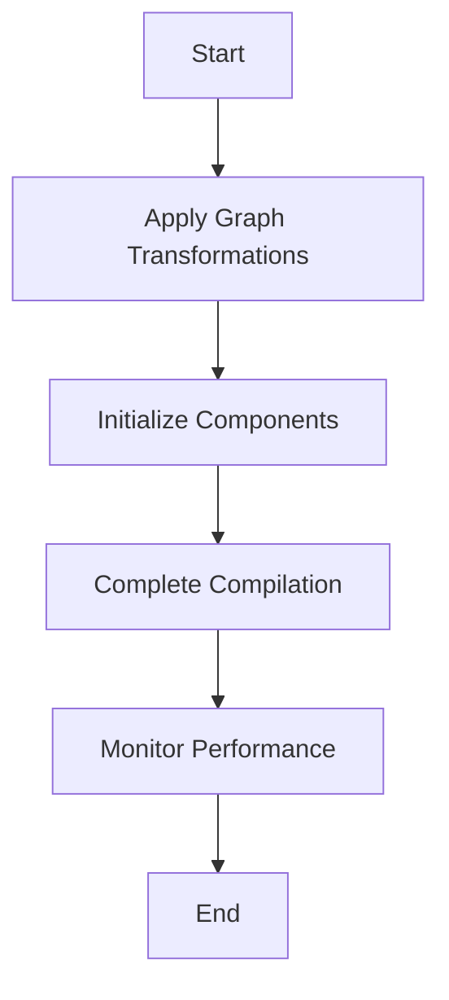

This document will cover the overview of the `fw_compiler_base` function, which includes:

1. The purpose of `fw_compiler_base`
2. The flow of the compilation process
3. Key components involved in the process

Technical document: <SwmLink doc-title="Overview of fw_compiler_base">[Overview of fw_compiler_base](/.swm/overview-of-fw_compiler_base.zy5uyk0e.sw.md)</SwmLink>

# [Purpose of ](https://app.swimm.io/repos/Z2l0aHViJTNBJTNBcHl0b3JjaC1hdXRvZG9jcy1kZW1vJTNBJTNBU3dpbW0tRGVtbw==/docs/zy5uyk0e#fw_compiler_base)`fw_compiler_base`

The `fw_compiler_base` function serves as the entry point for compiling a model's forward graph. It is responsible for initiating the compilation process and adding timing instrumentation to monitor performance. This function ensures that the model's forward graph is optimized and ready for execution.

# [Flow of the Compilation Process](https://app.swimm.io/repos/Z2l0aHViJTNBJTNBcHl0b3JjaC1hdXRvZG9jcy1kZW1vJTNBJTNBU3dpbW0tRGVtbw==/docs/zy5uyk0e#flow-drill-down)

The compilation process involves several key steps:

1. **Apply Graph Transformations**: The function first applies various transformations to the model's forward graph to optimize it. These transformations include pattern matching and constant folding, which help in improving the efficiency of the graph.
2. **Initialize Components**: After the transformations, the function initializes necessary components required for the compilation. This includes setting up pattern matching and transformation functions.
3. **Complete Compilation**: The final step involves completing the compilation process by invoking another function that handles the final steps. This ensures that the graph is fully optimized and ready for execution.
4. **Monitor Performance**: Throughout the process, the function keeps track of time to monitor performance. This helps in identifying any bottlenecks and optimizing the compilation process further.

# [Key Components Involved](https://app.swimm.io/repos/Z2l0aHViJTNBJTNBcHl0b3JjaC1hdXRvZG9jcy1kZW1vJTNBJTNBU3dpbW0tRGVtbw==/docs/zy5uyk0e#key-components)

Several key components are involved in the compilation process:

1. **Graph Transformations**: These are applied to optimize the model's forward graph. They include custom pre-passes, constant folding, and pattern matching.
2. **Initialization Functions**: Functions like `lazy_init`, `_misc_patterns_init`, and `_pad_mm_init` are used to set up necessary components for the compilation.
3. **Performance Monitoring**: Timing instrumentation is added to monitor the performance of the compilation process. This helps in identifying and addressing any performance issues.

&nbsp;

*This is an auto-generated document by Swimm AI 🌊 and has not yet been verified by a human*

<SwmMeta version="3.0.0" repo-id="Z2l0aHViJTNBJTNBcHl0b3JjaC1hdXRvZG9jcy1kZW1vJTNBJTNBU3dpbW0tRGVtbw==" repo-name="pytorch-autodocs-demo">Powered by [Swimm](https://app.swimm.io/)</SwmMeta>
