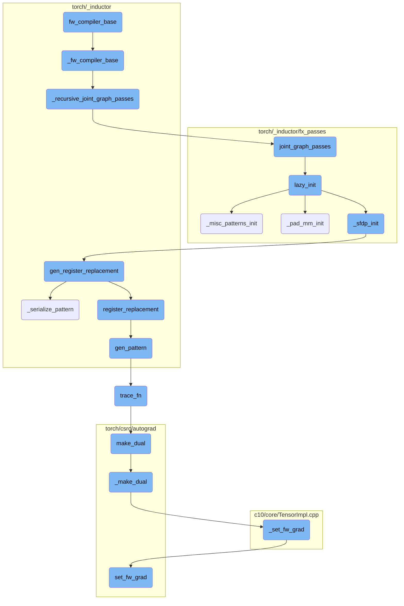
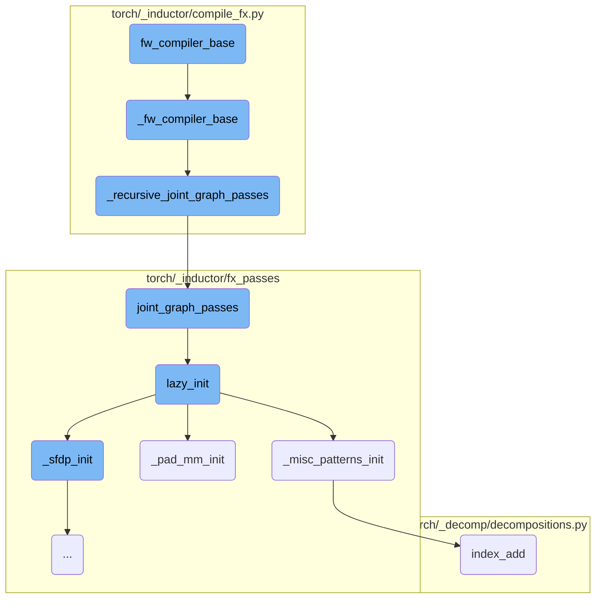
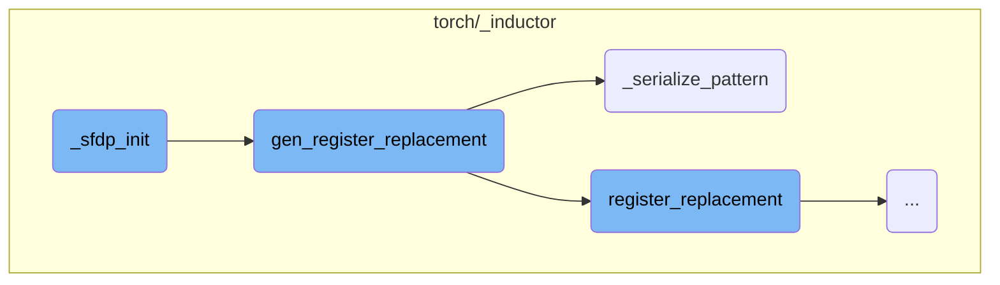
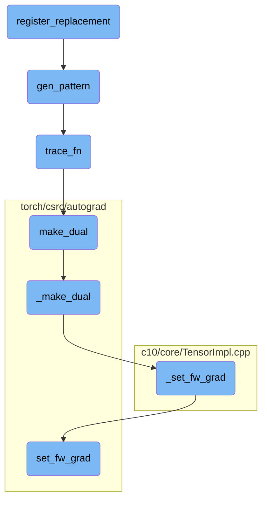

This document provides an overview of the `fw_compiler_base` function, which serves as the entry point for the forward compiler. It wraps the `_fw_compiler_base` function, adding timing instrumentation for performance monitoring. The document also explains the flow of the compilation process, including the initialization of various components and the application of graph transformations.

The `fw_compiler_base` function is the starting point for compiling a model's forward graph. It calls another function, `_fw_compiler_base`, which does the actual work. This involves several steps: first, it applies transformations to the graph to optimize it. Then, it initializes some components needed for the compilation. Finally, it completes the compilation process by calling another function that handles the final steps. Throughout this process, the function keeps track of time to monitor performance.

Here is a high level diagram of the flow, showing only the most important functions:



# Flow drill down

First, we'll zoom into this section of the flow:



<SwmSnippet path="/torch/_inductor/compile_fx.py" line="1334">

---

## fw_compiler_base

`fw_compiler_base` is the entry point for the forward compiler. It wraps the `_fw_compiler_base` function, adding timing instrumentation for performance monitoring.

```python
        def fw_compiler_base(
            model: torch.fx.GraphModule,
            example_inputs: List[torch.Tensor],
            is_inference: bool,
        ):
            with dynamo_utils.dynamo_timed("compile_fx.<locals>.fw_compiler_base"):
                return _fw_compiler_base(model, example_inputs, is_inference)
```

---

</SwmSnippet>

<SwmSnippet path="/torch/_inductor/compile_fx.py" line="1342">

---

## \_fw_compiler_base

`_fw_compiler_base` handles the core logic for compiling the forward graph. It performs various tasks such as recursively applying joint graph passes, initializing user-visible outputs, and invoking the `inner_compile` function to complete the compilation process.

```python
        def _fw_compiler_base(
            model: torch.fx.GraphModule,
            example_inputs: List[torch.Tensor],
            is_inference: bool,
        ):
            if is_inference:
                # partition_fn won't be called
                _recursive_joint_graph_passes(model)

            fixed = torch._inductor.utils.num_fw_fixed_arguments(
                num_example_inputs, len(example_inputs)
            )

            user_visible_outputs = {}

            if config.keep_output_stride:
                model_outputs_node = output_node(model)
                model_outputs = pytree.arg_tree_leaves(*model_outputs_node.args)
                num_model_outputs = len(model_outputs)

                context = torch._guards.TracingContext.try_get()
```

---

</SwmSnippet>

<SwmSnippet path="/torch/_inductor/compile_fx.py" line="274">

---

## \_recursive_joint_graph_passes

`_recursive_joint_graph_passes` applies joint graph passes recursively to all subgraphs within the given graph module. This ensures that all parts of the graph are transformed consistently.

```python
def _recursive_joint_graph_passes(gm):
    for subgraph_name in _get_subgraph_names(gm):
        subgraph = getattr(gm, subgraph_name)
        _recursive_joint_graph_passes(subgraph)
    joint_graph_passes(gm)
```

---

</SwmSnippet>

<SwmSnippet path="/torch/_inductor/fx_passes/joint_graph.py" line="434">

---

## joint_graph_passes

`joint_graph_passes` runs a series of transformations on the joint forward and backward graph. These transformations include custom pre-passes, constant folding, pattern matching, and custom post-passes. The function ensures the graph is optimized and ready for execution.

```python
def joint_graph_passes(graph: torch.fx.GraphModule):
    """
    Run FX transformations on the joint forwards+backwards graph.
    """
    lazy_init()
    count = 0
    if config.joint_custom_pre_pass is not None:
        with GraphTransformObserver(
            graph, "joint_custom_pre_pass", config.trace.log_url_for_graph_xform
        ):
            config.joint_custom_pre_pass(graph.graph)
            count += 1

    from .post_grad import remove_noop_ops

    remove_noop_ops(graph.graph)

    if config.joint_graph_constant_folding:
        with GraphTransformObserver(
            graph, "constant_fold_uniform_value", config.trace.log_url_for_graph_xform
        ):
```

---

</SwmSnippet>

<SwmSnippet path="/torch/_inductor/fx_passes/joint_graph.py" line="43">

---

## lazy_init

`lazy_init` initializes various pattern matching and transformation functions required for graph optimization. It ensures that all necessary components are set up before any transformations are applied.

```python
def lazy_init():
    from .fuse_attention import _sfdp_init
    from .misc_patterns import _misc_patterns_init
    from .pad_mm import _pad_mm_init

    _pad_mm_init()
    _sfdp_init()
    _misc_patterns_init()
```

---

</SwmSnippet>

<SwmSnippet path="/torch/_inductor/fx_passes/misc_patterns.py" line="16">

---

## \_misc_patterns_init

`_misc_patterns_init` registers various pattern replacements for graph optimization. These patterns help in optimizing specific operations like `index_add` by replacing them with more efficient implementations.

```python
def _misc_patterns_init():
    from .joint_graph import patterns as joint_graph_patterns
    from .post_grad import pass_patterns as post_grad_patterns_all

    post_grad_patterns = post_grad_patterns_all[1]  # medium priority

    if torch.cuda.is_available():
        # workaround https://github.com/pytorch/pytorch/issues/97894
        device = "cuda"
    else:
        device = "cpu"

    # These patterns do 2 things
    # 1. Since we know that index is completely unique, we can codegen it using
    # stores instead of atomic adds, which is quite a bit faster.
    # 2. Also, since we are guaranteed that they are completely within bounds,
    # we can use unsafe indexing and skip debug asserts
    def randperm_index_add_pattern(x, y):
        index = torch.randperm(x.shape[0], device=x.device)[: y.shape[0]]
        return torch.index_add(x, dim=0, source=y, index=index), index

```

---

</SwmSnippet>

<SwmSnippet path="/torch/_inductor/fx_passes/pad_mm.py" line="811">

---

## \_pad_mm_init

`_pad_mm_init` registers patterns for matrix multiplication operations. It ensures that these operations are optimized by padding them appropriately and replacing them with more efficient implementations.

```python
def _pad_mm_init():
    from .joint_graph import patterns

    if torch.cuda.is_available():
        # workaround https://github.com/pytorch/pytorch/issues/97894
        device = "cuda"
    else:
        device = "cpu"

    # sizes/values dont actually matter for initial trace
    # once we get a possible match we re-trace with the actual values and verify the match still holds

    dim2a = functools.partial(torch.empty, (4, 4), device=device, requires_grad=True)
    dim2b = functools.partial(torch.empty, (4, 4), device=device, requires_grad=True)

    dim3a = functools.partial(torch.empty, (4, 4, 4), device=device, requires_grad=True)
    dim3b = functools.partial(torch.empty, (4, 4, 4), device=device, requires_grad=True)

    dim1a = functools.partial(torch.empty, (4), device=device, requires_grad=True)

    # workaround https://github.com/pytorch/pytorch/issues/97894
```

---

</SwmSnippet>

<SwmSnippet path="/torch/_decomp/decompositions.py" line="2588">

---

## index_add

`index_add` is a decomposition function that provides an optimized implementation for the `index_add` operation. It ensures that the operation is performed efficiently, taking into account various parameters like dimension and alpha.

```python
def index_add(
    x: TensorLike,
    dim: int,
    index: TensorLike,
    tensor: TensorLike,
    *,
    alpha: NumberType = 1,
):
    return _index_add(x, dim, index, tensor, inplace=False, alpha=alpha)
```

---

</SwmSnippet>

Now, lets zoom into this section of the flow:



<SwmSnippet path="/torch/_inductor/fx_passes/fuse_attention.py" line="906">

---

## \_sfdp_init

The `_sfdp_init` function initializes the SFDP (Sparse Format Data Processing) patterns by iterating over the patterns obtained from `_get_sfdp_patterns` and calling `gen_register_replacement` for each pattern. This setup is crucial for enabling pattern-based optimizations in the framework.

```python
@functools.lru_cache(None)
def _sfdp_init():
    for key, register_replacement_kwargs in _get_sfdp_patterns():
        gen_register_replacement(key, **register_replacement_kwargs)
```

---

</SwmSnippet>

<SwmSnippet path="/torch/_inductor/pattern_matcher.py" line="1463">

---

## gen_register_replacement

The `gen_register_replacement` function registers a replacement pattern for a given search pattern. It first checks if the environment variable `PYTORCH_GEN_PATTERNS` is set to decide whether to serialize the pattern using `_serialize_pattern` or to load a precompiled pattern. It then registers the replacement using `register_replacement`, ensuring that the example inputs are materialized and handling any potential memory leaks with fake tensors.

```python
def gen_register_replacement(
    unique_name: str,
    search_fn: SearchFn,
    replace_fn: ReplaceFn,
    example_inputs: Iterable[Any],
    trace_fn: TraceFn,
    pass_dicts: Union[_PassDictsType, Sequence[_PassDictsType]],
    extra_check: Callable[[Match], bool] = _return_true,
    scalar_workaround: Union[Dict[str, Union[float, int]], None] = None,
    exclusive_arg_names: Sequence[str] = (),
    skip_duplicates: bool = False,
) -> None:
    # Make sure the example_inputs is materialized.
    example_inputs = tuple(example_inputs)

    if "PYTORCH_GEN_PATTERNS" in os.environ:
        pat = _serialize_pattern(
            unique_name, search_fn, example_inputs, trace_fn, scalar_workaround
        )
    else:
        pattern_name = search_fn.__name__
```

---

</SwmSnippet>

<SwmSnippet path="/torch/_inductor/pattern_matcher.py" line="1374">

---

### \_serialize_pattern

The `_serialize_pattern` function generates and serializes a pattern based on the provided search function, example inputs, and trace function. It creates a file template for the serialized pattern, generates the pattern using `gen_pattern`, and writes the serialized pattern to a file in the specified directory. This function is essential for saving and reusing patterns for optimization.

```python
def _serialize_pattern(
    unique_name: str,
    search_fn: SearchFn,
    example_inputs: Iterable[Any],
    trace_fn: TraceFn,
    scalar_workaround: Union[Dict[str, Union[float, int]], None],
) -> PatternExpr:
    def get_file_template() -> str:
        auto_generated_msg = textwrap.dedent(
            """\
            # This is an auto-generated file. Please do not modify it by hand.
            # To re-generate, run:
            # cd ~/pytorch && python torchgen/fuse/gen_patterns.py
            """
        )

        file_template = textwrap.dedent(
            """\
            # mypy: ignore-errors

            # noqa: F401, E501
```

---

</SwmSnippet>

Now, lets zoom into this section of the flow:



<SwmSnippet path="/torch/_inductor/pattern_matcher.py" line="1220">

---

## register_replacement

The `check_fn` function within `register_replacement` ensures that shapes are correctly matched by ignoring certain types during the initial match.

```python
    def check_fn(match: Match) -> bool:
        """
        Often shapes get burned into the pattern, so our initial match ran with
        `ignore_types=(int, ...)`.
```

---

</SwmSnippet>

<SwmSnippet path="/torch/_inductor/pattern_matcher.py" line="1274">

---

The `search_fn_new` function adapts the arguments for the search function, ensuring that the correct subset of arguments is passed.

```python
                    def search_fn_new(*args_new: Any) -> Any:
                        return search_fn(*args_new[len(args_new) - len(args) :])
```

---

</SwmSnippet>

<SwmSnippet path="/torch/_inductor/pattern_matcher.py" line="1326">

---

The `normalize_args` function collects and normalizes arguments based on predefined static argument names.

```python
    def normalize_args(**kwargs: Any) -> List[Any]:
        args = []
        for name in argnames_static:
            args.append(kwargs.pop(name))
```

---

</SwmSnippet>

&nbsp;

*This is an auto-generated document by Swimm AI 🌊 and has not yet been verified by a human*

<SwmMeta version="3.0.0" repo-id="Z2l0aHViJTNBJTNBcHl0b3JjaC1hdXRvZG9jcy1kZW1vJTNBJTNBU3dpbW0tRGVtbw==" repo-name="pytorch-autodocs-demo"><sup>Powered by [Swimm](https://app.swimm.io/)</sup></SwmMeta>
