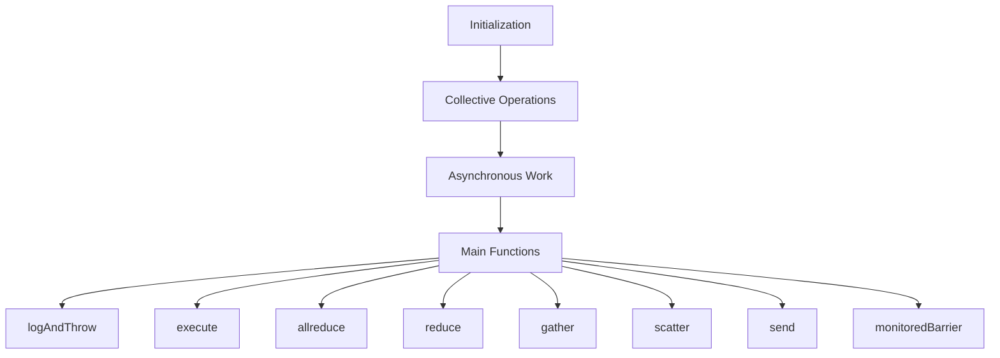

<SwmSnippet path="/torch/csrc/distributed/c10d/ProcessGroupGloo.cpp" line="750">

---

# Initialization

The Gloo Process Group is initialized with a store, rank, size, and options. It creates a context for each device specified in the options.

```c++
ProcessGroupGloo::ProcessGroupGloo(
    const c10::intrusive_ptr<Store>& store,
    int rank,
    int size,
    c10::intrusive_ptr<Options> options)
    : Backend(rank, size),
      store_(new GlooStore(store)),
      options_(std::move(options)),
      stop_(false),
      collectiveCounter_(0) {
  auto& devices = options_->devices;
  if (devices.empty()) {
    TORCH_CHECK(false, "No device(s) specified");
  }

  // Create and connect a context for every device.
  //
  // Note that the same device can be specified multiple times, either
  // the same object, or the same logical device as different objects.
  // Either mode is fine and only has performance implications.
  //
```

---

</SwmSnippet>

<SwmSnippet path="/torch/csrc/distributed/c10d/ProcessGroupGloo.cpp" line="2238">

---

# Collective Operations

The Gloo Process Group supports various collective operations such as gather. This example shows the gather operation, which collects tensors from all processes to a single process.

```c++
  void gather(
      std::vector<std::vector<at::Tensor>>& outputs,
      std::vector<at::Tensor>& inputs) {
    const auto scalarType = inputs[0].scalar_type();
    gloo::GatherOptions opts(context);
    opts.setRoot(root);
    opts.setTag(tag);

    // Set single temporary tensor on root process.
    // This is later scattered to the separate output tensors.
    at::Tensor flatOutputTensor;
    if (context->rank == root) {
      flatOutputTensor = newLikeFlat(outputs[0]);
      GENERATE_ALL_TYPES(scalarType, setOutput, opts, flatOutputTensor);
    }

    // Set single input tensor on all processes.
    GENERATE_ALL_TYPES(scalarType, setInput, opts, inputs[0]);
    gloo::gather(opts);

    // Unflatten into output tensors on root process.
```

---

</SwmSnippet>

# Main Functions

The main functions of the Gloo Process Group include <SwmToken path="torch/csrc/distributed/c10d/ProcessGroupGloo.cpp" pos="140:2:2" line-data="void logAndThrow(">`logAndThrow`</SwmToken>, <SwmToken path="torch/csrc/distributed/c10d/ProcessGroupGloo.cpp" pos="421:6:6" line-data="void ProcessGroupGloo::AsyncWork::execute(">`execute`</SwmToken>, <SwmToken path="torch/csrc/distributed/c10d/ProcessGroupGloo.cpp" pos="1486:9:9" line-data="c10::intrusive_ptr&lt;Work&gt; ProcessGroupGloo::allreduce(">`allreduce`</SwmToken>, <SwmToken path="torch/csrc/distributed/c10d/ProcessGroupGloo.cpp" pos="1741:9:9" line-data="c10::intrusive_ptr&lt;Work&gt; ProcessGroupGloo::reduce(">`reduce`</SwmToken>, <SwmToken path="torch/csrc/distributed/c10d/ProcessGroupGloo.cpp" pos="2238:3:3" line-data="  void gather(">`gather`</SwmToken>, <SwmToken path="torch/csrc/distributed/c10d/ProcessGroupGloo.cpp" pos="2539:9:9" line-data="c10::intrusive_ptr&lt;Work&gt; ProcessGroupGloo::scatter(">`scatter`</SwmToken>, <SwmToken path="torch/csrc/distributed/c10d/ProcessGroupGloo.cpp" pos="2804:9:9" line-data="c10::intrusive_ptr&lt;Work&gt; ProcessGroupGloo::send(">`send`</SwmToken>, and <SwmToken path="torch/csrc/distributed/c10d/ProcessGroupGloo.cpp" pos="2942:4:4" line-data="void ProcessGroupGloo::monitoredBarrier(">`monitoredBarrier`</SwmToken>.

<SwmSnippet path="/torch/csrc/distributed/c10d/ProcessGroupGloo.cpp" line="139">

---

## <SwmToken path="torch/csrc/distributed/c10d/ProcessGroupGloo.cpp" pos="140:2:2" line-data="void logAndThrow(">`logAndThrow`</SwmToken>

The <SwmToken path="torch/csrc/distributed/c10d/ProcessGroupGloo.cpp" pos="140:2:2" line-data="void logAndThrow(">`logAndThrow`</SwmToken> function logs an error message and throws an exception using <SwmToken path="torch/csrc/distributed/c10d/ProcessGroupGloo.cpp" pos="139:17:17" line-data="// Emit a LOG(ERROR) and throws using TORCH_CHECK with the given messages.">`TORCH_CHECK`</SwmToken>. It is used to handle errors by logging the error message and stopping the execution with a clear error message.

```c++
// Emit a LOG(ERROR) and throws using TORCH_CHECK with the given messages.
void logAndThrow(
    const std::string& logMessage,
    const std::string& errorMessage) {
  LOG(ERROR) << logMessage;
  TORCH_CHECK(false, errorMessage);
}
```

---

</SwmSnippet>

<SwmSnippet path="/torch/csrc/distributed/c10d/ProcessGroupGloo.cpp" line="420">

---

## execute

The <SwmToken path="torch/csrc/distributed/c10d/ProcessGroupGloo.cpp" pos="421:6:6" line-data="void ProcessGroupGloo::AsyncWork::execute(">`execute`</SwmToken> function in the <SwmToken path="torch/csrc/distributed/c10d/ProcessGroupGloo.cpp" pos="421:4:4" line-data="void ProcessGroupGloo::AsyncWork::execute(">`AsyncWork`</SwmToken> class runs the asynchronous work and handles any exceptions that occur during execution. It ensures that the work is synchronized and completed properly.

```c++
// static
void ProcessGroupGloo::AsyncWork::execute(
    const c10::intrusive_ptr<AsyncWork>& work) {
  if (work->recordFunctionBeforeCallback_) {
    work->recordFunctionBeforeCallback_();
  }
  try {
    work->run();
  } catch (...) {
    work->finishWorkGlooError(std::current_exception());
    return;
  }

  // FIXME: We need to call it here since Future completion requires all
  // the work to be synchronized to CUDA.
  work->synchronize();
  work->finishWorkGloo();
}
```

---

</SwmSnippet>

<SwmSnippet path="/torch/csrc/distributed/c10d/ProcessGroupGloo.cpp" line="1486">

---

## allreduce

The <SwmToken path="torch/csrc/distributed/c10d/ProcessGroupGloo.cpp" pos="1486:9:9" line-data="c10::intrusive_ptr&lt;Work&gt; ProcessGroupGloo::allreduce(">`allreduce`</SwmToken> function performs an allreduce operation, which aggregates data from all processes and distributes the result back to all processes. It supports both CPU and CUDA tensors and handles different tensor layouts.

```c++
c10::intrusive_ptr<Work> ProcessGroupGloo::allreduce(
    std::vector<at::Tensor>& inputs,
    const AllreduceOptions& opts) {
  static auto invalidArgument = [](const std::string& msg) {
    TORCH_CHECK(false, "ProcessGroupGloo::allreduce: " + msg);
  };

  assertNonEmpty(invalidArgument, inputs);
  assertLayoutMatch(invalidArgument, inputs);
  assertTypeAndSizesMatch(invalidArgument, inputs);

  const auto& device = inputs[0].device();
  switch (device.type()) {
    case at::kCPU:
      break;
    case at::kCUDA:
      // If the user gave us a CUDA tensor then CUDA must be loaded.
      TORCH_INTERNAL_ASSERT(at::hasCUDA());
      break;
    default:
      invalidArgument(c10::str("unsupported device type ", device.type()));
```

---

</SwmSnippet>

<SwmSnippet path="/torch/csrc/distributed/c10d/ProcessGroupGloo.cpp" line="1741">

---

## reduce

The <SwmToken path="torch/csrc/distributed/c10d/ProcessGroupGloo.cpp" pos="1741:9:9" line-data="c10::intrusive_ptr&lt;Work&gt; ProcessGroupGloo::reduce(">`reduce`</SwmToken> function performs a reduction operation, which aggregates data from all processes to a single root process. It supports both CPU and CUDA tensors and handles different tensor layouts.

```c++
c10::intrusive_ptr<Work> ProcessGroupGloo::reduce(
    std::vector<at::Tensor>& inputs,
    const ReduceOptions& opts) {
  static auto invalidArgument = [](const std::string& msg) {
    TORCH_CHECK(false, "ProcessGroupGloo::reduce: " + msg);
  };

  assertRootRank(invalidArgument, opts.rootRank, size_);
  assertRootTensor(
      invalidArgument, opts.rootTensor, static_cast<int64_t>(inputs.size()));
  assertSingleElement(invalidArgument, inputs);
  assertDense(invalidArgument, inputs);

  const auto& device = inputs[0].device();
  switch (device.type()) {
    case at::kCPU:
      break;
    case at::kCUDA:
      // If the user gave us a CUDA tensor then CUDA must be loaded.
      TORCH_INTERNAL_ASSERT(at::hasCUDA());
      break;
```

---

</SwmSnippet>

<SwmSnippet path="/torch/csrc/distributed/c10d/ProcessGroupGloo.cpp" line="2350">

---

## gather

The <SwmToken path="torch/csrc/distributed/c10d/ProcessGroupGloo.cpp" pos="2350:9:9" line-data="c10::intrusive_ptr&lt;Work&gt; ProcessGroupGloo::gather(">`gather`</SwmToken> function gathers data from all processes to a single root process. It ensures that the input and output tensors have the correct type and size and supports both CPU and CUDA tensors.

```c++
c10::intrusive_ptr<Work> ProcessGroupGloo::gather(
    std::vector<std::vector<at::Tensor>>& outputs,
    std::vector<at::Tensor>& inputs,
    const GatherOptions& opts) {
  static auto invalidArgument = [](const std::string& msg) {
    TORCH_CHECK(false, "ProcessGroupGloo::gather: " + msg);
  };

  assertRootRank(invalidArgument, opts.rootRank, size_);
  assertSingleElementInput(invalidArgument, inputs);
  assertDense(invalidArgument, inputs);

  if (getRank() == opts.rootRank) {
    if (outputs.size() != 1) {
      std::stringstream ss;
      ss << "requires a single-element output list containing a list with "
         << getSize() << " tensors.";
      invalidArgument(ss.str());
    } else if (outputs[0].size() != static_cast<size_t>(getSize())) {
      std::stringstream ss;
      ss << "Incorrect output list size " << outputs[0].size()
```

---

</SwmSnippet>

<SwmSnippet path="/torch/csrc/distributed/c10d/ProcessGroupGloo.cpp" line="2539">

---

## scatter

The <SwmToken path="torch/csrc/distributed/c10d/ProcessGroupGloo.cpp" pos="2539:9:9" line-data="c10::intrusive_ptr&lt;Work&gt; ProcessGroupGloo::scatter(">`scatter`</SwmToken> function scatters data from a single root process to all other processes. It ensures that the input and output tensors have the correct type and size and supports both CPU and CUDA tensors.

```c++
c10::intrusive_ptr<Work> ProcessGroupGloo::scatter(
    std::vector<at::Tensor>& outputs,
    std::vector<std::vector<at::Tensor>>& inputs,
    const ScatterOptions& opts) {
  static auto invalidArgument = [](const std::string& msg) {
    TORCH_CHECK(false, "ProcessGroupGloo::scatter: " + msg);
  };

  assertRootRank(invalidArgument, opts.rootRank, size_);
  assertSingleElementOutput(invalidArgument, outputs);
  assertDense(invalidArgument, outputs);

  if (getRank() == opts.rootRank) {
    if (inputs.size() != 1) {
      std::stringstream ss;
      ss << "requires a single-element input list containing a list with "
         << getSize() << " tensors";
      invalidArgument(ss.str());
    } else if (inputs[0].size() != static_cast<size_t>(getSize())) {
      std::stringstream ss;
      ss << "Incorrect input list size " << inputs[0].size()
```

---

</SwmSnippet>

<SwmSnippet path="/torch/csrc/distributed/c10d/ProcessGroupGloo.cpp" line="2804">

---

## send

The <SwmToken path="torch/csrc/distributed/c10d/ProcessGroupGloo.cpp" pos="2804:9:9" line-data="c10::intrusive_ptr&lt;Work&gt; ProcessGroupGloo::send(">`send`</SwmToken> function sends a tensor to a specified destination rank. It ensures that the tensor is contiguous and dense and creates an unbound buffer for the send operation.

```c++
c10::intrusive_ptr<Work> ProcessGroupGloo::send(
    std::vector<at::Tensor>& tensors,
    int dstRank,
    int tag) {
  auto& tensor = checkSingleTensor(tensors);
  auto utag = checkTag(tag);
  auto ptr = tensor.const_data_ptr();
  auto size = tensor.numel() * tensor.element_size();

  // Construct unbound buffer.
  auto context = getContext(tag);
  // NOLINTNEXTLINE(cppcoreguidelines-pro-type-const-cast)
  auto buf = context->createUnboundBuffer(const_cast<void*>(ptr), size);
  buf->send(dstRank, utag);
  ++seq_;

  // The work captures the tensor to prevent it being deallocated and
  // the unbound buffer to synchronize on completion of the send.
  return c10::make_intrusive<SendWork>(tensor, std::move(buf), seq_);
}
```

---

</SwmSnippet>

<SwmSnippet path="/torch/csrc/distributed/c10d/ProcessGroupGloo.cpp" line="2942">

---

## <SwmToken path="torch/csrc/distributed/c10d/ProcessGroupGloo.cpp" pos="2942:4:4" line-data="void ProcessGroupGloo::monitoredBarrier(">`monitoredBarrier`</SwmToken>

The <SwmToken path="torch/csrc/distributed/c10d/ProcessGroupGloo.cpp" pos="2942:4:4" line-data="void ProcessGroupGloo::monitoredBarrier(">`monitoredBarrier`</SwmToken> function performs a barrier operation with monitoring. It ensures that all ranks reach the barrier and handles timeouts and errors during the barrier operation.

```c++
void ProcessGroupGloo::monitoredBarrier(
    const BarrierOptions& opts,
    bool waitAllRanks) {
  C10_LOG_API_USAGE_ONCE("torch.distributed.monitored_barrier");
  // Use default timeout if no timeout was specified.
  auto monitoredBarrierTimeout =
      (opts.timeout == kUnsetTimeout) ? this->options_->timeout : opts.timeout;
  auto rank = this->getRank();
  auto t1 = nextTag();
  auto t2 = nextTag();
  std::vector<at::Tensor> commTensor = {at::tensor({rank})};
  // only enforce timeout on rank 0. This is so that other ranks aren't timed
  // out first, bringing down the job without reporting which rank timed out.
  if (rank != 0) {
    auto sendWork = send(commTensor, 0, static_cast<int>(t1));
    auto recvWork = recv(commTensor, 0, static_cast<int>(t2));
    try {
      sendWork->wait();
      recvWork->wait();
    } catch (const std::exception& e) {
      const std::string error = c10::str(
```

---

</SwmSnippet>

&nbsp;

*This is an auto-generated document by Swimm AI 🌊 and has not yet been verified by a human*

<SwmMeta version="3.0.0" repo-id="Z2l0aHViJTNBJTNBcHl0b3JjaC1hdXRvZG9jcy1kZW1vJTNBJTNBU3dpbW0tRGVtbw==" repo-name="pytorch-autodocs-demo"><sup>Powered by [Swimm](/)</sup></SwmMeta>
