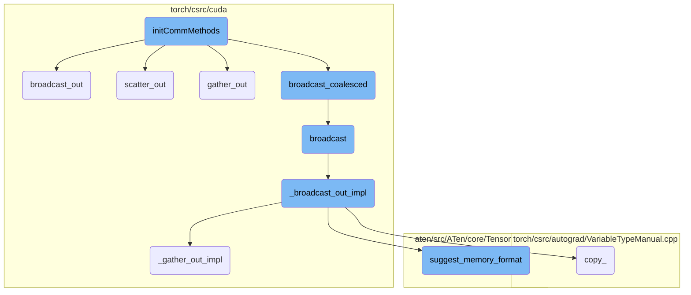
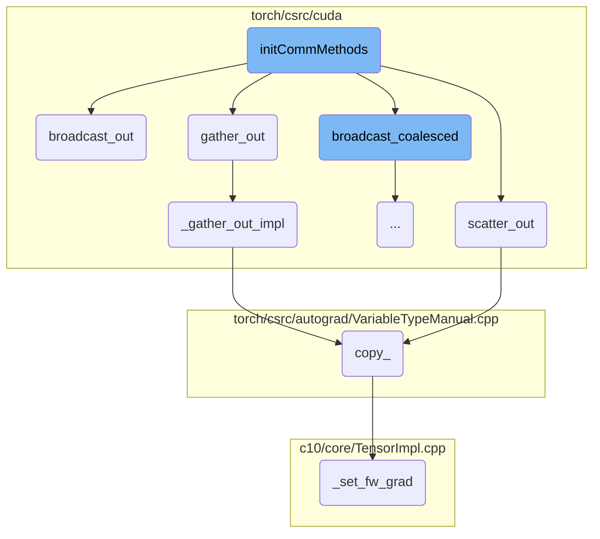
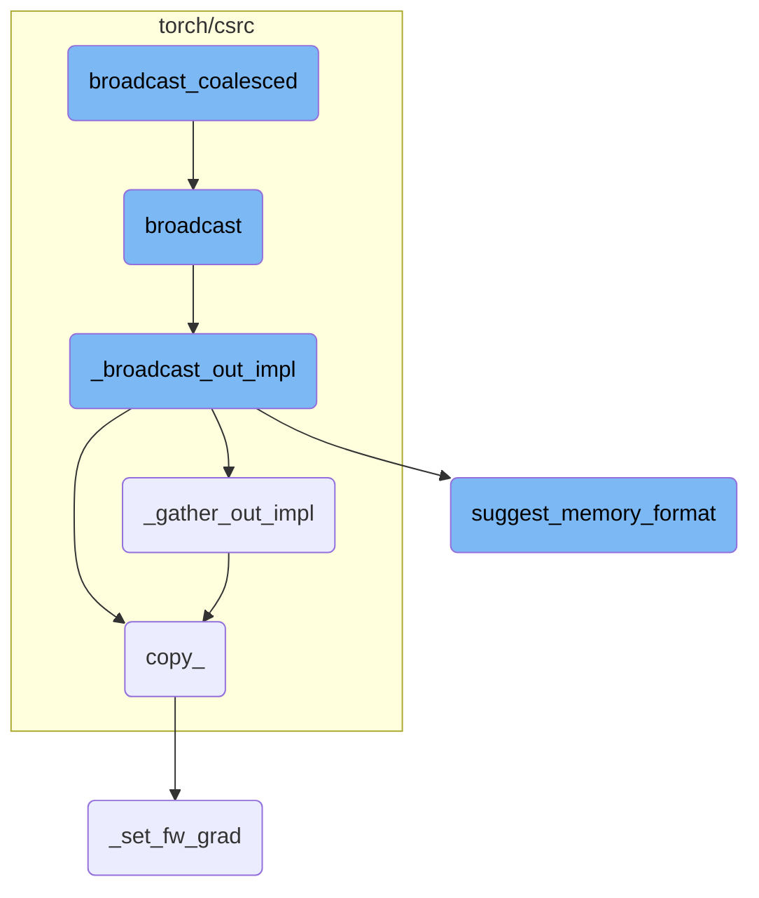

This document provides an overview of the `initCommMethods` function, which is responsible for setting up communication methods for CUDA tensors. It defines Python bindings for several key functions that facilitate operations like broadcasting, scattering, and gathering tensors across multiple devices. The document also explains how these functions interact to ensure efficient data transfer and synchronization across devices.

The `initCommMethods` function sets up various ways for CUDA tensors to communicate with each other. It creates connections for different operations like sending data to multiple devices at once (broadcasting), splitting data into parts and sending them to different devices (scattering), and collecting data from multiple devices into one (gathering). These operations help in managing and synchronizing data across different devices, making sure everything works smoothly and efficiently.

Here is a high level diagram of the flow, showing only the most important functions:



# Flow drill down

First, we'll zoom into this section of the flow:



<SwmSnippet path="/torch/csrc/cuda/python_comm.cpp" line="16">

---

## initCommMethods

The `initCommMethods` function initializes various communication methods for CUDA tensors. It defines Python bindings for several functions such as `_broadcast_coalesced`, `_broadcast`, `_broadcast_out`, `_scatter`, `_scatter_out`, `_gather`, and `_gather_out`. These functions facilitate operations like broadcasting, scattering, and gathering tensors across multiple devices. The use of `py::gil_scoped_release` ensures that the Global Interpreter Lock (GIL) is released during these operations, allowing for better performance in multi-threaded environments.

```c++
void initCommMethods(PyObject* module) {
  auto m = py::cast<py::module>(module);
  m.def(
       "_broadcast_coalesced",
       [](std::vector<at::Tensor>& tensors,
          const std::vector<int64_t>& devices,
          size_t buffer_size) {
         return broadcast_coalesced(tensors, devices, buffer_size);
       },
       py::arg("tensors"),
       py::arg("devices"),
       py::arg("buffer_size"),
       py::call_guard<py::gil_scoped_release>())
      .def(
          "_broadcast",
          [](at::Tensor& tensor, std::vector<int64_t> devices) {
            return broadcast(tensor, devices);
          },
          py::call_guard<py::gil_scoped_release>(),
          py::arg("tensor"),
          py::arg("devices"))
```

---

</SwmSnippet>

<SwmSnippet path="/torch/csrc/cuda/comm.cpp" line="73">

---

### broadcast_out

The `broadcast_out` function ensures that all output tensors are CUDA tensors and have the same shape as the source tensor. It then calls `_broadcast_out_impl` to perform the actual broadcasting operation. This function is crucial for synchronizing tensor data across multiple devices.

```c++
std::vector<Tensor>& broadcast_out(
    const Tensor& tensor,
    std::vector<Tensor>& out_tensors) {
  for (const auto i : c10::irange(out_tensors.size())) {
    TORCH_CHECK(
        out_tensors[i].is_cuda(),
        "Expected all output tensors to be CUDA tensors, but output tensor at index ",
        i,
        " has device '",
        out_tensors[i].device(),
        "'");
    TORCH_CHECK(
        out_tensors[i].sizes() == tensor.sizes(),
        "Expected all output tensors to have same shape as the source tensor ",
        tensor.sizes(),
        ", but output tensor at index ",
        i,
        " has shape ",
        out_tensors[i].sizes());
  }
  return _broadcast_out_impl(tensor, out_tensors);
```

---

</SwmSnippet>

<SwmSnippet path="/torch/csrc/cuda/comm.cpp" line="226">

---

### scatter_out

The `scatter_out` function distributes a source tensor to a list of CUDA tensors across one or more devices. It checks that the output tensors are CUDA tensors and have the correct shape. The function then splits the source tensor and copies the chunks to the output tensors, optionally using CUDA streams for non-blocking operations.

```c++
// ***************** Scatter *******************
//
// Scatter a source tensor (CPU or CUDA) to a list of CUDA tensors on one or
// more devices.

std::vector<at::Tensor>& scatter_out(
    const at::Tensor& tensor,
    std::vector<at::Tensor>& out_tensors,
    int64_t dim,
    const std::optional<std::vector<std::optional<at::cuda::CUDAStream>>>&
        streams) {
  TORCH_CHECK(
      !out_tensors.empty(),
      "Expected at least one output tensor to scatter to");
  dim = at::maybe_wrap_dim(dim, tensor);
  int64_t total_size = 0;
  // NOLINTNEXTLINE(cppcoreguidelines-init-variables)
  std::vector<int64_t> chunk_sizes;
  chunk_sizes.reserve(out_tensors.size());
  for (const auto i : c10::irange(out_tensors.size())) {
    TORCH_CHECK(
```

---

</SwmSnippet>

<SwmSnippet path="/torch/csrc/cuda/comm.cpp" line="391">

---

### gather_out

The `gather_out` function collects a list of CUDA tensors into a single output tensor. It verifies that the input tensors are CUDA tensors and have the same number of dimensions. The function then calls `_gather_out_impl` to perform the actual gathering operation, ensuring that the output tensor has the correct shape.

```c++
at::Tensor& gather_out(
    at::TensorList tensors,
    at::Tensor& out_tensor,
    int64_t dim) {
  TORCH_CHECK(!tensors.empty(), "Expected at least one tensor to gather from");
  int64_t total_size = 0;
  auto& first = tensors.front();
  const auto first_size = first.sizes();
  dim = at::maybe_wrap_dim(dim, first);
  // NOLINTNEXTLINE(cppcoreguidelines-init-variables)
  std::vector<int64_t> expected_size(first_size.begin(), first_size.end());
  for (const auto i : c10::irange(tensors.size())) {
    const auto& tensor = tensors[i];
    TORCH_CHECK(
        tensor.is_cuda(),
        "Expected all input tensors to be CUDA tensors, but "
        "tensor at index ",
        i,
        " has device '",
        tensor.device(),
        "'");
```

---

</SwmSnippet>

<SwmSnippet path="/torch/csrc/cuda/comm.cpp" line="367">

---

### \_gather_out_impl

The `_gather_out_impl` function performs the low-level gathering operation. It splits the output tensor into chunks and copies the input tensors into these chunks. This function is called by `gather_out` to execute the actual data transfer.

```c++
// ***************** Gather *******************
//
// Gather a list of CUDA tensors on one or more devices to a target tensor or
// device, either CPU or CUDA.

// no checks
static inline at::Tensor& _gather_out_impl(
    at::TensorList tensors,
    at::Tensor& out_tensor,
    int64_t dim) {
  // NOLINTNEXTLINE(cppcoreguidelines-init-variables)
  std::vector<int64_t> chunk_sizes;
  chunk_sizes.reserve(tensors.size());
  for (auto& tensor : tensors) {
    chunk_sizes.emplace_back(tensor.size(dim));
  }
  auto chunks =
      out_tensor.split_with_sizes(/*split_sizes=*/chunk_sizes, /*dim=*/dim);
  for (const auto i : c10::irange(tensors.size())) {
    chunks[i].copy_(tensors[i], /*non_blocking=*/out_tensor.is_cuda());
  }
```

---

</SwmSnippet>

<SwmSnippet path="/torch/csrc/autograd/VariableTypeManual.cpp" line="189">

---

### copy\_

The `copy_` function performs an in-place copy of one tensor to another. It handles autograd metadata to ensure that gradients are correctly propagated. If the tensors require gradients, it sets up the backward function to track the copy operation. This function is used internally by other operations like `scatter_out` and `gather_out` to copy data between tensors.

```c++
// We don't have an outplace copy, so this can't be generated automatically
Tensor& copy_(
    c10::DispatchKeySet ks,
    Tensor& self,
    const Tensor& src,
    bool non_blocking) {
  // TODO: once copy is exposed in Declarations.yaml we may be able to bind
  // it automatically
  auto& self_ = unpack(self, "self", 0);
  auto& src_ = unpack(src, "src", 1);
  std::shared_ptr<CopyBackwards> grad_fn;
  auto requires_grad = compute_requires_grad(self, src);
  requires_grad &= isDifferentiableType(self.scalar_type());
  check_inplace(self, requires_grad);
  if (requires_grad) {
    grad_fn = std::make_shared<CopyBackwards>();
    grad_fn->set_next_edges(collect_next_edges(self, src));
    grad_fn->src_options = src.options();
  }
  {
    at::AutoDispatchBelowAutograd mode;
```

---

</SwmSnippet>

<SwmSnippet path="/c10/core/TensorImpl.cpp" line="67">

---

### \_set_fw_grad

The `_set_fw_grad` function sets the forward-mode gradient for a tensor. It initializes the autograd metadata if it is not already present and updates the forward gradient. This function is called by `copy_` to ensure that forward-mode gradients are correctly handled during in-place operations.

```c++
void TensorImpl::_set_fw_grad(
    const at::TensorBase& new_grad,
    const at::TensorBase& self,
    uint64_t level,
    bool is_inplace_op) {
  if (!autograd_meta_)
    autograd_meta_ = impl::GetAutogradMetaFactory()->make();
  autograd_meta_->set_fw_grad(new_grad, self, level, is_inplace_op);
}
```

---

</SwmSnippet>

Now, lets zoom into this section of the flow:



<SwmSnippet path="/torch/csrc/cuda/comm.cpp" line="128">

---

## broadcast_coalesced

The function `broadcast_coalesced` is responsible for coalescing multiple variables into a single large one, broadcasting it to other devices, and then splitting it according to the original shapes. This process ensures that all variables share a single version counter during the broadcast, but they are re-wrapped to give them individual version counters after broadcasting. This is crucial for scenarios where one buffer is modified in-place during forward pass while another is needed in the backward pass.

```c++
// NOTE [ Version Counter in comm.*_coalesced ]
//
// broadcast_coalesced
// ~~~~~~~~~~~~~~~~~~~
//
// In broadcast_coalesced, multiple variables may be coalesced into a single
// large one, broadcast to other devices, and the get split according to the
// original shapes.
//
// When splitting, the view operations will make all Variables broadcast
// together to share a single version counter, because they are all views of the
// large Variable. However, that large Variable is immediately discarded and all
// these Variables do not share storage at all.
//
// For example, when two buffers are broadcast together in `DataParallel` and
// one of them is modified in-place during `forward` but the other is needed in
// backward, autograd engine will complain.
//
// We thus re-wrap these Variables after broadcasting (i.e., effectively doing
// what is equivalent to .data in Python), and give them individual version
// counters.
```

---

</SwmSnippet>

<SwmSnippet path="/torch/csrc/cuda/comm.cpp" line="96">

---

## broadcast

The `broadcast` function takes a tensor and a list of devices, and broadcasts the tensor to the specified devices. It creates empty tensors on the target devices and then calls `_broadcast_out_impl` to perform the actual broadcast operation. The function ensures that the tensor is correctly placed on each device, preserving the memory format.

```c++
std::vector<Tensor> broadcast(const Tensor& tensor, IntArrayRef devices) {
  // NOLINTNEXTLINE(cppcoreguidelines-init-variables)
  std::vector<Tensor> diff_device_dst_tensors;
  diff_device_dst_tensors.reserve(devices.size());
  for (auto device : devices) {
    TORCH_CHECK(
        device >= 0, "Expected non-negative device index, but got ", device);
    if (device != tensor.get_device()) {
      diff_device_dst_tensors.emplace_back(at::empty(
          tensor.sizes(),
          tensor.options().device(at::Device(
              DeviceType::CUDA,
              static_cast<DeviceIndex>(device))))); // preserve memory format
    }
  }
  _broadcast_out_impl(tensor, diff_device_dst_tensors);
  // NOLINTNEXTLINE(cppcoreguidelines-init-variables)
  std::vector<Tensor> dst_tensors;
  dst_tensors.reserve(devices.size());
  auto it = diff_device_dst_tensors.begin();
  for (auto device : devices) {
```

---

</SwmSnippet>

<SwmSnippet path="/torch/csrc/cuda/comm.cpp" line="50">

---

### \_broadcast_out_impl

The `_broadcast_out_impl` function is an internal function that performs the actual broadcast operation. It takes the source tensor and a list of destination tensors and copies the data from the source tensor to each destination tensor. This function is called by `broadcast` to distribute the tensor data across multiple devices.

```c++
static inline std::vector<Tensor>& _broadcast_out_impl(
    const Tensor& tensor,
    std::vector<Tensor>& out_tensors) {
#ifdef USE_NCCL
  std::vector<Tensor> nccl_list;
  nccl_list.reserve(out_tensors.size() + 1);
  nccl_list.emplace_back(tensor);
  for (auto& out_tensor : out_tensors) {
    nccl_list.emplace_back(out_tensor);
  }
  if (nccl::is_available(nccl_list)) {
    nccl::broadcast(nccl_list);
  } else {
#else
  {
#endif
    for (auto& out_tensor : out_tensors) {
      out_tensor.copy_(tensor, /*non_blocking=*/true);
    }
  }
  return out_tensors;
```

---

</SwmSnippet>

<SwmSnippet path="/aten/src/ATen/core/TensorBase.h" line="271">

---

## suggest_memory_format

The `suggest_memory_format` function suggests the optimal memory format for a tensor. It checks if the tensor's strides match the channels-last or channels-last-3d memory format and returns the appropriate memory format. If no specific format is matched, it defaults to the contiguous memory format. This function is useful for optimizing memory layout for performance.

```c
  at::MemoryFormat suggest_memory_format(
      bool channels_last_strides_exact_match = false) const {
    // Setting channels_last_strides_exact_match to true forces function to
    // check 0,1 - sized dimension strides.
    if (layout() == at::kStrided) {
      if (impl_->is_strides_like_channels_last()) {
        if (!channels_last_strides_exact_match ||
            get_channels_last_strides_2d(sizes()) == strides()) {
          return at::MemoryFormat::ChannelsLast;
        }
      }
      else if (impl_->is_strides_like_channels_last_3d()) {
        if (!channels_last_strides_exact_match ||
            get_channels_last_strides_3d(sizes()) == strides()) {
          return at::MemoryFormat::ChannelsLast3d;
        }
      }
    }
    return at::MemoryFormat::Contiguous;
  }
```

---

</SwmSnippet>

&nbsp;

*This is an auto-generated document by Swimm AI 🌊 and has not yet been verified by a human*

<SwmMeta version="3.0.0" repo-id="Z2l0aHViJTNBJTNBcHl0b3JjaC1hdXRvZG9jcy1kZW1vJTNBJTNBU3dpbW0tRGVtbw==" repo-name="pytorch-autodocs-demo"><sup>Powered by [Swimm](https://app.swimm.io/)</sup></SwmMeta>
