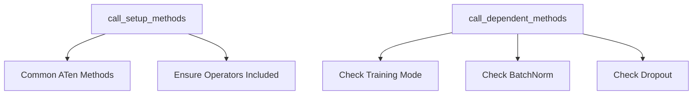

# Overview of Model Tracer in Mobile

The Model tracer is responsible for producing graphs by recording the actual operations performed on Tensors. It uses the `torch.jit.trace` function to trace these operations, with the entry point being `_create_method_from_trace`.

A thread-local instance of the `TracingState` object maintains a mapping between the actual data being computed during the trace, stored in `IValues`, and the abstract <SwmToken path="torch/_C/_monitor.pyi" pos="8:1:1" line-data="    VALUE = ...">`VALUE`</SwmToken> in the Graph that would compute each value. The functions `setValueTrace` and `getValueTrace` are used by the tracer to maintain this mapping.

# How to Use Model Tracer

To trace a module, use the <SwmToken path="torch/fx/_symbolic_trace.py" pos="1171:2:2" line-data="def symbolic_trace(">`symbolic_trace`</SwmToken> function from `torch.fx`. This will return a <SwmToken path="torch/_export/serde/schema.py" pos="355:2:2" line-data="class GraphModule:">`GraphModule`</SwmToken> that can be used like any other `nn.Module`.

The <SwmToken path="torch/csrc/jit/mobile/model_tracer/OperatorCallTracer.cpp" pos="4:0:0" line-data="OperatorCallTracer::OperatorCallTracer() {">`OperatorCallTracer`</SwmToken> class handles the attachment and removal of a recording callback that traces the invocation of <SwmToken path="torch/csrc/jit/mobile/model_tracer/OperatorCallTracer.h" pos="8:23:23" line-data=" * recording callback that traces invocation of ATen (and other) PyTorch">`PyTorch`</SwmToken> operators. It uses the <SwmToken path="torch/csrc/jit/mobile/model_tracer/OperatorCallTracer.cpp" pos="5:1:1" line-data="  getCalledOperators().withLock([](std::set&lt;std::string&gt;&amp; called_operators) {">`getCalledOperators`</SwmToken> method to retrieve the set of operators that were called.

<SwmSnippet path="/torch/csrc/jit/mobile/model_tracer/OperatorCallTracer.cpp" line="4">

---

The <SwmToken path="torch/csrc/jit/mobile/model_tracer/OperatorCallTracer.cpp" pos="4:0:0" line-data="OperatorCallTracer::OperatorCallTracer() {">`OperatorCallTracer`</SwmToken> class initializes by clearing the set of called operators and setting up a recording callback to trace operator invocations.

```c++
OperatorCallTracer::OperatorCallTracer() {
  getCalledOperators().withLock([](std::set<std::string>& called_operators) {
    called_operators.clear();
  });

  auto recorder_cb =
      [](const at::RecordFunction& fn) -> std::unique_ptr<at::ObserverContext> {
    std::optional<c10::OperatorName> op_name = fn.operator_name();
    if (op_name.has_value()) {
      getCalledOperators().withLock(
          [op_name](std::set<std::string>& called_operators) {
            called_operators.insert(c10::toString(*op_name));
          });
    }
    return nullptr;
  };

  handle_ = at::addGlobalCallback(at::RecordFunctionCallback(recorder_cb)
                                      .scopes({at::RecordScope::FUNCTION}));
}
```

---

</SwmSnippet>

The <SwmToken path="torch/csrc/jit/mobile/model_tracer/CustomClassTracer.cpp" pos="5:0:0" line-data="CustomClassTracer::CustomClassTracer() {">`CustomClassTracer`</SwmToken> class handles the attachment and removal of a recording callback that traces the invocation of code that handles loading custom classes on mobile. It uses the <SwmToken path="torch/csrc/jit/mobile/model_tracer/CustomClassTracer.cpp" pos="9:1:1" line-data="    getLoadedClasses().withLock(">`getLoadedClasses`</SwmToken> method to retrieve the set of used custom classes.

<SwmSnippet path="/torch/csrc/jit/mobile/model_tracer/CustomClassTracer.cpp" line="5">

---

The <SwmToken path="torch/csrc/jit/mobile/model_tracer/CustomClassTracer.cpp" pos="5:0:0" line-data="CustomClassTracer::CustomClassTracer() {">`CustomClassTracer`</SwmToken> class initializes by setting up a recording callback to trace the loading of custom classes.

```c++
CustomClassTracer::CustomClassTracer() {
  auto recorder_cb =
      [](const at::RecordFunction& fn) -> std::unique_ptr<at::ObserverContext> {
    std::string name = fn.name();
    getLoadedClasses().withLock(
        [&name](CustomClassTracer::custom_classes_type& custom_classes) {
          custom_classes.insert(name);
        });
    return nullptr;
  };

  handle_ = at::addGlobalCallback(at::RecordFunctionCallback(recorder_cb)
                                      .scopes({at::RecordScope::CUSTOM_CLASS}));
}
```

---

</SwmSnippet>

# Main Functions

There are several main functions in the Model tracer. Some of them are <SwmToken path="torch/csrc/jit/mobile/model_tracer/OperatorCallTracer.cpp" pos="4:0:0" line-data="OperatorCallTracer::OperatorCallTracer() {">`OperatorCallTracer`</SwmToken>, <SwmToken path="torch/csrc/jit/mobile/model_tracer/OperatorCallTracer.cpp" pos="5:1:1" line-data="  getCalledOperators().withLock([](std::set&lt;std::string&gt;&amp; called_operators) {">`getCalledOperators`</SwmToken>, and <SwmToken path="torch/csrc/jit/mobile/model_tracer/TracerRunner.cpp" pos="183:4:4" line-data="static void recordCustomClassesFromOpSchemas(">`recordCustomClassesFromOpSchemas`</SwmToken>. We will dive a little into <SwmToken path="torch/csrc/jit/mobile/model_tracer/OperatorCallTracer.cpp" pos="4:0:0" line-data="OperatorCallTracer::OperatorCallTracer() {">`OperatorCallTracer`</SwmToken> and <SwmToken path="torch/csrc/jit/mobile/model_tracer/OperatorCallTracer.cpp" pos="5:1:1" line-data="  getCalledOperators().withLock([](std::set&lt;std::string&gt;&amp; called_operators) {">`getCalledOperators`</SwmToken>.

## <SwmToken path="torch/csrc/jit/mobile/model_tracer/OperatorCallTracer.cpp" pos="4:0:0" line-data="OperatorCallTracer::OperatorCallTracer() {">`OperatorCallTracer`</SwmToken>

The <SwmToken path="torch/csrc/jit/mobile/model_tracer/OperatorCallTracer.cpp" pos="4:0:0" line-data="OperatorCallTracer::OperatorCallTracer() {">`OperatorCallTracer`</SwmToken> class handles the attachment and removal of a recording callback that traces the invocation of <SwmToken path="torch/csrc/jit/mobile/model_tracer/OperatorCallTracer.h" pos="8:23:23" line-data=" * recording callback that traces invocation of ATen (and other) PyTorch">`PyTorch`</SwmToken> operators. It is not thread-safe and should not be used across multiple threads.

<SwmSnippet path="/torch/csrc/jit/mobile/model_tracer/OperatorCallTracer.h" line="7">

---

The <SwmToken path="torch/csrc/jit/mobile/model_tracer/OperatorCallTracer.h" pos="7:4:4" line-data="/* The OperatorCallTracer class handles the attachment and removal of a">`OperatorCallTracer`</SwmToken> class definition, highlighting its purpose and limitations.

```c
/* The OperatorCallTracer class handles the attachment and removal of a
 * recording callback that traces invocation of ATen (and other) PyTorch
 * operators that get called via the Dispatcher.
 *
 * You can get the set of operators that were called (op_name.overload_name)
 * using getCalledOperators().
 *
 * Note: This class is not thread safe or re-entrant, and should not be used
 * across multiple threads of execution.
 *
 */
struct OperatorCallTracer final {
  at::CallbackHandle handle_;

  OperatorCallTracer();

  static c10::Synchronized<std::set<std::string>>& getCalledOperators() {
    static c10::Synchronized<std::set<std::string>> called_operators_;
    return called_operators_;
  }
```

---

</SwmSnippet>

## <SwmToken path="torch/csrc/jit/mobile/model_tracer/OperatorCallTracer.cpp" pos="5:1:1" line-data="  getCalledOperators().withLock([](std::set&lt;std::string&gt;&amp; called_operators) {">`getCalledOperators`</SwmToken>

The <SwmToken path="torch/csrc/jit/mobile/model_tracer/OperatorCallTracer.cpp" pos="5:1:1" line-data="  getCalledOperators().withLock([](std::set&lt;std::string&gt;&amp; called_operators) {">`getCalledOperators`</SwmToken> function returns a synchronized set of operator names that were called during the tracing process.

<SwmSnippet path="/torch/csrc/jit/mobile/model_tracer/OperatorCallTracer.h" line="23">

---

The <SwmToken path="torch/csrc/jit/mobile/model_tracer/OperatorCallTracer.h" pos="23:16:16" line-data="  static c10::Synchronized&lt;std::set&lt;std::string&gt;&gt;&amp; getCalledOperators() {">`getCalledOperators`</SwmToken> function definition.

```c
  static c10::Synchronized<std::set<std::string>>& getCalledOperators() {
    static c10::Synchronized<std::set<std::string>> called_operators_;
    return called_operators_;
  }
```

---

</SwmSnippet>

# Model Tracer Endpoints

Model Tracer Endpoints provide specific functionalities to ensure comprehensive tracing.

## <SwmToken path="torch/csrc/jit/mobile/model_tracer/TracerRunner.cpp" pos="50:4:4" line-data="static void call_setup_methods() {">`call_setup_methods`</SwmToken>

The <SwmToken path="torch/csrc/jit/mobile/model_tracer/TracerRunner.cpp" pos="50:4:4" line-data="static void call_setup_methods() {">`call_setup_methods`</SwmToken> function is responsible for calling a collection of common <SwmToken path="torch/csrc/jit/mobile/model_tracer/OperatorCallTracer.h" pos="8:15:15" line-data=" * recording callback that traces invocation of ATen (and other) PyTorch">`ATen`</SwmToken> methods that are usually called outside of the Model's <SwmToken path="torch/csrc/jit/mobile/model_tracer/TracerRunner.cpp" pos="45:15:17" line-data=" * called outside of the Model&#39;s forward() run, and they need to be">`forward()`</SwmToken> run. This ensures that the used operators are included in the build.

<SwmSnippet path="/torch/csrc/jit/mobile/model_tracer/TracerRunner.cpp" line="50">

---

The <SwmToken path="torch/csrc/jit/mobile/model_tracer/TracerRunner.cpp" pos="50:4:4" line-data="static void call_setup_methods() {">`call_setup_methods`</SwmToken> function definition, showing the <SwmToken path="torch/csrc/jit/mobile/model_tracer/OperatorCallTracer.h" pos="8:15:15" line-data=" * recording callback that traces invocation of ATen (and other) PyTorch">`ATen`</SwmToken> methods being called.

```c++
static void call_setup_methods() {
  at::zeros({2, 2});
  at::ones({2, 2});
  at::Tensor t1 = at::empty({7, 7});
  at::Tensor t2 = t1.fill_(3);
  at::Tensor t3 = t1.new_empty_strided(
      {2, 3},
      {3,
       1}); // TODO investigate how this is different from normal empty_strided
  at::narrow(t2, 1, 0, 1);
  at::eq(t1, t2);
  const volatile bool nz = at::native::is_nonzero(at::zeros({1}));
  (void)nz;

  // Create a byte tensor and copy it
  auto zb = at::zeros({10}, at::kByte);
  auto zf = at::zeros({10}, at::kFloat);
  zb.copy_(zf);
  t2.div(1);

  // Typically, failures show up in CopyKernel.cpp, so enumerating
```

---

</SwmSnippet>

## <SwmToken path="torch/csrc/jit/mobile/model_tracer/TracerRunner.cpp" pos="99:4:4" line-data="static void call_dependent_methods(std::set&lt;std::string&gt;&amp; root_ops) {">`call_dependent_methods`</SwmToken>

The <SwmToken path="torch/csrc/jit/mobile/model_tracer/TracerRunner.cpp" pos="99:4:4" line-data="static void call_dependent_methods(std::set&lt;std::string&gt;&amp; root_ops) {">`call_dependent_methods`</SwmToken> function calls a suite of functions that often appear under certain conditions but may avoid getting called in the trace due to the narrow nature of bundled inputs. It checks for conditions like training mode, batch normalization, and dropout.

<SwmSnippet path="/torch/csrc/jit/mobile/model_tracer/TracerRunner.cpp" line="99">

---

The <SwmToken path="torch/csrc/jit/mobile/model_tracer/TracerRunner.cpp" pos="99:4:4" line-data="static void call_dependent_methods(std::set&lt;std::string&gt;&amp; root_ops) {">`call_dependent_methods`</SwmToken> function definition, showing the checks for training mode, batch normalization, and dropout.

```c++
static void call_dependent_methods(std::set<std::string>& root_ops) {
  bool is_training = false;
  bool has_batchnorm = false;
  bool has_dropout = false;
  for (const std::string& op : root_ops) {
    if (op.find("backward") != std::string::npos ||
        op.find("requires_grad_") != std::string::npos) {
      is_training = true;
    }
    if (op.find("batch_norm") != std::string::npos) {
      has_batchnorm = true;
    }
    if (op.find("dropout") != std::string::npos) {
      has_dropout = true;
    }
  }
  if (is_training && has_batchnorm) {
    at::batch_norm(
        at::ones({2, 2}),
        std::nullopt,
        std::nullopt,
```

---

</SwmSnippet>

&nbsp;

*This is an auto-generated document by Swimm AI 🌊 and has not yet been verified by a human*

<SwmMeta version="3.0.0" repo-id="Z2l0aHViJTNBJTNBcHl0b3JjaC1hdXRvZG9jcy1kZW1vJTNBJTNBU3dpbW0tRGVtbw==" repo-name="pytorch-autodocs-demo"><sup>Powered by [Swimm](/)</sup></SwmMeta>
