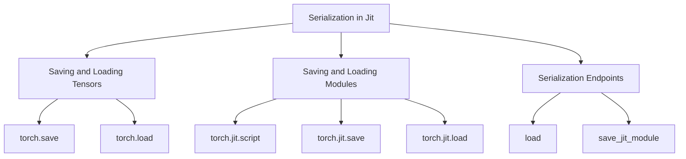

# Overview of Serialization in Jit

Serialization in Jit refers to the process of converting <SwmToken path="tools/nightly.py" pos="306:1:1" line-data="    pytorch, platform = &quot;&quot;, &quot;&quot;">`pytorch`</SwmToken> tensors and module states into a format that can be saved to disk and later loaded back into memory. This is essential for saving model parameters, states, and ensuring interoperability between Python and C++ environments.

## Saving and Loading Tensors

The <SwmToken path="torch/csrc/jit/serialization/pickler.cpp" pos="426:22:24" line-data="  // The format here is the same one used by `torch.save()`. The code for the">`torch.save`</SwmToken> function is used to serialize tensors to a file, and the <SwmToken path="torch/csrc/jit/serialization/unpickler.cpp" pos="34:6:8" line-data="// not for torch.load/torch.save). Otherwise we do not know the types">`torch.load`</SwmToken> function is used to deserialize them back into memory. This allows for easy saving and loading of model parameters and other tensor data.

<SwmSnippet path="/torch/csrc/jit/serialization/export_module.cpp" line="448">

---

The <SwmToken path="torch/csrc/jit/serialization/export_module.cpp" pos="448:2:2" line-data="void ScriptModuleSerializer::serialize(">`ScriptModuleSerializer`</SwmToken> class handles the serialization of the model object, including its code and tensor constants. This ensures that the model can be fully reconstructed when loaded.

```c++
void ScriptModuleSerializer::serialize(
    const Module& module,
    const ExtraFilesMap& extra_files,
    bool bytecode_format,
    bool save_mobile_debug_info) {
  C10_LOG_API_USAGE_ONCE("torch.jit.save");
  writeExtraFiles(module, extra_files);
  // Serialize the model object
  writeArchive(
      module._ivalue(),
      /*archive_name=*/"data",
      /*archive_dir=*/"",
      /*tensor_dir=*/"data/");
  // Then we serialize all code info.
  convertTypes(module.type());
  writeFiles("code/");
  // The tensor constants from the code are written to a separate archive
  // so loading the code does not depend on loading the data
  std::vector<IValue> ivalue_constants(
      constant_table_.begin(), constant_table_.end());
  if (bytecode_format) {
```

---

</SwmSnippet>

## Saving and Loading Modules

To serialize a module, you can use the `torch.jit.script` function to convert the module into a <SwmToken path="torch/_dynamo/backends/debugging.py" pos="86:2:2" line-data="def torchscript(gm, fake_tensor_inputs):">`torchscript`</SwmToken> representation, and then use <SwmToken path="torch/csrc/jit/serialization/export_module.cpp" pos="453:4:8" line-data="  C10_LOG_API_USAGE_ONCE(&quot;torch.jit.save&quot;);">`torch.jit.save`</SwmToken> to save it to a file. The module can be loaded back using `torch.jit.load`, which reconstructs the module with its original state and functionality.

<SwmSnippet path="/torch/csrc/jit/serialization/pickler.cpp" line="596">

---

The <SwmToken path="torch/csrc/jit/serialization/pickler.cpp" pos="600:2:2" line-data="void Pickler::startTypeTag() {">`Pickler`</SwmToken> class is responsible for adding the type of a container to the stack as a string, preserving type tags across serialization.

```c++
// startTypeTag() and endTypeTag() must be called in a pair, with 1 argument
// pushed on the stack in between them. They will add the type of a container
// ivalue to the stack as a string so we can preserve type tags across
// serialization
void Pickler::startTypeTag() {
  if (tag_aggregates_) {
    pushGlobal("torch.jit._pickle", "restore_type_tag");
  }
}
```

---

</SwmSnippet>

<SwmSnippet path="/torch/csrc/jit/serialization/unpickler.cpp" line="206">

---

The <SwmToken path="torch/csrc/jit/serialization/unpickler.cpp" pos="206:2:2" line-data="IValue Unpickler::parse_ivalue() {">`Unpickler`</SwmToken> class is used to parse the serialized data and reconstruct the original objects, ensuring that the type tags are accurately restored if possible.

```c++
IValue Unpickler::parse_ivalue() {
  run();
  TORCH_CHECK(
      stack_.size() == 1,
      "Unpickler expected 1 element on the stack, but found ",
      stack_.size());
  if (version_ <= 2) {
    // See [type tag serialization]
    restoreAccurateTypeTagsIfPossible(stack_[0]);
  }
  return stack_[0];
```

---

</SwmSnippet>

## Serialization Endpoints

Serialization endpoints are functions that facilitate the saving and loading of serialized modules. These include <SwmToken path="torch/csrc/jit/serialization/import.h" pos="78:4:4" line-data="TORCH_API Module load(">`load`</SwmToken> and <SwmToken path="torch/csrc/jit/serialization/export.h" pos="264:4:4" line-data="TORCH_API void save_jit_module(">`save_jit_module`</SwmToken>.

### load

The <SwmToken path="torch/csrc/jit/serialization/import.h" pos="78:4:4" line-data="TORCH_API Module load(">`load`</SwmToken> function is used to load a serialized <SwmToken path="torch/csrc/jit/serialization/export_module.cpp" pos="449:3:3" line-data="    const Module&amp; module,">`Module`</SwmToken> from a given <SwmToken path="torch/csrc/jit/serialization/import.h" pos="74:19:19" line-data="/// Loads a serialized `Module` from the given `istream`.">`istream`</SwmToken>. This function ensures that the serialized module, which was exported via <SwmToken path="torch/csrc/jit/serialization/import.h" pos="77:3:7" line-data="/// `torch::jit::ExportModule` in C++.">`torch::jit::ExportModule`</SwmToken> in C++, is correctly deserialized and reconstructed.

<SwmSnippet path="/torch/csrc/jit/serialization/import.h" line="74">

---

The <SwmToken path="torch/csrc/jit/serialization/import.h" pos="78:4:4" line-data="TORCH_API Module load(">`load`</SwmToken> function definition in the codebase.

```c
/// Loads a serialized `Module` from the given `istream`.
///
/// The istream must contain a serialized `Module`, exported via
/// `torch::jit::ExportModule` in C++.
TORCH_API Module load(
    std::istream& in,
    std::optional<c10::Device> device = std::nullopt,
    bool load_debug_files = true);
```

---

</SwmSnippet>

### <SwmToken path="torch/csrc/jit/serialization/export.h" pos="264:4:4" line-data="TORCH_API void save_jit_module(">`save_jit_module`</SwmToken>

The <SwmToken path="torch/csrc/jit/serialization/export.h" pos="264:4:4" line-data="TORCH_API void save_jit_module(">`save_jit_module`</SwmToken> function is responsible for saving a JIT module to a file. It takes a <SwmToken path="torch/csrc/jit/serialization/export_module.cpp" pos="449:3:3" line-data="    const Module&amp; module,">`Module`</SwmToken> and a filename as input and writes the serialized module to the specified file. This function ensures that all necessary components of the module, including extra files, are correctly saved.

<SwmSnippet path="/torch/csrc/jit/serialization/export.h" line="264">

---

The <SwmToken path="torch/csrc/jit/serialization/export.h" pos="264:4:4" line-data="TORCH_API void save_jit_module(">`save_jit_module`</SwmToken> function definition in the codebase.

```c
TORCH_API void save_jit_module(
    const Module& module,
    const std::string& filename,
    const ExtraFilesMap& extra_files = ExtraFilesMap());

TORCH_API DetachedBuffer::UniqueDetachedBuffer save_jit_module_to_bytes(
    const Module& module,
    const ExtraFilesMap& extra_files = ExtraFilesMap());

TORCH_API void save_jit_module_to_write_func(
    const Module& module,
    const ExtraFilesMap& extra_files,
    bool save_mobile_debug_info,
    const std::function<size_t(const void*, size_t)>& writer_func);
```

---

</SwmSnippet>

&nbsp;

*This is an auto-generated document by Swimm AI 🌊 and has not yet been verified by a human*

<SwmMeta version="3.0.0" repo-id="Z2l0aHViJTNBJTNBcHl0b3JjaC1hdXRvZG9jcy1kZW1vJTNBJTNBU3dpbW0tRGVtbw==" repo-name="pytorch-autodocs-demo"><sup>Powered by [Swimm](/)</sup></SwmMeta>
