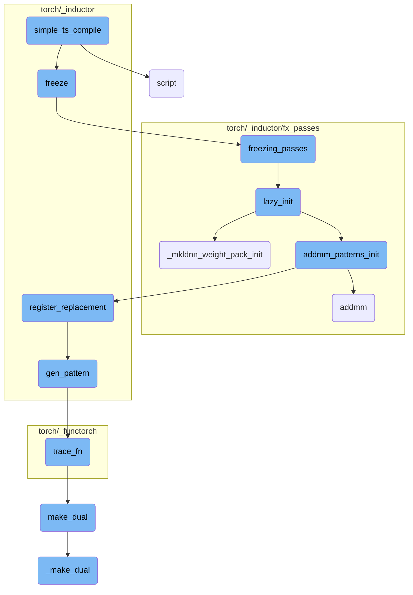
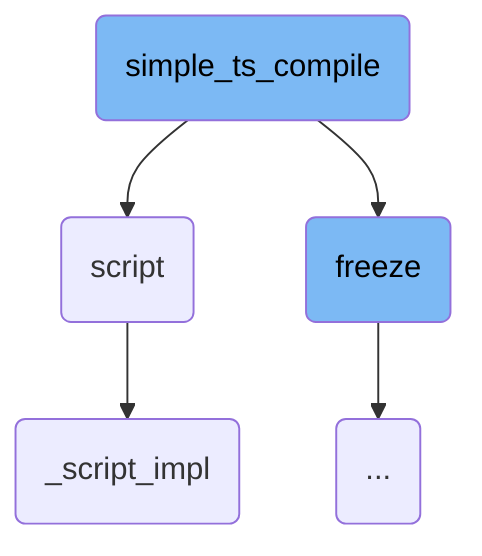
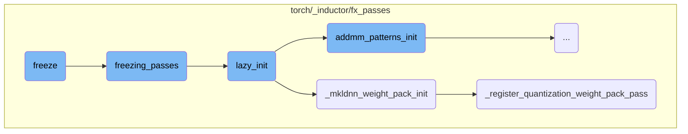
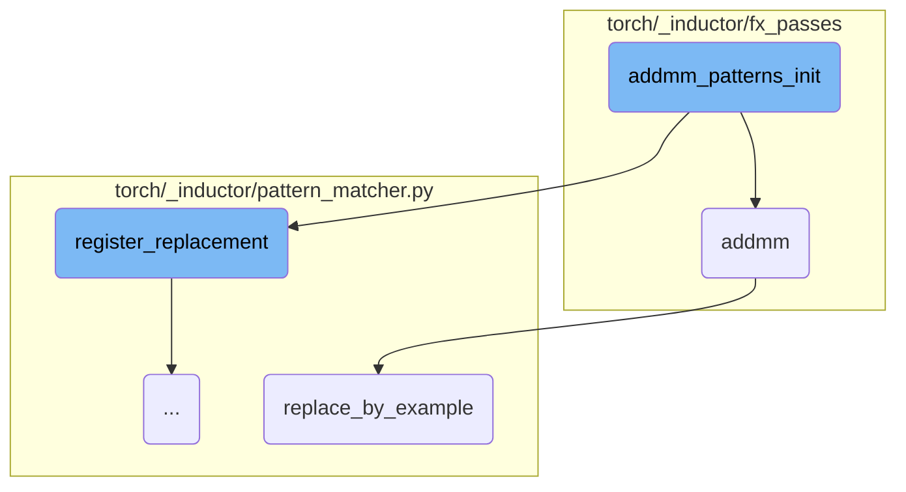
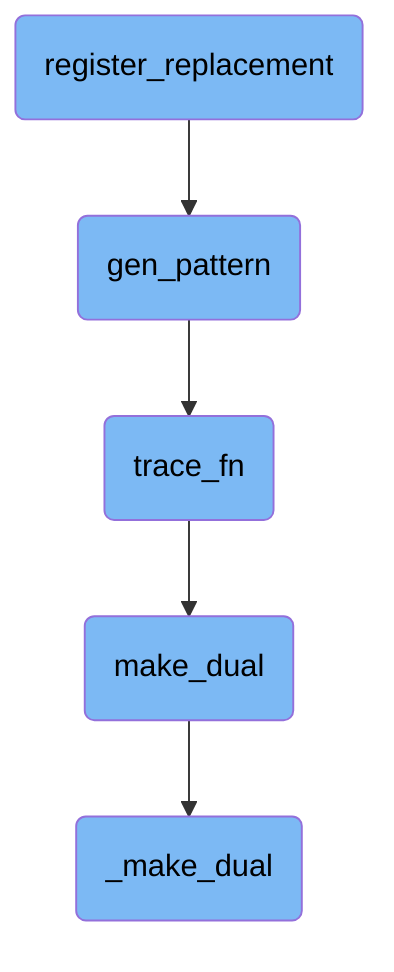

This document provides an overview of the `simple_ts_compile` function, which is responsible for compiling and freezing a TorchScript function. The process involves several key steps, including stripping overloads from the graph, scripting the graph into a TorchScript function, and freezing the resulting function to optimize it for execution.

The `simple_ts_compile` function starts by removing any unnecessary overloads from the graph. It then converts the graph into a TorchScript function, which is a more efficient representation for execution. Finally, the function freezes the TorchScript function, which involves optimizing the graph by converting certain parameters into constants and applying various optimization passes. This makes the function more efficient and ready for execution.

Here is a high level diagram of the flow, showing only the most important functions:



# Flow drill down

First, we'll zoom into this section of the flow:



<SwmSnippet path="/torch/_functorch/compilers.py" line="191">

---

## Compiling and Freezing a TorchScript Function

The function `simple_ts_compile` first strips overloads from the given graph using `strip_overloads(fx_g)`. It then compiles the graph into a TorchScript function using `torch.jit.script(fx_g)` and freezes the resulting function with `torch.jit.freeze(f.eval())`.

```python
    strip_overloads(fx_g)
    f = torch.jit.script(fx_g)
    f = torch.jit.freeze(f.eval())
```

---

</SwmSnippet>

<SwmSnippet path="/torch/jit/_script.py" line="1224">

---

## Scripting a Function

The `script` function is responsible for converting a Python function, module, dictionary, or list into a TorchScript representation. This is done by inspecting the source code and compiling it using the TorchScript compiler.

```python
    r"""Script the function.

    Scripting a function or ``nn.Module`` will inspect the source code, compile
    it as TorchScript code using the TorchScript compiler, and return a :class:`ScriptModule` or
    :class:`ScriptFunction`. TorchScript itself is a subset of the Python language, so not all
    features in Python work, but we provide enough functionality to compute on
    tensors and do control-dependent operations. For a complete guide, see the
    :ref:`language-reference`.

    Scripting a dictionary or list copies the data inside it into a TorchScript instance than can be
    subsequently passed by reference between Python and TorchScript with zero copy overhead.

    ``torch.jit.script`` can be used as a function for modules, functions, dictionaries and lists
     and as a decorator ``@torch.jit.script`` for :ref:`torchscript-classes` and functions.
```

---

</SwmSnippet>

<SwmSnippet path="/torch/jit/_script.py" line="1255">

---

### Example of Scripting a Function

An example of scripting a function is provided, where a simple function `foo` is decorated with `@torch.jit.script`. This converts the function into a `ScriptFunction`, which can then be executed using the TorchScript interpreter.

```python
        The ``@torch.jit.script`` decorator will construct a :class:`ScriptFunction`
        by compiling the body of the function.

        Example (scripting a function):

        .. testcode::

            import torch

            @torch.jit.script
            def foo(x, y):
                if x.max() > y.max():
                    r = x
                else:
                    r = y
                return r

            print(type(foo))  # torch.jit.ScriptFunction

            # See the compiled graph as Python code
            print(foo.code)
```

---

</SwmSnippet>

<SwmSnippet path="/torch/jit/_script.py" line="1086">

---

## Implementation of Script Function

The `_script_impl` function handles the actual conversion of the given object into a TorchScript representation. It checks the type of the object and processes it accordingly, whether it's a module, function, class, dictionary, or list.

```python
def _script_impl(
    obj,
    optimize=None,
    _frames_up=0,
    _rcb=None,
    example_inputs: Union[List[Tuple], Dict[Callable, List[Tuple]], None] = None,
):
    global type_trace_db

    if optimize is not None:
        warnings.warn(
            "`optimize` is deprecated and has no effect. "
            "Use `with torch.jit.optimized_execution()` instead",
            FutureWarning,
            stacklevel=3,
        )

    # No-op for modules, functions, class instances that are already scripted
    if isinstance(obj, RecursiveScriptClass):
        return obj
    if isinstance(obj, ScriptModule):
```

---

</SwmSnippet>

Now, lets zoom into this section of the flow:



<SwmSnippet path="/torch/_inductor/freezing.py" line="66">

---

## Freeze

The `freeze` function inlines parameters that are not mutated into constants and optimizes the graph through constant propagation and other techniques. It also discards the original parameters of the module for memory efficiency if enabled. This function is run in dynamo tracing post aot_autograd.

```python
def freeze(
    dynamo_gm: torch.fx.GraphModule,
    aot_autograd_gm: torch.fx.GraphModule,
    example_inputs: List[torch._subclasses.FakeTensor],
) -> Tuple[torch.fx.GraphModule, List[int]]:
    """
    Inlines parameters that are not mutated into constants and optimizes the graph through constant propagation
    and other techniques. If enabled, the function also discards the original parameters of the module for memory efficiency.

    Assumes that this function is run in dynamo tracing post aot_autograd.

    Args:
        dynamo_gm (torch.fx.GraphModule): The Dynamo constructed GraphModule.
        aot_autograd_gm (torch.fx.GraphModule): The aot_autograd constructed GraphModule to be frozen.
        example_inputs (List[torch.Tensor]): A list of example input tensors to be used in the freezing process.

    Returns:
        Tuple[torch.fx.GraphModule, List[int]]: A tuple containing the frozen GraphModule and a list of indices
        of the inputs that were preserved (not turned into constants).
    """
    # We have convert conv's weight to channels last which may meet error for .view
```

---

</SwmSnippet>

<SwmSnippet path="/torch/_inductor/fx_passes/freezing_patterns.py" line="36">

---

## Freezing Passes

The `freezing_passes` function applies various passes to the graph to freeze it. This includes constant folding, binary folding, and applying specific patterns to optimize the graph further.

```python
def freezing_passes(gm: torch.fx.GraphModule, aot_example_inputs):
    """
    Passes that are applied to the graph to freeze pass.
    """

    from ..freezing import constant_fold

    lazy_init()
    # We need a few rounds of binary folding to get rid of all the
    # unnecessary nodes, but may need a good method to chose the rounds number.
    # works like: conv+binary+binary.
    binary_folding = counters["inductor"]["binary_folding"]
    fake_tensor_prop(gm, aot_example_inputs, True)

    torch._inductor.fx_passes.binary_folding.mark_mixed_dtype_allowed_convs(gm)
    for _ in range(4):
        constant_fold(gm)
        # Make sure meta['val'] is properly set for all nodes
        fake_tensor_prop(gm, aot_example_inputs, True)
        binary_folding_pass.apply(gm.graph)  # type: ignore[arg-type]
        # If we don't have binary folding, we don't need to run the pass again.
```

---

</SwmSnippet>

<SwmSnippet path="/torch/_inductor/fx_passes/freezing_patterns.py" line="87">

---

## Lazy Initialization

The `lazy_init` function initializes various components required for freezing, such as MKL-DNN weight packing and binary folding.

```python
def lazy_init():
    if torch._C._has_mkldnn and config.cpp.weight_prepack:
        from .mkldnn_fusion import _mkldnn_weight_pack_init

        _mkldnn_weight_pack_init()

    from .binary_folding import binary_folding_init

    addmm_patterns_init()
    binary_folding_init()
```

---

</SwmSnippet>

<SwmSnippet path="/torch/_inductor/fx_passes/mkldnn_fusion.py" line="1262">

---

## MKL-DNN Weight Pack Initialization

The `_mkldnn_weight_pack_init` function registers the weight pack pass and recovers linear operations if MKL-DNN is enabled and available.

```python
    def _mkldnn_weight_pack_init():
        if torch.backends.mkldnn.enabled and torch.backends.mkldnn.is_available():
            _register_weight_pack_pass()
            _recover_linear()
            _register_quantization_weight_pack_pass()
```

---

</SwmSnippet>

<SwmSnippet path="/torch/_inductor/fx_passes/quantization.py" line="2490">

---

## Register Quantization Weight Pack Pass

The `_register_quantization_weight_pack_pass` function registers various steps for quantization weight packing, including dequant promotion and QConv/QLinear weight prepack.

```python
def _register_quantization_weight_pack_pass():
    # Step 1: Dequant promotion for int8-mixed-fp32/bf16
    _register_dequant_promotion()

    # Step 2: QConv weight prepack
    _register_qconv_weight_prepack()

    # Step 3: QLinear weight prepack
    _register_qlinear_weight_prepack()
```

---

</SwmSnippet>

Now, lets zoom into this section of the flow:



<SwmSnippet path="/torch/_inductor/fx_passes/freezing_patterns.py" line="116">

---

## Initializing addmm Patterns

The function `addmm_patterns_init` initializes patterns for matrix multiplication and addition operations. It first determines the device (CPU or CUDA) and sets up a partial function to create empty tensors. The function defines several patterns and their replacements, such as `matmul_fuse_pattern` and `matmul_replacement`, which fuse multiple matrix multiplications into a single operation and then split the result. These patterns are registered using `register_replacement`, which allows the system to recognize and replace specific operation sequences during execution. This optimization is crucial for improving computational efficiency.

```python
def addmm_patterns_init():
    if torch.cuda.is_available():
        # workaround https://github.com/pytorch/pytorch/issues/97894
        device = "cuda"
    else:
        device = "cpu"
    val = functools.partial(torch.empty, (10, 10), device=device, requires_grad=False)

    def check_concat_weights(match):
        weight_inputs = ["w1", "w2"]
        if "w3" in match.kwargs:
            weight_inputs.append("w3")

        equal_shape_inputs = [weight_inputs]

        if "b1" in match.kwargs:
            bias_inputs = ["b1", "b2"]
            if "b3" in match.kwargs:
                bias_inputs.append("b3")

            equal_shape_inputs.append(bias_inputs)
```

---

</SwmSnippet>

<SwmSnippet path="/torch/_inductor/fx_passes/freezing_patterns.py" line="158">

---

### Registering Replacement Patterns

The `register_replacement` function is called to register the `matmul_fuse_pattern` and `matmul_replacement`. This registration allows the system to replace sequences of matrix multiplications with a more efficient fused operation.

```python
    register_replacement(
        matmul_fuse_pattern,
        matmul_replacement,
        [val(), val(), val(), val()],
        fwd_only,
        pass_patterns[0],
        extra_check=check_concat_weights,
        exclusive_arg_names=("w1", "w2", "w3"),
    )
```

---

</SwmSnippet>

<SwmSnippet path="/torch/_inductor/fx_passes/freezing_patterns.py" line="124">

---

### Checking Concatenated Weights

The `check_concat_weights` function checks if the weights to be concatenated have the same shape. This ensures that the concatenation and subsequent operations are valid and can be performed without errors.

```python
    def check_concat_weights(match):
        weight_inputs = ["w1", "w2"]
        if "w3" in match.kwargs:
            weight_inputs.append("w3")

        equal_shape_inputs = [weight_inputs]

        if "b1" in match.kwargs:
            bias_inputs = ["b1", "b2"]
            if "b3" in match.kwargs:
                bias_inputs.append("b3")

            equal_shape_inputs.append(bias_inputs)

        for equal_shape_group in equal_shape_inputs:
            inps = [match.kwargs[name] for name in equal_shape_group]

            if not all(
                inp.op == "get_attr"
                and inp.meta["val"].shape == inps[0].meta["val"].shape
                for inp in inps
```

---

</SwmSnippet>

<SwmSnippet path="/torch/_inductor/fx_passes/post_grad.py" line="974">

---

## addmm Function

The `addmm` function replaces a pattern of matrix addition and multiplication with a more optimized version. It uses the `replace_by_example` method to perform this replacement, ensuring that the optimized operation is used during execution.

```python
def addmm(match, mat1, mat2, *, inp):
    def repl(inp, mat1, mat2):
        return aten.addmm(inp, mat1, mat2)

    match.replace_by_example(repl, [inp, mat1, mat2])
```

---

</SwmSnippet>

<SwmSnippet path="/torch/_inductor/pattern_matcher.py" line="224">

---

## Replacing by Example

The `replace_by_example` function replaces a given pattern with a specified replacement function. It traces the replacement function to create a new computational graph, which is then used to replace the original pattern. This method is essential for optimizing specific sequences of operations.

```python
    def replace_by_example(
        self,
        replacement_fn: ReplaceFn,
        args: Sequence[Any],
        trace_fn: Optional[TraceFn] = None,
        run_dce: bool = True,
    ) -> None:
        from torch._inductor.virtualized import V

        context = V.fake_mode if V.fake_mode is not None else contextlib.nullcontext

        with context:
            if trace_fn is None:
                trace_fn = functools.partial(fwd_only, run_dce=run_dce)
            replacement = trace_fn(
                replacement_fn, torch.fx.map_arg(args, lambda arg: arg.meta["val"])
            )
            ReplacementPatternEntry.replace_with_graph(
                self,
```

---

</SwmSnippet>

Now, lets zoom into this section of the flow:



<SwmSnippet path="/torch/_inductor/pattern_matcher.py" line="1220">

---

## register_replacement

The function `register_replacement` is responsible for registering a replacement pattern in the pattern matcher. It ensures that shapes are correctly matched by initially ignoring certain types like integers.

```python
    def check_fn(match: Match) -> bool:
        """
        Often shapes get burned into the pattern, so our initial match ran with
        `ignore_types=(int, ...)`.
```

---

</SwmSnippet>

<SwmSnippet path="/torch/_inductor/pattern_matcher.py" line="1274">

---

The `search_fn_new` function within `register_replacement` adjusts the arguments for the search function, ensuring that the correct subset of arguments is passed during the pattern matching process.

```python
                    def search_fn_new(*args_new: Any) -> Any:
                        return search_fn(*args_new[len(args_new) - len(args) :])
```

---

</SwmSnippet>

<SwmSnippet path="/torch/_inductor/pattern_matcher.py" line="1326">

---

The `normalize_args` function within `register_replacement` normalizes the arguments by extracting them from the keyword arguments, ensuring that the pattern matcher has a consistent view of the arguments.

```python
    def normalize_args(**kwargs: Any) -> List[Any]:
        args = []
        for name in argnames_static:
            args.append(kwargs.pop(name))
```

---

</SwmSnippet>

&nbsp;

*This is an auto-generated document by Swimm AI 🌊 and has not yet been verified by a human*

<SwmMeta version="3.0.0" repo-id="Z2l0aHViJTNBJTNBcHl0b3JjaC1hdXRvZG9jcy1kZW1vJTNBJTNBU3dpbW0tRGVtbw==" repo-name="pytorch-autodocs-demo"><sup>Powered by [Swimm](https://app.swimm.io/)</sup></SwmMeta>
