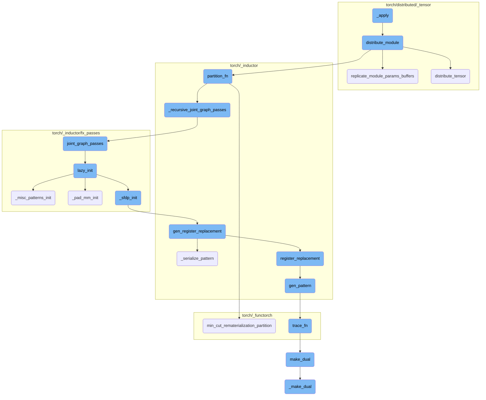
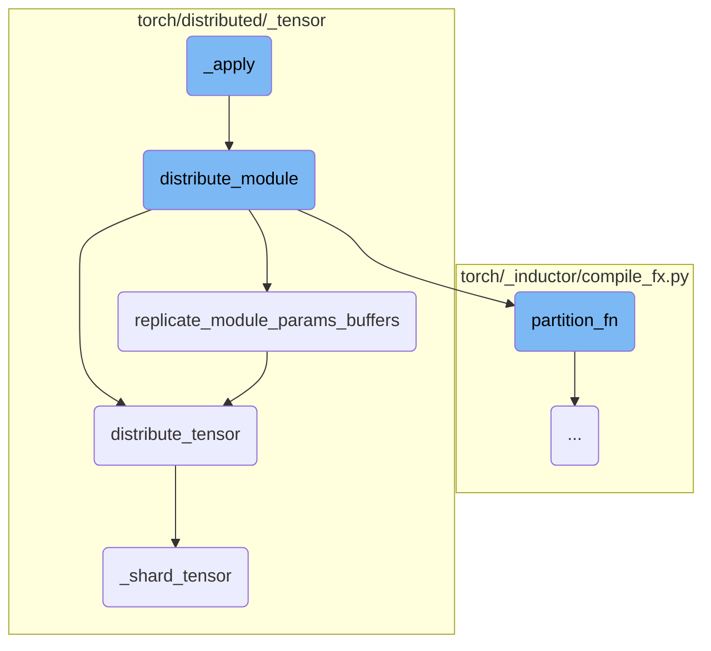
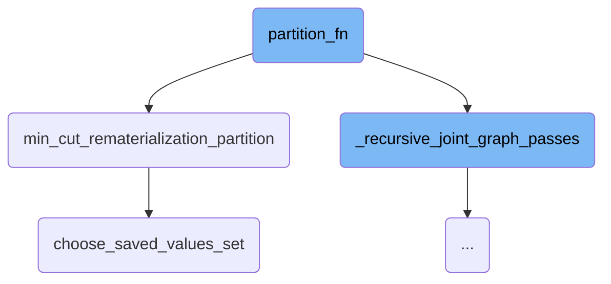
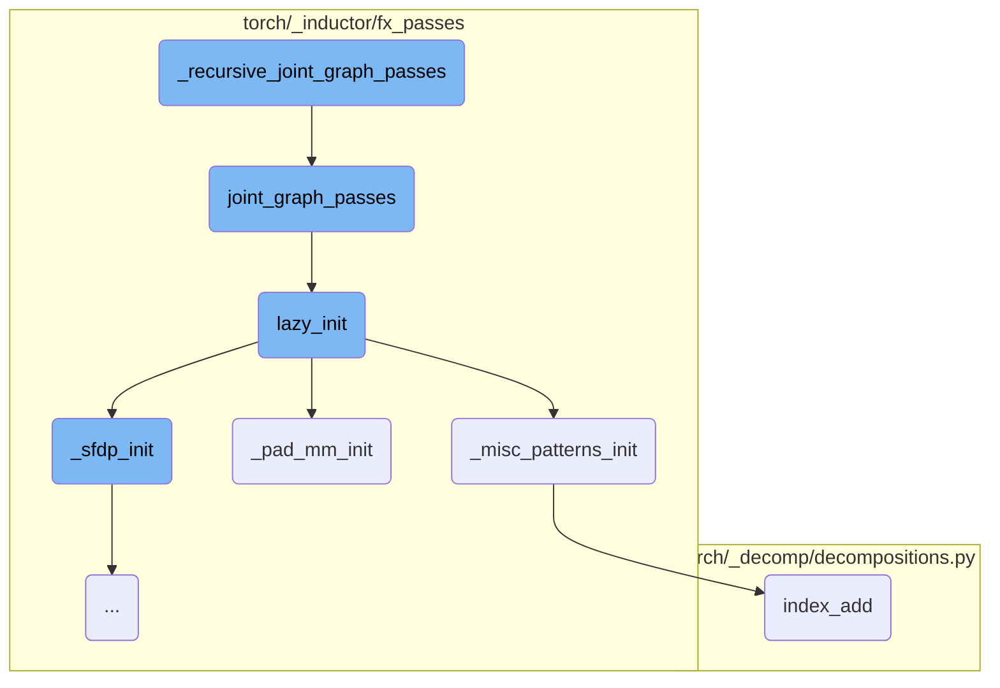
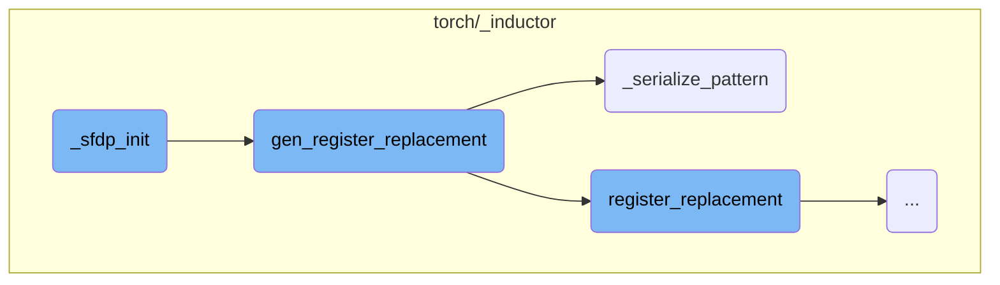
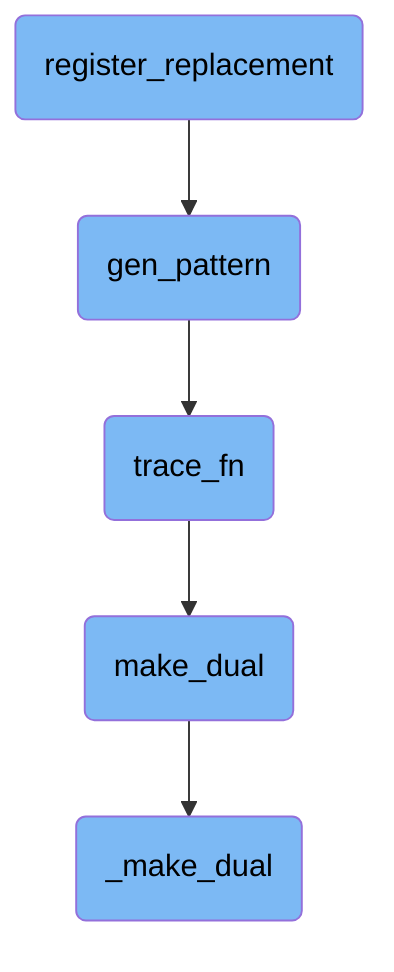

This document provides an overview of how the `_apply` function works. It explains the process of applying a module to a device mesh, ensuring that the module's parameters, inputs, and outputs are correctly distributed across the devices.

The `_apply` function starts by checking if the provided device mesh is valid and has the correct dimensions. If these conditions are met, it calls another function to distribute the module across the device mesh. This ensures that the module's parameters, inputs, and outputs are properly managed and distributed across the devices, allowing for efficient parallel processing.

Here is a high level diagram of the flow, showing only the most important functions:



# Flow drill down

First, we'll zoom into this section of the flow:



<SwmSnippet path="/torch/distributed/_tensor/experimental/attention.py" line="646">

---

## \_apply

The `_apply` function is responsible for applying a module to a device mesh. It first checks if the provided `device_mesh` is an instance of `DeviceMesh` and if its dimension is 1. If these conditions are met, it calls the `distribute_module` function, passing the module, device mesh, and input/output functions.

```python
    def _apply(self, module: nn.Module, device_mesh: DeviceMesh) -> nn.Module:
        if not isinstance(device_mesh, DeviceMesh):
            raise ValueError(
                f"{type(device_mesh)} is not supported by {type(self)} yet."
            )

        if not device_mesh.ndim == 1:
            raise ValueError

        return distribute_module(
            module,
            device_mesh,
            input_fn=self._input_fn,  # type: ignore[arg-type]
            output_fn=self._output_fn,  # type: ignore[arg-type]
        )
```

---

</SwmSnippet>

<SwmSnippet path="/torch/distributed/_tensor/api.py" line="728">

---

## distribute_module

The `distribute_module` function handles the distribution of a module's parameters, inputs, and outputs across a device mesh. It allows for sharding of module parameters before runtime execution through the `partition_fn`, and controls the inputs and outputs during runtime using `input_fn` and `output_fn`. If the device type is 'xla', it uses the `xla_distribute_module` function for XLA integration. The function also registers hooks for input and output functions to manage their distribution.

```python
def distribute_module(
    module: nn.Module,
    device_mesh: Optional[DeviceMesh] = None,
    partition_fn: Optional[Callable[[str, nn.Module, DeviceMesh], None]] = None,
    input_fn: Optional[Callable[[nn.Module, Any, DeviceMesh], None]] = None,
    output_fn: Optional[Callable[[nn.Module, Any, DeviceMesh], None]] = None,
) -> nn.Module:
    """
    This function expose three functions to control the parameters/inputs/outputs of the module:
    1. To perform sharding on the module before runtime execution by specifying the
        ``partition_fn`` (i.e. allow user to convert Module parameters to :class:`DTensor`
        parameters according to the `partition_fn` specified).
    2. To control the inputs or outputs of the module during runtime execution by
        specifying the ``input_fn`` and ``output_fn``. (i.e. convert the input to
        :class:`DTensor`, convert the output back to torch.Tensor)

    Args:
        module (:class:`nn.Module`): user module to be partitioned.
        device_mesh (:class:`DeviceMesh`): the device mesh to place the module.
        partition_fn (Callable): the function to partition parameters (i.e. shard certain
            parameters across the ``device_mesh``). If ``partition_fn`` is not specified,
```

---

</SwmSnippet>

<SwmSnippet path="/torch/distributed/_tensor/api.py" line="786">

---

## replicate_module_params_buffers

The `replicate_module_params_buffers` function replicates all non-DTensor parameters and buffers of a module to DTensor parameters and buffers. It ensures that parameters and buffers are distributed across the device mesh if they haven't been partitioned by the `partition_fn`.

```python
    def replicate_module_params_buffers(m: nn.Module, mesh: DeviceMesh) -> None:
        # This function loop over the immediate module parameters and
        # buffers, replicate all non DTensor params/buffers to DTensor
        # parameters/buffers, if they have not been partitioned in the
        # partition_fn, we can't easily use `module._apply` here
        # because we don't know what happened inside partition_fn as
        # user could do anything, i.e. install hooks, and we want to
        # preserve those.
        full_replicate = [Replicate()] * mesh.ndim
        for key, param in m._parameters.items():
            if param is not None and not isinstance(param, DTensor):
                m.register_parameter(
                    key,
                    nn.Parameter(distribute_tensor(param.data, mesh, full_replicate)),
                )
        for key, buffer in m._buffers.items():
            if buffer is not None and not isinstance(buffer, DTensor):
                m._buffers[key] = distribute_tensor(buffer, mesh, full_replicate)

```

---

</SwmSnippet>

<SwmSnippet path="/torch/distributed/_tensor/api.py" line="590">

---

## distribute_tensor

The `distribute_tensor` function distributes a leaf tensor to a device mesh according to specified placements. It handles the conversion of tensors to the appropriate device type and manages the sharding or replication of tensors based on the placements provided.

```python
def distribute_tensor(
    tensor: torch.Tensor,
    device_mesh: Optional[DeviceMesh] = None,
    placements: Optional[Sequence[Placement]] = None,
) -> DTensor:
    """
    Distribute a leaf torch.Tensor (i.e. nn.Parameter) to the ``device_mesh`` according
    to the ``placements`` specified. The rank of ``device_mesh`` and ``placements`` must be
    the same. If you want to construct a DTensor in the middle of the Autograd computation,
    please use ``DTensor.from_local`` instead.

    Args:
        tensor (torch.Tensor): torch.Tensor to be distributed. Note that if you
            want to shard a tensor on a dimension that is not evenly divisible by
            the number of devices in that mesh dimension, we use ``torch.chunk``
            semantic to shard the tensor and scatter the shards.
        device_mesh (:class:`DeviceMesh`, optional): DeviceMesh to distribute the
            tensor, if not specified, must be called under a DeviceMesh context
            manager, default: None
        placements (List[:class:`Placement`], optional): the placements that
            describes how to place the tensor on DeviceMesh, must have the same
```

---

</SwmSnippet>

<SwmSnippet path="/torch/distributed/_tensor/placement_types.py" line="145">

---

## \_shard_tensor

The `_shard_tensor` function shards and scatters a tensor across a specified dimension of a device mesh. It splits the tensor into chunks, scatters them across the mesh, and handles any necessary padding and unpadding.

```python
    def _shard_tensor(
        self, tensor: torch.Tensor, mesh: DeviceMesh, mesh_dim: int
    ) -> torch.Tensor:
        """
        shard and scatter a tensor on a mesh dimension (use coordinate
        0 on the mesh dimension as source of truth)
        """
        my_coordinate = mesh.get_coordinate()
        num_chunks = mesh.size(mesh_dim=mesh_dim)

        if my_coordinate is None:
            # if rank is not part of mesh, we simply return an empty tensor
            return tensor.new_empty(0, requires_grad=tensor.requires_grad)

        scatter_list, pad_sizes = self._split_tensor(
            tensor, num_chunks, with_padding=True, contiguous=True
        )

        mesh_dim_local_rank = my_coordinate[mesh_dim]
        output = torch.empty_like(scatter_list[mesh_dim_local_rank])
        mesh_scatter(output, scatter_list, mesh, mesh_dim=mesh_dim)
```

---

</SwmSnippet>

Now, lets zoom into this section of the flow:



<SwmSnippet path="/torch/_inductor/compile_fx.py" line="1438">

---

## partition_fn

The function `partition_fn` is responsible for orchestrating the partitioning of a computational graph. It first calls `_recursive_joint_graph_passes` to perform necessary graph transformations and optimizations. Then, it delegates the actual partitioning work to `min_cut_rematerialization_partition`, passing along the graph and joint inputs.

```python
            _recursive_joint_graph_passes(graph)
            return min_cut_rematerialization_partition(
                graph, joint_inputs, **kwargs, compiler="inductor"
            )
```

---

</SwmSnippet>

<SwmSnippet path="/torch/_functorch/partitioners.py" line="1689">

---

## min_cut_rematerialization_partition

The function `min_cut_rematerialization_partition` partitions the joint graph such that the backward pass recomputes the forward pass. This recomputation helps in trading off memory bandwidth with computation. It returns the generated forward and backward Fx graph modules.

```python
    """
    Partitions the joint graph such that the backward recomputes the forward.
    Recomputing helps in trading off memory bandwidth with computation.

    To create the fwd and bwd graph, we copy the joint graph, manually set the
    outputs to just original forward or backward outputs. And then we run the
    resulting graphs through dead code elimination.

    .. warning::
        This API is experimental and likely to change.

    Args:
        joint_module(fx.GraphModule): The joint forward and backward graph. This
            is the result of AOT Autograd tracing.
        _joint_inputs: The inputs to the joint graph. This is unused.
        compiler: This option determines the default set of recomputable ops.
            Currently, there are two options: ``nvfuser`` and ``inductor``.
        recomputable_ops: This is an optional set of recomputable ops. If this
            is not None, then this set of ops will be used instead of the
            default set of ops.
        num_fwd_outputs: The number of outputs from the forward graph.
```

---

</SwmSnippet>

<SwmSnippet path="/torch/_functorch/partitioners.py" line="1608">

---

## choose_saved_values_set

The function `choose_saved_values_set` determines which values should be saved during the forward pass to minimize memory usage while ensuring that the backward pass can be correctly computed. It uses a knapsack algorithm to select the optimal set of values to save within a given memory budget.

```python
    def get_saved_values_knapsack(memory_budget):
        with no_dispatch():
            (
                expected_runtime,
```

---

</SwmSnippet>

Now, lets zoom into this section of the flow:



<SwmSnippet path="/torch/_inductor/compile_fx.py" line="274">

---

## \_recursive_joint_graph_passes

The function `_recursive_joint_graph_passes` is responsible for recursively applying the `joint_graph_passes` function to all subgraphs within a given graph module (`gm`). This ensures that all nested subgraphs undergo the same transformation process, maintaining consistency across the entire graph structure.

```python
def _recursive_joint_graph_passes(gm):
    for subgraph_name in _get_subgraph_names(gm):
        subgraph = getattr(gm, subgraph_name)
        _recursive_joint_graph_passes(subgraph)
    joint_graph_passes(gm)
```

---

</SwmSnippet>

<SwmSnippet path="/torch/_inductor/fx_passes/joint_graph.py" line="434">

---

## joint_graph_passes

The `joint_graph_passes` function performs a series of transformations on the joint forwards and backwards graph. It initializes necessary components using `lazy_init`, applies custom pre and post passes if configured, removes no-op operations, performs constant folding, and applies pattern matching and random replacement passes. Finally, it sorts the graph topologically, checks for consistency, and recompiles it.

```python
def joint_graph_passes(graph: torch.fx.GraphModule):
    """
    Run FX transformations on the joint forwards+backwards graph.
    """
    lazy_init()
    count = 0
    if config.joint_custom_pre_pass is not None:
        with GraphTransformObserver(
            graph, "joint_custom_pre_pass", config.trace.log_url_for_graph_xform
        ):
            config.joint_custom_pre_pass(graph.graph)
            count += 1

    from .post_grad import remove_noop_ops

    remove_noop_ops(graph.graph)

    if config.joint_graph_constant_folding:
        with GraphTransformObserver(
            graph, "constant_fold_uniform_value", config.trace.log_url_for_graph_xform
        ):
```

---

</SwmSnippet>

<SwmSnippet path="/torch/_inductor/fx_passes/joint_graph.py" line="43">

---

### lazy_init

The `lazy_init` function initializes various components required for the graph transformations. It calls `_pad_mm_init`, `_sfdp_init`, and `_misc_patterns_init` to set up necessary patterns and configurations.

```python
def lazy_init():
    from .fuse_attention import _sfdp_init
    from .misc_patterns import _misc_patterns_init
    from .pad_mm import _pad_mm_init

    _pad_mm_init()
    _sfdp_init()
    _misc_patterns_init()
```

---

</SwmSnippet>

<SwmSnippet path="/torch/_inductor/fx_passes/misc_patterns.py" line="16">

---

### \_misc_patterns_init

The `_misc_patterns_init` function registers replacement patterns for certain operations to optimize performance. It defines patterns and their replacements for operations like `randperm_index_add` and `randperm_index`, ensuring faster execution and safe indexing.

```python
def _misc_patterns_init():
    from .joint_graph import patterns as joint_graph_patterns
    from .post_grad import pass_patterns as post_grad_patterns_all

    post_grad_patterns = post_grad_patterns_all[1]  # medium priority

    if torch.cuda.is_available():
        # workaround https://github.com/pytorch/pytorch/issues/97894
        device = "cuda"
    else:
        device = "cpu"

    # These patterns do 2 things
    # 1. Since we know that index is completely unique, we can codegen it using
    # stores instead of atomic adds, which is quite a bit faster.
    # 2. Also, since we are guaranteed that they are completely within bounds,
    # we can use unsafe indexing and skip debug asserts
    def randperm_index_add_pattern(x, y):
        index = torch.randperm(x.shape[0], device=x.device)[: y.shape[0]]
        return torch.index_add(x, dim=0, source=y, index=index), index

```

---

</SwmSnippet>

<SwmSnippet path="/torch/_inductor/fx_passes/pad_mm.py" line="811">

---

### \_pad_mm_init

The `_pad_mm_init` function registers replacement patterns for matrix multiplication operations. It sets up initial traces with placeholder values and registers replacements for patterns like `mm`, `bmm`, and `addmm`, ensuring they are optimized for both training and inference.

```python
def _pad_mm_init():
    from .joint_graph import patterns

    if torch.cuda.is_available():
        # workaround https://github.com/pytorch/pytorch/issues/97894
        device = "cuda"
    else:
        device = "cpu"

    # sizes/values dont actually matter for initial trace
    # once we get a possible match we re-trace with the actual values and verify the match still holds

    dim2a = functools.partial(torch.empty, (4, 4), device=device, requires_grad=True)
    dim2b = functools.partial(torch.empty, (4, 4), device=device, requires_grad=True)

    dim3a = functools.partial(torch.empty, (4, 4, 4), device=device, requires_grad=True)
    dim3b = functools.partial(torch.empty, (4, 4, 4), device=device, requires_grad=True)

    dim1a = functools.partial(torch.empty, (4), device=device, requires_grad=True)

    # workaround https://github.com/pytorch/pytorch/issues/97894
```

---

</SwmSnippet>

<SwmSnippet path="/torch/_decomp/decompositions.py" line="2588">

---

### index_add

The `index_add` function performs an indexed addition operation on a tensor. It is used within the registered patterns to optimize certain tensor operations by replacing them with more efficient implementations.

```python
def index_add(
    x: TensorLike,
    dim: int,
    index: TensorLike,
    tensor: TensorLike,
    *,
    alpha: NumberType = 1,
):
    return _index_add(x, dim, index, tensor, inplace=False, alpha=alpha)
```

---

</SwmSnippet>

Now, lets zoom into this section of the flow:



<SwmSnippet path="/torch/_inductor/fx_passes/fuse_attention.py" line="908">

---

## \_sfdp_init

The `_sfdp_init` function initializes the SFDP (Sparse Format Data Processing) patterns by iterating over the patterns obtained from `_get_sfdp_patterns` and calling `gen_register_replacement` for each pattern. This setup is crucial for ensuring that the appropriate replacements are registered for the SFDP patterns.

```python
    for key, register_replacement_kwargs in _get_sfdp_patterns():
        gen_register_replacement(key, **register_replacement_kwargs)
```

---

</SwmSnippet>

<SwmSnippet path="/torch/_inductor/pattern_matcher.py" line="1463">

---

## gen_register_replacement

The `gen_register_replacement` function is responsible for generating and registering replacement patterns. It first ensures that the example inputs are materialized and then either serializes the pattern or retrieves a precompiled pattern. The function then registers the replacement using the `register_replacement` function. This process is essential for pattern matching and replacement during the optimization passes.

```python
def gen_register_replacement(
    unique_name: str,
    search_fn: SearchFn,
    replace_fn: ReplaceFn,
    example_inputs: Iterable[Any],
    trace_fn: TraceFn,
    pass_dicts: Union[_PassDictsType, Sequence[_PassDictsType]],
    extra_check: Callable[[Match], bool] = _return_true,
    scalar_workaround: Union[Dict[str, Union[float, int]], None] = None,
    exclusive_arg_names: Sequence[str] = (),
    skip_duplicates: bool = False,
) -> None:
    # Make sure the example_inputs is materialized.
    example_inputs = tuple(example_inputs)

    if "PYTORCH_GEN_PATTERNS" in os.environ:
        pat = _serialize_pattern(
            unique_name, search_fn, example_inputs, trace_fn, scalar_workaround
        )
    else:
        pattern_name = search_fn.__name__
```

---

</SwmSnippet>

<SwmSnippet path="/torch/_inductor/pattern_matcher.py" line="1374">

---

### \_serialize_pattern

The `_serialize_pattern` function serializes a given pattern by generating a pattern expression and writing it to a file. This function ensures that the pattern can be reused and referenced in future runs, which is important for maintaining consistency and efficiency in pattern matching.

```python
def _serialize_pattern(
    unique_name: str,
    search_fn: SearchFn,
    example_inputs: Iterable[Any],
    trace_fn: TraceFn,
    scalar_workaround: Union[Dict[str, Union[float, int]], None],
) -> PatternExpr:
    def get_file_template() -> str:
        auto_generated_msg = textwrap.dedent(
            """\
            # This is an auto-generated file. Please do not modify it by hand.
            # To re-generate, run:
            # cd ~/pytorch && python torchgen/fuse/gen_patterns.py
            """
        )

        file_template = textwrap.dedent(
            """\
            # mypy: ignore-errors

            # noqa: F401, E501
```

---

</SwmSnippet>

Now, lets zoom into this section of the flow:



<SwmSnippet path="/torch/_inductor/pattern_matcher.py" line="1220">

---

## Register Replacement

The `register_replacement` function is responsible for registering a replacement pattern in the pattern matcher. It ensures that the shapes are correctly matched by ignoring certain types during the initial match.

```python
    def check_fn(match: Match) -> bool:
        """
        Often shapes get burned into the pattern, so our initial match ran with
        `ignore_types=(int, ...)`.
```

---

</SwmSnippet>

<SwmSnippet path="/torch/_inductor/pattern_matcher.py" line="1274">

---

The `search_fn_new` function within `register_replacement` adjusts the arguments for the search function, ensuring that the correct subset of arguments is passed.

```python
                    def search_fn_new(*args_new: Any) -> Any:
                        return search_fn(*args_new[len(args_new) - len(args) :])
```

---

</SwmSnippet>

<SwmSnippet path="/torch/_inductor/pattern_matcher.py" line="1326">

---

The `normalize_args` function collects and normalizes the arguments based on the static argument names, preparing them for further processing.

```python
    def normalize_args(**kwargs: Any) -> List[Any]:
        args = []
        for name in argnames_static:
            args.append(kwargs.pop(name))
```

---

</SwmSnippet>

<SwmSnippet path="/torch/_inductor/pattern_matcher.py" line="1521">

---

## Generate Pattern

The `gen_pattern` function generates a pattern expression by tracing the search function with example inputs. It handles scalar workarounds and exclusive argument names, ensuring that the pattern is correctly formed for the pattern matcher.

```python
def gen_pattern(
    search_fn: SearchFn,
    example_inputs: Sequence[Any],
    trace_fn: TraceFn,
    scalar_workaround: Union[Dict[str, Union[float, int]], None] = None,
    exclusive_arg_names: Sequence[str] = (),
) -> PatternExpr:
    argnames = [*inspect.signature(search_fn).parameters.keys()]

    if scalar_workaround is None:
        scalar_workaround = {}
    flat_inputs = []
    input_idx = 0  # Positional arguments index

    for argname in argnames:
        if argname in scalar_workaround:
            flat_inputs.append(scalar_workaround[argname])
        else:
            flat_inputs.append(example_inputs[input_idx])
            input_idx += 1

```

---

</SwmSnippet>

<SwmSnippet path="/torch/_functorch/eager_transforms.py" line="1776">

---

## Trace Function

The `trace_fn` function traces the function to be transformed, creating dual tensors for forward-mode automatic differentiation. It maps the tangents to the output, ensuring that the gradients are correctly computed.

```python
    def trace_fn(flat_tangents):
        with fwAD.dual_level():
            flat_duals = tuple(
                fwAD.make_dual(p, t) for p, t in zip(flat_primals, flat_tangents)
            )
            duals = tree_unflatten(flat_duals, primals_argspec)
            output = func(*duals)
            tangents = tree_map_only(
                torch.Tensor, lambda dual: safe_unpack_dual(dual, False)[1], output
            )

        return tangents
```

---

</SwmSnippet>

<SwmSnippet path="/torch/autograd/forward_ad.py" line="70">

---

## Make Dual

The `make_dual` function creates a dual tensor by associating a tensor value with its tangent. This is essential for forward-mode automatic differentiation, allowing the computation of Jacobian-vector products.

```python
def make_dual(tensor, tangent, *, level=None):
    r"""Associate a tensor value with its tangent to create a "dual tensor" for forward AD gradient computation.

    The result is a new tensor aliased to :attr:`tensor` with :attr:`tangent` embedded
    as an attribute as-is if it has the same storage layout or copied otherwise.
    The tangent attribute can be recovered with :func:`unpack_dual`.

    This function is backward differentiable.

    Given a function `f` whose jacobian is `J`, it allows one to compute the Jacobian-vector product (`jvp`)
    between `J` and a given vector `v` as follows.

    Example::

        >>> # xdoctest: +SKIP("Undefined variables")
        >>> with dual_level():
        ...     inp = make_dual(x, v)
        ...     out = f(inp)
        ...     y, jvp = unpack_dual(out)

    Please see the `forward-mode AD tutorial <https://pytorch.org/tutorials/intermediate/forward_ad_usage.html>`__
```

---

</SwmSnippet>

<SwmSnippet path="/torch/csrc/autograd/VariableTypeManual.cpp" line="147">

---

## \_Make Dual

The `_make_dual` function in C++ creates a dual tensor that holds a tangent for forward-mode gradients. It ensures that the dual tensor's primal is a view of the given primal and that the tangent is used as-is.

```c++
// NB: We need a manual variable type kernel so that set_fw_grad properly
// detects that _make_dual is not a forward-differentiable view
//
// This function can be used to create a dual Tensor that holds a tangent to
// compute forward mode gradients. Note that the dual Tensor's primal is a view
// of the given primal and the given tangent is used as-is. This function is
// backward differentiable.
Tensor _make_dual(
    c10::DispatchKeySet ks,
    const Tensor& primal,
    const Tensor& tangent,
    int64_t level) {
  TORCH_CHECK(
      !primal._fw_grad(level).defined(),
      "Making a dual Tensor based on a Tensor that "
      "already has a forward gradient at the same level ",
      level,
      " is not supported.");
  auto& primal_ = unpack(primal, "primal", 0);
  auto& tangent_ = unpack(tangent, "tangent", 0);
  std::shared_ptr<ViewBackward0> grad_fn;
```

---

</SwmSnippet>

&nbsp;

*This is an auto-generated document by Swimm AI 🌊 and has not yet been verified by a human*

<SwmMeta version="3.0.0" repo-id="Z2l0aHViJTNBJTNBcHl0b3JjaC1hdXRvZG9jcy1kZW1vJTNBJTNBU3dpbW0tRGVtbw==" repo-name="pytorch-autodocs-demo"><sup>Powered by [Swimm](https://app.swimm.io/)</sup></SwmMeta>
