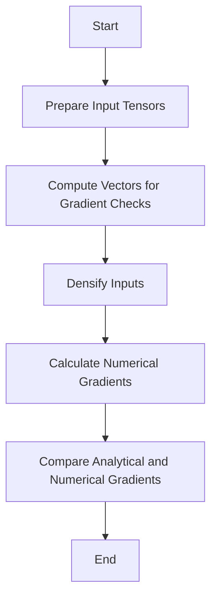

This document will cover the purpose and functionality of the \_fast_gradcheck function. We'll cover:

1. Purpose of \_fast_gradcheck
2. Preparing Input Tensors
3. Computing Vectors for Gradient Checks
4. Densifying Inputs
5. Calculating Numerical Gradients
6. Comparing Analytical and Numerical Gradients

Technical document: <SwmLink doc-title="Overview of _fast_gradcheck Function">[Overview of \_fast_gradcheck Function](/.swm/overview-of-_fast_gradcheck-function.wibv8mib.sw.md)</SwmLink>

# [Purpose of \_fast_gradcheck](https://app.swimm.io/repos/Z2l0aHViJTNBJTNBcHl0b3JjaC1hdXRvZG9jcy1kZW1vJTNBJTNBU3dpbW0tRGVtbw==/docs/wibv8mib#overview-of-_fast_gradcheck-function)

The \_fast_gradcheck function is designed to ensure the correctness of gradients in a computational graph. This is achieved by comparing two types of gradients: analytical gradients, which are calculated using backward mode, and numerical gradients, which are calculated using finite differences. This comparison helps verify that the gradients computed during training are accurate, which is crucial for the performance and reliability of machine learning models.

# [Preparing Input Tensors](https://app.swimm.io/repos/Z2l0aHViJTNBJTNBcHl0b3JjaC1hdXRvZG9jcy1kZW1vJTNBJTNBU3dpbW0tRGVtbw==/docs/wibv8mib#preparing-input-tensors)

The first step in the \_fast_gradcheck process involves preparing the input tensors. This means gathering all the necessary data that will be used for gradient checking. The input tensors are the data points on which the function will operate, and they need to be correctly formatted and organized to ensure accurate gradient calculations.

# [Computing Vectors for Gradient Checks](https://app.swimm.io/repos/Z2l0aHViJTNBJTNBcHl0b3JjaC1hdXRvZG9jcy1kZW1vJTNBJTNBU3dpbW0tRGVtbw==/docs/wibv8mib#computing-vectors-for-gradient-checks)

Once the input tensors are prepared, the next step is to compute the vectors needed for gradient checks. These vectors are used to perform operations that will help in calculating both analytical and numerical gradients. The vectors must be computed accurately to ensure that the subsequent gradient comparisons are valid.

# [Densifying Inputs](https://app.swimm.io/repos/Z2l0aHViJTNBJTNBcHl0b3JjaC1hdXRvZG9jcy1kZW1vJTNBJTNBU3dpbW0tRGVtbw==/docs/wibv8mib#densifying-inputs)

In some cases, the input data may be in a sparse format, meaning that it contains a lot of zero values. For gradient checking, it is often necessary to convert these sparse inputs into a dense format, where all elements are explicitly represented. This step ensures that the gradient calculations can be performed correctly without any missing data.

# [Calculating Numerical Gradients](https://app.swimm.io/repos/Z2l0aHViJTNBJTNBcHl0b3JjaC1hdXRvZG9jcy1kZW1vJTNBJTNBU3dpbW0tRGVtbw==/docs/wibv8mib#calculating-numerical-gradients)

The next step involves calculating the numerical gradients. This is done using a method called finite differences, which approximates the gradient by evaluating the function at slightly perturbed input values. Numerical gradients serve as a baseline for comparison with analytical gradients.

# [Comparing Analytical and Numerical Gradients](https://app.swimm.io/repos/Z2l0aHViJTNBJTNBcHl0b3JjaC1hdXRvZG9jcy1kZW1vJTNBJTNBU3dpbW0tRGVtbw==/docs/wibv8mib#comparing-analytical-and-numerical-gradients)

The final step in the \_fast_gradcheck process is to compare the analytical gradients with the numerical gradients. This comparison is crucial for verifying the correctness of the gradients. If the gradients are similar enough, it indicates that the gradient calculations are accurate. Any significant discrepancies would suggest errors in the gradient computation process, which need to be addressed.

&nbsp;

*This is an auto-generated document by Swimm AI 🌊 and has not yet been verified by a human*

<SwmMeta version="3.0.0" repo-id="Z2l0aHViJTNBJTNBcHl0b3JjaC1hdXRvZG9jcy1kZW1vJTNBJTNBU3dpbW0tRGVtbw==" repo-name="pytorch-autodocs-demo">Powered by [Swimm](https://app.swimm.io/)</SwmMeta>
