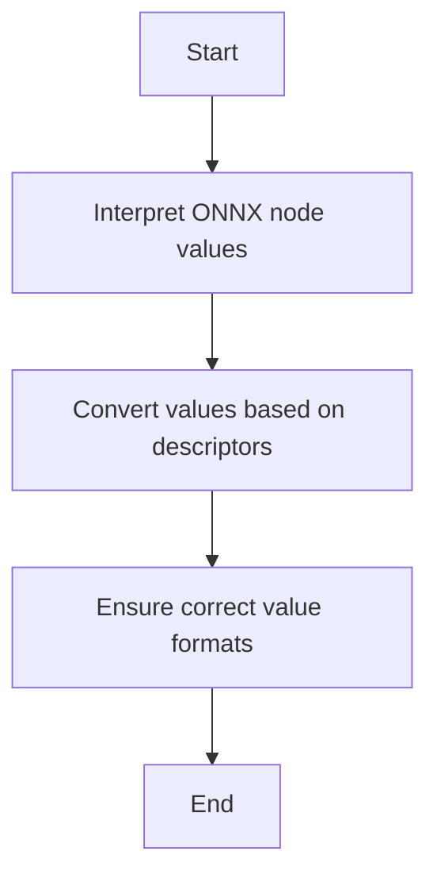

This document will cover the purpose and functionality of the \_parse_arg function, which includes:

1. Interpreting ONNX node values
2. Converting values based on descriptors
3. Ensuring correct value formats.

Technical document: <SwmLink doc-title="Overview of the _parse_arg Function">[Overview of the \_parse_arg Function](/.swm/overview-of-the-_parse_arg-function.x3hieuzp.sw.md)</SwmLink>

# [Interpreting ONNX Node Values](https://app.swimm.io/repos/Z2l0aHViJTNBJTNBcHl0b3JjaC1hdXRvZG9jcy1kZW1vJTNBJTNBU3dpbW0tRGVtbw==/docs/x3hieuzp#overview-of-the-_parse_arg-function)

The \_parse_arg function is designed to interpret ONNX node values. This means it takes the raw data from ONNX nodes and understands what type of data it is dealing with. For example, it can identify whether a value is an integer, float, or boolean. This step is crucial because it sets the stage for correctly processing the data in subsequent steps.

# [Converting Values Based on Descriptors](https://app.swimm.io/repos/Z2l0aHViJTNBJTNBcHl0b3JjaC1hdXRvZG9jcy1kZW1vJTNBJTNBU3dpbW0tRGVtbw==/docs/x3hieuzp#overview-of-the-_parse_arg-function)

Once the \_parse_arg function has interpreted the ONNX node values, it converts these values based on their descriptors. Descriptors are essentially labels that tell the function what type of data it is dealing with. For instance, if a descriptor indicates that a value should be an integer, the function will convert the value to an integer. This ensures that all values are in the correct format for further processing.

# [Ensuring Correct Value Formats](https://app.swimm.io/repos/Z2l0aHViJTNBJTNBcHl0b3JjaC1hdXRvZG9jcy1kZW1vJTNBJTNBU3dpbW0tRGVtbw==/docs/x3hieuzp#overview-of-the-_parse_arg-function)

The final step in the \_parse_arg function's process is to ensure that all values are in the correct format. This is important because it guarantees that the data can be used reliably in subsequent operations. If a value does not match its expected format, the function will raise an error. This step acts as a safeguard to prevent incorrect data from causing issues later in the workflow.

&nbsp;

*This is an auto-generated document by Swimm AI 🌊 and has not yet been verified by a human*

<SwmMeta version="3.0.0" repo-id="Z2l0aHViJTNBJTNBcHl0b3JjaC1hdXRvZG9jcy1kZW1vJTNBJTNBU3dpbW0tRGVtbw==" repo-name="pytorch-autodocs-demo">Powered by [Swimm](https://app.swimm.io/)</SwmMeta>
