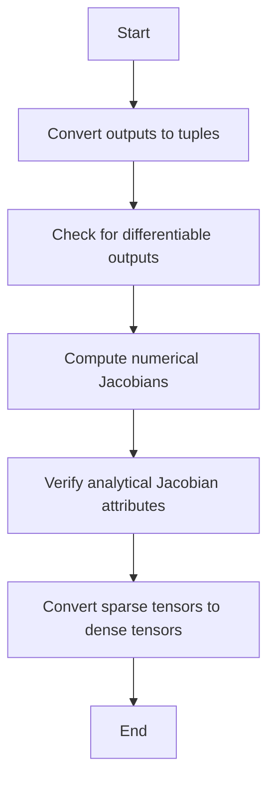

This document will cover the purpose and flow of the \_slow_gradcheck feature, which includes:

1. Converting outputs to tuples
2. Checking for differentiable outputs
3. Computing numerical Jacobians
4. Verifying analytical Jacobian attributes
5. Converting sparse tensors to dense tensors.

Technical document: <SwmLink doc-title="Overview of _slow_gradcheck">[Overview of \_slow_gradcheck](/.swm/overview-of-_slow_gradcheck.sfavb38d.sw.md)</SwmLink>

# [Converting Outputs to Tuples](https://app.swimm.io/repos/Z2l0aHViJTNBJTNBcHl0b3JjaC1hdXRvZG9jcy1kZW1vJTNBJTNBU3dpbW0tRGVtbw==/docs/sfavb38d#converting-outputs-to-tuples)

The process begins by converting the function outputs into a tuple format. This ensures that the outputs are in a consistent structure, which is necessary for further processing. If there are no outputs, the system will proceed to check that there are no differentiable outputs.

# [Checking for Differentiable Outputs](https://app.swimm.io/repos/Z2l0aHViJTNBJTNBcHl0b3JjaC1hdXRvZG9jcy1kZW1vJTNBJTNBU3dpbW0tRGVtbw==/docs/sfavb38d#checking-for-differentiable-outputs)

If there are no outputs, the system verifies that there are no differentiable outputs. This is done to ensure that the function does not produce any gradients when there are no outputs, maintaining the integrity of the gradient checking process.

# [Computing Numerical Jacobians](https://app.swimm.io/repos/Z2l0aHViJTNBJTNBcHl0b3JjaC1hdXRvZG9jcy1kZW1vJTNBJTNBU3dpbW0tRGVtbw==/docs/sfavb38d#computing-numerical-jacobians)

The next step involves computing the numerical Jacobian of the function with respect to its inputs. The numerical Jacobian is a matrix that represents the rate of change of the function's outputs with respect to its inputs. This computation is crucial for verifying the correctness of the gradients.

# [Verifying Analytical Jacobian Attributes](https://app.swimm.io/repos/Z2l0aHViJTNBJTNBcHl0b3JjaC1hdXRvZG9jcy1kZW1vJTNBJTNBU3dpbW0tRGVtbw==/docs/sfavb38d#verifying-analytical-jacobian-attributes)

The system then checks the attributes of the analytical Jacobian to ensure correctness. This includes verifying that the gradient has the correct data type, size, and is reentrant. Reentrancy ensures that the gradient computation can be repeated with the same results.

# [Converting Sparse Tensors to Dense Tensors](https://app.swimm.io/repos/Z2l0aHViJTNBJTNBcHl0b3JjaC1hdXRvZG9jcy1kZW1vJTNBJTNBU3dpbW0tRGVtbw==/docs/sfavb38d#converting-sparse-tensors-to-dense-tensors)

Finally, the system converts sparse tensors to dense tensors for numerical gradient computation. Sparse tensors contain many zero elements, and converting them to dense tensors involves replacing these unspecified elements with zero-valued elements. This conversion is necessary for accurate numerical gradient computation.

&nbsp;

*This is an auto-generated document by Swimm AI 🌊 and has not yet been verified by a human*

<SwmMeta version="3.0.0" repo-id="Z2l0aHViJTNBJTNBcHl0b3JjaC1hdXRvZG9jcy1kZW1vJTNBJTNBU3dpbW0tRGVtbw==" repo-name="pytorch-autodocs-demo">Powered by [Swimm](https://app.swimm.io/)</SwmMeta>
