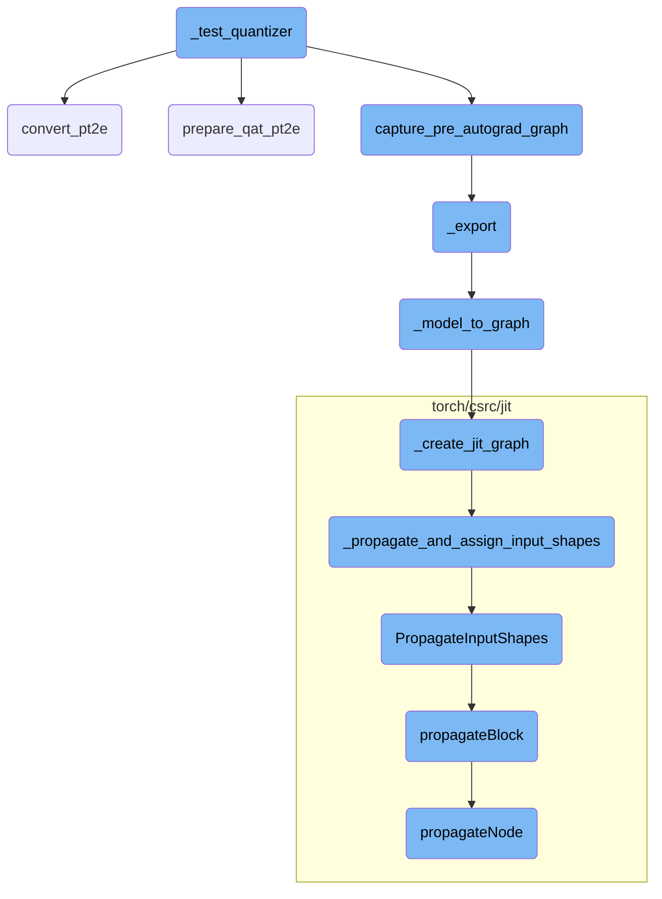
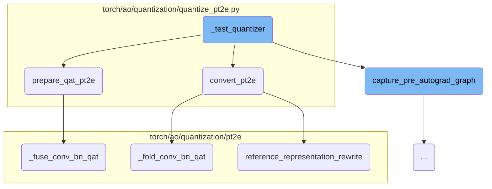
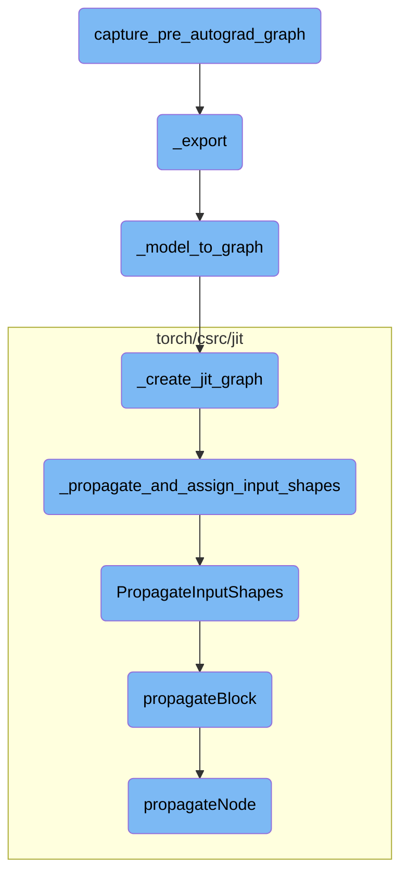

This document provides an overview of the `_test_quantizer` function, which is essential for testing the quantization process of a model. The function involves capturing the pre-autograd graph, preparing the model for quantization, and converting the model to a quantized version.

The `_test_quantizer` function starts by capturing the model's structure before any automatic differentiation operations are applied. This is important to get a static representation of the model. Next, the model is prepared for quantization, which involves adding fake quantization modules to the model. This step is crucial for making the model ready for the actual quantization process. Finally, the model is converted to a quantized version, which involves optimizing the model by folding batch normalization layers and applying quantization operations. This entire process ensures that the model is efficiently quantized and ready for deployment.

Here is a high level diagram of the flow, showing only the most important functions:



# Flow drill down

First, we'll zoom into this section of the flow:



<SwmSnippet path="/torch/testing/_internal/common_quantization.py" line="1259">

---

## \_test_quantizer

The `_test_quantizer` function begins by capturing the pre-autograd graph of the model using the `capture_pre_autograd_graph` function. This step is crucial for obtaining a static representation of the model before any autograd operations are applied.

```python
        m = capture_pre_autograd_graph(
            m,
            example_inputs,
            dynamic_shapes=dynamic_shapes if export_with_dynamic_shape else None,
        )
```

---

</SwmSnippet>

<SwmSnippet path="/torch/testing/_internal/common_quantization.py" line="1265">

---

### Preparing the Model for Quantization

Depending on whether Quantization Aware Training (QAT) is enabled, the model is prepared using either `prepare_qat_pt2e` or `prepare_pt2e`. This step annotates the model with fake quantization modules, making it ready for quantization.

```python
        if is_qat:
            m = prepare_qat_pt2e(m, quantizer)
        else:
            m = prepare_pt2e(m, quantizer)
```

---

</SwmSnippet>

<SwmSnippet path="/torch/testing/_internal/common_quantization.py" line="1271">

---

### Converting the Model

The model is then converted to a quantized version using the `convert_pt2e` function. This step finalizes the quantization process by folding batch normalization layers and applying quantization operations.

```python
        m = convert_pt2e(m)
```

---

</SwmSnippet>

<SwmSnippet path="/torch/ao/quantization/quantize_pt2e.py" line="231">

---

## convert_pt2e

The `convert_pt2e` function converts a calibrated or trained model into a quantized model. It first converts the model to a reference decomposed format and then folds convolution and batch normalization layers.

```python
    original_graph_meta = model.meta
    model = _convert_to_reference_decomposed_fx(model)
    model = _fold_conv_bn_qat(model)
```

---

</SwmSnippet>

<SwmSnippet path="/torch/ao/quantization/quantize_pt2e.py" line="235">

---

### Applying Passes

Passes like `DuplicateDQPass` and `PortNodeMetaForQDQ` are applied to the model to ensure that the quantization operations are correctly duplicated and ported.

```python
    pm = PassManager([DuplicateDQPass()])
    model = pm(model).graph_module

    pm = PassManager([PortNodeMetaForQDQ()])
    model = pm(model).graph_module
```

---

</SwmSnippet>

<SwmSnippet path="/torch/ao/quantization/quantize_pt2e.py" line="241">

---

### Folding Quantize Operations

If the `fold_quantize` flag is set, the `constant_fold` function is called to fold the quantize operations, optimizing the model for inference.

```python
    if fold_quantize:
        constant_fold(model, _quant_node_constraint)

```

---

</SwmSnippet>

<SwmSnippet path="/torch/ao/quantization/quantize_pt2e.py" line="166">

---

## prepare_qat_pt2e

The `prepare_qat_pt2e` function prepares a model for Quantization Aware Training (QAT). It annotates the model with fake quantization modules and validates the annotations.

```python
    original_graph_meta = model.meta
    node_name_to_scope = _get_node_name_to_scope(model)
    model = quantizer.transform_for_annotation(model)
    quantizer.annotate(model)
    quantizer.validate(model)
```

---

</SwmSnippet>

<SwmSnippet path="/torch/ao/quantization/quantize_pt2e.py" line="174">

---

### Fusing Convolution and Batch Normalization

The `_fuse_conv_bn_qat` function is called to fuse convolution and batch normalization layers, which is essential for optimizing the model for QAT.

```python
    _fuse_conv_bn_qat(model)
```

---

</SwmSnippet>

<SwmSnippet path="/torch/ao/quantization/pt2e/qat_utils.py" line="625">

---

## \_fuse_conv_bn_qat

The `_fuse_conv_bn_qat` function iterates over different convolution types (1D, 2D, transpose) and fuses them with batch normalization layers. This step is crucial for reducing the computational overhead during inference.

```python
        m = _fuse_conv_bn_qat_helper(
            m, F.conv1d, _conv1d_bn_example_inputs, is_cuda=is_cuda
        )
        m = _fuse_conv_bn_qat_helper(
            m, F.conv2d, _conv2d_bn_example_inputs, is_cuda=is_cuda
        )
        m = _fuse_conv_bn_qat_helper(
            m, F.conv_transpose1d, _conv1d_bn_example_inputs, is_cuda=is_cuda
        )
        m = _fuse_conv_bn_qat_helper(
            m, F.conv_transpose2d, _conv2d_bn_example_inputs, is_cuda=is_cuda
        )
```

---

</SwmSnippet>

<SwmSnippet path="/torch/ao/quantization/pt2e/qat_utils.py" line="831">

---

## \_fold_conv_bn_qat

The `_fold_conv_bn_qat` function folds the batch normalization layers into the convolution layers for different convolution types. This step helps in optimizing the model by reducing the number of operations.

```python
        m = _fold_conv_bn_qat_helper(
            m, F.conv1d, _quantized_conv1d_bn_example_inputs, is_cuda=is_cuda
        )
        m = _fold_conv_bn_qat_helper(
            m, F.conv2d, _quantized_conv2d_bn_example_inputs, is_cuda=is_cuda
        )
        m = _fold_conv_bn_qat_helper(
            m, F.conv_transpose1d, _quantized_conv1d_bn_example_inputs, is_cuda=is_cuda
        )
        m = _fold_conv_bn_qat_helper(
            m, F.conv_transpose2d, _quantized_conv2d_bn_example_inputs, is_cuda=is_cuda
        )
```

---

</SwmSnippet>

<SwmSnippet path="/torch/ao/quantization/pt2e/representation/rewrite.py" line="809">

---

## reference_representation_rewrite

The `reference_representation_rewrite` function rewrites the model to use a reference representation. It replaces patterns in the model graph with optimized versions, ensuring that the quantized model is efficient and accurate.

```python
    remove_tensor_overload_for_qdq_ops(model)
    for rewrite_info in _REWRITE_INFO_LIST:
        example_inputs = rewrite_info.example_inputs
        pattern = rewrite_info.pattern
        replacement = rewrite_info.replacement
        pattern_post_trans = rewrite_info.pattern_post_trans
        replacement_post_trans = rewrite_info.replacement_post_trans
        pattern = _get_aten_graph_module_for_pattern(pattern, example_inputs)  # type: ignore[arg-type, assignment]
        remove_tensor_overload_for_qdq_ops(pattern)  # type: ignore[arg-type]
        replacement = _get_aten_graph_module_for_pattern(replacement, example_inputs)  # type: ignore[arg-type, assignment]
        remove_tensor_overload_for_qdq_ops(replacement)  # type: ignore[arg-type]
        if pattern_post_trans:
            pattern = pattern_post_trans(pattern)
        if replacement_post_trans:
            replacement = replacement_post_trans(replacement)
        pattern.recompile()  # type: ignore[attr-defined]
        replacement.recompile()  # type: ignore[attr-defined]
        matches = replace_pattern(model, pattern, replacement)
    return model
```

---

</SwmSnippet>

Now, lets zoom into this section of the flow:



<SwmSnippet path="/torch/_export/__init__.py" line="72">

---

## capture_pre_autograd_graph

The function `capture_pre_autograd_graph` is responsible for capturing the computational graph before the autograd (automatic differentiation) process begins. This is crucial for scenarios where the graph needs to be analyzed or transformed before gradients are computed. By capturing the graph at this stage, it ensures that the structure and operations of the model are preserved in their initial form, which can be useful for optimizations or exporting the model to other formats.

```python
def capture_pre_autograd_graph(
    f: torch.nn.Module,
    args: Tuple[Any],
    kwargs: Optional[Dict[str, Any]] = None,
    dynamic_shapes: Optional[Union[Dict[str, Any], Tuple[Any]]] = None,
) -> torch.nn.Module:
    """
    A helper function that is intended to trace a module before any pre-autograd
    decomposition is run. The produced module will be "non-functional" and
    composed of aten operators. Later this API will be deleted in favor of more general
    torch.export API.

    Args:
      f: nn.Module to be traced

      args: example positional inputs.

      kwargs: optional example keyword inputs.

      dynamic_shapes: Should either be:
         1) a dict from argument names of ``f`` to their dynamic shape specifications,
```

---

</SwmSnippet>

<SwmSnippet path="/torch/onnx/utils.py" line="1515">

---

## \_export

The `_export` function is a key component in exporting a PyTorch model to the ONNX (Open Neural Network Exchange) format. It handles various aspects such as setting up the export context, managing model parameters, and ensuring compatibility with different ONNX opset versions. This function ensures that the model is correctly converted into an ONNX graph, which can then be used for inference in different environments.

```python
def _export(
    model,
    args,
    f,
    export_params=True,
    verbose=False,
    training=_C_onnx.TrainingMode.EVAL,
    input_names=None,
    output_names=None,
    operator_export_type=_C_onnx.OperatorExportTypes.ONNX,
    export_type=None,
    opset_version=None,
    do_constant_folding=True,
    dynamic_axes=None,
    keep_initializers_as_inputs=None,
    fixed_batch_size=False,
    custom_opsets=None,
    add_node_names=True,
    onnx_shape_inference=True,
    export_modules_as_functions=False,
    autograd_inlining=True,
```

---

</SwmSnippet>

<SwmSnippet path="/torch/onnx/utils.py" line="1130">

---

## \_model_to_graph

The `_model_to_graph` function converts a PyTorch model into an ONNX graph. It handles the tracing of the model, optimization of the graph, and assignment of input and output shapes. This function is essential for transforming the model into a format that can be exported and used in ONNX-compatible environments.

```python
def _model_to_graph(
    model,
    args,
    verbose=False,
    input_names=None,
    output_names=None,
    operator_export_type=_C_onnx.OperatorExportTypes.ONNX,
    do_constant_folding=True,
    _disable_torch_constant_prop=False,
    fixed_batch_size=False,
    training=_C_onnx.TrainingMode.EVAL,
    dynamic_axes=None,
) -> tuple[
    _C.Graph,
    dict[str, torch.Tensor],
    torch.Tensor
    | tuple[torch.Tensor, ...]
    | list[torch.Tensor]
    | dict[str, torch.Tensor]
    | Any
    | None,
```

---

</SwmSnippet>

<SwmSnippet path="/torch/onnx/utils.py" line="1015">

---

## \_create_jit_graph

The `_create_jit_graph` function creates a JIT (Just-In-Time) graph from a PyTorch model. It handles both traced and scripted models, ensuring that the graph is correctly formed and optimized. This function is a crucial step in the process of converting a model to an ONNX graph, as it provides the initial representation of the model's computational graph.

```python
def _create_jit_graph(
    model: torch.nn.Module | torch.jit.ScriptFunction, args: Sequence[Any]
) -> tuple[_C.Graph, list[_C.IValue], Any | None, _C.ScriptModule | None]:
    if isinstance(model, (torch.jit.ScriptFunction, torch.jit.ScriptModule)):
        flattened_args = tuple(torch.jit._flatten(tuple(args))[0])
        _check_flatten_did_not_remove(args, flattened_args)
        torch_out = None

        if isinstance(model, torch.jit.ScriptModule):
            try:
                graph = model.forward.graph  # type: ignore[attr-defined]
            except AttributeError as e:
                raise RuntimeError("'forward' method must be a script method") from e
            _C._jit_pass_onnx_function_substitution(graph)
            freezed_module = _C._freeze_module(
                cast(_C.ScriptModule, model._c), preserveParameters=True
            )
            module, params = _C._jit_onnx_list_model_parameters(freezed_module)
            method_graph = module._get_method("forward").graph
            args_params = tuple(args) + tuple(params)
            param_count_list = _get_param_count_list(method_graph, args_params)
```

---

</SwmSnippet>

<SwmSnippet path="/torch/csrc/jit/python/script_init.cpp" line="461">

---

## \_propagate_and_assign_input_shapes

The `_propagate_and_assign_input_shapes` function propagates and assigns input shapes within a graph. This is important for ensuring that all tensor shapes are correctly inferred and assigned, which is necessary for subsequent graph optimizations and transformations.

```c++
static std::shared_ptr<Graph> _propagate_and_assign_input_shapes(
    Graph& graph,
    const std::vector<at::Tensor>& inputs,
    const std::vector<int>& param_count_list,
    bool with_grad = false,
    bool propagate = true) {
  auto retval = graph.copy();
  setInputTensorTypes(
      *retval, fmap<IValue>(inputs), /*complete=*/true, param_count_list);
  if (propagate) {
    PropagateInputShapes(retval);
  }
  return retval;
}
```

---

</SwmSnippet>

<SwmSnippet path="/torch/csrc/jit/passes/shape_analysis.cpp" line="2147">

---

## PropagateInputShapes

The `PropagateInputShapes` function is responsible for propagating input shapes throughout the graph. It uses a `ShapePropagator` to traverse the graph and assign shapes to all tensors, ensuring that the graph has complete shape information for all operations.

```c++
void PropagateInputShapes(const std::shared_ptr<Graph>& graph) {
  ShapePropagator(graph).propagateBlock(graph->block());
}
```

---

</SwmSnippet>

<SwmSnippet path="/torch/csrc/jit/passes/shape_analysis.cpp" line="59">

---

## propagateBlock

The `propagateBlock` function iterates over all nodes in a block and propagates their shapes. It handles exceptions and ensures that any nodes that fail shape propagation are marked accordingly. This function is part of the shape analysis process, ensuring that all nodes in the graph have accurate shape information.

```c++
void PropertyPropBase::propagateBlock(Block* block, bool insert_expands) {
  for (Node* node : block->nodes()) {
    try {
      propagateNode(node, insert_expands);
    } catch (propagation_error& e) {
      setUnshapedType(node);
    } catch (std::exception& e) {
      throw(
          ErrorReport(node->sourceRange())
          << ExceptionMessage(e)
          << "\nThe above operation failed shape propagation in this context");
    }
  }
}
```

---

</SwmSnippet>

<SwmSnippet path="/torch/csrc/jit/passes/shape_analysis.cpp" line="586">

---

## propagateNode

The `propagateNode` function propagates the shape of a single node. It handles various types of nodes and ensures that their output shapes are correctly inferred based on their inputs. This function is a critical part of the shape propagation process, ensuring that each node in the graph has accurate shape information.

```c++
  void propagateNode(Node* node, bool insert_expands = true) override {
    // Certain ops like resize_ change the input tensors size. Because our
    // analysis is flow invariant, we set any Tensor that can alias a resized
    // Tensor to the base Tensor Type without size information.
    if (setUnshapedTypeIfAliasResizedSet(node->inputs())) {
      return setUnshapedType(node);
    }

    // These don't require the types, and have complicated schema. Return early
    // after we process them.
    switch (node->kind()) {
      case prim::If:
        return processIf(node);
      case prim::Loop: {
        return processLoop(node);
      }
      case aten::Bool:
      case aten::Int:
      case aten::Float:
      case aten::ScalarImplicit:
      case aten::FloatImplicit:
```

---

</SwmSnippet>

&nbsp;

*This is an auto-generated document by Swimm AI 🌊 and has not yet been verified by a human*

<SwmMeta version="3.0.0" repo-id="Z2l0aHViJTNBJTNBcHl0b3JjaC1hdXRvZG9jcy1kZW1vJTNBJTNBU3dpbW0tRGVtbw==" repo-name="pytorch-autodocs-demo"><sup>Powered by [Swimm](https://app.swimm.io/)</sup></SwmMeta>
