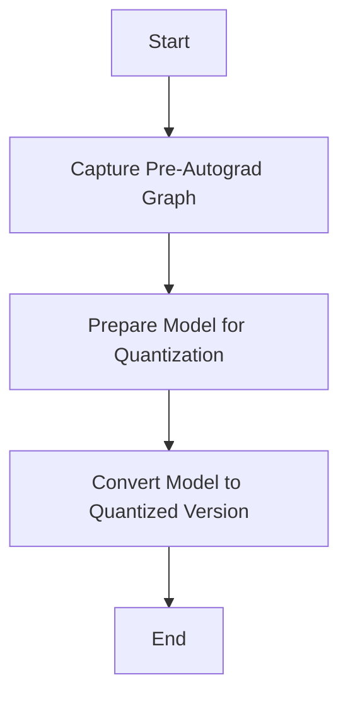

This document will cover the overview of the \_test_quantizer function, which includes:

1. Capturing the pre-autograd graph
2. Preparing the model for quantization
3. Converting the model to a quantized version.

Technical document: <SwmLink doc-title="Overview of the _test_quantizer Function">[Overview of the \_test_quantizer Function](/.swm/overview-of-the-_test_quantizer-function.hasdbpyk.sw.md)</SwmLink>

# [Capturing the Pre-Autograd Graph](https://app.swimm.io/repos/Z2l0aHViJTNBJTNBcHl0b3JjaC1hdXRvZG9jcy1kZW1vJTNBJTNBU3dpbW0tRGVtbw==/docs/hasdbpyk#_test_quantizer)

The process begins by capturing the model's structure before any automatic differentiation operations are applied. This step is essential to obtain a static representation of the model, which is necessary for further analysis and transformations. By capturing the pre-autograd graph, we ensure that the model's initial structure and operations are preserved, which is crucial for accurate quantization.

# [Preparing the Model for Quantization](https://app.swimm.io/repos/Z2l0aHViJTNBJTNBcHl0b3JjaC1hdXRvZG9jcy1kZW1vJTNBJTNBU3dpbW0tRGVtbw==/docs/hasdbpyk#preparing-the-model-for-quantization)

In this step, the model is annotated with fake quantization modules to prepare it for the actual quantization process. Depending on whether Quantization Aware Training (QAT) is enabled, the model is prepared using either `prepare_qat_pt2e` or `prepare_pt2e`. This preparation is crucial as it sets up the model with the necessary components to handle quantization effectively.

# [Converting the Model to a Quantized Version](https://app.swimm.io/repos/Z2l0aHViJTNBJTNBcHl0b3JjaC1hdXRvZG9jcy1kZW1vJTNBJTNBU3dpbW0tRGVtbw==/docs/hasdbpyk#converting-the-model)

The final step involves converting the model to a quantized version using the `convert_pt2e` function. This step optimizes the model by folding batch normalization layers and applying quantization operations. The conversion ensures that the model is efficiently quantized, reducing its size and improving its performance for deployment.

&nbsp;

*This is an auto-generated document by Swimm AI 🌊 and has not yet been verified by a human*

<SwmMeta version="3.0.0" repo-id="Z2l0aHViJTNBJTNBcHl0b3JjaC1hdXRvZG9jcy1kZW1vJTNBJTNBU3dpbW0tRGVtbw==" repo-name="pytorch-autodocs-demo">Powered by [Swimm](https://app.swimm.io/)</SwmMeta>
