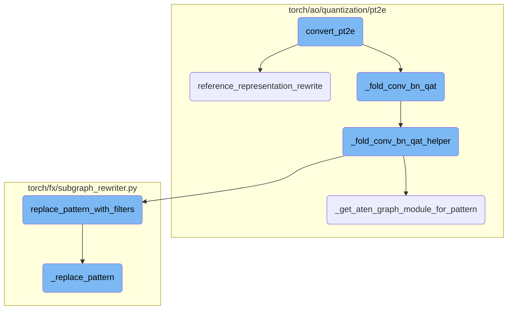
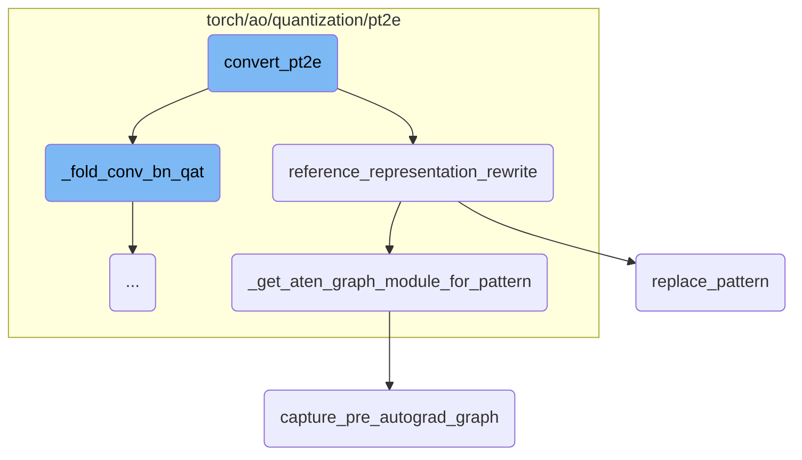
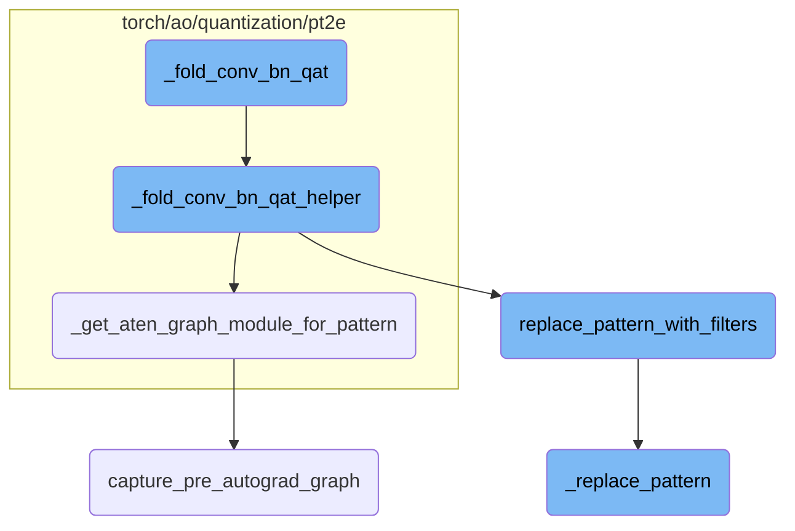
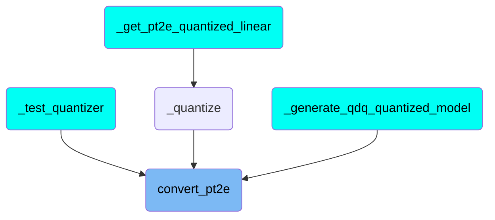

This document provides an overview of the `convert_pt2e` process. The main idea is to convert a calibrated or trained model into a quantized model. The process involves several steps, including logging API usage, validating arguments, converting the model to a reference decomposed FX model, folding convolution and batch normalization layers, and applying various passes to optimize the model. The document also includes a high-level diagram to illustrate the flow.

The flow starts with the `convert_pt2e` function, which takes a model and optional flags. It logs the API usage and validates the arguments. Next, it converts the model to a reference decomposed FX model and folds convolution and batch normalization layers if needed. The function then applies a series of passes to optimize the model by duplicating dequantize operations and porting node metadata. If the `fold_quantize` flag is set, it performs constant folding on the model. If the `use_reference_representation` flag is set, it rewrites the model to use reference representation. Finally, it updates the model's metadata and disallows evaluation and training modes before returning the quantized model.

Here is a high level diagram of the flow, showing only the most important functions:



# Flow drill down

First, we'll zoom into this section of the flow:



<SwmSnippet path="/torch/ao/quantization/quantize_pt2e.py" line="199">

---

## convert_pt2e

The `convert_pt2e` function is responsible for converting a calibrated or trained model into a quantized model. It takes a `GraphModule` model and optional flags to determine whether to use reference representation and whether to fold the quantize operation. The function first logs the API usage and validates the `use_reference_representation` argument. It then converts the model to a reference decomposed FX model and folds convolution and batch normalization layers if applicable. The function applies a series of passes to duplicate dequantize operations and port node metadata for quantize-dequantize operations. If the `fold_quantize` flag is set, it performs constant folding on the model. If the `use_reference_representation` flag is set, it rewrites the model to use reference representation. Finally, it updates the model's metadata and disallows evaluation and training modes before returning the quantized model.

```python
def convert_pt2e(
    model: GraphModule,
    use_reference_representation: bool = False,
    fold_quantize: bool = True,
) -> GraphModule:
    """Convert a calibrated/trained model to a quantized model

    Args:
      * `model` (torch.fx.GraphModule): calibrated/trained model
      * `use_reference_representation` (bool): boolean flag to indicate whether to produce referece representation or not
      * `fold_quantize` (bool): boolean flag for whether fold the quantize op or not

    Returns:
        quantized model, either in q/dq representation or reference representation

    Example::

        # prepared_model: the model produced by `prepare_pt2e`/`prepare_qat_pt2e` and calibration/training
        # `convert_pt2e` produces a quantized model that represents quantized computation with
        # quantize dequantize ops and fp32 ops by default.
        # Please refer to
```

---

</SwmSnippet>

<SwmSnippet path="/torch/ao/quantization/pt2e/representation/rewrite.py" line="808">

---

## reference_representation_rewrite

The `reference_representation_rewrite` function rewrites the model to use reference representation. It removes tensor overloads for quantize-dequantize operations and iterates over a list of rewrite information. For each rewrite info, it retrieves the example inputs, pattern, and replacement, and converts them to FX graphs with decomposed aten operations. It then removes tensor overloads for the patterns and replacements, applies any post transformations, recompiles the patterns and replacements, and replaces the matched patterns in the model with the replacements.

```python
def reference_representation_rewrite(model: GraphModule) -> GraphModule:
    remove_tensor_overload_for_qdq_ops(model)
    for rewrite_info in _REWRITE_INFO_LIST:
        example_inputs = rewrite_info.example_inputs
        pattern = rewrite_info.pattern
        replacement = rewrite_info.replacement
        pattern_post_trans = rewrite_info.pattern_post_trans
        replacement_post_trans = rewrite_info.replacement_post_trans
        pattern = _get_aten_graph_module_for_pattern(pattern, example_inputs)  # type: ignore[arg-type, assignment]
        remove_tensor_overload_for_qdq_ops(pattern)  # type: ignore[arg-type]
        replacement = _get_aten_graph_module_for_pattern(replacement, example_inputs)  # type: ignore[arg-type, assignment]
        remove_tensor_overload_for_qdq_ops(replacement)  # type: ignore[arg-type]
        if pattern_post_trans:
            pattern = pattern_post_trans(pattern)
        if replacement_post_trans:
            replacement = replacement_post_trans(replacement)
        pattern.recompile()  # type: ignore[attr-defined]
        replacement.recompile()  # type: ignore[attr-defined]
        matches = replace_pattern(model, pattern, replacement)
    return model
```

---

</SwmSnippet>

<SwmSnippet path="/torch/ao/quantization/pt2e/utils.py" line="351">

---

## \_get_aten_graph_module_for_pattern

The `_get_aten_graph_module_for_pattern` function converts a given pattern to an FX graph with decomposed aten operations. It optionally moves the example inputs to CUDA if specified, captures the pre-autograd graph for the pattern, eliminates dead code, and recompiles the graph. It also removes any unnecessary copy nodes and eliminates dead code again before returning the aten pattern graph module.

```python
def _get_aten_graph_module_for_pattern(
    pattern: Callable,
    example_inputs: Tuple[Any, ...],
    is_cuda: bool = False,
    **kwargs,
) -> GraphModule:
    """
    Convert the pattern to an FX graph with decomposed aten ops.
    """
    if is_cuda:
        example_inputs = tuple(
            [x.cuda() if isinstance(x, torch.Tensor) else x for x in example_inputs]
        )
    aten_pattern = capture_pre_autograd_graph(
        pattern,
        example_inputs,
        kwargs,
    )
    aten_pattern.graph.eliminate_dead_code()
    aten_pattern.recompile()

```

---

</SwmSnippet>

<SwmSnippet path="/torch/fx/subgraph_rewriter.py" line="84">

---

## replace_pattern

The `replace_pattern` function matches all possible non-overlapping sets of operators and their data dependencies in the graph of a `GraphModule` and replaces each matched subgraph with another subgraph. It takes the graph module, the pattern to match, and the replacement subgraph as arguments. The function returns a list of `Match` objects representing the places in the original graph where the pattern was matched. The matches are replaced with the replacement subgraph, and the function ensures that the parameters of the pattern and replacement callables match.

```python
def replace_pattern(
    gm: GraphModule,
    pattern: Union[Callable, GraphModule],
    replacement: Union[Callable, GraphModule]
) -> List[Match]:
    """
    Matches all possible non-overlapping sets of operators and their
    data dependencies (``pattern``) in the Graph of a GraphModule
    (``gm``), then replaces each of these matched subgraphs with another
    subgraph (``replacement``).

    Args:
        ``gm``: The GraphModule that wraps the Graph to operate on
        ``pattern``: The subgraph to match in ``gm`` for replacement
        ``replacement``: The subgraph to replace ``pattern`` with

    Returns:
        List[Match]: A list of ``Match`` objects representing the places
        in the original graph that ``pattern`` was matched to. The list
        is empty if there are no matches. ``Match`` is defined as:

```

---

</SwmSnippet>

<SwmSnippet path="/torch/_export/__init__.py" line="72">

---

## capture_pre_autograd_graph

The `capture_pre_autograd_graph` function captures the pre-autograd graph for a given pattern and example inputs. It logs a warning about using the torch.export.\_trace.\_export function and raises a NotImplementedError for the `_train` and `_eval` methods. This function is used to convert patterns to FX graphs with decomposed aten operations in the `_get_aten_graph_module_for_pattern` function.

```python
def capture_pre_autograd_graph(
    f: torch.nn.Module,
    args: Tuple[Any],
    kwargs: Optional[Dict[str, Any]] = None,
    dynamic_shapes: Optional[Union[Dict[str, Any], Tuple[Any]]] = None,
) -> torch.nn.Module:
    """
    A helper function that is intended to trace a module before any pre-autograd
    decomposition is run. The produced module will be "non-functional" and
    composed of aten operators. Later this API will be deleted in favor of more general
    torch.export API.

    Args:
      f: nn.Module to be traced

      args: example positional inputs.

      kwargs: optional example keyword inputs.

      dynamic_shapes: Should either be:
         1) a dict from argument names of ``f`` to their dynamic shape specifications,
```

---

</SwmSnippet>

Now, lets zoom into this section of the flow:



<SwmSnippet path="/torch/ao/quantization/pt2e/qat_utils.py" line="825">

---

## Folding Convolution and Batch Normalization Layers

The function `_fold_conv_bn_qat` is responsible for folding convolution and batch normalization layers in a given `GraphModule`. It first checks if the graph contains any batch normalization nodes. If not, it returns the original module. Otherwise, it iterates over different convolution functions and applies the `_fold_conv_bn_qat_helper` function to fold the batch normalization weights into the convolution weights. Finally, it removes any in-place addition operations from batch normalization layers and eliminates dead code before recompiling the graph.

```python
def _fold_conv_bn_qat(m: GraphModule) -> GraphModule:
    has_bn = any(_is_bn_node(n) for n in m.graph.nodes)
    if not has_bn:
        return m
    is_cuda_options = [True, False] if torch.cuda.is_available() else [False]
    for is_cuda in is_cuda_options:
        m = _fold_conv_bn_qat_helper(
            m, F.conv1d, _quantized_conv1d_bn_example_inputs, is_cuda=is_cuda
        )
        m = _fold_conv_bn_qat_helper(
            m, F.conv2d, _quantized_conv2d_bn_example_inputs, is_cuda=is_cuda
        )
        m = _fold_conv_bn_qat_helper(
            m, F.conv_transpose1d, _quantized_conv1d_bn_example_inputs, is_cuda=is_cuda
        )
        m = _fold_conv_bn_qat_helper(
            m, F.conv_transpose2d, _quantized_conv2d_bn_example_inputs, is_cuda=is_cuda
        )

    # remove in place add from batchnorm tracking traning stats
    for node in m.graph.nodes:
```

---

</SwmSnippet>

<SwmSnippet path="/torch/ao/quantization/pt2e/qat_utils.py" line="861">

---

### Helper Function for Folding

The `_fold_conv_bn_qat_helper` function assists in replacing the quantized convolution and batch normalization pattern with a simpler convolution pattern where the batch normalization weights are folded into the convolution weights. It first eliminates dead code and duplicates dequantize nodes. Then, it iterates over various replacement options to match and replace patterns in the graph. The function also copies metadata and arguments from the original subgraph to the replacement nodes and folds the batch normalization weights into the convolution node. Finally, it eliminates any extra dequantize nodes and recompiles the graph.

```python
def _fold_conv_bn_qat_helper(
    m: GraphModule,
    conv_fn: Callable,
    example_inputs: Tuple[Any, ...],
    is_cuda: bool,
) -> GraphModule:
    """
    Replace the quantized (conv + bn) pattern with conv with bn weights folded into the weights of conv.
    """
    m.graph.eliminate_dead_code()
    m.recompile()
    _duplicate_dequantize_node(m)

    # Step (1): Replace QAT pattern with simple [conv - bn] pattern
    replacements = []
    replacement_options = itertools.product(
        [True, False],  # is_per_channel
        [True, False],  # has_bias
        [True, False],  # bias_is_quantized
        [True, False],  # bn_is_training
    )
```

---

</SwmSnippet>

<SwmSnippet path="/torch/fx/subgraph_rewriter.py" line="208">

---

## Replacing Patterns with Filters

The `replace_pattern_with_filters` function is used to replace a specific pattern in the graph with a replacement pattern, optionally using match filters to refine the matching process. This function is an overload of the `replace_pattern` function with an additional `match_filters` argument, which allows for more granular control over the pattern matching and replacement process.

```python
def replace_pattern_with_filters(
    gm: GraphModule,
    pattern: Union[Callable, Graph, GraphModule],
    replacement: Union[Callable, Graph, GraphModule],
    match_filters: Optional[List[Callable[["InternalMatch", Graph, Graph], bool]]] = None,
    ignore_literals: bool = False,
) -> List[ReplacedPatterns]:
    """
    See replace_pattern for documentation. This function is an overload with an additional match_filter argument.

    Args:
        ``match_filters``: A list of functions that take in
            (match: InternalMatch, original_graph: Graph, pattern_graph: Graph) and return a boolean indicating
            whether the match satisfies the condition.
            See matcher_utils.py for definition of InternalMatch.
    """

```

---

</SwmSnippet>

<SwmSnippet path="/torch/fx/subgraph_rewriter.py" line="228">

---

### Internal Pattern Replacement

The `_replace_pattern` function performs the actual pattern replacement in the graph. It uses a `SubgraphMatcher` to find matches of the pattern in the original graph and applies any provided match filters. The function then maps the placeholders in the replacement graph to the corresponding nodes in the original graph, copies the replacement graph into the original graph, and hooks the output nodes of the replacement subgraph into the original graph. Finally, it removes the original nodes and recompiles the graph module to reflect the new state.

```python
def _replace_pattern(
    gm: GraphModule,
    pattern: Union[Callable, Graph, GraphModule],
    replacement: Union[Callable, Graph, GraphModule],
    match_filters: Optional[List[Callable[["InternalMatch", Graph, Graph], bool]]] = None,
    ignore_literals: bool = False,
) -> List[ReplacedPatterns]:

    from torch.fx.passes.utils.matcher_utils import SubgraphMatcher, InternalMatch

    if match_filters is None:
        match_filters = []

    # Get the graphs for `gm`, `pattern`, `replacement`
    original_graph: Graph = gm.graph

    if isinstance(pattern, GraphModule):
        pattern_graph = pattern.graph
    elif isinstance(pattern, Graph):
        pattern_graph = pattern
    else:
```

---

</SwmSnippet>

# Where is this flow used?

This flow is used multiple times in the codebase as represented in the following diagram:



&nbsp;

*This is an auto-generated document by Swimm AI 🌊 and has not yet been verified by a human*

<SwmMeta version="3.0.0" repo-id="Z2l0aHViJTNBJTNBcHl0b3JjaC1hdXRvZG9jcy1kZW1vJTNBJTNBU3dpbW0tRGVtbw==" repo-name="pytorch-autodocs-demo"><sup>Powered by [Swimm](https://app.swimm.io/)</sup></SwmMeta>
