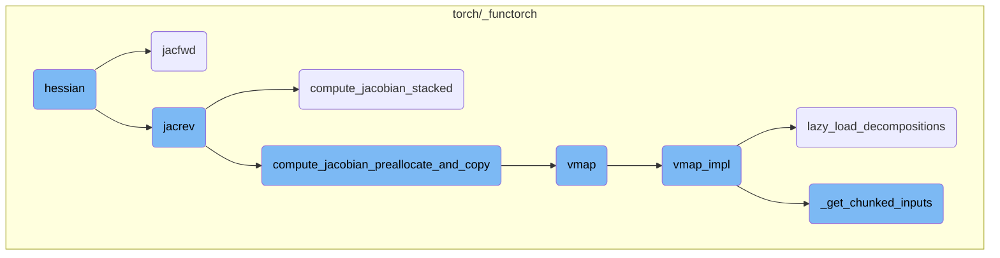
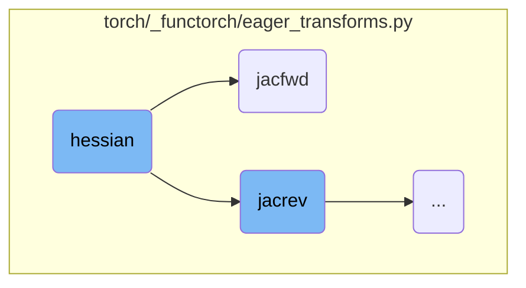
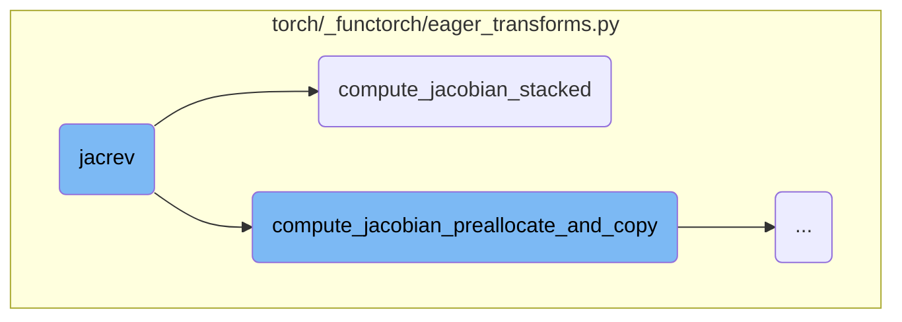
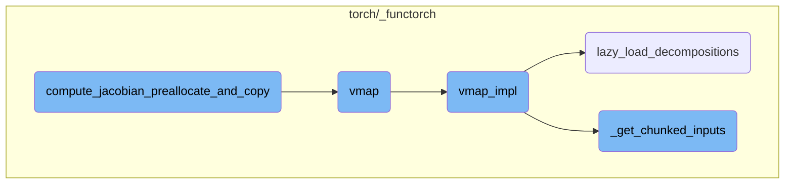

This document provides an overview of the `hessian` function, which computes the Hessian matrix of a given function. The document explains the forward-over-reverse strategy used for performance benefits and details the flow of how the Hessian is computed using various helper functions.

The `hessian` function calculates the Hessian matrix of a function, which is a square matrix of second-order partial derivatives. It uses a method called forward-over-reverse, which combines two other functions, `jacfwd` and `jacrev`, to do this efficiently. The process starts by computing the Jacobian matrix using `jacfwd`, then applies `jacrev` to this Jacobian to get the Hessian. This approach is chosen because it balances performance and accuracy. The document also covers how the Jacobian is computed in chunks to manage memory and computational efficiency.

Here is a high level diagram of the flow, showing only the most important functions:



# Flow drill down

First, we'll zoom into this section of the flow:



<SwmSnippet path="/torch/_functorch/eager_transforms.py" line="1354">

---

## Hessian Function

The `hessian` function computes the Hessian matrix of a given function `func` with respect to specified arguments. It uses a forward-over-reverse strategy by composing `jacfwd` and `jacrev` to achieve this. This approach is chosen for its performance benefits. The function returns another function that, when called with the same inputs as `func`, returns the Hessian matrix.

```python
def hessian(func, argnums=0):
    """
    Computes the Hessian of ``func`` with respect to the arg(s) at index
    ``argnum`` via a forward-over-reverse strategy.

    The forward-over-reverse strategy (composing ``jacfwd(jacrev(func))``) is
    a good default for good performance. It is possible to compute Hessians
    through other compositions of :func:`jacfwd` and :func:`jacrev` like
    ``jacfwd(jacfwd(func))`` or ``jacrev(jacrev(func))``.

    Args:
        func (function): A Python function that takes one or more arguments,
            one of which must be a Tensor, and returns one or more Tensors
        argnums (int or Tuple[int]): Optional, integer or tuple of integers,
            saying which arguments to get the Hessian with respect to.
            Default: 0.

    Returns:
        Returns a function that takes in the same inputs as ``func`` and
        returns the Hessian of ``func`` with respect to the arg(s) at
        ``argnums``.
```

---

</SwmSnippet>

<SwmSnippet path="/torch/_functorch/eager_transforms.py" line="1359">

---

### Forward-over-Reverse Strategy

The forward-over-reverse strategy involves composing `jacfwd(jacrev(func))`. This method is generally a good default for performance. Other compositions like `jacfwd(jacfwd(func))` or `jacrev(jacrev(func))` are also possible but may not be as efficient.

```python
    The forward-over-reverse strategy (composing ``jacfwd(jacrev(func))``) is
    a good default for good performance. It is possible to compute Hessians
    through other compositions of :func:`jacfwd` and :func:`jacrev` like
    ``jacfwd(jacfwd(func))`` or ``jacrev(jacrev(func))``.
```

---

</SwmSnippet>

<SwmSnippet path="/torch/_functorch/eager_transforms.py" line="1178">

---

## Jacfwd Function

The `jacfwd` function computes the Jacobian of a given function `func` with respect to specified arguments using forward-mode automatic differentiation. It returns a function that, when called with the same inputs as `func`, returns the Jacobian matrix. This function can also handle auxiliary outputs and different types of randomness.

```python
def jacfwd(
    func: Callable,
    argnums: argnums_t = 0,
    has_aux: bool = False,
    *,
    randomness: str = "error",
):
    """
    Computes the Jacobian of ``func`` with respect to the arg(s) at index
    ``argnum`` using forward-mode autodiff

    Args:
        func (function): A Python function that takes one or more arguments,
            one of which must be a Tensor, and returns one or more Tensors
        argnums (int or Tuple[int]): Optional, integer or tuple of integers,
            saying which arguments to get the Jacobian with respect to.
            Default: 0.
        has_aux (bool): Flag indicating that ``func`` returns a
            ``(output, aux)`` tuple where the first element is the output of
            the function to be differentiated and the second element is
            auxiliary objects that will not be differentiated.
```

---

</SwmSnippet>

<SwmSnippet path="/torch/_functorch/eager_transforms.py" line="1219">

---

### Usage of Jacfwd

A basic usage example of `jacfwd` with a pointwise, unary operation will give a diagonal array as the Jacobian. This demonstrates how `jacfwd` can be used to compute the Jacobian of simple functions.

```python
        >>> from torch.func import jacfwd
        >>> x = torch.randn(5)
        >>> jacobian = jacfwd(torch.sin)(x)
        >>> expected = torch.diag(torch.cos(x))
        >>> assert torch.allclose(jacobian, expected)
```

---

</SwmSnippet>

<SwmSnippet path="/torch/_functorch/eager_transforms.py" line="1225">

---

### Composing Jacfwd with Vmap

The `jacfwd` function can be composed with `vmap` to produce batched Jacobians. This is useful for computing Jacobians over batches of inputs efficiently.

```python
    :func:`jacfwd` can be composed with vmap to produce batched
    Jacobians:

        >>> from torch.func import jacfwd, vmap
        >>> x = torch.randn(64, 5)
        >>> jacobian = vmap(jacfwd(torch.sin))(x)
        >>> assert jacobian.shape == (64, 5, 5)
```

---

</SwmSnippet>

Now, lets zoom into this section of the flow:



<SwmSnippet path="/torch/_functorch/eager_transforms.py" line="465">

---

## jacrev

The `jacrev` function is responsible for computing the Jacobian of a given function using reverse-mode automatic differentiation. It handles complex inputs by raising an error if any are detected. The function `wrapper_fn` is defined within `jacrev` to manage the computation of the vector-Jacobian product (VJP) using `_vjp_with_argnums`. This setup allows for efficient computation of the Jacobian by leveraging the properties of reverse-mode differentiation.

```python
def jacrev(
    func: Callable,
    argnums: Union[int, Tuple[int]] = 0,
    *,
    has_aux=False,
    chunk_size: Optional[int] = None,
    _preallocate_and_copy=False,
):
    """
    Computes the Jacobian of ``func`` with respect to the arg(s) at index
    ``argnum`` using reverse mode autodiff

    .. note::
        Using :attr:`chunk_size=1` is equivalent to computing the jacobian
        row-by-row with a for-loop i.e. the constraints of :func:`vmap` are
        not applicable.

    Args:
        func (function): A Python function that takes one or more arguments,
            one of which must be a Tensor, and returns one or more Tensors
        argnums (int or Tuple[int]): Optional, integer or tuple of integers,
```

---

</SwmSnippet>

<SwmSnippet path="/torch/_functorch/eager_transforms.py" line="622">

---

## compute_jacobian_stacked

The `compute_jacobian_stacked` function is a helper function designed to compute the Jacobian in chunks. It iterates over chunks of the standard basis vectors, applies the vector-Jacobian product function (`vjp_fn`) to each chunk, and collects the results. If the chunk size is one, it ensures that the results are correctly shaped. The function then concatenates the results from different chunks to form the final Jacobian. This approach helps manage memory usage and computational efficiency when dealing with large inputs.

```python
        def compute_jacobian_stacked():
            # Helper function to compute chunked Jacobian
            # The intermediate chunked calculation are only
            # scoped at this function level.
            chunked_results = []
            for flat_basis_chunk in _chunked_standard_basis_for_(
                flat_output, flat_output_numels, chunk_size=chunk_size
            ):
                if chunk_size == 1:
                    # sanity check.
                    for t in flat_basis_chunk:
                        assert t.size(0) == 1

                    flat_basis_chunk = tree_map(
                        lambda t: torch.squeeze(t, 0), flat_basis_chunk
                    )

                basis = tree_unflatten(flat_basis_chunk, output_spec)

                if chunk_size == 1:
                    # Behaviour with `chunk_size=1` is same as `for-loop`
```

---

</SwmSnippet>

Now, lets zoom into this section of the flow:



<SwmSnippet path="/torch/_functorch/eager_transforms.py" line="671">

---

## Preallocating and Copying Jacobian Chunks

The function `compute_jacobian_preallocate_and_copy` is responsible for computing the Jacobian matrix in chunks. It preallocates memory for the Jacobian and copies the results of each chunk into this preallocated space. This approach is particularly useful for handling large Jacobian matrices efficiently by breaking down the computation into smaller, manageable chunks.

```python
        def compute_jacobian_preallocate_and_copy():
            # Helper function to compute chunked Jacobian
            # The intermediate chunked calculation are only
            # scoped at this function level.
            out_vec_size = sum(flat_output_numels)

            # Don't pre-allocate if we have a single chunk.
            if not (chunk_size is None or chunk_size >= out_vec_size):
                stacked_results = [
                    primal.new_zeros(out_vec_size, *primal.shape)
                    for primal in flat_primals
                ]

            for idx, flat_basis_chunk in enumerate(
                _chunked_standard_basis_for_(
                    flat_output, flat_output_numels, chunk_size=chunk_size
                )
            ):
                if chunk_size == 1:
                    # sanity check.
                    for t in flat_basis_chunk:
```

---

</SwmSnippet>

<SwmSnippet path="/torch/_functorch/apis.py" line="32">

---

## Vectorizing Map Function

The `vmap` function is a vectorizing map that transforms a given function to operate over a specified dimension of the inputs. This allows for efficient batch processing and can be used to compute batched gradients when combined with autograd. The function also supports chunking to manage memory usage during vectorized operations.

```python
def vmap(
    func: Callable,
    in_dims: in_dims_t = 0,
    out_dims: out_dims_t = 0,
    randomness: str = "error",
    *,
    chunk_size=None,
) -> Callable:
    """
    vmap is the vectorizing map; ``vmap(func)`` returns a new function that
    maps ``func`` over some dimension of the inputs. Semantically, vmap
    pushes the map into PyTorch operations called by ``func``, effectively
    vectorizing those operations.

    vmap is useful for handling batch dimensions: one can write a function
    ``func`` that runs on examples and then lift it to a function that can
    take batches of examples with ``vmap(func)``. vmap can also be used to
    compute batched gradients when composed with autograd.

    .. note::
        :func:`torch.vmap` is aliased to :func:`torch.func.vmap` for
```

---

</SwmSnippet>

<SwmSnippet path="/torch/_functorch/vmap.py" line="309">

---

### Implementing vmap

The `vmap_impl` function is the core implementation of the `vmap` functionality. It processes the batched inputs and either applies chunked vectorization or flat vectorization based on the specified chunk size. This function ensures that the vectorized operations are executed efficiently.

```python
def vmap_impl(func, in_dims, out_dims, randomness, chunk_size, *args, **kwargs):
    lazy_load_decompositions()
    _check_out_dims_is_int_or_int_pytree(out_dims, func)
    batch_size, flat_in_dims, flat_args, args_spec = _process_batched_inputs(
        in_dims, args, func
    )

    if chunk_size is not None:
        chunks_flat_args = _get_chunked_inputs(
            flat_args, flat_in_dims, batch_size, chunk_size
        )
        return _chunked_vmap(
            func,
            flat_in_dims,
            chunks_flat_args,
            args_spec,
            out_dims,
            randomness,
            **kwargs,
        )

```

---

</SwmSnippet>

<SwmSnippet path="/torch/_functorch/vmap.py" line="263">

---

### Lazy Loading Decompositions

The `lazy_load_decompositions` function ensures that decompositions are loaded only when needed. This is particularly useful for environments that may have issues with decompositions, such as those using torch.package or Python 3.11. The function registers necessary decompositions into the decomposition table.

```python
# torch.package, Python 3.11, and torch.jit-less environments are unhappy with
# decompositions. Only load them when needed if possible.
def lazy_load_decompositions():
    global DECOMPOSITIONS_LOADED
    if DECOMPOSITIONS_LOADED:
        return

    with DECOMPOSITIONS_LOCK:
        if DECOMPOSITIONS_LOADED:
            return

        if not (os.environ.get("PYTORCH_JIT", "1") == "1" and __debug__):
            DECOMPOSITIONS_LOADED = True
            return

        # use an alternate way to register an operator into the decomposition table
        # _register_jit_decomposition doesn't work for some operators, e.g. addr,
        #  because the Tensor types generated cannot be unioned by torchscript
        # decomp should be type OpOverload
        global VMAP_DECOMPOSITIONS_LIB
        VMAP_DECOMPOSITIONS_LIB = torch.library.Library(
```

---

</SwmSnippet>

<SwmSnippet path="/torch/_functorch/vmap.py" line="353">

---

### Chunking Inputs

The `_get_chunked_inputs` function splits the input tensors into chunks based on the specified chunk size. This is a preparatory step for chunked vectorization, ensuring that each chunk can be processed independently and efficiently.

```python
def _get_chunked_inputs(flat_args, flat_in_dims, batch_size, chunk_size):
    split_idxs = (batch_size,)
    if chunk_size is not None:
        chunk_sizes = get_chunk_sizes(batch_size, chunk_size)
        split_idxs = tuple(itertools.accumulate(chunk_sizes))

    flat_args_chunks = tuple(
        t.tensor_split(split_idxs, dim=in_dim)
        if in_dim is not None
        else [
            t,
        ]
        * len(split_idxs)
        for t, in_dim in zip(flat_args, flat_in_dims)
    )

    # transpose chunk dim and flatten structure
    # chunks_flat_args is a list of flatten args
    chunks_flat_args = zip(*flat_args_chunks)
    return chunks_flat_args
```

---

</SwmSnippet>

&nbsp;

*This is an auto-generated document by Swimm AI 🌊 and has not yet been verified by a human*

<SwmMeta version="3.0.0" repo-id="Z2l0aHViJTNBJTNBcHl0b3JjaC1hdXRvZG9jcy1kZW1vJTNBJTNBU3dpbW0tRGVtbw==" repo-name="pytorch-autodocs-demo"><sup>Powered by [Swimm](https://app.swimm.io/)</sup></SwmMeta>
