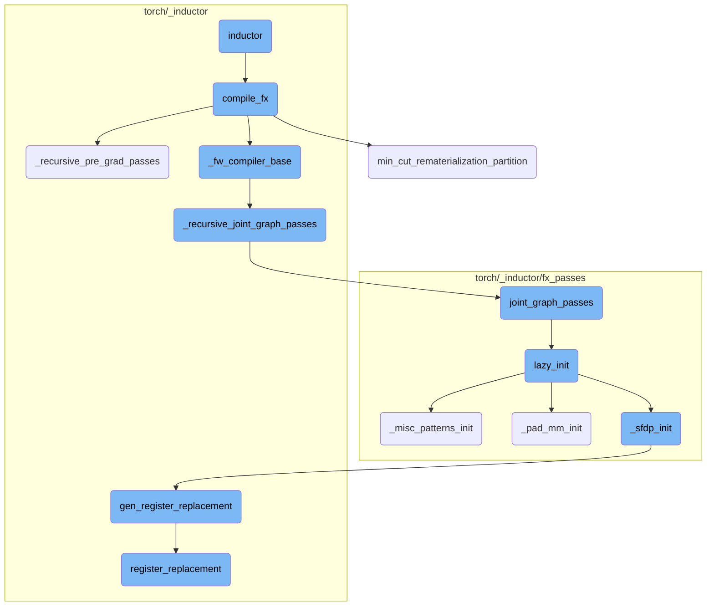
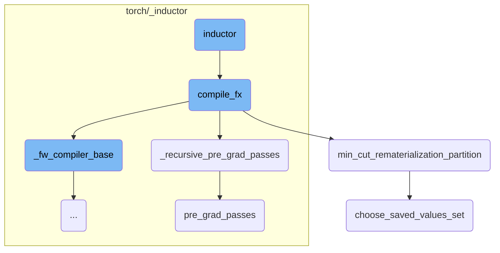
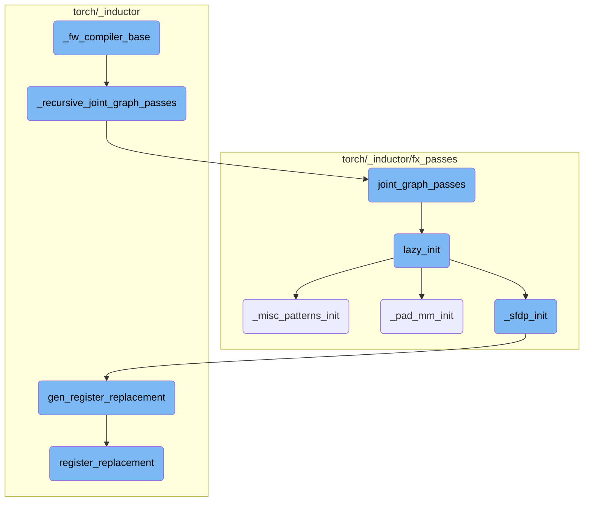

This document provides an overview of the `inductor` function, which serves as the entry point for the compilation process. It explains how the function checks for platform compatibility, imports necessary modules, and invokes the compilation process. The document also covers the various sub-functions involved in the compilation, such as `compile_fx`, `_recursive_pre_grad_passes`, and `min_cut_rematerialization_partition`, detailing their roles in optimizing and transforming the computation graph.

The `inductor` function starts by checking if the platform is Windows and raises an error if it is. Then, it imports the `compile_fx` function and calls it with the provided arguments. The `compile_fx` function orchestrates the entire compilation process, calling various sub-functions to optimize and transform the computation graph. These sub-functions include `_recursive_pre_grad_passes`, which applies pre-gradient passes to subgraphs, and `min_cut_rematerialization_partition`, which partitions the computation graph to optimize memory and computation trade-offs. The flow ensures that the computation graph is efficiently compiled and optimized for both forward and backward passes.

Here is a high level diagram of the flow, showing only the most important functions:



# Flow drill down

First, we'll zoom into this section of the flow:



<SwmSnippet path="/torch/_dynamo/backends/inductor.py" line="9">

---

## Inductor Function

The `inductor` function serves as the entry point for the compilation process. It first checks if the platform is Windows and raises an error if so. Then, it imports the `compile_fx` function and invokes it with the provided arguments.

```python
def inductor(*args, **kwargs):
    if sys.platform == "win32":
        raise RuntimeError("Windows not yet supported for inductor")

    # do import here to avoid loading inductor into memory when it is not used
    from torch._inductor.compile_fx import compile_fx

    return compile_fx(*args, **kwargs)
```

---

</SwmSnippet>

<SwmSnippet path="/torch/_inductor/compile_fx.py" line="1232">

---

## Compile FX Function

The `compile_fx` function is responsible for orchestrating the compilation process. It includes various sub-functions like `fw_compiler_base` and `_fw_compiler_base`, which handle different aspects of the compilation. The function also calls `_recursive_pre_grad_passes` and `min_cut_rematerialization_partition` to optimize the computation graph.

```python
def compile_fx(
    model_: torch.fx.GraphModule,
    example_inputs_: List[torch.Tensor],
    inner_compile: Callable[..., Any] = compile_fx_inner,
    config_patches: Optional[Dict[str, Any]] = None,
    decompositions: Optional[Dict[OpOverload, Callable[..., Any]]] = None,
):
    with _use_lazy_graph_module(dynamo_config.use_lazy_graph_module):
        """Main entrypoint to a compile given FX graph"""
        if config_patches:
            with config.patch(config_patches):
                return compile_fx(
                    model_,
                    example_inputs_,
                    # need extra layer of patching as backwards is compiled out of scope
                    inner_compile=config.patch(config_patches)(inner_compile),
                    decompositions=decompositions,
                )

        if config.cpp_wrapper:
            with config.patch(
```

---

</SwmSnippet>

<SwmSnippet path="/torch/_inductor/compile_fx.py" line="265">

---

### Recursive Pre-Grad Passes

The `_recursive_pre_grad_passes` function recursively applies pre-gradient passes to subgraphs within the main graph module. It ensures that each subgraph is processed and optimized before the main graph undergoes further transformations.

```python
def _recursive_pre_grad_passes(gm, example_inputs):
    for subgraph_name in _get_subgraph_names(gm):
        subgraph = getattr(gm, subgraph_name)
        # as we don't have recursive example inputs, passing None here
        new_subgraph = _recursive_pre_grad_passes(subgraph, example_inputs=None)
        setattr(gm, subgraph_name, new_subgraph)
    return pre_grad_passes(gm, example_inputs)
```

---

</SwmSnippet>

<SwmSnippet path="/torch/_functorch/partitioners.py" line="1682">

---

### Min-Cut Rematerialization Partition

The `min_cut_rematerialization_partition` function partitions the joint computation graph into forward and backward graphs. This partitioning helps in trading off memory bandwidth with computation by recomputing certain operations during the backward pass.

```python
def min_cut_rematerialization_partition(
    joint_module: fx.GraphModule,
    _joint_inputs,
    compiler="inductor",
    *,
    num_fwd_outputs,
) -> Tuple[fx.GraphModule, fx.GraphModule]:
    """
    Partitions the joint graph such that the backward recomputes the forward.
    Recomputing helps in trading off memory bandwidth with computation.

    To create the fwd and bwd graph, we copy the joint graph, manually set the
    outputs to just original forward or backward outputs. And then we run the
    resulting graphs through dead code elimination.

    .. warning::
        This API is experimental and likely to change.

    Args:
        joint_module(fx.GraphModule): The joint forward and backward graph. This
            is the result of AOT Autograd tracing.
```

---

</SwmSnippet>

<SwmSnippet path="/torch/_functorch/partitioners.py" line="1499">

---

### Choose Saved Values Set

The `choose_saved_values_set` function selects a set of values to be saved during the forward pass, which will be used in the backward pass. This selection is based on a memory budget and aims to optimize the overall computation.

```python
def choose_saved_values_set(
    joint_graph: fx.Graph, node_info: NodeInfo, memory_budget=1
) -> List[fx.Node]:
    if memory_budget > 1 or memory_budget < 0:
        raise RuntimeError(
            f"The valid ranges for memory budget are 0 <= m <= 1. The provided value is {memory_budget}"
        )
    min_cut_options = MinCutOptions(
        ban_if_used_far_apart=config.ban_recompute_used_far_apart,
        ban_if_long_fusible_chains=config.ban_recompute_long_fusible_chains,
        ban_if_materialized_backward=config.ban_recompute_materialized_backward,
        ban_if_not_in_allowlist=config.ban_recompute_not_in_allowlist,
        ban_if_reduction=config.ban_recompute_reductions,
    )

    if config.aggressive_recomputation:
        min_cut_options = replace(
            min_cut_options,
            ban_if_used_far_apart=False,
            ban_if_long_fusible_chains=False,
            ban_if_materialized_backward=False,
```

---

</SwmSnippet>

<SwmSnippet path="/torch/_inductor/fx_passes/pre_grad.py" line="95">

---

### Pre-Grad Passes

The `pre_grad_passes` function applies a series of optimization passes to the computation graph before the gradient computation. These passes include normalization, fusion, and removal of unnecessary operations, preparing the graph for efficient gradient computation.

```python
def pre_grad_passes(gm: torch.fx.GraphModule, example_inputs=None):
    """
    Apply passes on the input FX graph using Torch IR.

    WARNING:
    The IR before grad is not functional or normalized, so it is harder
    to write passes on this IR.  Passes must be safe with respect to
    aliasing and mutation and need to handle all possible arg schemas.

    Consider adding a new pass to post_grad.py or joint_graph.py which
    are after functionalization and normalization.
    """
    if config.pattern_matcher:
        lazy_init()
        if hasattr(
            config, "fx_passes_numeric_check"
        ) and config.fx_passes_numeric_check.get("pre_grad", False):
            gm_before_fx_passes = gm.__copy__()
        # explicitly run with predispatch atenIR based passes
        if config.is_predispatch:

```

---

</SwmSnippet>

Now, lets zoom into this section of the flow:



<SwmSnippet path="/torch/_inductor/compile_fx.py" line="1342">

---

## \_fw_compiler_base

The `_fw_compiler_base` function is responsible for compiling a forward model in PyTorch. It handles both inference and training scenarios. For inference, it directly calls `_recursive_joint_graph_passes` to process the model graph. The function also manages user-visible outputs and prepares the model for compilation by invoking `inner_compile` with the necessary parameters.

```python
        def _fw_compiler_base(
            model: torch.fx.GraphModule,
            example_inputs: List[torch.Tensor],
            is_inference: bool,
        ):
            if is_inference:
                # partition_fn won't be called
                _recursive_joint_graph_passes(model)

            fixed = torch._inductor.utils.num_fw_fixed_arguments(
                num_example_inputs, len(example_inputs)
            )

            user_visible_outputs = {}

            if config.keep_output_stride:
                model_outputs_node = output_node(model)
                model_outputs = pytree.arg_tree_leaves(*model_outputs_node.args)
                num_model_outputs = len(model_outputs)

                context = torch._guards.TracingContext.try_get()
```

---

</SwmSnippet>

<SwmSnippet path="/torch/_inductor/compile_fx.py" line="274">

---

## \_recursive_joint_graph_passes

The `_recursive_joint_graph_passes` function recursively processes subgraphs within a given graph module. It ensures that all subgraphs undergo the `joint_graph_passes` transformation, which applies various FX transformations to optimize the graph.

```python
def _recursive_joint_graph_passes(gm):
    for subgraph_name in _get_subgraph_names(gm):
        subgraph = getattr(gm, subgraph_name)
        _recursive_joint_graph_passes(subgraph)
    joint_graph_passes(gm)
```

---

</SwmSnippet>

<SwmSnippet path="/torch/_inductor/fx_passes/joint_graph.py" line="434">

---

## joint_graph_passes

The `joint_graph_passes` function applies a series of transformations to the joint forward and backward graph. It includes custom pre and post passes, removes no-op operations, performs constant folding, and applies pattern matching for optimization. The function ensures the graph is topologically sorted and recompiled after transformations.

```python
def joint_graph_passes(graph: torch.fx.GraphModule):
    """
    Run FX transformations on the joint forwards+backwards graph.
    """
    lazy_init()
    count = 0
    if config.joint_custom_pre_pass is not None:
        with GraphTransformObserver(
            graph, "joint_custom_pre_pass", config.trace.log_url_for_graph_xform
        ):
            config.joint_custom_pre_pass(graph.graph)
            count += 1

    from .post_grad import remove_noop_ops

    remove_noop_ops(graph.graph)

    if config.joint_graph_constant_folding:
        with GraphTransformObserver(
            graph, "constant_fold_uniform_value", config.trace.log_url_for_graph_xform
        ):
```

---

</SwmSnippet>

<SwmSnippet path="/torch/_inductor/fx_passes/joint_graph.py" line="43">

---

## lazy_init

The `lazy_init` function initializes various pattern matching and optimization routines. It calls `_pad_mm_init`, `_sfdp_init`, and `_misc_patterns_init` to set up the necessary patterns and replacements for graph transformations.

```python
def lazy_init():
    from .fuse_attention import _sfdp_init
    from .misc_patterns import _misc_patterns_init
    from .pad_mm import _pad_mm_init

    _pad_mm_init()
    _sfdp_init()
    _misc_patterns_init()
```

---

</SwmSnippet>

<SwmSnippet path="/torch/_inductor/fx_passes/misc_patterns.py" line="16">

---

## \_misc_patterns_init

The `_misc_patterns_init` function registers replacement patterns for miscellaneous operations. It defines patterns and their replacements for operations like `randperm_index_add` and `randperm_index`, optimizing them for performance by using unsafe indexing and skipping debug asserts.

```python
def _misc_patterns_init():
    from .joint_graph import patterns as joint_graph_patterns
    from .post_grad import pass_patterns as post_grad_patterns_all

    post_grad_patterns = post_grad_patterns_all[1]  # medium priority

    if torch.cuda.is_available():
        # workaround https://github.com/pytorch/pytorch/issues/97894
        device = "cuda"
    else:
        device = "cpu"

    # These patterns do 2 things
    # 1. Since we know that index is completely unique, we can codegen it using
    # stores instead of atomic adds, which is quite a bit faster.
    # 2. Also, since we are guaranteed that they are completely within bounds,
    # we can use unsafe indexing and skip debug asserts
    def randperm_index_add_pattern(x, y):
        index = torch.randperm(x.shape[0], device=x.device)[: y.shape[0]]
        return torch.index_add(x, dim=0, source=y, index=index), index

```

---

</SwmSnippet>

<SwmSnippet path="/torch/_inductor/fx_passes/pad_mm.py" line="811">

---

## \_pad_mm_init

The `_pad_mm_init` function registers replacement patterns for matrix multiplication operations. It defines patterns and replacements for `mm`, `bmm`, and `addmm` operations, ensuring they are optimized for both training and inference scenarios.

```python
def _pad_mm_init():
    from .joint_graph import patterns

    if torch.cuda.is_available():
        # workaround https://github.com/pytorch/pytorch/issues/97894
        device = "cuda"
    else:
        device = "cpu"

    # sizes/values dont actually matter for initial trace
    # once we get a possible match we re-trace with the actual values and verify the match still holds

    dim2a = functools.partial(torch.empty, (4, 4), device=device, requires_grad=True)
    dim2b = functools.partial(torch.empty, (4, 4), device=device, requires_grad=True)

    dim3a = functools.partial(torch.empty, (4, 4, 4), device=device, requires_grad=True)
    dim3b = functools.partial(torch.empty, (4, 4, 4), device=device, requires_grad=True)

    dim1a = functools.partial(torch.empty, (4), device=device, requires_grad=True)

    # workaround https://github.com/pytorch/pytorch/issues/97894
```

---

</SwmSnippet>

<SwmSnippet path="/torch/_inductor/fx_passes/fuse_attention.py" line="906">

---

## \_sfdp_init

The `_sfdp_init` function initializes patterns for the `sfdp` operation. It registers replacement patterns using `gen_register_replacement` to optimize the `sfdp` operation in the graph.

```python
@functools.lru_cache(None)
def _sfdp_init():
    for key, register_replacement_kwargs in _get_sfdp_patterns():
        gen_register_replacement(key, **register_replacement_kwargs)
```

---

</SwmSnippet>

<SwmSnippet path="/torch/_inductor/pattern_matcher.py" line="1463">

---

## gen_register_replacement

The `gen_register_replacement` function registers a replacement pattern for a given search function. It ensures the pattern is materialized, checks for duplicates, and registers the replacement using `register_replacement`.

```python
def gen_register_replacement(
    unique_name: str,
    search_fn: SearchFn,
    replace_fn: ReplaceFn,
    example_inputs: Iterable[Any],
    trace_fn: TraceFn,
    pass_dicts: Union[_PassDictsType, Sequence[_PassDictsType]],
    extra_check: Callable[[Match], bool] = _return_true,
    scalar_workaround: Union[Dict[str, Union[float, int]], None] = None,
    exclusive_arg_names: Sequence[str] = (),
    skip_duplicates: bool = False,
) -> None:
    # Make sure the example_inputs is materialized.
    example_inputs = tuple(example_inputs)

    if "PYTORCH_GEN_PATTERNS" in os.environ:
        pat = _serialize_pattern(
            unique_name, search_fn, example_inputs, trace_fn, scalar_workaround
        )
    else:
        pattern_name = search_fn.__name__
```

---

</SwmSnippet>

<SwmSnippet path="/torch/_inductor/pattern_matcher.py" line="1194">

---

## register_replacement

The `register_replacement` function registers a replacement for a given search function. It includes checks for shapes and types, normalizes arguments, and ensures the replacement pattern is correctly registered for graph transformations.

```python
def register_replacement(
    search_fn: SearchFn,
    replace_fn: ReplaceFn,
    example_inputs: Iterable[Any],
    trace_fn: TraceFn,
    pass_dicts: Union[_PassDictsType, Sequence[_PassDictsType]],
    extra_check: Callable[[Match], bool] = _return_true,
    scalar_workaround: Union[Dict[str, Union[float, int]], None] = None,
    exclusive_arg_names: Sequence[str] = (),
    search_fn_pattern: Union[PatternExpr, None] = None,
) -> bool:
    """
    Create a replacement rule based on example functions that get traced
    to create patterns.  This supports both training and inference when
    run on a joint forward+backward graph.

    Args:
        search_fn: traced to give original pattern
        replace_fn: traced to give replacement graph
        example_inputs: example inputs for initial trace
        trace_fn: fwd_only or joint_fwd_bwd
```

---

</SwmSnippet>

&nbsp;

*This is an auto-generated document by Swimm AI 🌊 and has not yet been verified by a human*

<SwmMeta version="3.0.0" repo-id="Z2l0aHViJTNBJTNBcHl0b3JjaC1hdXRvZG9jcy1kZW1vJTNBJTNBU3dpbW0tRGVtbw==" repo-name="pytorch-autodocs-demo"><sup>Powered by [Swimm](https://app.swimm.io/)</sup></SwmMeta>
