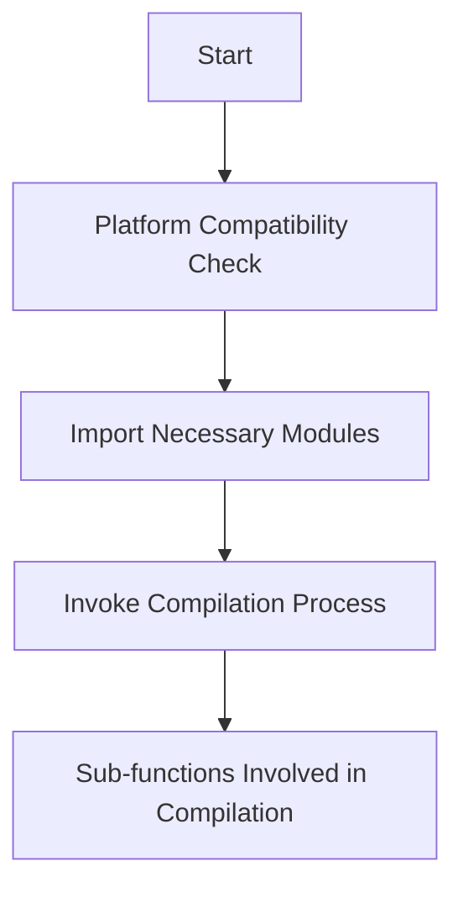

This document will cover the overview of the Inductor Function, which includes:

1. Platform Compatibility Check
2. Importing Necessary Modules
3. Invoking the Compilation Process
4. Sub-functions Involved in Compilation

Technical document: <SwmLink doc-title="Overview of the Inductor Function">[Overview of the Inductor Function](/.swm/overview-of-the-inductor-function.8mhnp3qq.sw.md)</SwmLink>

# [Platform Compatibility Check](https://app.swimm.io/repos/Z2l0aHViJTNBJTNBcHl0b3JjaC1hdXRvZG9jcy1kZW1vJTNBJTNBU3dpbW0tRGVtbw==/docs/8mhnp3qq#inductor-function)

The Inductor function begins by checking if the platform is Windows. If it is, an error is raised. This step ensures that the function does not proceed on unsupported platforms, thereby preventing potential issues and ensuring a smooth user experience.

# [Importing Necessary Modules](https://app.swimm.io/repos/Z2l0aHViJTNBJTNBcHl0b3JjaC1hdXRvZG9jcy1kZW1vJTNBJTNBU3dpbW0tRGVtbw==/docs/8mhnp3qq#inductor-function)

After confirming platform compatibility, the function imports the necessary modules required for the compilation process. This step is crucial for ensuring that all dependencies are available and loaded into memory only when needed, optimizing resource usage.

# [Invoking the Compilation Process](https://app.swimm.io/repos/Z2l0aHViJTNBJTNBcHl0b3JjaC1hdXRvZG9jcy1kZW1vJTNBJTNBU3dpbW0tRGVtbw==/docs/8mhnp3qq#inductor-function)

The Inductor function then invokes the compilation process by calling the `compile_fx` function with the provided arguments. This step initiates the core functionality of the Inductor, setting the stage for the subsequent optimization and transformation of the computation graph.

# [Sub-functions Involved in Compilation](https://app.swimm.io/repos/Z2l0aHViJTNBJTNBcHl0b3JjaC1hdXRvZG9jcy1kZW1vJTNBJTNBU3dpbW0tRGVtbw==/docs/8mhnp3qq#compile-fx-function)

The `compile_fx` function orchestrates the entire compilation process. It calls various sub-functions to optimize and transform the computation graph. These sub-functions include:

- `_recursive_pre_grad_passes`: Applies pre-gradient passes to subgraphs, ensuring each subgraph is processed and optimized before further transformations.
- `min_cut_rematerialization_partition`: Partitions the computation graph to optimize memory and computation trade-offs by recomputing certain operations during the backward pass.
- `_fw_compiler_base`: Handles the compilation of the forward model, managing both inference and training scenarios.
- `_recursive_joint_graph_passes`: Recursively processes subgraphs within a given graph module, applying various FX transformations to optimize the graph.

&nbsp;

*This is an auto-generated document by Swimm AI 🌊 and has not yet been verified by a human*

<SwmMeta version="3.0.0" repo-id="Z2l0aHViJTNBJTNBcHl0b3JjaC1hdXRvZG9jcy1kZW1vJTNBJTNBU3dpbW0tRGVtbw==" repo-name="pytorch-autodocs-demo">Powered by [Swimm](https://app.swimm.io/)</SwmMeta>
