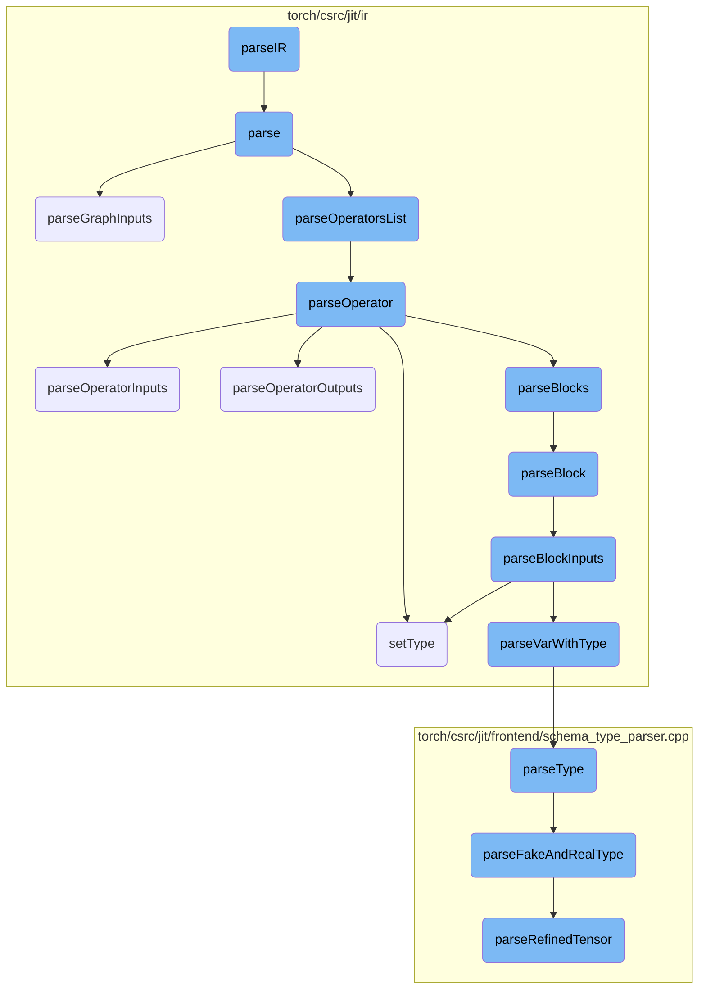
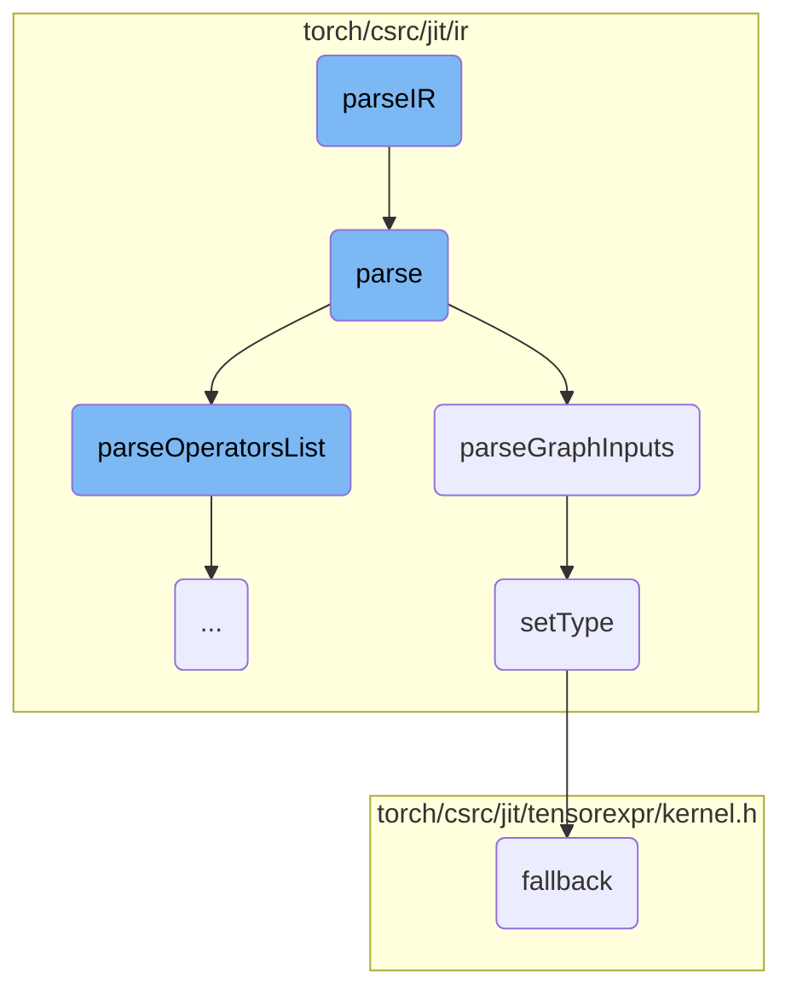
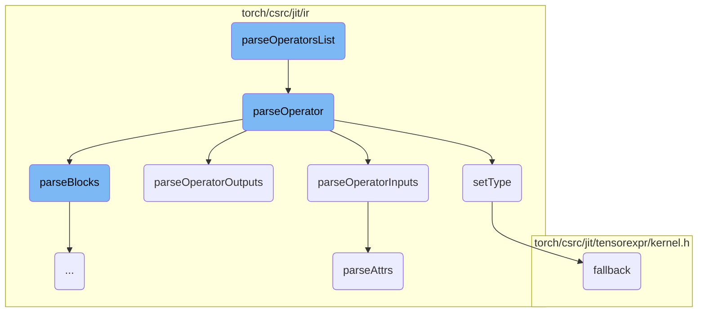
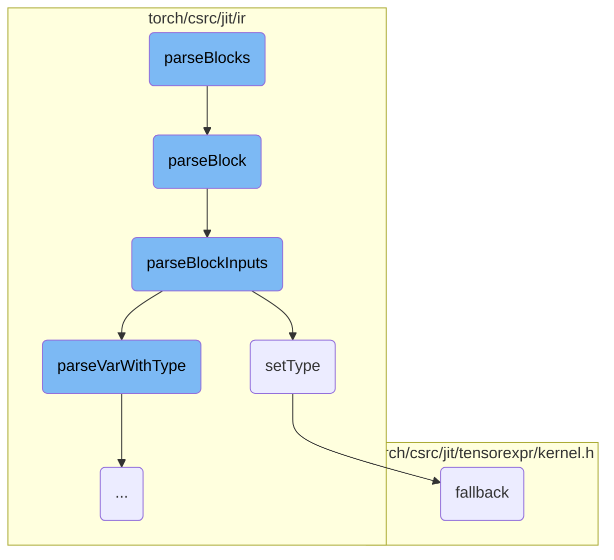
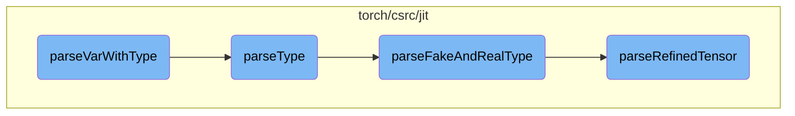
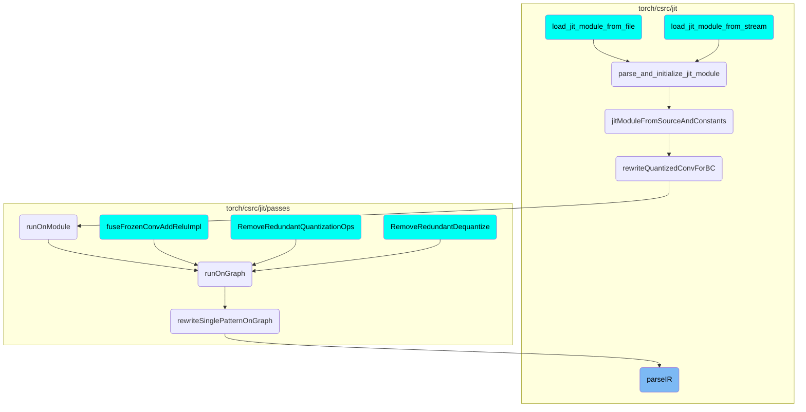

This document provides an overview of the `parseIR` function, which is responsible for initializing the IR parser and starting the parsing process. The document also covers the various steps involved in parsing the graph, including parsing graph inputs, operators, and blocks.

The flow starts with the `parseIR` function, which initializes the IR parser with the provided string, graph, and value map. It then calls the `parse` method to start the parsing process. The `parse` method first parses the graph inputs, then the list of operators, and finally the return statement. It also handles deferred initializations for tensor values and empty containers. The flow continues with parsing individual operators, their inputs, and outputs, and setting their types. Finally, it parses blocks and their inputs, ensuring that all elements are correctly added to the graph.

Here is a high level diagram of the flow, showing only the most important functions:



# Flow drill down

First, we'll zoom into this section of the flow:



<SwmSnippet path="/torch/csrc/jit/ir/irparser.cpp" line="108">

---

## parseIR Function

The `parseIR` function initializes the `IRParser` with the provided string, graph, and value map, and then calls the `parse` method to start the parsing process.

```c++
void parseIR(
    const std::string& str,
    torch::jit::Graph* graph,
    std::unordered_map<std::string, Value*>& vmap,
    bool parse_tensor_constants) {
  torch::jit::IRParser p(str, graph, vmap, parse_tensor_constants);
  p.parse();
}
```

---

</SwmSnippet>

<SwmSnippet path="/torch/csrc/jit/ir/irparser.cpp" line="622">

---

## parse Method

The `parse` method is responsible for parsing the entire graph. It first parses the graph inputs, then the list of operators, and finally the return statement. It also handles deferred initializations for tensor values and empty containers.

```c++
void IRParser::parse() {
  // Parse graph definition, it should look like the following:
  // graphName (input1, input2, ... inputN):
  L.expect(TK_IDENT);
  parseGraphInputs();
  L.expect(':');

  // After the definition we should have a list of statements, parse it:
  parseOperatorsList(g->block());

  // The last statement should be return, which specifies graph outputs
  parseReturnOperator();

  for (Node* n : deferred_tensor_value_initializations_) {
    auto type = n->output()->type()->expect<TensorType>();
    auto tt = n->output()->type()->cast<TensorType>();
    TORCH_INTERNAL_ASSERT(tt, "expected tensor output ", *n);
    auto sizes = tt->sizes().concrete_sizes();
    TORCH_INTERNAL_ASSERT(sizes);
    auto strides = tt->strides().concrete_sizes();
    TORCH_INTERNAL_ASSERT(strides);
```

---

</SwmSnippet>

<SwmSnippet path="/torch/csrc/jit/ir/irparser.cpp" line="581">

---

### Parsing Graph Inputs

The `parseGraphInputs` method parses the list of graph inputs, adds them to the graph, and sets their types.

```c++
void IRParser::parseGraphInputs() {
  parseList('(', ',', ')', [&] {
    VarWithType v = parseVarWithType();
    // If the name isn't valid, don't use it
    std::string uniq_name = Value::isValidName(v.name) ? v.name : "";
    vmap[v.name] = g->addInput(uniq_name);
    vmap[v.name]->setType(v.type);
  });
}
```

---

</SwmSnippet>

<SwmSnippet path="/torch/csrc/jit/ir/ir.h" line="1502">

---

### Setting Types

The `setType` method sets the type of a value. If the type is dynamic, it falls back to a more specific type.

```c
inline Value* Value::setType(TypePtr type) {
  AT_ASSERT(type);
  if (auto dyn = type->castRaw<c10::DynamicType>()) {
    type = dyn->fallback();
  }
  type_ = std::move(type);
  for (Use& use : uses_) {
    use.user->op_ = nullptr;
  }
  return this;
}
```

---

</SwmSnippet>

<SwmSnippet path="/torch/csrc/jit/tensorexpr/kernel.h" line="158">

---

### Fallback Mechanism

The `fallback` function runs the interpreter state on the provided stack, serving as a fallback mechanism.

```c
  void fallback(Stack& stack) const {
    InterpreterState(code_).run(stack);
  }
  void recompile();
```

---

</SwmSnippet>

Now, lets zoom into this section of the flow:



<SwmSnippet path="/torch/csrc/jit/ir/irparser.cpp" line="500">

---

## Parsing the List of Operators

The function `parseOperatorsList` is responsible for parsing a list of operators within a block. It expects the list to be indented and delimited by either `TK_NEWLINE`, `TK_RETURN`, or `TK_ARROW`. The function iterates through the list and calls `parseOperator` for each operator found.

```c++
  L.expect(TK_INDENT);
  while (L.cur().kind != TK_ARROW && L.cur().kind != TK_RETURN) {
    parseOperator(b);
  }
```

---

</SwmSnippet>

<SwmSnippet path="/torch/csrc/jit/ir/irparser.cpp" line="522">

---

## Parsing Individual Operators

The function `parseOperator` parses an individual operator statement. It handles the parsing of the operator's outputs, name, attributes, and inputs. It also registers the outputs and inserts the new node into the block. If the operator has nested blocks, it calls `parseBlocks` to handle them.

```c++
  // Parse lefthand side.
  std::vector<VarWithType> outs;
  parseOperatorOutputs(&outs);

  // Parse the name and create the corresponding node in the graph.
  auto source_range = L.cur().range;
  std::string name = parseOperatorName();
  Node* n = g->create(Symbol::fromQualString(name), {}, outs.size())
                ->setSourceRange(source_range);

  // Parse attributes and inputs.
  parseOperatorInputs(n);

  const FunctionSchema* schema = n->maybeSchema();

  // Register outputs.
  unsigned idx = 0;
  for (const VarWithType& v : outs) {
    vmap[v.name] = n->outputs()[idx];
    if (schema && !schema->is_varret()) {
      TORCH_CHECK(
```

---

</SwmSnippet>

<SwmSnippet path="/torch/csrc/jit/ir/irparser.cpp" line="437">

---

### Parsing Operator Inputs

The function `parseOperatorInputs` parses the inputs of an operator. If the current token is '\[', it calls `parseAttrs` to parse the attributes. It then parses a list of inputs enclosed in parentheses and adds each input to the node.

```c++
void IRParser::parseOperatorInputs(Node* n) {
  if (L.cur().kind == '[') {
    parseAttrs(n);
  }
  parseList('(', ',', ')', [&] {
    std::string var_name = parseVar();
    n->addInput(findValueInVMap(var_name));
  });
}
```

---

</SwmSnippet>

<SwmSnippet path="/torch/csrc/jit/ir/irparser.cpp" line="162">

---

### Parsing Operator Outputs

The function `parseOperatorOutputs` parses the outputs of an operator. If the current token is '%', it parses a list of outputs and expects an '=' token to follow.

```c++
void IRParser::parseOperatorOutputs(std::vector<VarWithType>* outs) {
  if (L.cur().kind != '%') {
    return;
  }
  parseList(TK_NOTHING, ',', TK_NOTHING, [&] {
    outs->push_back(parseVarWithType(true));
  });
  L.expect('=');
}
```

---

</SwmSnippet>

<SwmSnippet path="/torch/csrc/jit/ir/irparser.cpp" line="433">

---

### Parsing Attributes

The function `parseAttrs` parses the attributes of an operator. It parses a list of attributes enclosed in square brackets and calls `parseAttr` for each attribute.

```c++
void IRParser::parseAttrs(Node* n) {
  parseList('[', ',', ']', [&] { parseAttr(n); });
}
```

---

</SwmSnippet>

Now, lets zoom into this section of the flow:



<SwmSnippet path="/torch/csrc/jit/ir/irparser.cpp" line="447">

---

## Parsing Blocks

The function `parseBlocks` is responsible for parsing multiple blocks within a parent node. It expects an indentation to start and continues to parse individual blocks using the `parseBlock` function until it encounters a dedentation.

```c++
void IRParser::parseBlocks(Node* parentNode) {
  L.expect(TK_INDENT);
  while (L.cur().kind != TK_DEDENT) {
    parseBlock(parentNode);
  }
  L.expect(TK_DEDENT);
}
```

---

</SwmSnippet>

<SwmSnippet path="/torch/csrc/jit/ir/irparser.cpp" line="475">

---

## Parsing a Single Block

The function `parseBlock` handles the parsing of a single block. It adds a new block to the parent node, parses the block's inputs using `parseBlockInputs`, expects a colon to denote the start of operations, parses the list of operations, and finally parses the block's outputs.

```c++
/** \brief Parse a block.
 *
 * It should look like the following:
 * blockName(input1, input2, input3, ...):
 *   op1
 *   op2
 *   ...
 *   opN
 *   -> (output1, output2, output3, ...)
 */
void IRParser::parseBlock(Node* parentNode) {
  Block* b = parentNode->addBlock();
  L.expect(TK_IDENT).text(); // Block name is not used anywhere.
  parseBlockInputs(b);
  L.expect(':');
  parseOperatorsList(b);
  parseBlockOutputs(b);
}
```

---

</SwmSnippet>

<SwmSnippet path="/torch/csrc/jit/ir/irparser.cpp" line="455">

---

### Parsing Block Inputs

The function `parseBlockInputs` parses the inputs of a block. It reads a list of variables with types, validates their names, adds them as inputs to the block, and sets their types accordingly.

```c++
void IRParser::parseBlockInputs(Block* b) {
  parseList('(', ',', ')', [&] {
    VarWithType v = parseVarWithType();
    // If the name isn't valid, don't use it
    std::string uniq_name = Value::isValidName(v.name) ? v.name : "";
    vmap[v.name] = b->addInput(uniq_name);
    vmap[v.name]->setType(v.type);
  });
}
```

---

</SwmSnippet>

Now, lets zoom into this section of the flow:



<SwmSnippet path="/torch/csrc/jit/ir/irparser.cpp" line="128">

---

## Parsing Variable with Type

The function `parseVarWithType` is responsible for parsing a variable and its associated type. It first parses the variable name using `parseVar`. If the `allow_optional` flag is set, the type is set to `nullptr`; otherwise, it defaults to `TensorType::get()`. If a colon is encountered, it indicates the presence of a type alias, which is then parsed using `type_parser.parseType()`. The parsed type is assigned to the variable.

```c++
  if (allow_optional) {
    r.type = nullptr;
  } else {
    r.type = TensorType::get();
  }
  if (L.nextIf(':')) {
    auto type_alias = type_parser.parseType();
    AT_ASSERTM(!type_alias.second, "Parsing IR with Alias Info not handled");
    r.type = type_alias.first;
  }
  return r;
```

---

</SwmSnippet>

<SwmSnippet path="/torch/csrc/jit/frontend/schema_type_parser.cpp" line="358">

---

## Parsing Type

The function `parseType` calls `parseFakeAndRealType` to parse both the fake and real types. It returns a pair consisting of the parsed type and any associated alias information.

```c++
  auto r = parseFakeAndRealType();
  return std::make_pair(std::move(std::get<0>(r)), std::move(std::get<2>(r)));
```

---

</SwmSnippet>

<SwmSnippet path="/torch/csrc/jit/frontend/schema_type_parser.cpp" line="362">

---

## Parsing Fake and Real Type

The function `parseFakeAndRealType` handles the parsing of various types, including tuples, futures, awaits, RRefs, tensors, dictionaries, unions, and custom classes. It also manages alias information and handles optional types and lists. The function ensures that the parsed types are correctly associated with their aliases and other attributes like device and requires_grad.

```c++
std::tuple</*fake*/ TypePtr, /*real*/ TypePtr, std::optional<AliasInfo>>
SchemaTypeParser::parseFakeAndRealType() {
  TypePtr fake_value;
  TypePtr real_value;
  std::optional<AliasInfo> alias_info;
  // Tuple type
  if (L.cur().kind == '(') {
    std::vector<TypePtr> types;
    parseList('(', ',', ')', [&] {
      auto r = parseType();
      types.push_back(std::move(r.first));
      if (alias_info && r.second) {
        alias_info->addContainedType(std::move(*r.second));
      }
    });
    fake_value = real_value =
        c10::TypeFactory::create<TupleType>(std::move(types));
  } else if (L.cur().kind == TK_IDENT && L.cur().text() == "Future") {
    L.next(); // Future
    L.expect('(');
    auto p = parseType();
```

---

</SwmSnippet>

<SwmSnippet path="/torch/csrc/jit/frontend/schema_type_parser.cpp" line="229">

---

## Parsing Refined Tensor

The function `parseRefinedTensor` parses a refined tensor type, including its data type, dimensions, strides, device, and requires_grad attributes. It supports various tensor specifications, such as known and unknown ranks, and ensures that the parsed tensor type is correctly constructed with all its attributes.

```c++
TypePtr SchemaTypeParser::parseRefinedTensor() {
  auto maybe_dtype = parseTensorDType(L.expect(TK_IDENT).text());
  AT_ASSERT(maybe_dtype);
  at::ScalarType dtype = *maybe_dtype;
  TypePtr ptr;
  L.expect('(');
  TypePtr tensor_type;
  std::optional<c10::Device> device;
  std::optional<bool> requires_grad;
  // Parse a type with either no ranks, known ranks with sizes, ranks with
  // unknown sizes, a mix of ranks with known and unknown sizes, or ranks with
  // known sizes and strides. The type might also have requires_grad and/or
  // device option. Examples of types we're handling here:
  //   Long(10, 8, 6, strides=[48, 6, 1], requires_grad=0, device=cuda:1)
  //   Float(10, *, 20, device=cuda:1)
  //   Float(requires_grad=1)
  std::vector<std::optional<int64_t>> dims;
  bool seen_strides = false;
  std::vector<int64_t> strides;
  parseList(TK_NOTHING, ',', ')', [&] {
    // Extra handling for options like 'device' and 'requires_grad'
```

---

</SwmSnippet>

# Where is this flow used?

This flow is used multiple times in the codebase as represented in the following diagram:

(Note - these are only some of the entry points of this flow)



&nbsp;

*This is an auto-generated document by Swimm AI 🌊 and has not yet been verified by a human*

<SwmMeta version="3.0.0" repo-id="Z2l0aHViJTNBJTNBcHl0b3JjaC1hdXRvZG9jcy1kZW1vJTNBJTNBU3dpbW0tRGVtbw==" repo-name="pytorch-autodocs-demo"><sup>Powered by [Swimm](https://app.swimm.io/)</sup></SwmMeta>
