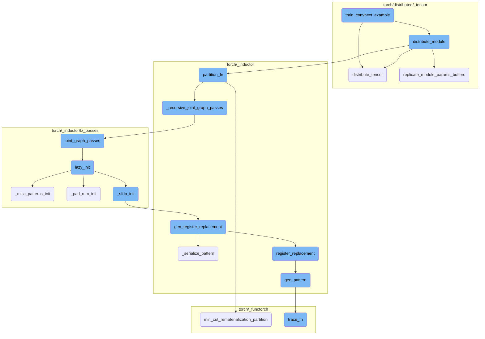
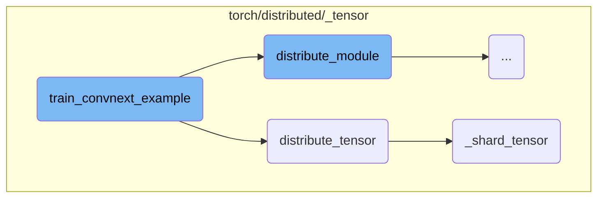
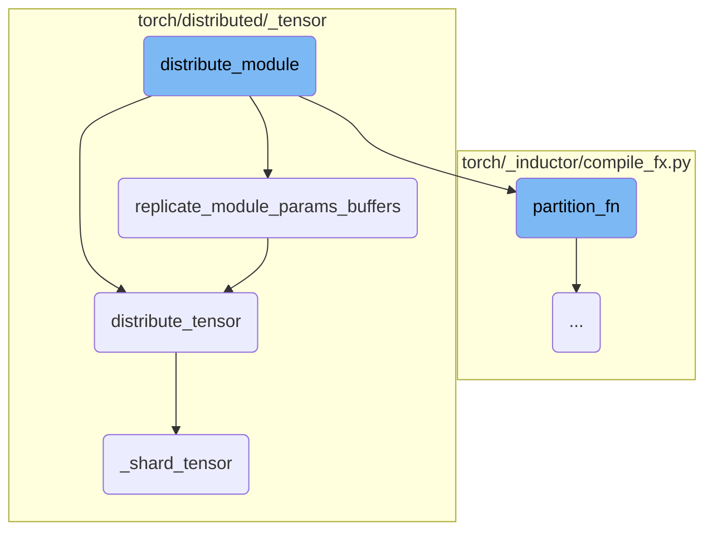
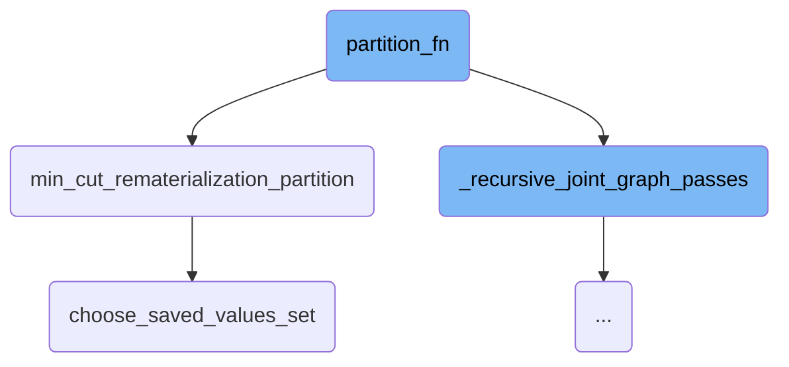
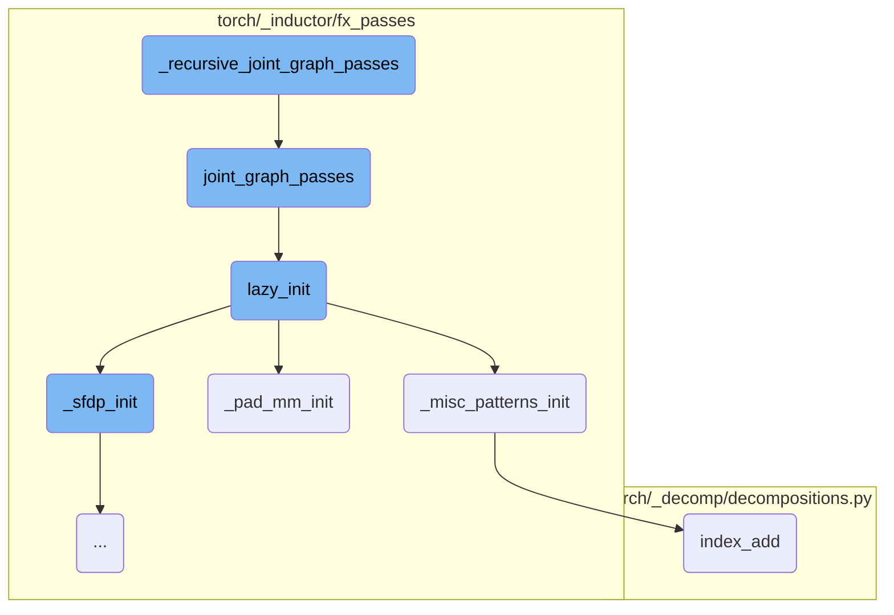
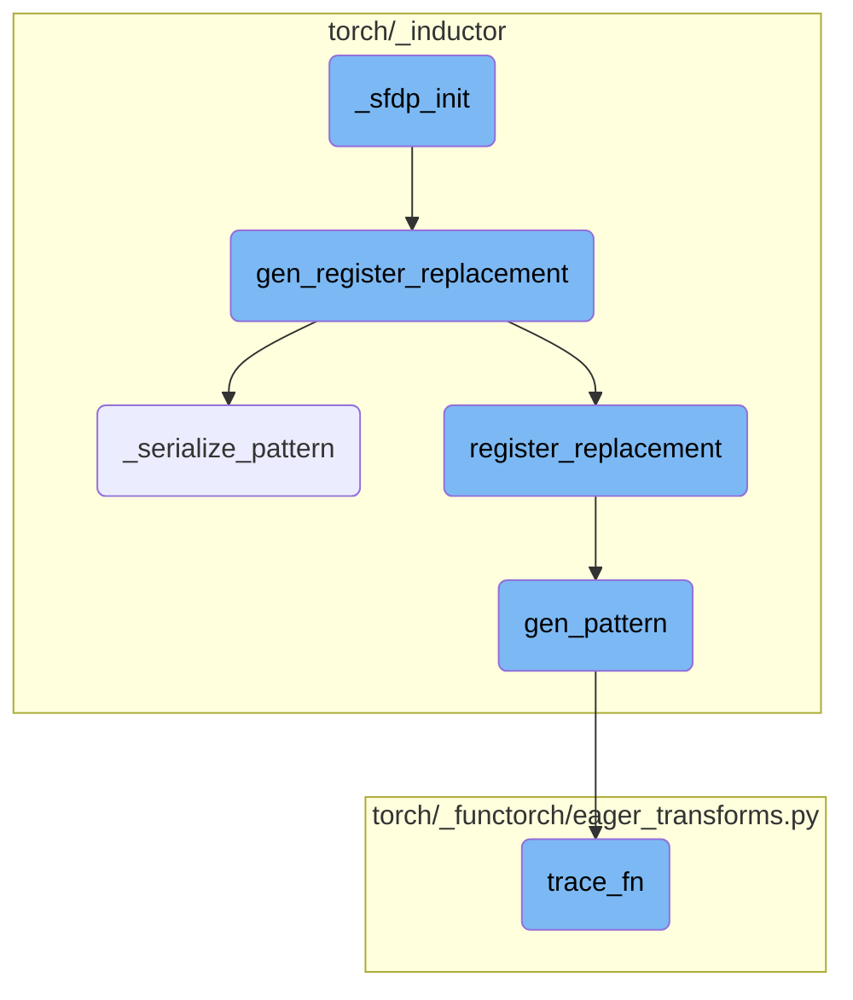

This document provides an overview of the `train_convnext_example` function. The function is responsible for initializing the ConvNeXt model with specific parameters, distributing the model across a device mesh, and distributing the input and target tensors for training. The document also includes a high-level diagram of the flow, showing the most important functions involved in the process.

The `train_convnext_example` function starts by setting up the ConvNeXt model with certain parameters like depths and dimensions. Once the model is ready, it is distributed across multiple devices to ensure efficient training. After that, the input data and the target labels are also distributed across the devices. This setup allows the model to be trained in a distributed manner, making the process faster and more efficient.

Here is a high level diagram of the flow, showing only the most important functions:



# Flow drill down

First, we'll zoom into this section of the flow:



<SwmSnippet path="/torch/distributed/_tensor/examples/convnext_example.py" line="192">

---

## Initializing and Distributing the ConvNeXt Model

The `train_convnext_example` function initializes the ConvNeXt model with specific depths, dimensions, and other parameters. It then distributes the model across the device mesh using the `distribute_module` function.

```python
    model = ConvNeXt(
        depths=[3, 3, 27, 3],
        dims=[256, 512, 1024, 2048],
        drop_path_rate=0.0,
        num_classes=1000,
    ).to(device_type)
    model = distribute_module(model, mesh, _conv_fn, input_fn=None, output_fn=None)
```

---

</SwmSnippet>

<SwmSnippet path="/torch/distributed/_tensor/examples/convnext_example.py" line="203">

---

## Distributing Input and Target Tensors

The input tensor `x` and the target tensor `y_target` are created and then distributed across the device mesh using the `distribute_tensor` function. This ensures that the tensors are properly sharded or replicated as needed for distributed training.

```python
    x = torch.randn(*in_shape).to(device_type).requires_grad_()
    y_target = (
        torch.empty(output_shape[0], dtype=torch.long)
        .random_(output_shape[1])
        .to(device_type)
    )
    x = distribute_tensor(x, mesh, [Shard(3)])
    y_target = distribute_tensor(y_target, mesh, [Replicate()])
```

---

</SwmSnippet>

<SwmSnippet path="/torch/distributed/_tensor/api.py" line="590">

---

### Distributing Tensors

The `distribute_tensor` function is responsible for distributing a given tensor across the specified device mesh according to the provided placements. This function ensures that the tensor is correctly sharded or replicated across the devices.

```python
def distribute_tensor(
    tensor: torch.Tensor,
    device_mesh: Optional[DeviceMesh] = None,
    placements: Optional[Sequence[Placement]] = None,
) -> DTensor:
```

---

</SwmSnippet>

<SwmSnippet path="/torch/distributed/_tensor/placement_types.py" line="145">

---

### Sharding Tensors

The `_shard_tensor` function handles the sharding and scattering of a tensor across a mesh dimension. It splits the tensor into chunks and distributes them across the devices in the mesh.

```python
    def _shard_tensor(
        self, tensor: torch.Tensor, mesh: DeviceMesh, mesh_dim: int
    ) -> torch.Tensor:
        """
        shard and scatter a tensor on a mesh dimension (use coordinate
        0 on the mesh dimension as source of truth)
```

---

</SwmSnippet>

Now, lets zoom into this section of the flow:



<SwmSnippet path="/torch/distributed/_tensor/api.py" line="728">

---

## Distributing Module

The `distribute_module` function is responsible for distributing a given neural network module across a specified device mesh. It allows for sharding of module parameters before runtime execution using the `partition_fn`, and controls the distribution of inputs and outputs during runtime using `input_fn` and `output_fn`. This function ensures that the module's parameters and buffers are converted to `DTensor` and distributed according to the specified device mesh.

```python
def distribute_module(
    module: nn.Module,
    device_mesh: Optional[DeviceMesh] = None,
    partition_fn: Optional[Callable[[str, nn.Module, DeviceMesh], None]] = None,
    input_fn: Optional[Callable[[nn.Module, Any, DeviceMesh], None]] = None,
    output_fn: Optional[Callable[[nn.Module, Any, DeviceMesh], None]] = None,
) -> nn.Module:
    """
    This function expose three functions to control the parameters/inputs/outputs of the module:
    1. To perform sharding on the module before runtime execution by specifying the
        ``partition_fn`` (i.e. allow user to convert Module parameters to :class:`DTensor`
        parameters according to the `partition_fn` specified).
    2. To control the inputs or outputs of the module during runtime execution by
        specifying the ``input_fn`` and ``output_fn``. (i.e. convert the input to
        :class:`DTensor`, convert the output back to torch.Tensor)

    Args:
        module (:class:`nn.Module`): user module to be partitioned.
        device_mesh (:class:`DeviceMesh`): the device mesh to place the module.
        partition_fn (Callable): the function to partition parameters (i.e. shard certain
            parameters across the ``device_mesh``). If ``partition_fn`` is not specified,
```

---

</SwmSnippet>

<SwmSnippet path="/torch/distributed/_tensor/api.py" line="786">

---

### Replicating Module Parameters and Buffers

The `replicate_module_params_buffers` function is used to replicate all non-`DTensor` parameters and buffers of a module to `DTensor` parameters and buffers. This is done if the parameters and buffers have not been partitioned by the `partition_fn`. The function iterates over the module's parameters and buffers, converting them to `DTensor` and registering them back into the module.

```python
    def replicate_module_params_buffers(m: nn.Module, mesh: DeviceMesh) -> None:
        # This function loop over the immediate module parameters and
        # buffers, replicate all non DTensor params/buffers to DTensor
        # parameters/buffers, if they have not been partitioned in the
        # partition_fn, we can't easily use `module._apply` here
        # because we don't know what happened inside partition_fn as
        # user could do anything, i.e. install hooks, and we want to
        # preserve those.
        full_replicate = [Replicate()] * mesh.ndim
        for key, param in m._parameters.items():
            if param is not None and not isinstance(param, DTensor):
                m.register_parameter(
                    key,
                    nn.Parameter(distribute_tensor(param.data, mesh, full_replicate)),
                )
        for key, buffer in m._buffers.items():
            if buffer is not None and not isinstance(buffer, DTensor):
                m._buffers[key] = distribute_tensor(buffer, mesh, full_replicate)

```

---

</SwmSnippet>

Now, lets zoom into this section of the flow:



<SwmSnippet path="/torch/_inductor/compile_fx.py" line="1438">

---

## partition_fn

The `partition_fn` function is responsible for orchestrating the partitioning of a computational graph. It first calls `_recursive_joint_graph_passes` to perform necessary graph transformations. Then, it invokes `min_cut_rematerialization_partition` to partition the graph, optimizing for memory and computation trade-offs.

```python
            _recursive_joint_graph_passes(graph)
            return min_cut_rematerialization_partition(
                graph, joint_inputs, **kwargs, compiler="inductor"
            )
```

---

</SwmSnippet>

<SwmSnippet path="/torch/_functorch/partitioners.py" line="1682">

---

## min_cut_rematerialization_partition

The `min_cut_rematerialization_partition` function partitions the joint graph into forward and backward graphs. It eliminates dead code, applies common subexpression elimination (CSE), and classifies nodes to determine which are required for forward and backward passes. The function then uses a memory budget to decide which values to save for recomputation, optimizing the trade-off between memory usage and computation.

```python
def min_cut_rematerialization_partition(
    joint_module: fx.GraphModule,
    _joint_inputs,
    compiler="inductor",
    *,
    num_fwd_outputs,
) -> Tuple[fx.GraphModule, fx.GraphModule]:
    """
    Partitions the joint graph such that the backward recomputes the forward.
    Recomputing helps in trading off memory bandwidth with computation.

    To create the fwd and bwd graph, we copy the joint graph, manually set the
    outputs to just original forward or backward outputs. And then we run the
    resulting graphs through dead code elimination.

    .. warning::
        This API is experimental and likely to change.

    Args:
        joint_module(fx.GraphModule): The joint forward and backward graph. This
            is the result of AOT Autograd tracing.
```

---

</SwmSnippet>

<SwmSnippet path="/torch/_functorch/partitioners.py" line="1499">

---

## choose_saved_values_set

The `choose_saved_values_set` function selects which values to save during the partitioning process. It estimates the size of activations, normalizes sizes, and calculates memory ratios to ensure that the chosen set of saved values fits within the specified memory budget. This function is crucial for optimizing memory usage during the forward and backward passes.

```python
def choose_saved_values_set(
    joint_graph: fx.Graph, node_info: NodeInfo, memory_budget=1
) -> List[fx.Node]:
    if memory_budget > 1 or memory_budget < 0:
        raise RuntimeError(
            f"The valid ranges for memory budget are 0 <= m <= 1. The provided value is {memory_budget}"
        )
    min_cut_options = MinCutOptions(
        ban_if_used_far_apart=config.ban_recompute_used_far_apart,
        ban_if_long_fusible_chains=config.ban_recompute_long_fusible_chains,
        ban_if_materialized_backward=config.ban_recompute_materialized_backward,
        ban_if_not_in_allowlist=config.ban_recompute_not_in_allowlist,
        ban_if_reduction=config.ban_recompute_reductions,
    )

    if config.aggressive_recomputation:
        min_cut_options = replace(
            min_cut_options,
            ban_if_used_far_apart=False,
            ban_if_long_fusible_chains=False,
            ban_if_materialized_backward=False,
```

---

</SwmSnippet>

Now, lets zoom into this section of the flow:



<SwmSnippet path="/torch/_inductor/compile_fx.py" line="274">

---

## \_recursive_joint_graph_passes

The function `_recursive_joint_graph_passes` is responsible for traversing and processing subgraphs within a given graph module. It recursively calls itself on each subgraph, ensuring that all nested subgraphs are processed. After processing the subgraphs, it applies the `joint_graph_passes` function to the main graph module.

```python
def _recursive_joint_graph_passes(gm):
    for subgraph_name in _get_subgraph_names(gm):
        subgraph = getattr(gm, subgraph_name)
        _recursive_joint_graph_passes(subgraph)
    joint_graph_passes(gm)
```

---

</SwmSnippet>

<SwmSnippet path="/torch/_inductor/fx_passes/joint_graph.py" line="434">

---

## joint_graph_passes

The `joint_graph_passes` function performs various transformations on the joint forwards and backwards graph. It initializes necessary components using `lazy_init`, applies custom pre and post passes if configured, removes no-op operations, performs constant folding, and applies pattern matching. Finally, it sorts the graph topologically, checks for consistency, and recompiles the graph.

```python
def joint_graph_passes(graph: torch.fx.GraphModule):
    """
    Run FX transformations on the joint forwards+backwards graph.
    """
    lazy_init()
    count = 0
    if config.joint_custom_pre_pass is not None:
        with GraphTransformObserver(
            graph, "joint_custom_pre_pass", config.trace.log_url_for_graph_xform
        ):
            config.joint_custom_pre_pass(graph.graph)
            count += 1

    from .post_grad import remove_noop_ops

    remove_noop_ops(graph.graph)

    if config.joint_graph_constant_folding:
        with GraphTransformObserver(
            graph, "constant_fold_uniform_value", config.trace.log_url_for_graph_xform
        ):
```

---

</SwmSnippet>

<SwmSnippet path="/torch/_inductor/fx_passes/joint_graph.py" line="43">

---

### lazy_init

The `lazy_init` function initializes various components required for graph transformations. It calls initialization functions for different pattern matching and optimization modules, ensuring that they are ready for use in the `joint_graph_passes` function.

```python
def lazy_init():
    from .fuse_attention import _sfdp_init
    from .misc_patterns import _misc_patterns_init
    from .pad_mm import _pad_mm_init

    _pad_mm_init()
    _sfdp_init()
    _misc_patterns_init()
```

---

</SwmSnippet>

<SwmSnippet path="/torch/_inductor/fx_passes/misc_patterns.py" line="16">

---

### \_misc_patterns_init

The `_misc_patterns_init` function registers various pattern replacements for optimization. It defines patterns and their replacements, which are used to optimize specific operations in the graph. These patterns help in generating more efficient code by leveraging unique indexing and unsafe operations where applicable.

```python
def _misc_patterns_init():
    from .joint_graph import patterns as joint_graph_patterns
    from .post_grad import pass_patterns as post_grad_patterns_all

    post_grad_patterns = post_grad_patterns_all[1]  # medium priority

    if torch.cuda.is_available():
        # workaround https://github.com/pytorch/pytorch/issues/97894
        device = "cuda"
    else:
        device = "cpu"

    # These patterns do 2 things
    # 1. Since we know that index is completely unique, we can codegen it using
    # stores instead of atomic adds, which is quite a bit faster.
    # 2. Also, since we are guaranteed that they are completely within bounds,
    # we can use unsafe indexing and skip debug asserts
    def randperm_index_add_pattern(x, y):
        index = torch.randperm(x.shape[0], device=x.device)[: y.shape[0]]
        return torch.index_add(x, dim=0, source=y, index=index), index

```

---

</SwmSnippet>

<SwmSnippet path="/torch/_inductor/fx_passes/pad_mm.py" line="811">

---

### \_pad_mm_init

The `_pad_mm_init` function registers patterns and replacements for matrix multiplication operations. It defines patterns for different matrix multiplication scenarios and registers their replacements, which include additional checks and workarounds for specific issues. This helps in optimizing matrix multiplication operations in the graph.

```python
def _pad_mm_init():
    from .joint_graph import patterns

    if torch.cuda.is_available():
        # workaround https://github.com/pytorch/pytorch/issues/97894
        device = "cuda"
    else:
        device = "cpu"

    # sizes/values dont actually matter for initial trace
    # once we get a possible match we re-trace with the actual values and verify the match still holds

    dim2a = functools.partial(torch.empty, (4, 4), device=device, requires_grad=True)
    dim2b = functools.partial(torch.empty, (4, 4), device=device, requires_grad=True)

    dim3a = functools.partial(torch.empty, (4, 4, 4), device=device, requires_grad=True)
    dim3b = functools.partial(torch.empty, (4, 4, 4), device=device, requires_grad=True)

    dim1a = functools.partial(torch.empty, (4), device=device, requires_grad=True)

    # workaround https://github.com/pytorch/pytorch/issues/97894
```

---

</SwmSnippet>

<SwmSnippet path="/torch/_decomp/decompositions.py" line="2588">

---

### index_add

The `index_add` function performs an indexed addition operation on a tensor. It is used in the pattern replacements defined in `_misc_patterns_init` to optimize the addition of tensors based on random permutations of indices.

```python
def index_add(
    x: TensorLike,
    dim: int,
    index: TensorLike,
    tensor: TensorLike,
    *,
    alpha: NumberType = 1,
):
    return _index_add(x, dim, index, tensor, inplace=False, alpha=alpha)
```

---

</SwmSnippet>

Now, lets zoom into this section of the flow:



<SwmSnippet path="/torch/_inductor/fx_passes/fuse_attention.py" line="906">

---

## Initializing Pattern Replacement

The function `_sfdp_init` initializes the pattern replacement process. It iterates over the patterns obtained from `_get_sfdp_patterns` and calls `gen_register_replacement` for each pattern, passing the necessary arguments to register the replacement.

```python
@functools.lru_cache(None)
def _sfdp_init():
    for key, register_replacement_kwargs in _get_sfdp_patterns():
        gen_register_replacement(key, **register_replacement_kwargs)
```

---

</SwmSnippet>

<SwmSnippet path="/torch/_inductor/pattern_matcher.py" line="1463">

---

## Generating and Registering Replacement Patterns

The function `gen_register_replacement` is responsible for generating and registering replacement patterns. It first materializes the example inputs and checks if the pattern should be serialized. If so, it calls `_serialize_pattern` to serialize the pattern. Otherwise, it attempts to load a precompiled pattern. Finally, it registers the replacement using the `register_replacement` function.

```python
def gen_register_replacement(
    unique_name: str,
    search_fn: SearchFn,
    replace_fn: ReplaceFn,
    example_inputs: Iterable[Any],
    trace_fn: TraceFn,
    pass_dicts: Union[_PassDictsType, Sequence[_PassDictsType]],
    extra_check: Callable[[Match], bool] = _return_true,
    scalar_workaround: Union[Dict[str, Union[float, int]], None] = None,
    exclusive_arg_names: Sequence[str] = (),
    skip_duplicates: bool = False,
) -> None:
    # Make sure the example_inputs is materialized.
    example_inputs = tuple(example_inputs)

    if "PYTORCH_GEN_PATTERNS" in os.environ:
        pat = _serialize_pattern(
            unique_name, search_fn, example_inputs, trace_fn, scalar_workaround
        )
    else:
        pattern_name = search_fn.__name__
```

---

</SwmSnippet>

<SwmSnippet path="/torch/_inductor/pattern_matcher.py" line="1374">

---

### Serializing Patterns

The function `_serialize_pattern` serializes a given pattern by generating a Python file that contains the pattern's definition. This file can later be used to load the pattern without regenerating it. The function ensures that the serialized patterns directory exists and writes the serialized pattern to a file.

```python
def _serialize_pattern(
    unique_name: str,
    search_fn: SearchFn,
    example_inputs: Iterable[Any],
    trace_fn: TraceFn,
    scalar_workaround: Union[Dict[str, Union[float, int]], None],
) -> PatternExpr:
    def get_file_template() -> str:
        auto_generated_msg = textwrap.dedent(
            """\
            # This is an auto-generated file. Please do not modify it by hand.
            # To re-generate, run:
            # cd ~/pytorch && python torchgen/fuse/gen_patterns.py
            """
        )

        file_template = textwrap.dedent(
            """\
            # mypy: ignore-errors

            # noqa: F401, E501
```

---

</SwmSnippet>

<SwmSnippet path="/torch/_inductor/pattern_matcher.py" line="1194">

---

## Registering Replacement

The function `register_replacement` registers a replacement pattern by associating a search function with a replace function. It ensures that the replacement pattern is correctly integrated into the system, allowing for efficient pattern matching and replacement during execution.

```python
def register_replacement(
    search_fn: SearchFn,
    replace_fn: ReplaceFn,
    example_inputs: Iterable[Any],
    trace_fn: TraceFn,
    pass_dicts: Union[_PassDictsType, Sequence[_PassDictsType]],
    extra_check: Callable[[Match], bool] = _return_true,
    scalar_workaround: Union[Dict[str, Union[float, int]], None] = None,
    exclusive_arg_names: Sequence[str] = (),
    search_fn_pattern: Union[PatternExpr, None] = None,
) -> bool:
    """
    Create a replacement rule based on example functions that get traced
    to create patterns.  This supports both training and inference when
    run on a joint forward+backward graph.

    Args:
        search_fn: traced to give original pattern
        replace_fn: traced to give replacement graph
        example_inputs: example inputs for initial trace
        trace_fn: fwd_only or joint_fwd_bwd
```

---

</SwmSnippet>

<SwmSnippet path="/torch/_inductor/pattern_matcher.py" line="1521">

---

## Generating Patterns

The function `gen_pattern` generates a pattern expression by tracing the search function with the provided example inputs. It uses the `trace_fn` to obtain a graph representation of the search function, which is then converted into a pattern expression.

```python
def gen_pattern(
    search_fn: SearchFn,
    example_inputs: Sequence[Any],
    trace_fn: TraceFn,
    scalar_workaround: Union[Dict[str, Union[float, int]], None] = None,
    exclusive_arg_names: Sequence[str] = (),
) -> PatternExpr:
    argnames = [*inspect.signature(search_fn).parameters.keys()]

    if scalar_workaround is None:
        scalar_workaround = {}
    flat_inputs = []
    input_idx = 0  # Positional arguments index

    for argname in argnames:
        if argname in scalar_workaround:
            flat_inputs.append(scalar_workaround[argname])
        else:
            flat_inputs.append(example_inputs[input_idx])
            input_idx += 1

```

---

</SwmSnippet>

<SwmSnippet path="/torch/_functorch/eager_transforms.py" line="1775">

---

## Tracing Function

The function `trace_fn` traces the execution of a function by creating dual tensors for the inputs and capturing the gradients. This traced information is used to generate a pattern expression that can be matched and replaced during execution.

```python
    # function to trace
    def trace_fn(flat_tangents):
        with fwAD.dual_level():
            flat_duals = tuple(
                fwAD.make_dual(p, t) for p, t in zip(flat_primals, flat_tangents)
            )
            duals = tree_unflatten(flat_duals, primals_argspec)
            output = func(*duals)
            tangents = tree_map_only(
                torch.Tensor, lambda dual: safe_unpack_dual(dual, False)[1], output
            )

        return tangents
```

---

</SwmSnippet>

&nbsp;

*This is an auto-generated document by Swimm AI 🌊 and has not yet been verified by a human*

<SwmMeta version="3.0.0" repo-id="Z2l0aHViJTNBJTNBcHl0b3JjaC1hdXRvZG9jcy1kZW1vJTNBJTNBU3dpbW0tRGVtbw==" repo-name="pytorch-autodocs-demo"><sup>Powered by [Swimm](https://app.swimm.io/)</sup></SwmMeta>
