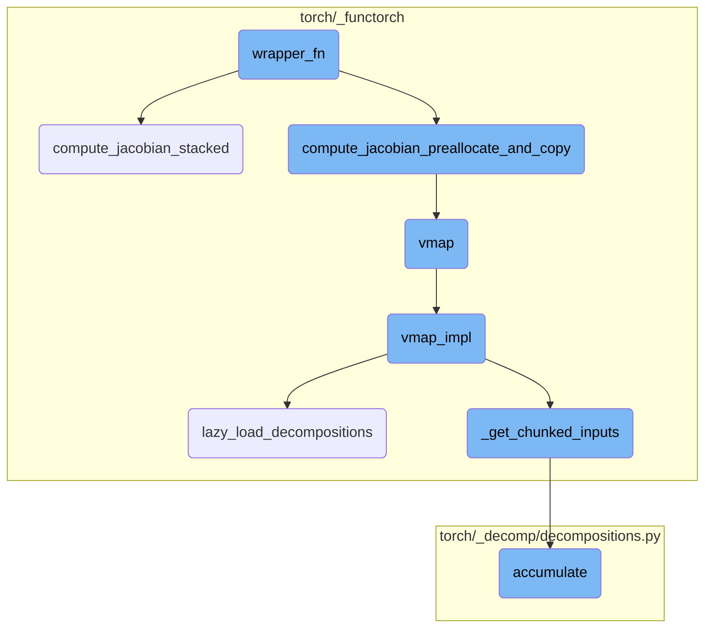
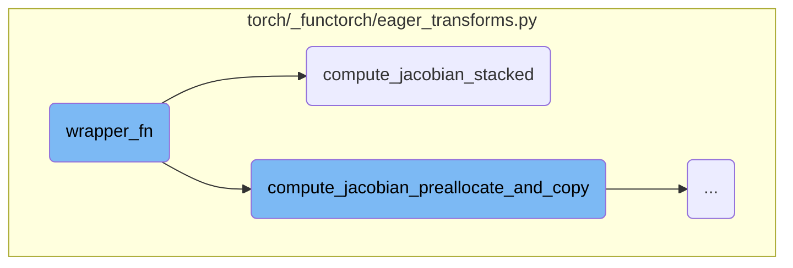
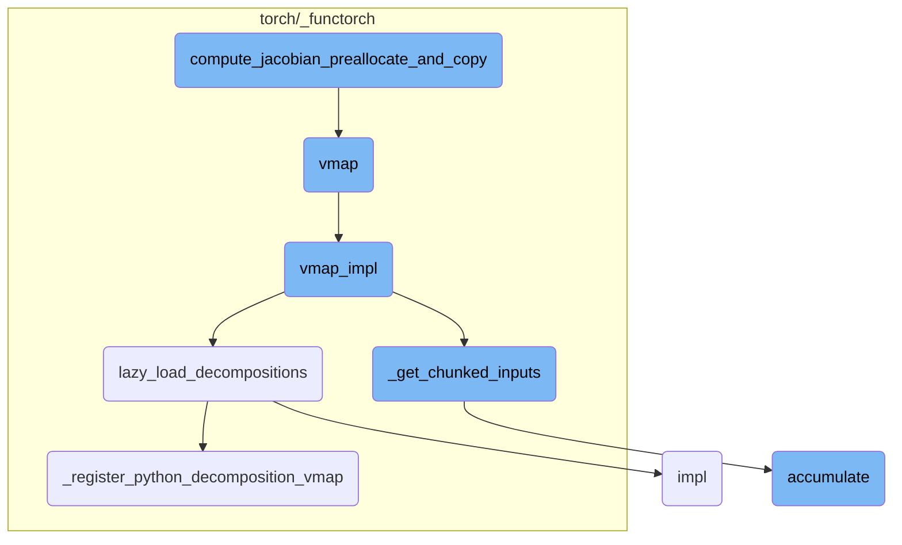

This document provides an overview of the `wrapper_fn` function, which is responsible for orchestrating the computation of the Jacobian matrix. It includes a high-level diagram of the flow and a detailed breakdown of the function's steps.

The `wrapper_fn` function starts by checking if the input is complex. It then computes the vector-Jacobian product (VJP) and extracts the necessary components. The function flattens the output, validates it, and constructs gradient outputs. It decides whether to compute the Jacobian using preallocation and copying or by stacking the results. Finally, it processes the Jacobian and returns it in the required format.

Here is a high level diagram of the flow, showing only the most important functions:



# Flow drill down

First, we'll zoom into this section of the flow:



<SwmSnippet path="/torch/_functorch/eager_transforms.py" line="602">

---

## wrapper_fn

The `wrapper_fn` function is responsible for orchestrating the computation of the Jacobian matrix. It first validates the input to ensure it is not complex and then computes the vector-Jacobian product (VJP) using `_vjp_with_argnums`. Depending on whether auxiliary outputs are present, it extracts the necessary components from the VJP output. The function then flattens the output and validates it again. It constructs gradient outputs by splitting the standard basis and flattens the primals. The function then decides whether to compute the Jacobian using preallocation and copying or by stacking the results. Finally, it processes the Jacobian to return it in the required format.

```python
    def wrapper_fn(*args):
        error_if_complex("jacrev", args, is_input=True)
        vjp_out = _vjp_with_argnums(func, *args, argnums=argnums, has_aux=has_aux)
        if has_aux:
            output, vjp_fn, aux = vjp_out
        else:
            output, vjp_fn = vjp_out

        # See NOTE: [Computing jacobian with vmap and vjp for multiple outputs]
        flat_output, output_spec = tree_flatten(output)

        error_if_complex("jacrev", flat_output, is_input=False)

        # NB: vjp already checks that all outputs are tensors
        # Step 1: Construct grad_outputs by splitting the standard basis
        flat_output_numels = tuple(out.numel() for out in flat_output)

        primals = _slice_argnums(args, argnums)
        flat_primals, primals_spec = tree_flatten(primals)

        def compute_jacobian_stacked():
```

---

</SwmSnippet>

<SwmSnippet path="/torch/_functorch/eager_transforms.py" line="622">

---

### compute_jacobian_stacked

The `compute_jacobian_stacked` function is a helper function within `wrapper_fn` that computes the Jacobian matrix by chunking the standard basis. It iterates over chunks of the basis, applies the VJP function to each chunk, and collects the results. If the chunk size is one, it ensures the results are correctly shaped. The function concatenates the results from different chunks and returns the final Jacobian matrix.

```python
        def compute_jacobian_stacked():
            # Helper function to compute chunked Jacobian
            # The intermediate chunked calculation are only
            # scoped at this function level.
            chunked_results = []
            for flat_basis_chunk in _chunked_standard_basis_for_(
                flat_output, flat_output_numels, chunk_size=chunk_size
            ):
                if chunk_size == 1:
                    # sanity check.
                    for t in flat_basis_chunk:
                        assert t.size(0) == 1

                    flat_basis_chunk = tree_map(
                        lambda t: torch.squeeze(t, 0), flat_basis_chunk
                    )

                basis = tree_unflatten(flat_basis_chunk, output_spec)

                if chunk_size == 1:
                    # Behaviour with `chunk_size=1` is same as `for-loop`
```

---

</SwmSnippet>

Now, lets zoom into this section of the flow:



<SwmSnippet path="/torch/_functorch/eager_transforms.py" line="671">

---

## The function `compute_jacobian_preallocate_and_copy`

The function `compute_jacobian_preallocate_and_copy` is responsible for computing the Jacobian matrix in a chunked manner. It preallocates memory for the Jacobian if the chunk size is not specified or is larger than the output vector size. The function iterates over chunks of the standard basis, applies the vector-Jacobian product function (`vjp_fn`) to each chunk, and accumulates the results. If the chunk size is 1, it uses a for-loop-like behavior; otherwise, it leverages `vmap` for vectorized computation. The results are then copied into preallocated storage, ensuring efficient memory usage and computation.

```python
        def compute_jacobian_preallocate_and_copy():
            # Helper function to compute chunked Jacobian
            # The intermediate chunked calculation are only
            # scoped at this function level.
            out_vec_size = sum(flat_output_numels)

            # Don't pre-allocate if we have a single chunk.
            if not (chunk_size is None or chunk_size >= out_vec_size):
                stacked_results = [
                    primal.new_zeros(out_vec_size, *primal.shape)
                    for primal in flat_primals
                ]

            for idx, flat_basis_chunk in enumerate(
                _chunked_standard_basis_for_(
                    flat_output, flat_output_numels, chunk_size=chunk_size
                )
            ):
                if chunk_size == 1:
                    # sanity check.
                    for t in flat_basis_chunk:
```

---

</SwmSnippet>

<SwmSnippet path="/torch/_functorch/apis.py" line="32">

---

### Vectorizing with `vmap`

The `vmap` function is a vectorizing map that transforms a given function to operate over a specified dimension of the inputs. This is particularly useful for handling batch dimensions and computing batched gradients. When `vmap` is applied, it pushes the map into PyTorch operations, effectively vectorizing them. This allows for more efficient computation by leveraging parallelism.

```python
def vmap(
    func: Callable,
    in_dims: in_dims_t = 0,
    out_dims: out_dims_t = 0,
    randomness: str = "error",
    *,
    chunk_size=None,
) -> Callable:
    """
    vmap is the vectorizing map; ``vmap(func)`` returns a new function that
    maps ``func`` over some dimension of the inputs. Semantically, vmap
    pushes the map into PyTorch operations called by ``func``, effectively
    vectorizing those operations.

    vmap is useful for handling batch dimensions: one can write a function
    ``func`` that runs on examples and then lift it to a function that can
    take batches of examples with ``vmap(func)``. vmap can also be used to
    compute batched gradients when composed with autograd.

    .. note::
        :func:`torch.vmap` is aliased to :func:`torch.func.vmap` for
```

---

</SwmSnippet>

<SwmSnippet path="/torch/_functorch/vmap.py" line="309">

---

### Implementing `vmap`

The `vmap_impl` function is the core implementation of `vmap`. It first calls `lazy_load_decompositions` to ensure that necessary decompositions are loaded. It then processes the batched inputs and, if a chunk size is specified, it splits the inputs into chunks and applies the function to each chunk. If no chunk size is specified, it applies the function to the entire batch at once.

```python
def vmap_impl(func, in_dims, out_dims, randomness, chunk_size, *args, **kwargs):
    lazy_load_decompositions()
    _check_out_dims_is_int_or_int_pytree(out_dims, func)
    batch_size, flat_in_dims, flat_args, args_spec = _process_batched_inputs(
        in_dims, args, func
    )

    if chunk_size is not None:
        chunks_flat_args = _get_chunked_inputs(
            flat_args, flat_in_dims, batch_size, chunk_size
        )
        return _chunked_vmap(
            func,
            flat_in_dims,
            chunks_flat_args,
            args_spec,
            out_dims,
            randomness,
            **kwargs,
        )

```

---

</SwmSnippet>

<SwmSnippet path="/torch/_functorch/vmap.py" line="263">

---

### Lazy Loading Decompositions

The `lazy_load_decompositions` function ensures that decompositions are only loaded when needed. This is particularly important for environments that may not support certain decompositions, such as those without JIT compilation. The function uses a global lock to ensure that decompositions are loaded only once, improving efficiency and avoiding redundant operations.

```python
# torch.package, Python 3.11, and torch.jit-less environments are unhappy with
# decompositions. Only load them when needed if possible.
def lazy_load_decompositions():
    global DECOMPOSITIONS_LOADED
    if DECOMPOSITIONS_LOADED:
        return

    with DECOMPOSITIONS_LOCK:
        if DECOMPOSITIONS_LOADED:
            return

        if not (os.environ.get("PYTORCH_JIT", "1") == "1" and __debug__):
            DECOMPOSITIONS_LOADED = True
            return

        # use an alternate way to register an operator into the decomposition table
        # _register_jit_decomposition doesn't work for some operators, e.g. addr,
        #  because the Tensor types generated cannot be unioned by torchscript
        # decomp should be type OpOverload
        global VMAP_DECOMPOSITIONS_LIB
        VMAP_DECOMPOSITIONS_LIB = torch.library.Library(
```

---

</SwmSnippet>

<SwmSnippet path="/torch/_functorch/vmap.py" line="353">

---

### Chunking Inputs

The `_get_chunked_inputs` function splits the input tensors into chunks based on the specified chunk size. This is useful for managing memory and computational efficiency, especially when dealing with large batches. The function returns a list of chunked inputs, which can then be processed independently.

```python
def _get_chunked_inputs(flat_args, flat_in_dims, batch_size, chunk_size):
    split_idxs = (batch_size,)
    if chunk_size is not None:
        chunk_sizes = get_chunk_sizes(batch_size, chunk_size)
        split_idxs = tuple(itertools.accumulate(chunk_sizes))

    flat_args_chunks = tuple(
        t.tensor_split(split_idxs, dim=in_dim)
        if in_dim is not None
        else [
            t,
        ]
        * len(split_idxs)
        for t, in_dim in zip(flat_args, flat_in_dims)
    )

    # transpose chunk dim and flatten structure
    # chunks_flat_args is a list of flatten args
    chunks_flat_args = zip(*flat_args_chunks)
    return chunks_flat_args
```

---

</SwmSnippet>

<SwmSnippet path="/torch/_decomp/decompositions.py" line="4665">

---

### Accumulating Results

The `accumulate` function is used to accumulate gradients or other results over specified index ranges. This is useful for operations that involve padding or other transformations that require conditional accumulation. The function ensures that only valid ranges are accumulated, improving the accuracy and efficiency of the computation.

```python
    def accumulate(grad, out, index_ranges):
        # If the upper bound is less than the lower bound, we can get rid of one accumulation.
        # This happens when the padding size is zero.
        for i in range(dim):
            upper_less_than_lower = index_ranges[i][2] < index_ranges[i][1]
            if isinstance(upper_less_than_lower, bool) and upper_less_than_lower:
                return grad

        cond = functools.reduce(
            aten.logical_and,
            [index_range_condition(index_range) for index_range in index_ranges],
        )
        g = aten._unsafe_masked_index(grad_output, cond, b + out, 0.0)
        return grad + g
```

---

</SwmSnippet>

<SwmSnippet path="/torch/_functorch/vmap.py" line="289">

---

### Registering Decompositions

The `_register_python_decomposition_vmap` function registers Python-based decompositions for use with `vmap`. This is important for ensuring that custom operations are correctly decomposed and vectorized, allowing for efficient computation.

```python
        def _register_python_decomposition_vmap(decomp):
            if decomp in decomposition_table:
                VMAP_DECOMPOSITIONS_LIB.impl(decomp, decomposition_table[decomp])
            else:
                raise RuntimeError(f"could not find decomposition for {decomp}")
```

---

</SwmSnippet>

<SwmSnippet path="/torch/_custom_ops.py" line="120">

---

### Custom Operation Implementation

The `impl` function registers an implementation for a custom operation on specified device types (e.g., CPU, CUDA). This allows for custom operations to be efficiently executed on different hardware, leveraging device-specific optimizations.

```python
def impl(qualname, *, device_types=("cpu", "cuda"), func=None):
    r"""Register an implementation for a device type for this custom op.

    If the op is passed multiple Tensor inputs with different device
    types, it will dispatch to the registered implementation for the highest
    priority device type among those present.
    The supported device types, in order of priority, are {'cuda', 'cpu'}.

    This API may be used as a decorator (see examples).

    For a detailed guide on custom ops, please see
    https://docs.google.com/document/d/1aGWtgxV3HppuxQAdddyPrs74_aEntpkYt9MalnCKnhk

    Arguments:
        device_types (str or Iterable[str]): the device type(s) to register the function for.

    Example::
        >>> # xdoctest: +REQUIRES(env:TORCH_DOCTEST_CUDA)
        >>> import torch
        >>> import numpy as np
        >>> from torch import Tensor
```

---

</SwmSnippet>

&nbsp;

*This is an auto-generated document by Swimm AI 🌊 and has not yet been verified by a human*

<SwmMeta version="3.0.0" repo-id="Z2l0aHViJTNBJTNBcHl0b3JjaC1hdXRvZG9jcy1kZW1vJTNBJTNBU3dpbW0tRGVtbw==" repo-name="pytorch-autodocs-demo"><sup>Powered by [Swimm](https://app.swimm.io/)</sup></SwmMeta>
