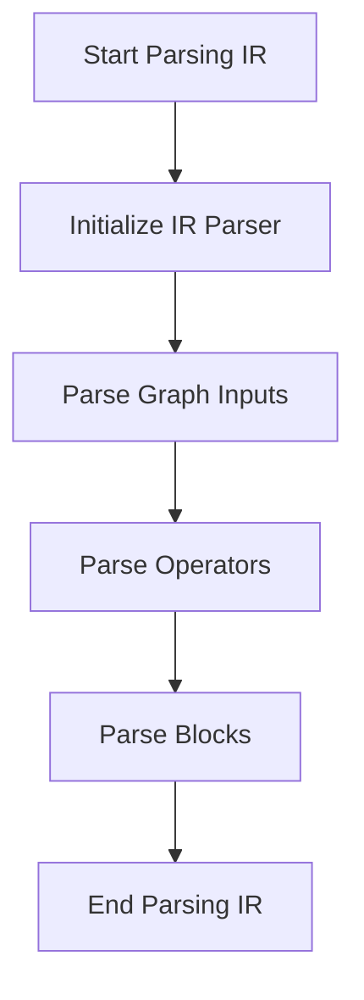

This document will cover the process of parsing Intermediate Representation (IR) in the product. We'll cover:

1. Initializing the IR parser
2. Parsing the graph inputs
3. Parsing the operators
4. Parsing the blocks

Technical document: <SwmLink doc-title="Overview of the parseIR Function">[Overview of the parseIR Function](/.swm/overview-of-the-parseir-function.zpsfy1q0.sw.md)</SwmLink>

# [Initializing the IR parser](https://app.swimm.io/repos/Z2l0aHViJTNBJTNBcHl0b3JjaC1hdXRvZG9jcy1kZW1vJTNBJTNBU3dpbW0tRGVtbw==/docs/zpsfy1q0#parseir-function)

The process begins with initializing the IR parser. This involves setting up the parser with the provided string, graph, and value map. This step is crucial as it prepares the parser to understand and process the IR data. The parser is then ready to start the parsing process.

# [Parsing the graph inputs](https://app.swimm.io/repos/Z2l0aHViJTNBJTNBcHl0b3JjaC1hdXRvZG9jcy1kZW1vJTNBJTNBU3dpbW0tRGVtbw==/docs/zpsfy1q0#parsing-graph-inputs)

The next step is parsing the graph inputs. This involves reading the list of inputs for the graph and adding them to the graph structure. Each input is assigned a type, ensuring that the graph can correctly interpret and use these inputs in subsequent operations.

# [Parsing the operators](https://app.swimm.io/repos/Z2l0aHViJTNBJTNBcHl0b3JjaC1hdXRvZG9jcy1kZW1vJTNBJTNBU3dpbW0tRGVtbw==/docs/zpsfy1q0#parsing-individual-operators)

After the inputs are parsed, the parser moves on to parsing the operators. This step involves reading each operator in the graph, understanding its inputs and outputs, and adding it to the graph. The parser also sets the type for each operator, ensuring that the graph can correctly execute these operations.

# [Parsing the blocks](https://app.swimm.io/repos/Z2l0aHViJTNBJTNBcHl0b3JjaC1hdXRvZG9jcy1kZW1vJTNBJTNBU3dpbW0tRGVtbw==/docs/zpsfy1q0#parsing-blocks)

The final step in the parsing process is parsing the blocks. Blocks are sections of the graph that contain a series of operations. The parser reads each block, parses its inputs and outputs, and adds it to the graph. This step ensures that all parts of the graph are correctly structured and ready for execution.

&nbsp;

*This is an auto-generated document by Swimm AI 🌊 and has not yet been verified by a human*

<SwmMeta version="3.0.0" repo-id="Z2l0aHViJTNBJTNBcHl0b3JjaC1hdXRvZG9jcy1kZW1vJTNBJTNBU3dpbW0tRGVtbw==" repo-name="pytorch-autodocs-demo">Powered by [Swimm](https://app.swimm.io/)</SwmMeta>
