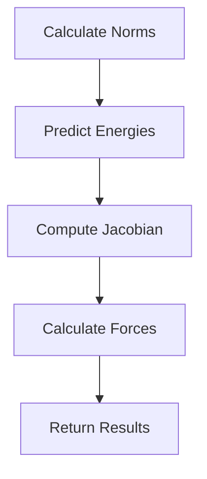

This document will cover the Prediction Process Overview, which includes:

1. Calculating norms of displacement vectors
2. Predicting energies using the model
3. Computing the Jacobian of the model
4. Calculating the forces based on the Jacobian.

Technical document: <SwmLink doc-title="Prediction Process Overview">[Prediction Process Overview](/.swm/prediction-process-overview.q69j4l8h.sw.md)</SwmLink>

# [Calculating Norms of Displacement Vectors](https://app.swimm.io/repos/Z2l0aHViJTNBJTNBcHl0b3JjaC1hdXRvZG9jcy1kZW1vJTNBJTNBU3dpbW0tRGVtbw==/docs/q69j4l8h#calculating-norms-of-displacement-vectors)

The process begins by calculating the norms of the displacement vectors. Displacement vectors represent the differences between positions in a given space. The norms are essentially the magnitudes of these vectors, which are calculated to understand the extent of displacement. These norms are then reshaped to fit the model's input requirements.

# [Predicting Energies Using the Model](https://app.swimm.io/repos/Z2l0aHViJTNBJTNBcHl0b3JjaC1hdXRvZG9jcy1kZW1vJTNBJTNBU3dpbW0tRGVtbw==/docs/q69j4l8h#predicting-energies-using-the-model)

Once the norms of the displacement vectors are calculated and reshaped, they are fed into the predictive model. The model uses these norms to predict the energies associated with the displacements. This step is crucial as it translates the physical displacements into energy values, which are essential for further calculations.

# [Computing the Jacobian of the Model](https://app.swimm.io/repos/Z2l0aHViJTNBJTNBcHl0b3JjaC1hdXRvZG9jcy1kZW1vJTNBJTNBU3dpbW0tRGVtbw==/docs/q69j4l8h#computing-the-jacobian-of-the-model)

The next step involves computing the Jacobian of the model with respect to the norms. The Jacobian matrix represents the rate of change of the model's output (energies) with respect to its input (norms). This computation is essential for understanding how small changes in the input norms affect the predicted energies. Specialized functions are used to compute the Jacobian efficiently.

# [Calculating the Forces Based on the Jacobian](https://app.swimm.io/repos/Z2l0aHViJTNBJTNBcHl0b3JjaC1hdXRvZG9jcy1kZW1vJTNBJTNBU3dpbW0tRGVtbw==/docs/q69j4l8h#calculating-the-forces-based-on-the-jacobian)

Using the computed Jacobian, the forces are then calculated. Forces are derived from the gradients of the energies with respect to the displacement vectors. This step involves using the Jacobian to determine how the energies change with displacement, which directly translates to the forces. The calculated forces are essential for understanding the dynamics of the system being modeled.

# [Returning the Predicted Energies and Forces](https://app.swimm.io/repos/Z2l0aHViJTNBJTNBcHl0b3JjaC1hdXRvZG9jcy1kZW1vJTNBJTNBU3dpbW0tRGVtbw==/docs/q69j4l8h#returning-the-predicted-energies-and-forces)

Finally, the predicted energies and calculated forces are returned as the output of the prediction process. These results can then be used for further analysis or decision-making processes. The energies provide insights into the potential states of the system, while the forces indicate the interactions and dynamics within the system.

&nbsp;

*This is an auto-generated document by Swimm AI 🌊 and has not yet been verified by a human*

<SwmMeta version="3.0.0" repo-id="Z2l0aHViJTNBJTNBcHl0b3JjaC1hdXRvZG9jcy1kZW1vJTNBJTNBU3dpbW0tRGVtbw==" repo-name="pytorch-autodocs-demo">Powered by [Swimm](https://app.swimm.io/)</SwmMeta>
