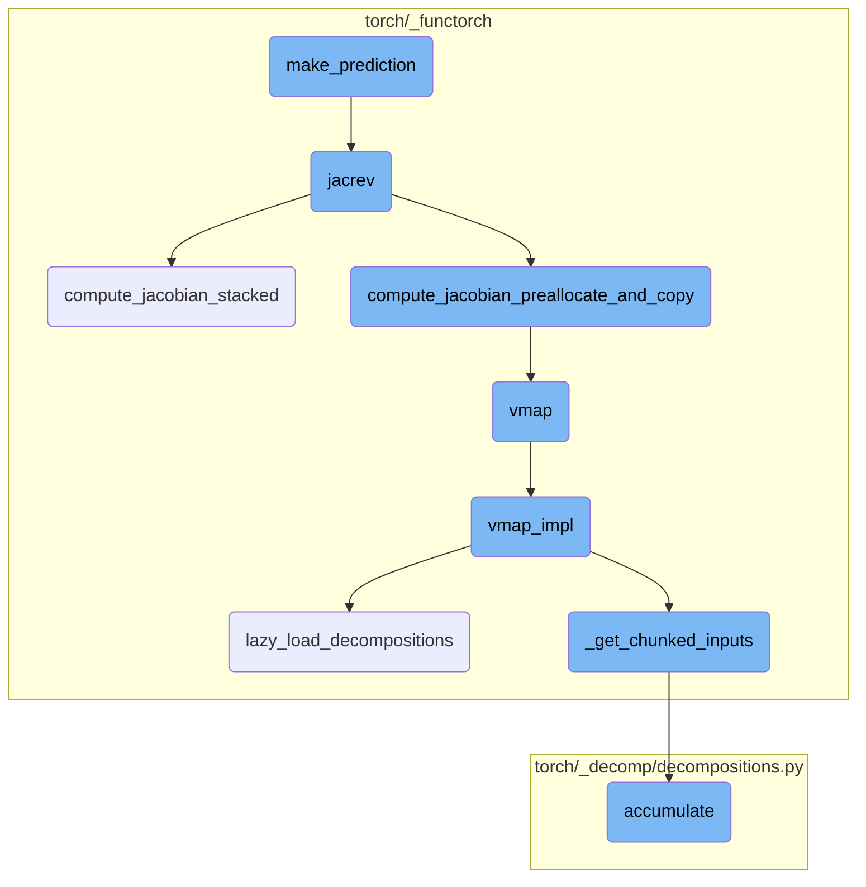
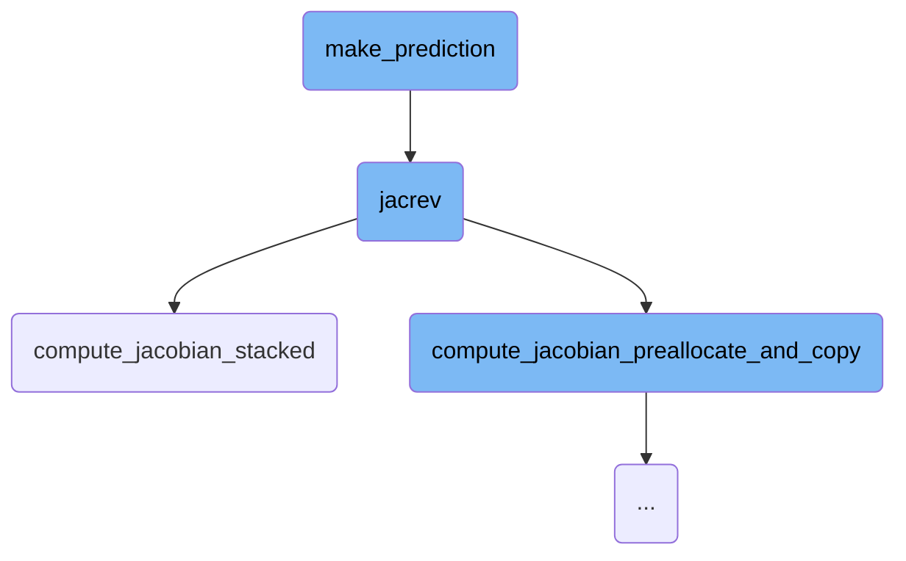
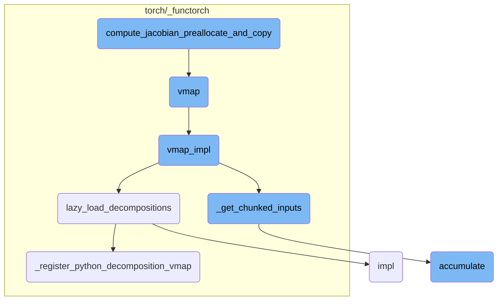

This document provides an overview of the process involved in making predictions using a model. The process includes calculating norms of displacement vectors, predicting energies using the model, computing the Jacobian of the model, and finally calculating the forces based on the Jacobian.

The flow starts by calculating the norms of the displacement vectors, which are then reshaped. These norms are fed into the model to predict the energies. Next, the Jacobian of the model with respect to the norms is computed using specialized functions. This Jacobian is used to calculate the forces. Finally, the predicted energies and forces are returned.

Here is a high level diagram of the flow, showing only the most important functions:



# Flow drill down

First, we'll zoom into this section of the flow:



<SwmSnippet path="/functorch/examples/lennard_jones/lennard_jones.py" line="51">

---

## make_prediction

The `make_prediction` function is responsible for predicting the energies and forces based on the input model and displacement vectors (`drs`). It first calculates the norms of the displacement vectors and reshapes them. Then, it uses the model to predict the energies. The function also computes the Jacobian of the model with respect to the norms using `jacrev` and `vmap`, which is then used to calculate the forces. Finally, it returns the predicted energies and forces.

```python
    norms = torch.norm(drs, dim=1).reshape(-1, 1)
    energies = model(norms)

    network_derivs = vmap(jacrev(model))(norms).squeeze(-1)
    forces = -network_derivs * drs / norms
    return energies, forces
```

---

</SwmSnippet>

<SwmSnippet path="/torch/_functorch/eager_transforms.py" line="602">

---

## jacrev

The `jacrev` function computes the Jacobian of a given function. It ensures that the input is not complex and then calculates the vector-Jacobian product (VJP) using `_vjp_with_argnums`. This is a crucial step in the `make_prediction` function for computing the derivatives of the model.

```python
    def wrapper_fn(*args):
        error_if_complex("jacrev", args, is_input=True)
        vjp_out = _vjp_with_argnums(func, *args, argnums=argnums, has_aux=has_aux)
        if has_aux:
```

---

</SwmSnippet>

<SwmSnippet path="/torch/_functorch/eager_transforms.py" line="622">

---

## compute_jacobian_stacked

The `compute_jacobian_stacked` function helps in computing the chunked Jacobian. It iterates over chunks of the standard basis, applies the VJP function to each chunk, and collects the results. If there is only one chunk, it returns the result directly; otherwise, it concatenates the results from different chunks. This function is used internally by `jacrev` to handle large Jacobian computations efficiently.

```python
        def compute_jacobian_stacked():
            # Helper function to compute chunked Jacobian
            # The intermediate chunked calculation are only
            # scoped at this function level.
            chunked_results = []
            for flat_basis_chunk in _chunked_standard_basis_for_(
                flat_output, flat_output_numels, chunk_size=chunk_size
            ):
                if chunk_size == 1:
                    # sanity check.
                    for t in flat_basis_chunk:
                        assert t.size(0) == 1

                    flat_basis_chunk = tree_map(
                        lambda t: torch.squeeze(t, 0), flat_basis_chunk
                    )

                basis = tree_unflatten(flat_basis_chunk, output_spec)

                if chunk_size == 1:
                    # Behaviour with `chunk_size=1` is same as `for-loop`
```

---

</SwmSnippet>

Now, lets zoom into this section of the flow:



<SwmSnippet path="/torch/_functorch/eager_transforms.py" line="671">

---

## compute_jacobian_preallocate_and_copy

The function `compute_jacobian_preallocate_and_copy` is responsible for computing the Jacobian matrix in a chunked manner. It preallocates memory for the Jacobian if the chunk size is appropriate and iterates over chunks of the standard basis to compute the vector-Jacobian products (VJPs). If the chunk size is set to 1, it directly computes the VJPs using a for-loop. Otherwise, it leverages the `vmap` function to vectorize the computation. The results are then either returned directly or copied into a preallocated tensor, depending on the chunk size.

```python
        def compute_jacobian_preallocate_and_copy():
            # Helper function to compute chunked Jacobian
            # The intermediate chunked calculation are only
            # scoped at this function level.
            out_vec_size = sum(flat_output_numels)

            # Don't pre-allocate if we have a single chunk.
            if not (chunk_size is None or chunk_size >= out_vec_size):
                stacked_results = [
                    primal.new_zeros(out_vec_size, *primal.shape)
                    for primal in flat_primals
                ]

            for idx, flat_basis_chunk in enumerate(
                _chunked_standard_basis_for_(
                    flat_output, flat_output_numels, chunk_size=chunk_size
                )
            ):
                if chunk_size == 1:
                    # sanity check.
                    for t in flat_basis_chunk:
```

---

</SwmSnippet>

<SwmSnippet path="/torch/_functorch/apis.py" line="32">

---

### vmap

The `vmap` function is a vectorizing map that transforms a given function to operate over a specified dimension of the inputs. It is particularly useful for handling batch dimensions and computing batched gradients. When used within `compute_jacobian_preallocate_and_copy`, it helps in efficiently computing the VJPs by vectorizing the operations.

```python
def vmap(
    func: Callable,
    in_dims: in_dims_t = 0,
    out_dims: out_dims_t = 0,
    randomness: str = "error",
    *,
    chunk_size=None,
) -> Callable:
    """
    vmap is the vectorizing map; ``vmap(func)`` returns a new function that
    maps ``func`` over some dimension of the inputs. Semantically, vmap
    pushes the map into PyTorch operations called by ``func``, effectively
    vectorizing those operations.

    vmap is useful for handling batch dimensions: one can write a function
    ``func`` that runs on examples and then lift it to a function that can
    take batches of examples with ``vmap(func)``. vmap can also be used to
    compute batched gradients when composed with autograd.

    .. note::
        :func:`torch.vmap` is aliased to :func:`torch.func.vmap` for
```

---

</SwmSnippet>

<SwmSnippet path="/torch/_functorch/vmap.py" line="309">

---

### vmap_impl

The `vmap_impl` function is the core implementation of the `vmap` functionality. It processes the batched inputs and either applies the vectorized function in chunks or as a whole, depending on the specified chunk size. This function is called within `compute_jacobian_preallocate_and_copy` to handle the vectorized computation of the VJPs.

```python
def vmap_impl(func, in_dims, out_dims, randomness, chunk_size, *args, **kwargs):
    lazy_load_decompositions()
    _check_out_dims_is_int_or_int_pytree(out_dims, func)
    batch_size, flat_in_dims, flat_args, args_spec = _process_batched_inputs(
        in_dims, args, func
    )

    if chunk_size is not None:
        chunks_flat_args = _get_chunked_inputs(
            flat_args, flat_in_dims, batch_size, chunk_size
        )
        return _chunked_vmap(
            func,
            flat_in_dims,
            chunks_flat_args,
            args_spec,
            out_dims,
            randomness,
            **kwargs,
        )

```

---

</SwmSnippet>

<SwmSnippet path="/torch/_functorch/vmap.py" line="263">

---

### lazy_load_decompositions

The `lazy_load_decompositions` function ensures that the necessary decompositions are loaded only when needed. This is important for environments that may have issues with decompositions. It is called within `vmap_impl` to ensure that all required decompositions are available before performing the vectorized operations.

```python
# torch.package, Python 3.11, and torch.jit-less environments are unhappy with
# decompositions. Only load them when needed if possible.
def lazy_load_decompositions():
    global DECOMPOSITIONS_LOADED
    if DECOMPOSITIONS_LOADED:
        return

    with DECOMPOSITIONS_LOCK:
        if DECOMPOSITIONS_LOADED:
            return

        if not (os.environ.get("PYTORCH_JIT", "1") == "1" and __debug__):
            DECOMPOSITIONS_LOADED = True
            return

        # use an alternate way to register an operator into the decomposition table
        # _register_jit_decomposition doesn't work for some operators, e.g. addr,
        #  because the Tensor types generated cannot be unioned by torchscript
        # decomp should be type OpOverload
        global VMAP_DECOMPOSITIONS_LIB
        VMAP_DECOMPOSITIONS_LIB = torch.library.Library(
```

---

</SwmSnippet>

<SwmSnippet path="/torch/_functorch/vmap.py" line="353">

---

### \_get_chunked_inputs

The `_get_chunked_inputs` function splits the input tensors into chunks based on the specified chunk size. This is useful for managing memory and computational efficiency when dealing with large inputs. It is used within `vmap_impl` to prepare the inputs for chunked vectorized computation.

```python
def _get_chunked_inputs(flat_args, flat_in_dims, batch_size, chunk_size):
    split_idxs = (batch_size,)
    if chunk_size is not None:
        chunk_sizes = get_chunk_sizes(batch_size, chunk_size)
        split_idxs = tuple(itertools.accumulate(chunk_sizes))

    flat_args_chunks = tuple(
        t.tensor_split(split_idxs, dim=in_dim)
        if in_dim is not None
        else [
            t,
        ]
        * len(split_idxs)
        for t, in_dim in zip(flat_args, flat_in_dims)
    )

    # transpose chunk dim and flatten structure
    # chunks_flat_args is a list of flatten args
    chunks_flat_args = zip(*flat_args_chunks)
    return chunks_flat_args
```

---

</SwmSnippet>

<SwmSnippet path="/torch/_decomp/decompositions.py" line="4665">

---

### accumulate

The `accumulate` function performs accumulation of gradients based on specified index ranges. This is useful for handling cases where padding or other conditions affect the gradient computation. It is part of the decomposition process that may be involved in the overall computation of the Jacobian.

```python
    def accumulate(grad, out, index_ranges):
        # If the upper bound is less than the lower bound, we can get rid of one accumulation.
        # This happens when the padding size is zero.
        for i in range(dim):
            upper_less_than_lower = index_ranges[i][2] < index_ranges[i][1]
            if isinstance(upper_less_than_lower, bool) and upper_less_than_lower:
                return grad

        cond = functools.reduce(
            aten.logical_and,
            [index_range_condition(index_range) for index_range in index_ranges],
        )
        g = aten._unsafe_masked_index(grad_output, cond, b + out, 0.0)
        return grad + g
```

---

</SwmSnippet>

<SwmSnippet path="/torch/_functorch/vmap.py" line="289">

---

### \_register_python_decomposition_vmap

The `_register_python_decomposition_vmap` function registers Python-based decompositions for use with `vmap`. This ensures that the necessary decompositions are available for vectorized operations. It is called within `lazy_load_decompositions` to register the required decompositions.

```python
        def _register_python_decomposition_vmap(decomp):
            if decomp in decomposition_table:
                VMAP_DECOMPOSITIONS_LIB.impl(decomp, decomposition_table[decomp])
            else:
                raise RuntimeError(f"could not find decomposition for {decomp}")

        _register_python_decomposition_vmap(torch.ops.aten.mse_loss_backward.default)
        _register_python_decomposition_vmap(
            torch.ops.aten.smooth_l1_loss_backward.default
        )
        _register_python_decomposition_vmap(torch.ops.aten.huber_loss_backward.default)
        _register_python_decomposition_vmap(torch.ops.aten.nll_loss_forward.default)
        _register_python_decomposition_vmap(torch.ops.aten.nll_loss2d_forward.default)
        _register_python_decomposition_vmap(torch.ops.aten.nll_loss_backward.default)
        _register_python_decomposition_vmap(torch.ops.aten.nll_loss2d_backward.default)
        _register_python_decomposition_vmap(torch.ops.aten.addr.default)

```

---

</SwmSnippet>

<SwmSnippet path="/torch/_custom_ops.py" line="120">

---

### impl

The `impl` function registers an implementation for a custom operation on specified device types. This is useful for extending the functionality of PyTorch with custom operations. It is part of the infrastructure that supports the overall computation process, including the vectorized operations performed by `vmap`.

```python
def impl(qualname, *, device_types=("cpu", "cuda"), func=None):
    r"""Register an implementation for a device type for this custom op.

    If the op is passed multiple Tensor inputs with different device
    types, it will dispatch to the registered implementation for the highest
    priority device type among those present.
    The supported device types, in order of priority, are {'cuda', 'cpu'}.

    This API may be used as a decorator (see examples).

    For a detailed guide on custom ops, please see
    https://docs.google.com/document/d/1aGWtgxV3HppuxQAdddyPrs74_aEntpkYt9MalnCKnhk

    Arguments:
        device_types (str or Iterable[str]): the device type(s) to register the function for.

    Example::
        >>> # xdoctest: +REQUIRES(env:TORCH_DOCTEST_CUDA)
        >>> import torch
        >>> import numpy as np
        >>> from torch import Tensor
```

---

</SwmSnippet>

&nbsp;

*This is an auto-generated document by Swimm AI 🌊 and has not yet been verified by a human*

<SwmMeta version="3.0.0" repo-id="Z2l0aHViJTNBJTNBcHl0b3JjaC1hdXRvZG9jcy1kZW1vJTNBJTNBU3dpbW0tRGVtbw==" repo-name="pytorch-autodocs-demo"><sup>Powered by [Swimm](https://app.swimm.io/)</sup></SwmMeta>
