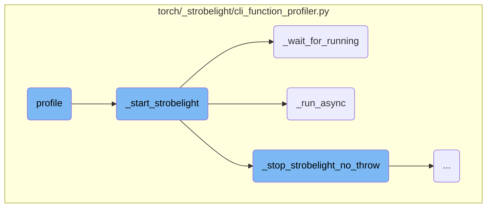

This document outlines the profiling process, detailing each step from initialization to retrieving results. The profiling process ensures that no concurrent runs are supported, starts the profiling asynchronously, waits for it to be in the running state, and handles the results after the profiling is stopped.

The profiling process starts by ensuring no other profiling runs are happening simultaneously. It then begins the profiling asynchronously and waits until the profiling is running. Once the profiling is complete, it stops the profiling and collects the results. If any errors occur during this process, they are logged and handled appropriately.

Here is a high level diagram of the flow, showing only the most important functions:


# Flow drill down

First, we'll zoom into this section of the flow:



<SwmSnippet path="/torch/_strobelight/cli_function_profiler.py" line="253">

---

## Profile Initialization

The `profile` function initializes the profiling process by acquiring a lock to ensure no concurrent runs are supported. If the lock is successfully acquired, it proceeds to start the strobelight profiling.

```python
    def profile(self, work_function: Any, *args: Any, **kwargs: Any) -> Any:
        self.current_run_id = None
        self.profile_result = None

        if locked := StrobelightCLIFunctionProfiler._lock.acquire(False):
            if not locked:
                if self.stop_at_error:
                    raise StrobelightCLIProfilerError("concurrent runs not supported")

                logger.warning("concurrent runs not supported")
                return work_function(*args, **kwargs)
```

---

</SwmSnippet>

<SwmSnippet path="/torch/_strobelight/cli_function_profiler.py" line="236">

---

## Starting Strobelight

The `_start_strobelight` function attempts to start the strobelight profiling asynchronously. It logs the run ID and waits for the profiling to be in the running state.

```python
    # Return true if strobelight started and is running. Never throw.
    def _start_strobelight(self) -> bool:
        strobelight_started = False
        try:
            self._run_async()
            strobelight_started = True
            logger.info("strobelight run id is: %s", self.current_run_id)
            self._wait_for_running()
            logger.info("strobelight profiling running")
            return True
```

---

</SwmSnippet>

<SwmSnippet path="/torch/_strobelight/cli_function_profiler.py" line="93">

---

### Running Asynchronously

The `_run_async` function constructs and executes the command to start the strobelight profiling in asynchronous mode. It captures the output to extract the run ID.

```python
    def _run_async(self) -> None:
        processId = os.getpid()
        namespace = _pid_namespace(processId)
        command = [
            "strobeclient",
            "run",
            "--profiler",
            "pyperf",
            "--event",
            "cycles",
            "--async",
            "--sample-interval",
            f"{int(self.sample_each)}",
            "--duration-ms",
            f"{int(self.max_profile_duration_sec * 1000)}",
            "--pid",
            f"{namespace}:{processId}",
        ]

        if self.sample_tags:
            command.append("--sample-tags")
```

---

</SwmSnippet>

<SwmSnippet path="/torch/_strobelight/cli_function_profiler.py" line="134">

---

### Waiting for Running State

The `_wait_for_running` function checks the status of the profiling process. It repeatedly queries the status until it confirms that the profiling is running or encounters an error.

```python
    def _wait_for_running(self, counter: int = 0) -> None:
        if counter > 20:
            raise StrobelightCLIProfilerError(
                "wait_for_running called more than 20 times"
            )

        command = ["strobeclient", "getRunStatus", "--run-id", f"{self.current_run_id}"]
        logger.debug("running command: %s", _command_to_string(command))
        result = subprocess.run(command, capture_output=True)
        output = result.stderr.decode("utf-8")
        logger.debug("output:\n{%s}", output)

        if result.returncode != 0:
            raise StrobelightCLIProfilerError(
                f"failed to start strobelight profiling, error in wait_for_running:{output}"
            )

        if match := re.search("Profile run status: (.*)", output):
            current_status = match.group(1)
            if current_status == "RUNNING":
                return
```

---

</SwmSnippet>

<SwmSnippet path="/torch/_strobelight/cli_function_profiler.py" line="276">

---

## Handling Profiling Results

After the work function is executed, the `profile` function stops the strobelight profiling and releases the lock. It handles any exceptions that occur during the profiling process.

```python
            try:
                logger.debug("collection started")
                start = timer()
                result = work_function(*args, **kwargs)
                end = timer()
                total_time = end - start  # Time in seconds, e.g. 5.38091952400282
                logger.info("work function took %s seconds", total_time)
                self._stop_strobelight_no_throw(collect_results=True)
                StrobelightCLIFunctionProfiler._lock.release()
                return result
            except Exception as error:
                logger.warning("work function throw exception", exc_info=True)
                self._stop_strobelight_no_throw(collect_results=False)
                StrobelightCLIFunctionProfiler._lock.release()
                raise error
```

---

</SwmSnippet>

Now, lets zoom into this section of the flow:


<SwmSnippet path="/torch/_strobelight/cli_function_profiler.py" line="218">

---

## \_stop_strobelight_no_throw

The function `_stop_strobelight_no_throw` is responsible for stopping the strobelight profiling process. It first attempts to stop the run by calling the `_stop_run` function. If the `collect_results` flag is set to true, it proceeds to collect the results by calling the `_get_results` function. Any exceptions encountered during this process are caught and logged as warnings.

```python
    def _stop_strobelight_no_throw(
        self,
        collect_results: bool,
    ) -> None:
        try:
            # call stop run
            self._stop_run()
            logger.info("strobelight profiling stopped")

            logger.debug("collection stopped")

            if not collect_results:
                return

            self._get_results()
        except Exception as error:
            logger.warning("error during stop_strobelight", exc_info=True)
```

---

</SwmSnippet>

<SwmSnippet path="/torch/_strobelight/cli_function_profiler.py" line="164">

---

### \_stop_run

The function `_stop_run` sends a command to stop the current profiling run using the `strobeclient` tool. It constructs the command with the current run ID and executes it using `subprocess.run`. The function checks the command's output and raises an error if the profiling stop was not successful. This function ensures that the profiling process is properly terminated before any results are collected.

```python
    def _stop_run(self) -> None:
        command = ["strobeclient", "stopRun", "--run-id", str(self.current_run_id)]
        logger.debug("running command: %s", _command_to_string(command))
        result = subprocess.run(command, capture_output=True)
        output = result.stderr.decode("utf-8")
        logger.debug("output:\n{%s}", output)

        if result.returncode != 0:
            raise StrobelightCLIProfilerError(
                f"failed to stop strobelight profiling, return code is not 0 :{output}"
            )

        if match := re.search("INFO ::1:(.*)", output):
            current_status = match.group(1)
            if current_status.__contains__("Success!"):
                return
            else:
                raise StrobelightCLIProfilerError(
                    f"failed to stop strobelight profiling, got {current_status} result"
                )

```

---

</SwmSnippet>

Now, lets zoom into this section of the flow:


<SwmSnippet path="/torch/_strobelight/cli_function_profiler.py" line="188">

---

## Retrieving Profiling Results

The `_get_results` function is responsible for retrieving the profiling results of a run. It constructs a command to query the status of the profiling run using `strobeclient`. If the run is still processing, it waits and retries. Once the run is complete, it parses the output to extract relevant profiling data and logs it.

```python
        command = ["strobeclient", "getRunStatus", "--run-id", str(self.current_run_id)]
        logger.debug("running command: %s", _command_to_string(command))
        result = subprocess.run(command, capture_output=True)
        output = result.stderr.decode("utf-8")
        logger.debug("output:\n{%s}", output)

        if result.returncode != 0:
            raise StrobelightCLIProfilerError(
                f"failed to extract profiling results, return code is not 0 : {output}"
            )

        if match := re.search("INFO ::1:(.*)", output):
            current_status = match.group(1)
            if current_status.__contains__("Profile run status: PROCESSING"):
                time.sleep(10)
                self._get_results()
                return
            elif not current_status.__contains__("Profile run finished with SUCCESS"):
                raise StrobelightCLIProfilerError(
                    f"failed to extract profiling results, unexpected response {output}"
                )
```

---

</SwmSnippet>

<SwmSnippet path="/torch/_lobpcg.py" line="817">

---

## Running LOBPCG Iterations

The `run` function initiates the LOBPCG iterations. It first calls the `update` function to set up iteration variables. If a tracker is present, it calls the tracker before and after the iteration loop. The loop continues to call `update` until the stopping condition is met.

```python
    def run(self):
        """Run LOBPCG iterations.

        Use this method as a template for implementing LOBPCG
        iteration scheme with custom tracker that is compatible with
        TorchScript.
        """
        self.update()

        if not torch.jit.is_scripting() and self.tracker is not None:
            self.call_tracker()

        while not self.stop_iteration():
            self.update()

            if not torch.jit.is_scripting() and self.tracker is not None:
                self.call_tracker()
```

---

</SwmSnippet>

<SwmSnippet path="/torch/_lobpcg.py" line="747">

---

## Updating Iteration Variables

The `update` function sets and updates the iteration variables. It normalizes the input matrices and sets initial values for iteration counters. Depending on the method specified, it calls either `_update_basic` or `_update_ortho` to perform the specific update logic.

```python
    def update(self):
        """Set and update iteration variables."""
        if self.ivars["istep"] == 0:
            X_norm = float(torch.norm(self.X))
            iX_norm = X_norm**-1
            A_norm = float(torch.norm(_utils.matmul(self.A, self.X))) * iX_norm
            B_norm = float(torch.norm(_utils.matmul(self.B, self.X))) * iX_norm
            self.fvars["X_norm"] = X_norm
            self.fvars["A_norm"] = A_norm
            self.fvars["B_norm"] = B_norm
            self.ivars["iterations_left"] = self.iparams["niter"]
            self.ivars["converged_count"] = 0
            self.ivars["converged_end"] = 0

        if self.method == "ortho":
            self._update_ortho()
        else:
            self._update_basic()

        self.ivars["iterations_left"] = self.ivars["iterations_left"] - 1
        self.ivars["istep"] = self.ivars["istep"] + 1
```

---

</SwmSnippet>

<SwmSnippet path="/torch/_lobpcg.py" line="847">

---

### Basic Update Logic

The `_update_basic` function handles the update logic when the method is set to 'basic'. It performs the Rayleigh-Ritz procedure to update the eigenvalues and eigenvectors, checks for convergence, and updates the residuals and iteration variables accordingly.

```python
    def _update_basic(self):
        """
        Update or initialize iteration variables when `method == "basic"`.
        """
        mm = torch.matmul
        ns = self.ivars["converged_end"]
        nc = self.ivars["converged_count"]
        n = self.iparams["n"]
        largest = self.bparams["largest"]

        if self.ivars["istep"] == 0:
            Ri = self._get_rayleigh_ritz_transform(self.X)
            M = _utils.qform(_utils.qform(self.A, self.X), Ri)
            E, Z = _utils.symeig(M, largest)
            self.X[:] = mm(self.X, mm(Ri, Z))
            self.E[:] = E
            np = 0
            self.update_residual()
            nc = self.update_converged_count()
            self.S[..., :n] = self.X

```

---

</SwmSnippet>

<SwmSnippet path="/torch/_lobpcg.py" line="890">

---

### Orthogonal Update Logic

The `_update_ortho` function handles the update logic when the method is set to 'ortho'. It performs the Rayleigh-Ritz procedure with orthogonalization to update the eigenvalues and eigenvectors, checks for convergence, and updates the residuals and iteration variables accordingly.

```python
    def _update_ortho(self):
        """
        Update or initialize iteration variables when `method == "ortho"`.
        """
        mm = torch.matmul
        ns = self.ivars["converged_end"]
        nc = self.ivars["converged_count"]
        n = self.iparams["n"]
        largest = self.bparams["largest"]

        if self.ivars["istep"] == 0:
            Ri = self._get_rayleigh_ritz_transform(self.X)
            M = _utils.qform(_utils.qform(self.A, self.X), Ri)
            E, Z = _utils.symeig(M, largest)
            self.X = mm(self.X, mm(Ri, Z))
            self.update_residual()
            np = 0
            nc = self.update_converged_count()
            self.S[:, :n] = self.X
            W = self._get_ortho(self.R, self.X)
            ns = self.ivars["converged_end"] = n + np + W.shape[-1]
```

---

</SwmSnippet>

# Where is this flow used?

This flow is used multiple times in the codebase as represented in the following diagram:

(Note - these are only some of the entry points of this flow)


&nbsp;

*This is an auto-generated document by Swimm AI 🌊 and has not yet been verified by a human*

<SwmMeta version="3.0.0" repo-id="Z2l0aHViJTNBJTNBcHl0b3JjaC1hdXRvZG9jcy1kZW1vJTNBJTNBU3dpbW0tRGVtbw==" repo-name="pytorch-autodocs-demo"><sup>Powered by [Swimm](https://app.swimm.io/)</sup></SwmMeta>
