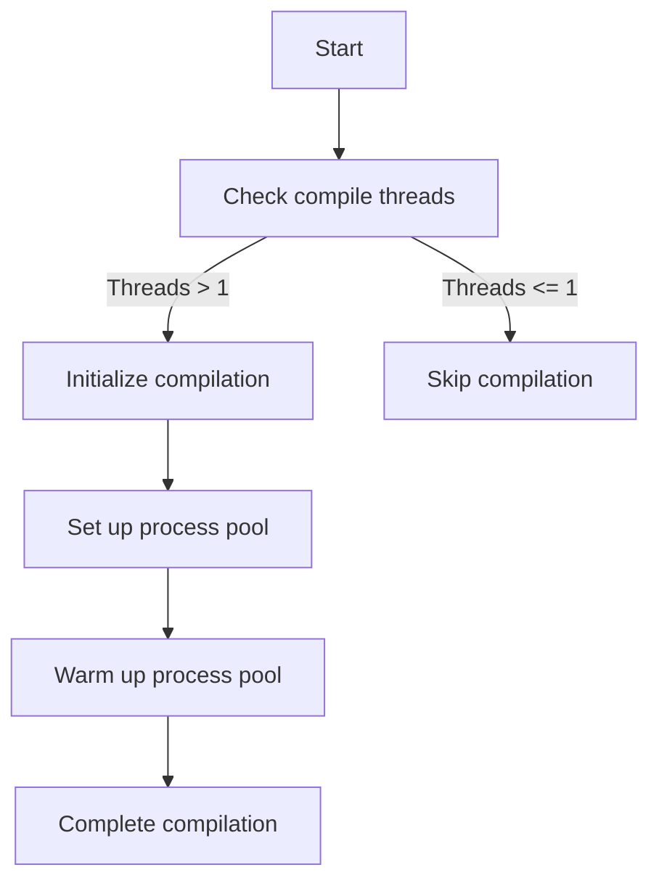

This document will cover the purpose and functionality of the warm_pool function, which includes:

1. Initializing the compilation process
2. Setting up a process pool
3. Ensuring efficient resource allocation for compilation tasks.

Technical document: <SwmLink doc-title="Purpose of the warm_pool Function">[Purpose of the warm_pool Function](/.swm/purpose-of-the-warm_pool-function.16lylpat.sw.md)</SwmLink>

# [Initializing the Compilation Process](https://app.swimm.io/repos/Z2l0aHViJTNBJTNBcHl0b3JjaC1hdXRvZG9jcy1kZW1vJTNBJTNBU3dpbW0tRGVtbw==/docs/16lylpat#warm_pool-function)

The warm_pool function is responsible for starting the compilation process. It first checks if the number of compile threads is greater than one. This is important because having multiple threads allows for parallel processing, which can significantly speed up the compilation process. If there are not enough threads, the function will skip the compilation process altogether.

# [Setting Up a Process Pool](https://app.swimm.io/repos/Z2l0aHViJTNBJTNBcHl0b3JjaC1hdXRvZG9jcy1kZW1vJTNBJTNBU3dpbW0tRGVtbw==/docs/16lylpat#process_pool-function)

Once the warm_pool function determines that there are enough compile threads, it sets up a process pool. A process pool is a collection of worker processes that can execute multiple tasks concurrently. This setup is crucial for managing multiple compilation tasks at the same time, thereby improving efficiency. The process pool is configured based on the number of compile threads and the worker start method specified in the configuration.

# [Ensuring Efficient Resource Allocation](https://app.swimm.io/repos/Z2l0aHViJTNBJTNBcHl0b3JjaC1hdXRvZG9jcy1kZW1vJTNBJTNBU3dpbW0tRGVtbw==/docs/16lylpat#warm_pool-function)

After setting up the process pool, the warm_pool function warms up the pool with the specified number of compile threads. Warming up the pool means preparing the worker processes to be ready for tasks, which reduces the time taken to start the actual compilation tasks. This step ensures that the necessary resources are allocated efficiently, making the overall compilation process faster and more reliable.

&nbsp;

*This is an auto-generated document by Swimm AI 🌊 and has not yet been verified by a human*

<SwmMeta version="3.0.0" repo-id="Z2l0aHViJTNBJTNBcHl0b3JjaC1hdXRvZG9jcy1kZW1vJTNBJTNBU3dpbW0tRGVtbw==" repo-name="pytorch-autodocs-demo">Powered by [Swimm](https://app.swimm.io/)</SwmMeta>
