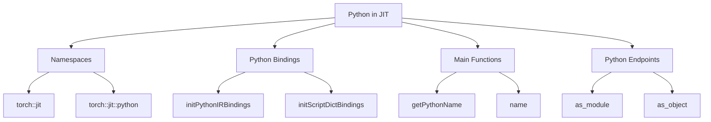

# Understanding Python in JIT

Python is used to define and manage operations within the JIT (Just-In-Time) compilation framework. This document will cover various aspects of Python's integration within the JIT framework, including namespaces, bindings, main functions, and endpoints.

## Namespaces

Namespaces such as `torch::jit` and `torch::jit::python` are used to organize Python-related functionalities and bindings within the JIT framework.

## Python Bindings

Python bindings are initialized using functions like `initPythonIRBindings` and `initScriptDictBindings` to integrate Python with the JIT compiler.

<SwmSnippet path="/torch/csrc/jit/python/init.cpp" line="2278">

---

The function `initJitScriptBindings` is used to initialize Python bindings within the JIT framework.

```c++
  initTreeViewBindings(module);
  initJitScriptBindings(module);
  initJitBackendBindings(module);
```

---

</SwmSnippet>

## Main Functions

There are several main functions related to Python operations. Some of them are `getPythonName`, `name`, `autogradFunction`, `cloneFrom`, and `lint_python`. We will dive a little into `getPythonName` and `name`.

### getPythonName

The `getPythonName` function retrieves the name of a Python object. It uses the `pybind11::gil_scoped_acquire` to ensure the Global Interpreter Lock (GIL) is held while accessing Python attributes. This function is useful for identifying Python objects within the JIT framework.

<SwmSnippet path="/torch/csrc/jit/python/python_ir.cpp" line="35">

---

The implementation of the `getPythonName` function.

```c++
std::string getPythonName(const PyObject* obj_) {
  pybind11::gil_scoped_acquire gil;
  // NOLINTNEXTLINE(cppcoreguidelines-pro-type-const-cast)
  PyObject* obj = const_cast<PyObject*>(obj_);
  auto v = py::getattr(obj, "__name__", py::str("<python_value>"));
  // if this was a autograd.Function recover the name of the class
  return py::str(v);
}
```

---

</SwmSnippet>

### name

The `name` method of the `ConcretePythonOp` class returns the name of the Python operation. It calls the `autogradFunction` method to check if the operation is an autograd function and retrieves its name using `getPythonName`. This method is essential for naming operations within the JIT framework.

<SwmSnippet path="/torch/csrc/jit/python/python_ir.cpp" line="109">

---

The implementation of the `name` method in the `ConcretePythonOp` class.

```c++
std::string ConcretePythonOp::name() const {
  pybind11::gil_scoped_acquire gil;
  if (auto autograd = autogradFunction()) {
    return getPythonName(autograd->get());
  } else {
    return getPythonName(pyobj.get());
  }
}
```

---

</SwmSnippet>

## Python Endpoints

Python endpoints in the JIT framework include functions like `as_module` and `as_object`.

### as_module

The `as_module` function attempts to cast a Python object to a JIT `Module`. It checks if the object is an instance of `ScriptModule` and, if so, returns the corresponding `Module`.

<SwmSnippet path="/torch/csrc/jit/python/module_python.h" line="11">

---

The implementation of the `as_module` function.

```c
inline std::optional<Module> as_module(py::handle obj) {
  static py::handle ScriptModule =
      py::module::import("torch.jit").attr("ScriptModule");
  if (py::isinstance(obj, ScriptModule)) {
    return py::cast<Module>(obj.attr("_c"));
  }
  return std::nullopt;
}
```

---

</SwmSnippet>

### as_object

The `as_object` function attempts to cast a Python object to a JIT `Object`. It checks if the object is an instance of `ScriptObject` or `RecursiveScriptClass` and, if so, returns the corresponding `Object`.

<SwmSnippet path="/torch/csrc/jit/python/module_python.h" line="20">

---

The implementation of the `as_object` function.

```c
inline std::optional<Object> as_object(py::handle obj) {
  static py::handle ScriptObject =
      py::module::import("torch").attr("ScriptObject");
  if (py::isinstance(obj, ScriptObject)) {
    return py::cast<Object>(obj);
  }

  static py::handle RecursiveScriptClass =
      py::module::import("torch.jit").attr("RecursiveScriptClass");
  if (py::isinstance(obj, RecursiveScriptClass)) {
    return py::cast<Object>(obj.attr("_c"));
  }
  return std::nullopt;
}
```

---

</SwmSnippet>

&nbsp;

*This is an auto-generated document by Swimm AI 🌊 and has not yet been verified by a human*

<SwmMeta version="3.0.0" repo-id="Z2l0aHViJTNBJTNBcHl0b3JjaC1hdXRvZG9jcy1kZW1vJTNBJTNBU3dpbW0tRGVtbw==" repo-name="pytorch-autodocs-demo"><sup>Powered by [Swimm](https://app.swimm.io/)</sup></SwmMeta>
