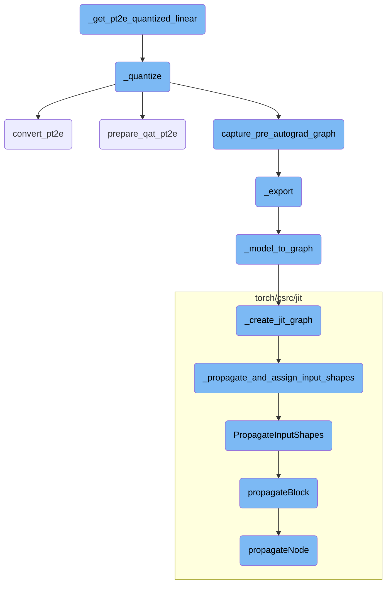
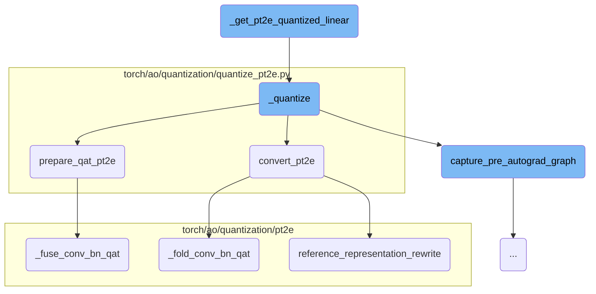
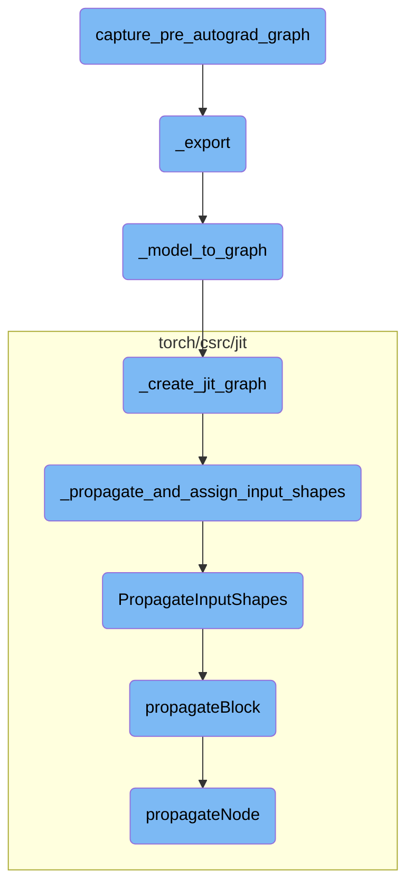

This document provides an overview of the quantization process for a simple linear model. It outlines the key steps involved in preparing the model for quantization, performing the quantization, and converting the model for efficient inference.

The quantization process for a linear model involves several key steps. First, a simple linear model is initialized and a quantizer is set up with a specific configuration. The model is then prepared for quantization-aware training or post-training quantization. After preparation, the model is converted into a quantized version, which is optimized for efficient inference on quantized hardware. This process ensures that the model can perform computations more efficiently while maintaining accuracy.

Here is a high level diagram of the flow, showing only the most important functions:



# Flow drill down

First, we'll zoom into this section of the flow:



<SwmSnippet path="/torch/testing/_internal/common_quantization.py" line="1327">

---

## \_get_pt2e_quantized_linear

The `_get_pt2e_quantized_linear` function initializes a simple linear model and prepares it for quantization. It sets up a quantizer with a symmetric quantization configuration and then calls the `_quantize` function to perform the quantization.

```python
    def _get_pt2e_quantized_linear(self, is_per_channel=False) -> torch.fx.GraphModule:
        class M(torch.nn.Module):
            def __init__(self) -> None:
                super().__init__()
                self.linear = torch.nn.Linear(2, 2)

            def forward(self, x):
                return self.linear(x)

        quantizer = XNNPACKQuantizer()
        operator_config = get_symmetric_quantization_config(is_per_channel=is_per_channel)
        quantizer.set_global(operator_config)
        example_inputs = (torch.randn(2, 2),)
        m = M().eval()
        return self._quantize(m, quantizer, example_inputs)
```

---

</SwmSnippet>

<SwmSnippet path="/torch/testing/_internal/common_quantization.py" line="1311">

---

## \_quantize

The `_quantize` function handles the core quantization process. It first captures the pre-autograd graph of the model and then prepares the model for quantization-aware training (QAT) or post-training quantization (PTQ) based on the `is_qat` flag. Finally, it converts the prepared model into a quantized model using the `convert_pt2e` function.

```python
    def _quantize(self, m, quantizer, example_inputs, is_qat: bool = False):
        # resetting dynamo cache
        torch._dynamo.reset()

        m = capture_pre_autograd_graph(
            m,
            example_inputs,
        )
        if is_qat:
            m = prepare_qat_pt2e(m, quantizer)
        else:
            m = prepare_pt2e(m, quantizer)
        m(*example_inputs)
        m = convert_pt2e(m)
        return m
```

---

</SwmSnippet>

<SwmSnippet path="/torch/ao/quantization/quantize_pt2e.py" line="199">

---

### convert_pt2e

The `convert_pt2e` function converts a calibrated or trained model into a quantized model. It optionally folds the quantize operations and rewrites the model to use a reference representation if specified. This function ensures that the model is ready for efficient inference on quantized hardware.

```python
def convert_pt2e(
    model: GraphModule,
    use_reference_representation: bool = False,
    fold_quantize: bool = True,
) -> GraphModule:
    """Convert a calibrated/trained model to a quantized model

    Args:
      * `model` (torch.fx.GraphModule): calibrated/trained model
      * `use_reference_representation` (bool): boolean flag to indicate whether to produce referece representation or not
      * `fold_quantize` (bool): boolean flag for whether fold the quantize op or not

    Returns:
        quantized model, either in q/dq representation or reference representation

    Example::

        # prepared_model: the model produced by `prepare_pt2e`/`prepare_qat_pt2e` and calibration/training
        # `convert_pt2e` produces a quantized model that represents quantized computation with
        # quantize dequantize ops and fp32 ops by default.
        # Please refer to
```

---

</SwmSnippet>

<SwmSnippet path="/torch/ao/quantization/quantize_pt2e.py" line="108">

---

### prepare_qat_pt2e

The `prepare_qat_pt2e` function prepares a model for quantization-aware training by adding fake quantization modules based on the quantizer's annotations. It also performs necessary transformations and validations to ensure the model is ready for QAT.

```python
def prepare_qat_pt2e(
    model: GraphModule,
    quantizer: Quantizer,
) -> GraphModule:
    """Prepare a model for quantization aware training

    Args:
      * `model` (torch.fx.GraphModule): see :func:`~torch.ao.quantization.quantize_pt2e.prepare_pt2e`
      * `quantizer`: see :func:`~torch.ao.quantization.quantize_pt2e.prepare_pt2e`

    Return:
      A GraphModule with fake quant modules (based on quantizer annotation), ready for
      quantization aware training

    Example::
        import torch
        from torch.ao.quantization.quantize_pt2e import prepare_qat_pt2e
        from torch._export import capture_pre_autograd_graph
        from torch.ao.quantization.quantizer import (
            XNNPACKQuantizer,
            get_symmetric_quantization_config,
```

---

</SwmSnippet>

<SwmSnippet path="/torch/ao/quantization/pt2e/qat_utils.py" line="619">

---

### \_fuse_conv_bn_qat

The `_fuse_conv_bn_qat` function fuses convolution and batch normalization layers in the model to optimize it for quantization-aware training. This fusion helps in reducing the computational overhead during inference.

```python
def _fuse_conv_bn_qat(m: GraphModule) -> GraphModule:
    has_bn = any(_is_bn_node(n) for n in m.graph.nodes)
    if not has_bn:
        return m
    is_cuda_options = [True, False] if torch.cuda.is_available() else [False]
    for is_cuda in is_cuda_options:
        m = _fuse_conv_bn_qat_helper(
            m, F.conv1d, _conv1d_bn_example_inputs, is_cuda=is_cuda
        )
        m = _fuse_conv_bn_qat_helper(
            m, F.conv2d, _conv2d_bn_example_inputs, is_cuda=is_cuda
        )
        m = _fuse_conv_bn_qat_helper(
            m, F.conv_transpose1d, _conv1d_bn_example_inputs, is_cuda=is_cuda
        )
        m = _fuse_conv_bn_qat_helper(
            m, F.conv_transpose2d, _conv2d_bn_example_inputs, is_cuda=is_cuda
        )
    return m
```

---

</SwmSnippet>

<SwmSnippet path="/torch/ao/quantization/pt2e/qat_utils.py" line="825">

---

### \_fold_conv_bn_qat

The `_fold_conv_bn_qat` function folds the batch normalization layers into the preceding convolution layers in a quantized model. This folding is essential for optimizing the model's performance during inference.

```python
def _fold_conv_bn_qat(m: GraphModule) -> GraphModule:
    has_bn = any(_is_bn_node(n) for n in m.graph.nodes)
    if not has_bn:
        return m
    is_cuda_options = [True, False] if torch.cuda.is_available() else [False]
    for is_cuda in is_cuda_options:
        m = _fold_conv_bn_qat_helper(
            m, F.conv1d, _quantized_conv1d_bn_example_inputs, is_cuda=is_cuda
        )
        m = _fold_conv_bn_qat_helper(
            m, F.conv2d, _quantized_conv2d_bn_example_inputs, is_cuda=is_cuda
        )
        m = _fold_conv_bn_qat_helper(
            m, F.conv_transpose1d, _quantized_conv1d_bn_example_inputs, is_cuda=is_cuda
        )
        m = _fold_conv_bn_qat_helper(
            m, F.conv_transpose2d, _quantized_conv2d_bn_example_inputs, is_cuda=is_cuda
        )

    # remove in place add from batchnorm tracking traning stats
    for node in m.graph.nodes:
```

---

</SwmSnippet>

<SwmSnippet path="/torch/ao/quantization/pt2e/representation/rewrite.py" line="808">

---

### reference_representation_rewrite

The `reference_representation_rewrite` function rewrites the model to use a reference representation for quantized operations. This step is crucial for ensuring that the model's quantized computations are accurately represented and optimized.

```python
def reference_representation_rewrite(model: GraphModule) -> GraphModule:
    remove_tensor_overload_for_qdq_ops(model)
    for rewrite_info in _REWRITE_INFO_LIST:
        example_inputs = rewrite_info.example_inputs
        pattern = rewrite_info.pattern
        replacement = rewrite_info.replacement
        pattern_post_trans = rewrite_info.pattern_post_trans
        replacement_post_trans = rewrite_info.replacement_post_trans
        pattern = _get_aten_graph_module_for_pattern(pattern, example_inputs)  # type: ignore[arg-type, assignment]
        remove_tensor_overload_for_qdq_ops(pattern)  # type: ignore[arg-type]
        replacement = _get_aten_graph_module_for_pattern(replacement, example_inputs)  # type: ignore[arg-type, assignment]
        remove_tensor_overload_for_qdq_ops(replacement)  # type: ignore[arg-type]
        if pattern_post_trans:
            pattern = pattern_post_trans(pattern)
        if replacement_post_trans:
            replacement = replacement_post_trans(replacement)
        pattern.recompile()  # type: ignore[attr-defined]
        replacement.recompile()  # type: ignore[attr-defined]
        matches = replace_pattern(model, pattern, replacement)
    return model
```

---

</SwmSnippet>

Now, lets zoom into this section of the flow:



<SwmSnippet path="/torch/_export/__init__.py" line="72">

---

## capture_pre_autograd_graph

The function `capture_pre_autograd_graph` is responsible for capturing the computational graph before the autograd (automatic differentiation) process begins. This is crucial for scenarios where the graph needs to be analyzed or transformed before gradients are computed. By capturing the graph at this stage, it allows for optimizations and modifications that can enhance performance or adapt the model for specific deployment environments.

```python
def capture_pre_autograd_graph(
    f: torch.nn.Module,
    args: Tuple[Any],
    kwargs: Optional[Dict[str, Any]] = None,
    dynamic_shapes: Optional[Union[Dict[str, Any], Tuple[Any]]] = None,
) -> torch.nn.Module:
    """
    A helper function that is intended to trace a module before any pre-autograd
    decomposition is run. The produced module will be "non-functional" and
    composed of aten operators. Later this API will be deleted in favor of more general
    torch.export API.

    Args:
      f: nn.Module to be traced

      args: example positional inputs.

      kwargs: optional example keyword inputs.

      dynamic_shapes: Should either be:
         1) a dict from argument names of ``f`` to their dynamic shape specifications,
```

---

</SwmSnippet>

<SwmSnippet path="/torch/onnx/utils.py" line="1515">

---

## \_export

The `_export` function is used to export a PyTorch model to the ONNX (Open Neural Network Exchange) format. This function handles various aspects of the export process, including setting up the model for tracing, optimizing the computational graph, and handling different export configurations. It ensures that the model is correctly converted to the ONNX format, which can then be used for inference in different environments.

```python
def _export(
    model,
    args,
    f,
    export_params=True,
    verbose=False,
    training=_C_onnx.TrainingMode.EVAL,
    input_names=None,
    output_names=None,
    operator_export_type=_C_onnx.OperatorExportTypes.ONNX,
    export_type=None,
    opset_version=None,
    do_constant_folding=True,
    dynamic_axes=None,
    keep_initializers_as_inputs=None,
    fixed_batch_size=False,
    custom_opsets=None,
    add_node_names=True,
    onnx_shape_inference=True,
    export_modules_as_functions=False,
    autograd_inlining=True,
```

---

</SwmSnippet>

<SwmSnippet path="/torch/onnx/utils.py" line="1130">

---

## \_model_to_graph

The `_model_to_graph` function converts a PyTorch model into an ONNX graph. It performs several steps such as tracing the model, optimizing the graph, and assigning input and output shapes. This function is essential for preparing the model for export by ensuring that the computational graph is in the correct format and optimized for performance.

```python
def _model_to_graph(
    model,
    args,
    verbose=False,
    input_names=None,
    output_names=None,
    operator_export_type=_C_onnx.OperatorExportTypes.ONNX,
    do_constant_folding=True,
    _disable_torch_constant_prop=False,
    fixed_batch_size=False,
    training=_C_onnx.TrainingMode.EVAL,
    dynamic_axes=None,
) -> tuple[
    _C.Graph,
    dict[str, torch.Tensor],
    torch.Tensor
    | tuple[torch.Tensor, ...]
    | list[torch.Tensor]
    | dict[str, torch.Tensor]
    | Any
    | None,
```

---

</SwmSnippet>

<SwmSnippet path="/torch/onnx/utils.py" line="1015">

---

## \_create_jit_graph

The `_create_jit_graph` function creates a JIT (Just-In-Time) graph from a PyTorch model. This involves tracing the model's forward pass to generate a computational graph that can be further optimized and exported. The function handles both ScriptModules and traced modules, ensuring that the resulting graph is suitable for further processing and export.

```python
def _create_jit_graph(
    model: torch.nn.Module | torch.jit.ScriptFunction, args: Sequence[Any]
) -> tuple[_C.Graph, list[_C.IValue], Any | None, _C.ScriptModule | None]:
    if isinstance(model, (torch.jit.ScriptFunction, torch.jit.ScriptModule)):
        flattened_args = tuple(torch.jit._flatten(tuple(args))[0])
        _check_flatten_did_not_remove(args, flattened_args)
        torch_out = None

        if isinstance(model, torch.jit.ScriptModule):
            try:
                graph = model.forward.graph  # type: ignore[attr-defined]
            except AttributeError as e:
                raise RuntimeError("'forward' method must be a script method") from e
            _C._jit_pass_onnx_function_substitution(graph)
            freezed_module = _C._freeze_module(
                cast(_C.ScriptModule, model._c), preserveParameters=True
            )
            module, params = _C._jit_onnx_list_model_parameters(freezed_module)
            method_graph = module._get_method("forward").graph
            args_params = tuple(args) + tuple(params)
            param_count_list = _get_param_count_list(method_graph, args_params)
```

---

</SwmSnippet>

<SwmSnippet path="/torch/csrc/jit/python/script_init.cpp" line="461">

---

## \_propagate_and_assign_input_shapes

The `_propagate_and_assign_input_shapes` function propagates and assigns input shapes within a computational graph. This step is crucial for ensuring that all tensor shapes are correctly inferred and assigned, which is necessary for subsequent graph optimizations and transformations. By propagating shapes, the function helps maintain the integrity and correctness of the computational graph.

```c++
static std::shared_ptr<Graph> _propagate_and_assign_input_shapes(
    Graph& graph,
    const std::vector<at::Tensor>& inputs,
    const std::vector<int>& param_count_list,
    bool with_grad = false,
    bool propagate = true) {
  auto retval = graph.copy();
  setInputTensorTypes(
      *retval, fmap<IValue>(inputs), /*complete=*/true, param_count_list);
  if (propagate) {
    PropagateInputShapes(retval);
  }
  return retval;
}
```

---

</SwmSnippet>

<SwmSnippet path="/torch/csrc/jit/passes/shape_analysis.cpp" line="2147">

---

## PropagateInputShapes

The `PropagateInputShapes` function is responsible for propagating input shapes throughout the computational graph. It uses a shape propagator to traverse the graph and assign shapes to all tensors. This step ensures that the graph has complete shape information, which is essential for optimization and execution.

```c++
void PropagateInputShapes(const std::shared_ptr<Graph>& graph) {
  ShapePropagator(graph).propagateBlock(graph->block());
}
```

---

</SwmSnippet>

<SwmSnippet path="/torch/csrc/jit/passes/shape_analysis.cpp" line="59">

---

## propagateBlock

The `propagateBlock` function propagates shapes within a block of nodes in the computational graph. It iterates over each node in the block and applies shape propagation logic. This function is part of the shape analysis process, ensuring that all nodes within a block have the correct shape information.

```c++
void PropertyPropBase::propagateBlock(Block* block, bool insert_expands) {
  for (Node* node : block->nodes()) {
    try {
      propagateNode(node, insert_expands);
    } catch (propagation_error& e) {
      setUnshapedType(node);
    } catch (std::exception& e) {
      throw(
          ErrorReport(node->sourceRange())
          << ExceptionMessage(e)
          << "\nThe above operation failed shape propagation in this context");
    }
  }
}
```

---

</SwmSnippet>

<SwmSnippet path="/torch/csrc/jit/passes/shape_analysis.cpp" line="586">

---

## propagateNode

The `propagateNode` function propagates shapes for a single node in the computational graph. It handles various types of nodes and applies the appropriate shape propagation logic. This function is essential for ensuring that each node in the graph has the correct shape information, which is necessary for accurate execution and optimization.

```c++
  void propagateNode(Node* node, bool insert_expands = true) override {
    // Certain ops like resize_ change the input tensors size. Because our
    // analysis is flow invariant, we set any Tensor that can alias a resized
    // Tensor to the base Tensor Type without size information.
    if (setUnshapedTypeIfAliasResizedSet(node->inputs())) {
      return setUnshapedType(node);
    }

    // These don't require the types, and have complicated schema. Return early
    // after we process them.
    switch (node->kind()) {
      case prim::If:
        return processIf(node);
      case prim::Loop: {
        return processLoop(node);
      }
      case aten::Bool:
      case aten::Int:
      case aten::Float:
      case aten::ScalarImplicit:
      case aten::FloatImplicit:
```

---

</SwmSnippet>

&nbsp;

*This is an auto-generated document by Swimm AI 🌊 and has not yet been verified by a human*

<SwmMeta version="3.0.0" repo-id="Z2l0aHViJTNBJTNBcHl0b3JjaC1hdXRvZG9jcy1kZW1vJTNBJTNBU3dpbW0tRGVtbw==" repo-name="pytorch-autodocs-demo"><sup>Powered by [Swimm](https://app.swimm.io/)</sup></SwmMeta>
