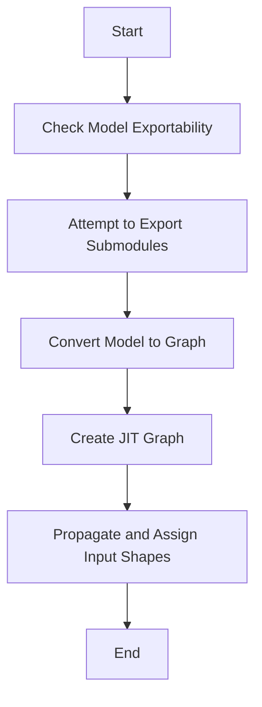

This document will cover the process of reporting the exportability of a PyTorch model. We'll cover:

1. Checking model exportability
2. Attempting to export submodules
3. Converting the model to a graph
4. Creating a JIT graph
5. Propagating and assigning input shapes

Technical document: <SwmLink doc-title="Reporting Model Exportability">[Reporting Model Exportability](/.swm/reporting-model-exportability.utn1smep.sw.md)</SwmLink>

# [Checking Model Exportability](https://app.swimm.io/repos/Z2l0aHViJTNBJTNBcHl0b3JjaC1hdXRvZG9jcy1kZW1vJTNBJTNBU3dpbW0tRGVtbw==/docs/utn1smep#report_exportability)

The process begins with checking if a PyTorch model can be exported without issues. This involves iterating through all submodules of the given model and attempting to export each one. If an export attempt fails, the error is recorded. This step helps in identifying any issues that might prevent the model from being exported successfully.

# [Attempting to Export Submodules](https://app.swimm.io/repos/Z2l0aHViJTNBJTNBcHl0b3JjaC1hdXRvZG9jcy1kZW1vJTNBJTNBU3dpbW0tRGVtbw==/docs/utn1smep#try_export)

In this step, each submodule of the model is individually tested for exportability. The system attempts to export the submodule and logs a success message if it succeeds. If it fails, the error is caught, logged, and added to the report. This ensures that any issues with specific submodules are identified and documented.

# [Converting the Model to a Graph](https://app.swimm.io/repos/Z2l0aHViJTNBJTNBcHl0b3JjaC1hdXRvZG9jcy1kZW1vJTNBJTNBU3dpbW0tRGVtbw==/docs/utn1smep#_model_to_graph)

This step involves converting the PyTorch model into an ONNX graph. The process includes various preprocessing steps such as flattening inputs, optimizing the graph, and assigning input and output names. The resulting graph, along with a dictionary of parameters and the traced output tensors, is then used for further processing.

# [Creating a JIT Graph](https://app.swimm.io/repos/Z2l0aHViJTNBJTNBcHl0b3JjaC1hdXRvZG9jcy1kZW1vJTNBJTNBU3dpbW0tRGVtbw==/docs/utn1smep#_create_jit_graph)

In this step, a JIT graph is created from the given model and input arguments. The system handles both `ScriptModule` and `ScriptFunction` types, performing necessary substitutions and shape propagation. The resulting graph, a list of parameters, the traced output, and the module are then used for further processing.

# [Propagating and Assigning Input Shapes](https://app.swimm.io/repos/Z2l0aHViJTNBJTNBcHl0b3JjaC1hdXRvZG9jcy1kZW1vJTNBJTNBU3dpbW0tRGVtbw==/docs/utn1smep#_propagate_and_assign_input_shapes)

The final step involves propagating and assigning input shapes through the graph. The system copies the given graph and sets the input tensor types. If the `propagate` flag is true, it calls the `PropagateInputShapes` function to propagate the shapes through the graph. This ensures that the input shapes are correctly assigned and propagated, which is crucial for successful model export.

&nbsp;

*This is an auto-generated document by Swimm AI 🌊 and has not yet been verified by a human*

<SwmMeta version="3.0.0" repo-id="Z2l0aHViJTNBJTNBcHl0b3JjaC1hdXRvZG9jcy1kZW1vJTNBJTNBU3dpbW0tRGVtbw==" repo-name="pytorch-autodocs-demo">Powered by [Swimm](https://app.swimm.io/)</SwmMeta>
