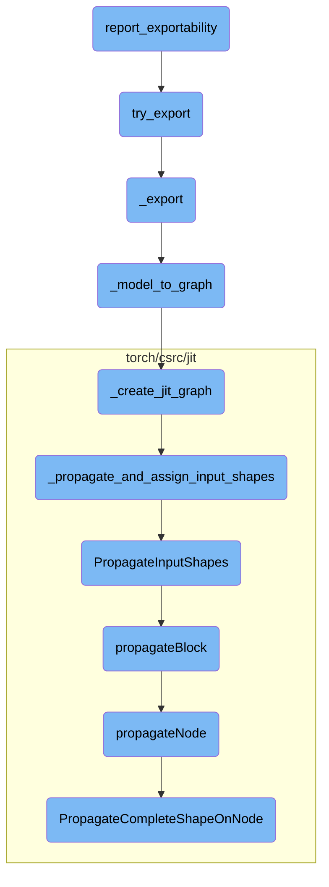

This document explains the process of reporting the exportability of a PyTorch model. The process involves iterating through all submodules of the given model, attempting to export each one, and logging any exceptions that occur. The document also covers the steps involved in converting a model to a graph, creating a JIT graph, and propagating input shapes through the graph.

The flow starts with the `report_exportability` function, which checks if a PyTorch model can be exported without issues. It tries to export each part of the model and logs any problems. If an export attempt fails, it records the error. The process includes converting the model to a graph, creating a JIT graph, and ensuring that input shapes are correctly propagated through the graph. This helps in identifying any issues that might prevent the model from being exported successfully.

# Flow drill down



<SwmSnippet path="/torch/_export/tools.py" line="61">

---

## Exporting the Model

The `report_exportability` function is responsible for reporting any issues that may arise when exporting a PyTorch model. It iterates through all submodules of the given model and attempts to export each one using the `try_export` function. If an exception occurs during the export, it logs the exception and associates it with the submodule name in the report.

```python
def report_exportability(
    mod: torch.nn.Module,
    args: Tuple[Any, ...],
    kwargs: Optional[Dict[str, Any]] = None,
    *,
    strict: bool = True,
    pre_dispatch: bool = False,
) -> Dict[str, Optional[Exception]]:
    """
    Report exportability issues for a module in one-shot.

    Args:
        mod: root module.
        args: args to the root module.
        kwargs: kwargs to the root module.
    Returns:
        A dict that maps from submodule name to the exception that was raised when trying to export it.
        `None` means the module is exportable without issue.
    Sample output:
        {
            '': UnsupportedOperatorException(func=<OpOverload(op='testlib.op_missing_meta', overload='default')>),
```

---

</SwmSnippet>

<SwmSnippet path="/torch/_export/tools.py" line="96">

---

### Attempting to Export Submodules

The `try_export` function attempts to export a given module using the `_export` function. If the export is successful, it logs a success message; otherwise, it catches the exception, logs a warning, and adds the exception to the report. It then recursively attempts to export all child modules.

```python
    def try_export(module, module_name, args, kwargs):
        nonlocal submod_inputs, report, strict, pre_dispatch

        if args is not None or kwargs is not None:
            try:
                torch.export._trace._export(
                    module,
                    args,
                    kwargs,
                    strict=strict,
                    pre_dispatch=pre_dispatch,
                )
                report[module_name] = None
                log.info("Successfully exported `%s`", module_name)
                return
            except Exception as e:
                short_msg = repr(e).split("\n")[0]
                log.warning(
                    "Failed exporting `%s` with exception: %s", module_name, short_msg
                )
                report[module_name] = e
```

---

</SwmSnippet>

<SwmSnippet path="/torch/onnx/utils.py" line="1130">

---

## Converting Model to Graph

The `_model_to_graph` function converts a PyTorch model into an ONNX graph. It handles various preprocessing steps, such as flattening inputs, optimizing the graph, and assigning input and output names. The function returns the graph, a dictionary of parameters, and the traced output tensors.

```python
def _model_to_graph(
    model,
    args,
    verbose=False,
    input_names=None,
    output_names=None,
    operator_export_type=_C_onnx.OperatorExportTypes.ONNX,
    do_constant_folding=True,
    _disable_torch_constant_prop=False,
    fixed_batch_size=False,
    training=_C_onnx.TrainingMode.EVAL,
    dynamic_axes=None,
) -> tuple[
    _C.Graph,
    dict[str, torch.Tensor],
    torch.Tensor
    | tuple[torch.Tensor, ...]
    | list[torch.Tensor]
    | dict[str, torch.Tensor]
    | Any
    | None,
```

---

</SwmSnippet>

<SwmSnippet path="/torch/onnx/utils.py" line="1015">

---

### Creating JIT Graph

The `_create_jit_graph` function creates a JIT graph from the given model and input arguments. It handles both `ScriptModule` and `ScriptFunction` types, performing necessary substitutions and shape propagation. The function returns the graph, a list of parameters, the traced output, and the module.

```python
def _create_jit_graph(
    model: torch.nn.Module | torch.jit.ScriptFunction, args: Sequence[Any]
) -> tuple[_C.Graph, list[_C.IValue], Any | None, _C.ScriptModule | None]:
    if isinstance(model, (torch.jit.ScriptFunction, torch.jit.ScriptModule)):
        flattened_args = tuple(torch.jit._flatten(tuple(args))[0])
        _check_flatten_did_not_remove(args, flattened_args)
        torch_out = None

        if isinstance(model, torch.jit.ScriptModule):
            try:
                graph = model.forward.graph  # type: ignore[attr-defined]
            except AttributeError as e:
                raise RuntimeError("'forward' method must be a script method") from e
            _C._jit_pass_onnx_function_substitution(graph)
            freezed_module = _C._freeze_module(
                cast(_C.ScriptModule, model._c), preserveParameters=True
            )
            module, params = _C._jit_onnx_list_model_parameters(freezed_module)
            method_graph = module._get_method("forward").graph
            args_params = tuple(args) + tuple(params)
            param_count_list = _get_param_count_list(method_graph, args_params)
```

---

</SwmSnippet>

<SwmSnippet path="/torch/csrc/jit/python/script_init.cpp" line="461">

---

## Propagating and Assigning Input Shapes

The `_propagate_and_assign_input_shapes` function copies the given graph and sets the input tensor types. If the `propagate` flag is true, it calls the `PropagateInputShapes` function to propagate the shapes through the graph.

```c++
static std::shared_ptr<Graph> _propagate_and_assign_input_shapes(
    Graph& graph,
    const std::vector<at::Tensor>& inputs,
    const std::vector<int>& param_count_list,
    bool with_grad = false,
    bool propagate = true) {
  auto retval = graph.copy();
  setInputTensorTypes(
      *retval, fmap<IValue>(inputs), /*complete=*/true, param_count_list);
  if (propagate) {
    PropagateInputShapes(retval);
  }
  return retval;
```

---

</SwmSnippet>

<SwmSnippet path="/torch/csrc/jit/passes/shape_analysis.cpp" line="2147">

---

### Propagating Input Shapes

The `PropagateInputShapes` function uses the `ShapePropagator` class to propagate input shapes through the graph's blocks.

```c++
void PropagateInputShapes(const std::shared_ptr<Graph>& graph) {
  ShapePropagator(graph).propagateBlock(graph->block());
}
```

---

</SwmSnippet>

<SwmSnippet path="/torch/csrc/jit/passes/shape_analysis.cpp" line="59">

---

### Propagating Shapes in a Block

The `propagateBlock` method iterates over all nodes in a block and calls the `propagateNode` method for each node. If an error occurs during propagation, it sets the node's type to unshaped.

```c++
void PropertyPropBase::propagateBlock(Block* block, bool insert_expands) {
  for (Node* node : block->nodes()) {
    try {
      propagateNode(node, insert_expands);
    } catch (propagation_error& e) {
      setUnshapedType(node);
    } catch (std::exception& e) {
      throw(
          ErrorReport(node->sourceRange())
          << ExceptionMessage(e)
          << "\nThe above operation failed shape propagation in this context");
    }
  }
}
```

---

</SwmSnippet>

<SwmSnippet path="/torch/csrc/jit/passes/shape_analysis.cpp" line="586">

---

### Propagating Shapes in a Node

The `propagateNode` method handles shape propagation for individual nodes. It processes various node types, such as `If`, `Loop`, and tensor operations, and sets the output types accordingly. If the node's shape cannot be determined, it sets the node's type to unshaped.

```c++
  void propagateNode(Node* node, bool insert_expands = true) override {
    // Certain ops like resize_ change the input tensors size. Because our
    // analysis is flow invariant, we set any Tensor that can alias a resized
    // Tensor to the base Tensor Type without size information.
    if (setUnshapedTypeIfAliasResizedSet(node->inputs())) {
      return setUnshapedType(node);
    }

    // These don't require the types, and have complicated schema. Return early
    // after we process them.
    switch (node->kind()) {
      case prim::If:
        return processIf(node);
      case prim::Loop: {
        return processLoop(node);
      }
      case aten::Bool:
      case aten::Int:
      case aten::Float:
      case aten::ScalarImplicit:
      case aten::FloatImplicit:
```

---

</SwmSnippet>

<SwmSnippet path="/torch/csrc/jit/passes/shape_analysis.cpp" line="1872">

---

### Propagating Complete Shape on Node

The `PropagateCompleteShapeOnNode` function handles shape propagation for specific operations, such as `add`, `sub`, `mul`, and `div`. It either directly encodes the shape propagation logic or runs a fake version of the operation to determine the shape.

```c++
  bool PropagateCompleteShapeOnNode(
      Node* node,
      bool insert_expands,
      std::vector<TensorTypePtr> tensor_types) {
    // For expensive ops we can directly encode their shape propagation
    // here, otherwise we fallback to running a fake version of the op
    // to get a quick and dirty propagation.
    if (node->matches(
            "aten::add(Tensor self, Tensor other, *, Scalar alpha) -> Tensor") ||
        node->matches(
            "aten::sub(Tensor self, Tensor other, *, Scalar alpha) -> Tensor") ||
        node->matches("aten::mul(Tensor self, Tensor other) -> Tensor")) {
      // These nodes handle tensors of different shapes internally, so there's
      // no need to insert explicit expand nodes.
      return PropagateShapeOnNodeByRunningIt(node);
    } else if (node->matches(
                   "aten::div(Tensor self, Tensor other) -> Tensor")) {
      // "div" handle tensors of different shapes internally, so there's no need
      // to insert explicit expand nodes.
      // Note that this function could be merged to the one above , but "div" is
      // not always safe to run by itself due to integer divide-by-zero.
```

---

</SwmSnippet>

&nbsp;

*This is an auto-generated document by Swimm AI 🌊 and has not yet been verified by a human*

<SwmMeta version="3.0.0" repo-id="Z2l0aHViJTNBJTNBcHl0b3JjaC1hdXRvZG9jcy1kZW1vJTNBJTNBU3dpbW0tRGVtbw==" repo-name="pytorch-autodocs-demo"><sup>Powered by [Swimm](https://app.swimm.io/)</sup></SwmMeta>
