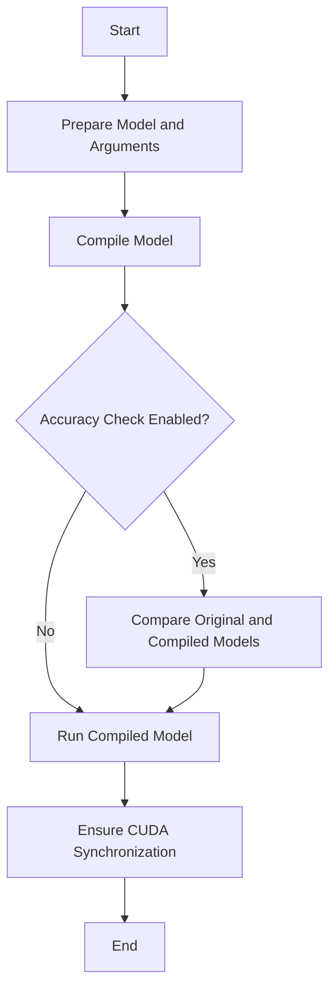

This document will cover the Repro Run Flow, which includes:

1. Preparing the model and arguments
2. Compiling the model
3. Checking for accuracy
4. Running the compiled model
5. Ensuring synchronization of CUDA operations

Technical document: <SwmLink doc-title="Repro Run Flow">[Repro Run Flow](/.swm/repro-run-flow.cn3as6gr.sw.md)</SwmLink>

# [Preparing the Model and Arguments](https://app.swimm.io/repos/Z2l0aHViJTNBJTNBcHl0b3JjaC1hdXRvZG9jcy1kZW1vJTNBJTNBU3dpbW0tRGVtbw==/docs/cn3as6gr#repro_common-function)

The first step in the Repro Run Flow is to prepare the model and its arguments. This involves ensuring that the model has no parameters and handling model buffers. The model is then converted into a GraphModule, which is a representation of the model that can be further processed. This step is crucial for setting up the model in a way that it can be accurately compiled and run in subsequent steps.

# [Compiling the Model](https://app.swimm.io/repos/Z2l0aHViJTNBJTNBcHl0b3JjaC1hdXRvZG9jcy1kZW1vJTNBJTNBU3dpbW0tRGVtbw==/docs/cn3as6gr#compile_fx_inner)

Once the model and arguments are prepared, the next step is to compile the model. This involves setting up the necessary context and environment for the compilation process. Various modes and configurations are applied to ensure that the model is compiled correctly. This step transforms the model into a form that can be executed efficiently.

# [Checking for Accuracy](https://app.swimm.io/repos/Z2l0aHViJTNBJTNBcHl0b3JjaC1hdXRvZG9jcy1kZW1vJTNBJTNBU3dpbW0tRGVtbw==/docs/cn3as6gr#accuracy-check-for-inductor)

If accuracy checking is enabled, the original and compiled models are compared to ensure they produce similar results. This involves running both models with the same inputs and comparing their outputs. If the outputs are not sufficiently similar, an accuracy error is raised. This step is important for verifying that the compilation process has not introduced any errors.

# [Running the Compiled Model](https://app.swimm.io/repos/Z2l0aHViJTNBJTNBcHl0b3JjaC1hdXRvZG9jcy1kZW1vJTNBJTNBU3dpbW0tRGVtbw==/docs/cn3as6gr#handling-compiled-function-invocation)

After the model is compiled and accuracy is checked, the compiled model is run with the prepared arguments. This step executes the model and produces the final output. It is essential for verifying that the compiled model behaves as expected when run with real data.

# [Ensuring Synchronization of CUDA Operations](https://app.swimm.io/repos/Z2l0aHViJTNBJTNBcHl0b3JjaC1hdXRvZG9jcy1kZW1vJTNBJTNBU3dpbW0tRGVtbw==/docs/cn3as6gr#handling-compiled-function-invocation)

The final step in the Repro Run Flow is to ensure that any CUDA operations are synchronized. This involves making sure that all GPU operations are completed before the process finishes. This step is crucial for ensuring the correctness and reliability of the model's execution, especially when using GPU acceleration.

&nbsp;

*This is an auto-generated document by Swimm AI 🌊 and has not yet been verified by a human*

<SwmMeta version="3.0.0" repo-id="Z2l0aHViJTNBJTNBcHl0b3JjaC1hdXRvZG9jcy1kZW1vJTNBJTNBU3dpbW0tRGVtbw==" repo-name="pytorch-autodocs-demo">Powered by [Swimm](https://app.swimm.io/)</SwmMeta>
