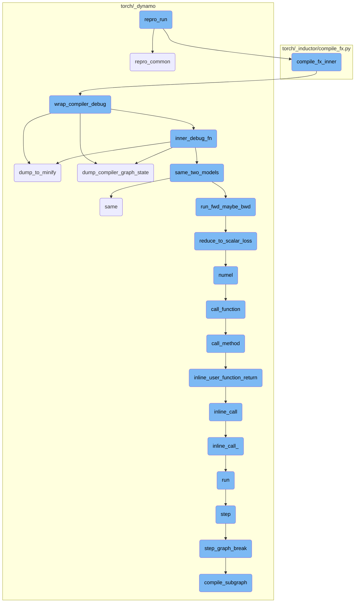
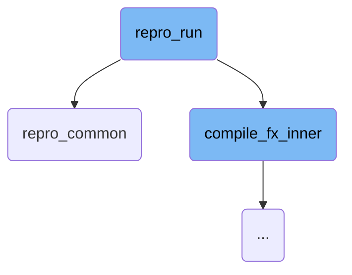
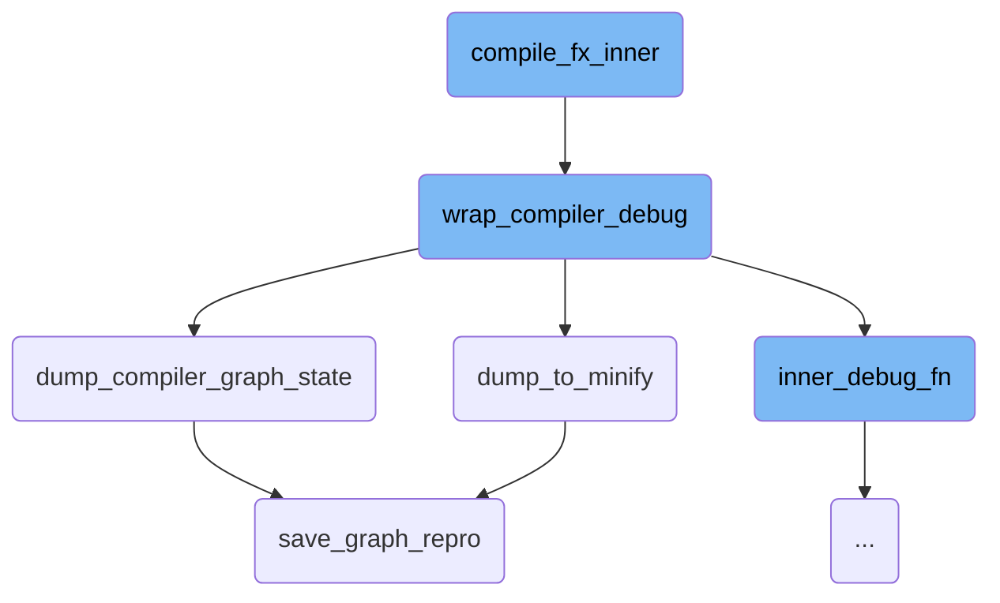
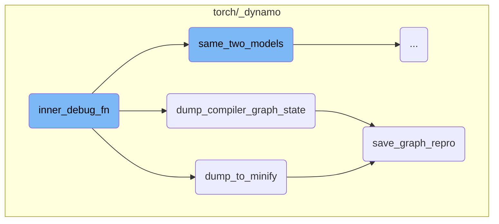
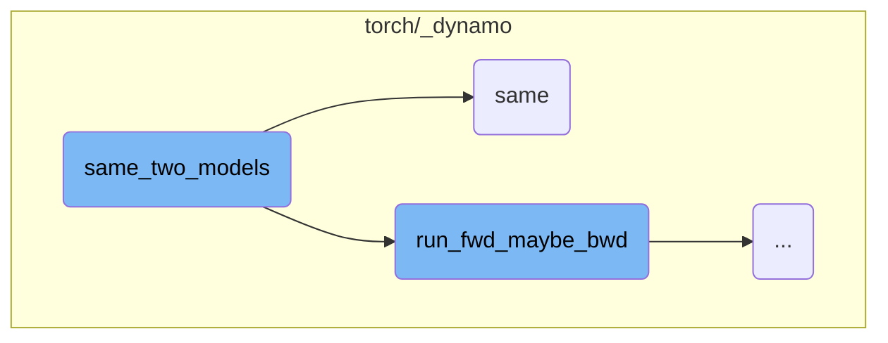

```mermaid
graph TD;
      subgraph torchdynamo["torch/_dynamo"]
45d3914ff219ac59d8791edb23592ffcf2198e42f21e9d2fa8d458122697dfbf(run_fwd_maybe_bwd):::mainFlowStyle --> b849fa0d966995c95bcc0dd289d11300f269a476fb0a889509ae0149e18ed3ef(reduce_to_scalar_loss):::mainFlowStyle
end

subgraph torchdynamo["torch/_dynamo"]
b849fa0d966995c95bcc0dd289d11300f269a476fb0a889509ae0149e18ed3ef(reduce_to_scalar_loss):::mainFlowStyle --> 155e3cc2d5c50ff89e280b9cdc1c9ae4e009632d190253b8d3364f817aed44c4(numel):::mainFlowStyle
end

subgraph torchdynamo["torch/_dynamo"]
155e3cc2d5c50ff89e280b9cdc1c9ae4e009632d190253b8d3364f817aed44c4(numel):::mainFlowStyle --> 0fe776e548d42ed0d2169b9051562848ccfee29509461e7e993ce542426370a7(call_function):::mainFlowStyle
end

subgraph torchdynamo["torch/_dynamo"]
0fe776e548d42ed0d2169b9051562848ccfee29509461e7e993ce542426370a7(call_function):::mainFlowStyle --> fde83ab941c6a2749f130ece53e7f65af2928d91723a63a01273d4e430a433bb(call_method):::mainFlowStyle
end

subgraph torchdynamo["torch/_dynamo"]
fde83ab941c6a2749f130ece53e7f65af2928d91723a63a01273d4e430a433bb(call_method):::mainFlowStyle --> 458008e74f18ebce47c64da5a4233a63dc2fd42ac18b14ae3f3aaea47313241b(inline_user_function_return):::mainFlowStyle
end

subgraph torchdynamo["torch/_dynamo"]
458008e74f18ebce47c64da5a4233a63dc2fd42ac18b14ae3f3aaea47313241b(inline_user_function_return):::mainFlowStyle --> fcd883700fffa007b56c5d346195884dc971b221f81f7154a62efec44b035ea5(inline_call):::mainFlowStyle
end

subgraph torchdynamo["torch/_dynamo"]
fcd883700fffa007b56c5d346195884dc971b221f81f7154a62efec44b035ea5(inline_call):::mainFlowStyle --> 15971f1e27fd627308a99bae241ac3eb113c6830b15353374d03323c5a30959c(inline_call_):::mainFlowStyle
end

subgraph torchdynamo["torch/_dynamo"]
15971f1e27fd627308a99bae241ac3eb113c6830b15353374d03323c5a30959c(inline_call_):::mainFlowStyle --> edf27ab967b775dcd6f62cb8a0fb2a87177da9406db5a99aad72cc627af839ac(run):::mainFlowStyle
end

subgraph torchdynamo["torch/_dynamo"]
edf27ab967b775dcd6f62cb8a0fb2a87177da9406db5a99aad72cc627af839ac(run):::mainFlowStyle --> 99e91bca7ea856f56e3f34579d72219ce35debd0d03d0aee37dedaffe5ac2a22(step):::mainFlowStyle
end

subgraph torchdynamo["torch/_dynamo"]
99e91bca7ea856f56e3f34579d72219ce35debd0d03d0aee37dedaffe5ac2a22(step):::mainFlowStyle --> a8cb423a5d16e220218eb2e3c35a54f64a0aaab6b5233dd0b33a8dae3657ca81(step_graph_break):::mainFlowStyle
end

subgraph torchdynamo["torch/_dynamo"]
a8cb423a5d16e220218eb2e3c35a54f64a0aaab6b5233dd0b33a8dae3657ca81(step_graph_break):::mainFlowStyle --> 2ba345a88495baf48df3654780e05d6be290f7d7a9d8f157cc7acee764a6ff02(compile_subgraph):::mainFlowStyle
end


      classDef mainFlowStyle color:#000000,fill:#7CB9F4
classDef rootsStyle color:#000000,fill:#00FFF4
classDef Style1 color:#000000,fill:#00FFAA
classDef Style2 color:#000000,fill:#FFFF00
classDef Style3 color:#000000,fill:#AA7CB9
```

This document explains the `repro_run` function, which orchestrates the main flow of a repro script. It prepares the model and arguments, compiles the model, checks for accuracy, and ensures synchronization of CUDA operations.

The `repro_run` function starts by preparing the model and its arguments. It then compiles the model and, if accuracy checking is enabled, compares the original and compiled models. Finally, it runs the compiled model and ensures that any CUDA operations are synchronized. This process helps in debugging and verifying the behavior of the model.

Here is a high level diagram of the flow, showing only the most important functions:



# Flow drill down

First, we'll zoom into this section of the flow:



<SwmSnippet path="/torch/_dynamo/repro/after_aot.py" line="710">

---

## repro_run Function

The `repro_run` function orchestrates the main flow of the repro script. It first calls `repro_common` to prepare the model and arguments, then compiles the model using `compile_fx_inner`. If accuracy checking is enabled, it compares the original and compiled models using `same_two_models`. Finally, it runs the compiled model and ensures any CUDA operations are synchronized.

```python
def repro_run(options, mod, load_args):
    from torch._inductor.compile_fx import compile_fx_inner

    mod, args = repro_common(options, mod, load_args)

    from torch.cuda import synchronize

    compiled = compile_fx_inner(mod, args)

    if options.accuracy != "":
        # We don't really respect --accuracy vs --strict-accuracy here, it
        # seems counterintuitive
        if not same_two_models(
            mod,
            compiled,
            args,
            only_fwd=True,
            ignore_non_fp=config.repro_ignore_non_fp,
        ):
            raise AccuracyError("Bad accuracy detected")
    else:
```

---

</SwmSnippet>

<SwmSnippet path="/torch/_dynamo/repro/after_aot.py" line="465">

---

### repro_common Function

The `repro_common` function prepares the model and its arguments for further processing. It ensures the model has no parameters, handles model buffers, and loads input arguments. It then converts the model into a `GraphModule` using `make_fx` and sets a configuration flag for generating intermediate hooks.

```python
def repro_common(options, mod, load_args):
    # Invariant for graphs we generate with the repro script
    assert not any(mod.named_parameters())
    for n, b in mod.named_buffers():
        if b.numel() > MAX_CONSTANT_NUMEL_INLINE:
            log.warning(
                "Constant %s was not serialized, generated random data instead. "
                "If you think this is affecting you, please comment on "
                "https://github.com/pytorch/pytorch/issues/100468",
                n,
            )

    if not hasattr(load_args, "_version"):
        log.warning(
            "load_args does not have a _version attribute, please file a bug to PyTorch "
            "and describe how you generate this repro script"
        )
    else:
        if load_args._version > 0:
            log.warning(
                "load_args is version %s, but this version of PyTorch only supports "
```

---

</SwmSnippet>

Now, lets zoom into this section of the flow:



<SwmSnippet path="/torch/_inductor/compile_fx.py" line="461">

---

## compile_fx_inner

The function `compile_fx_inner` is responsible for setting up the necessary context and environment for the compilation process. It uses `contextlib.ExitStack` to manage multiple context managers, ensuring that various modes and configurations are correctly applied during the compilation. This includes disabling current modes, using a lazy graph module if configured, timing the compilation process, and setting up a fresh cache. Finally, it calls `wrap_compiler_debug` with `_compile_fx_inner` and the compiler name 'inductor' to handle the actual compilation.

```python
    with contextlib.ExitStack() as stack:
        stack.enter_context(torch.utils._python_dispatch._disable_current_modes())
        stack.enter_context(_use_lazy_graph_module(dynamo_config.use_lazy_graph_module))
        stack.enter_context(
            dynamo_utils.dynamo_timed(
                "compile_fx_inner", phase_name="inductor_compile", fwd_only=False
            )
        )
        stack.enter_context(with_fresh_cache_if_config())
        stack.enter_context(DebugContext())

        return wrap_compiler_debug(_compile_fx_inner, compiler_name="inductor")(
            *args, **kwargs
        )
```

---

</SwmSnippet>

<SwmSnippet path="/torch/_dynamo/repro/after_aot.py" line="59">

---

## wrap_compiler_debug

The function `wrap_compiler_debug` wraps the compiler function with additional debugging capabilities. It defines an inner function `debug_wrapper` that handles the compilation process, including dealing with fake tensors and potentially minifying the function for accuracy. This wrapper ensures that any issues during compilation can be debugged more effectively.

```python
def wrap_compiler_debug(unconfigured_compiler_fn, compiler_name: str):
    """
    Minifier for Fx Graph modules after Aot Autograd has finished. We wrap both
    forward and backward call separately with the backend compiler_fn - like
    inductor or nvfuser. Intercepting after Aot Autograd presents neat
    abstraction, where all the params are lifted as graph inputs, making it easy
    to save the graph as a string.
    """

    @functools.wraps(unconfigured_compiler_fn)
    def debug_wrapper(gm, example_inputs, **kwargs):
        from torch._subclasses import FakeTensorMode

        compiler_fn = functools.partial(unconfigured_compiler_fn, **kwargs)

        from torch._functorch.aot_autograd import get_aot_graph_name

        graph_name = get_aot_graph_name()

        # TODO: why do we need to deepcopy the original graph?
        orig_graph = copy.deepcopy(gm.graph)
```

---

</SwmSnippet>

<SwmSnippet path="/torch/_dynamo/repro/after_aot.py" line="333">

---

### dump_to_minify

The function `dump_to_minify` is used to save the current state of the graph and its arguments to a checkpoint directory. This is useful for debugging and minimizing the graph to isolate issues. It calls `save_graph_repro` to handle the actual saving process and returns the minified output.

```python
def dump_to_minify(gm, args, compiler_name: str):
    out = io.StringIO()
    # TODO: factor this out
    subdir = os.path.join(minifier_dir(), "checkpoints")
    if not os.path.exists(subdir):
        os.makedirs(subdir, exist_ok=True)
    save_graph_repro(out, gm, args, compiler_name, save_dir=subdir, command="minify")
    return helper_for_dump_minify(out.getvalue())
```

---

</SwmSnippet>

<SwmSnippet path="/torch/_dynamo/repro/after_aot.py" line="305">

---

### dump_compiler_graph_state

The function `dump_compiler_graph_state` saves the current state of the compiler graph to a file. It creates a checkpoint directory if it doesn't exist and writes the graph state to a file within this directory. This function is useful for creating reproducible test cases for debugging.

```python
def dump_compiler_graph_state(gm, args, compiler_name, *, accuracy=None):
    subdir = os.path.join(minifier_dir(), "checkpoints")
    if not os.path.exists(subdir):
        os.makedirs(subdir, exist_ok=True)
    file_name = os.path.join(subdir, f"{len(gm.graph.nodes)}.py")
    log.warning(
        "Writing checkpoint with %s nodes to %s", len(gm.graph.nodes), file_name
    )
    with open(file_name, "w") as fd:
        save_graph_repro(
            fd, gm, args, compiler_name, save_dir=subdir, accuracy=accuracy
        )
    curdir = os.getcwd()
    repro_path = os.path.join(curdir, "repro.py")
    try:
        shutil.copyfile(file_name, repro_path)
        log.warning("Copying repro file for convenience to %s", repro_path)
        if use_buck:
            BuckTargetWriter(file_name).write()
    except OSError:
        log.warning("No write permissions for %s", repro_path)
```

---

</SwmSnippet>

<SwmSnippet path="/torch/_dynamo/repro/after_aot.py" line="257">

---

### save_graph_repro

The function `save_graph_repro` generates a reproducible script for the given graph module and its arguments. It writes this script to the provided file descriptor, including necessary imports and function calls to run the graph. This function is essential for creating reproducible test cases that can be used to debug and verify the behavior of the graph.

```python
def save_graph_repro(
    fd,
    gm,
    args,
    compiler_name,
    *,
    stable_output=False,
    save_dir=None,
    command="run",
    accuracy=None,
    tracing_mode=None,
    check_str=None,
):
    if any(
        isinstance(arg, torch.fx.experimental._backward_state.BackwardState)
        for arg in args
    ):
        fd.write(
            "Repro is not generated due to existence of BackwardState in graph input"
        )
        return
```

---

</SwmSnippet>

Now, lets zoom into this section of the flow:



<SwmSnippet path="/torch/_dynamo/repro/after_aot.py" line="124">

---

## Handling Fake Tensors

The function `inner_debug_fn` starts by handling fake tensors. It copies the tensor attributes like shape and stride by converting them to fake tensors using `FakeTensorMode`. This is necessary because the compiler might clear the tensor list during code generation, and the example inputs are only available for the first invocation.

```python
            # Copy the tensor attrs like shape, stride etc by converting to Fake Tensor
            # because inductor clears the tensor list in its codegen. And example_inputs
            # are available only for the first invocation.
            fake_mode = FakeTensorMode()
            copy_tensor_attrs = [
                fake_mode.from_tensor(x) if isinstance(x, torch.Tensor) else x
                for x in real_inputs
            ]
```

---

</SwmSnippet>

<SwmSnippet path="/torch/_dynamo/repro/after_aot.py" line="132">

---

## Dumping the Original Module

If the `repro_level` is set to 3, the function `dump_to_minify` is called to always dump the original module. This is crucial for debugging purposes, especially in cases where there might be segmentation faults.

```python
            if config.repro_level == 3:
                # Always dump the original module in case we have segfaults
                dump_to_minify(
                    fx.GraphModule(gm, orig_graph), real_inputs, compiler_name
                )
```

---

</SwmSnippet>

<SwmSnippet path="/torch/_dynamo/repro/after_aot.py" line="138">

---

## Accuracy Check for Inductor

For `repro_level` 4, the function performs an accuracy check specifically for the 'inductor' compiler. It uses the function `same_two_models` to compare the models and logs a warning if the accuracy check fails. In such cases, it dumps the compiler graph state and the module for further analysis.

```python
            if config.repro_level == 4:
                if compiler_name != "inductor":
                    raise NotImplementedError(
                        "Accuracy minification is supported for inductor only"
                    )
                failed = not same_two_models(
                    gm,
                    inner_compiled_fn,
                    real_inputs,
                    only_fwd=True,
                    ignore_non_fp=config.repro_ignore_non_fp,
                )

                if failed:
                    log.warning(
                        "Accuracy failed for the AOT Autograd graph %s", graph_name
                    )
                    dump_compiler_graph_state(
                        fx.GraphModule(gm, orig_graph),
                        real_inputs,
                        f"{compiler_name}_accuracy",
```

---

</SwmSnippet>

<SwmSnippet path="/torch/_dynamo/repro/after_aot.py" line="167">

---

## Handling Compiled Function Invocation

The function then attempts to call the compiled function with real inputs. If an exception occurs and `repro_level` is set to 1 or 2, it dumps the compiler graph state or the module, respectively, for debugging purposes. Finally, it raises the exception to signal the error.

```python
                    # Call the compiled function with real inputs
                    return inner_compiled_fn(real_inputs)
            else:
                try:
                    # Call the compiled function with real inputs
                    out = inner_compiled_fn(real_inputs)
                    # sync cuda kernels to ensure IMA detection
                    for arg in example_inputs:
                        if isinstance(arg, torch.Tensor) and arg.is_cuda:
                            torch.cuda.synchronize()
                            break
                    return out
                except Exception as e:
                    if config.repro_level == 1:
                        dump_compiler_graph_state(
                            fx.GraphModule(gm, orig_graph),
                            copy_tensor_attrs,
                            compiler_name,
                        )
                    elif config.repro_level == 2:
                        dump_to_minify(
```

---

</SwmSnippet>

Now, lets zoom into this section of the flow:



<SwmSnippet path="/torch/_dynamo/debug_utils.py" line="353">

---

## Comparing the accuracy of two models

The function `same_two_models` is responsible for checking if two models have the same accuracy. It first runs the forward (and optionally backward) pass on the first model to get a reference output. If configured, it also attempts to generate a higher precision (fp64) reference output. Then, it runs the forward (and optionally backward) pass on the second model to get the output to compare. Finally, it uses the `same` function to compare the outputs and determine if they are sufficiently similar.

```python
    ref = run_fwd_maybe_bwd(gm, example_inputs, only_fwd)

    fp64_ref = None
    if config.same_two_models_use_fp64:
        try:
            fp64_model, fp64_examples = cast_to_fp64(
                copy.deepcopy(gm), clone_inputs_retaining_gradness(example_inputs)
            )
            fp64_ref = run_fwd_maybe_bwd(fp64_model, fp64_examples, only_fwd)
        except Exception:
            if require_fp64:
                raise RuntimeError("Could not generate fp64 outputs")  # noqa: B904
            log.warning("Could not generate fp64 outputs")

    try:
        res = run_fwd_maybe_bwd(opt_gm, example_inputs, only_fwd)
    except Exception as e:
        # This means that the minified graph is bad/exposes a different problem.
        # As we are checking accuracy here, lets log the exception and return True.
        log.exception(
            "While minifying the program in accuracy minification mode, "
```

---

</SwmSnippet>

<SwmSnippet path="/torch/_dynamo/debug_utils.py" line="353">

---

### Running forward and backward passes

The function `run_fwd_maybe_bwd` is called to run the forward (and optionally backward) pass on the first model to get a reference output. If `config.same_two_models_use_fp64` is set, it attempts to generate a higher precision (fp64) reference output by casting the model and inputs to fp64 and running the forward (and optionally backward) pass again.

```python
    ref = run_fwd_maybe_bwd(gm, example_inputs, only_fwd)

    fp64_ref = None
    if config.same_two_models_use_fp64:
        try:
            fp64_model, fp64_examples = cast_to_fp64(
                copy.deepcopy(gm), clone_inputs_retaining_gradness(example_inputs)
            )
            fp64_ref = run_fwd_maybe_bwd(fp64_model, fp64_examples, only_fwd)
        except Exception:
```

---

</SwmSnippet>

<SwmSnippet path="/torch/_dynamo/debug_utils.py" line="367">

---

### Handling exceptions

If an exception occurs while running the forward (and optionally backward) pass on the second model, it logs the exception and returns `True`, indicating that the minified graph is bad or exposes a different problem. This is done to skip the graph and avoid false negatives in accuracy checks.

```python
    try:
        res = run_fwd_maybe_bwd(opt_gm, example_inputs, only_fwd)
    except Exception as e:
        # This means that the minified graph is bad/exposes a different problem.
        # As we are checking accuracy here, lets log the exception and return True.
        log.exception(
            "While minifying the program in accuracy minification mode, "
            "ran into a runtime exception which is likely an unrelated issue."
            " Skipping this graph."
        )
        return True
```

---

</SwmSnippet>

<SwmSnippet path="/torch/_dynamo/utils.py" line="1487">

---

## Checking output similarity

The function `same` is used to check if the outputs of the two models are sufficiently similar. It supports various data types and structures, including lists, tuples, dictionaries, and tensors. It also handles special cases like boolean tensors and cosine similarity checks.

```python
def same(
    ref,
    res,
    fp64_ref=None,
    cos_similarity=False,
    tol=1e-4,
    equal_nan=False,
    exact_dtype=True,
    relax_numpy_equality=False,
    ignore_non_fp=False,
    log_error=log.error,
    use_larger_multiplier_for_smaller_tensor=False,
):
    """Check correctness to see if ref and res match"""
```

---

</SwmSnippet>

<SwmSnippet path="/torch/_dynamo/utils.py" line="1569">

---

### Comparing tensors

When comparing tensors, the function `same` first ensures that the data types match (if `exact_dtype` is set). It then uses `torch.allclose` to check if the tensors are within a specified tolerance. If the tensors are not sufficiently close, it calculates the root mean square error (RMSE) between the tensors and compares it against a threshold to determine if the difference is acceptable.

```python
    elif isinstance(ref, (torch.Tensor, float)):
        assert not isinstance(ref, torch._subclasses.FakeTensor)
        assert not isinstance(res, torch._subclasses.FakeTensor)

        def to_tensor(t):
            return t if isinstance(t, torch.Tensor) else torch.tensor(t)

        ref, res, fp64_ref = (to_tensor(val) for val in (ref, res, fp64_ref))

        if ref.is_sparse:
            assert res.is_sparse
            ref = ref.to_dense()
            res = res.to_dense()
        assert isinstance(res, torch.Tensor), f"type mismatch {type(ref)} {type(res)}"
        if exact_dtype:
            if ref.dtype != res.dtype:
                log_error("dtype mismatch %s, %s", ref.dtype, res.dtype)
                return False
            if ref.dtype == torch.bool:
                if ignore_non_fp:
                    return True
```

---

</SwmSnippet>

Now, lets zoom into this section of the flow:



<SwmSnippet path="/torch/_dynamo/debug_utils.py" line="307">

---

## run_fwd_maybe_bwd

The function `run_fwd_maybe_bwd` is responsible for running a forward and possibly backward iteration for a given model and arguments. It first deep copies the model and optionally clones the input arguments to retain their gradient properties. If the model has a `zero_grad` method, it is called to reset gradients. The model is then executed with the provided arguments. If only the forward pass is required, the function returns the output. Otherwise, it checks if a backward pass is needed and, if so, reduces the output to a scalar loss and performs backpropagation.

```python
def run_fwd_maybe_bwd(gm, args, only_fwd=False, disable_clone=False):
    """
    Runs a forward and possibly backward iteration for a given mod and args.

    When disable_clone is True, we will use args as-is without cloning.
    This is higher fidelity but we may destroy the args in the process.
    """
    from .testing import collect_results, reduce_to_scalar_loss, requires_bwd_pass

    gm = copy.deepcopy(gm)
    if not disable_clone:
        args = clone_inputs_retaining_gradness(args)

    if hasattr(gm, "zero_grad"):
        gm.zero_grad(True)

    # TorchInductor returned callable expects lists. So, may need a boxed calling convention.
    out = gm(args) if hasattr(gm, "_boxed_call") else gm(*args)

    if only_fwd:
        return out
```

---

</SwmSnippet>

<SwmSnippet path="/torch/_dynamo/testing.py" line="105">

---

### reduce_to_scalar_loss

The function `reduce_to_scalar_loss` reduces the output of a model to a scalar loss. It handles various types of outputs, including tensors, lists, tuples, and specific model output types. For tensors, it computes the mean of the elements. For lists and tuples, it recursively reduces each element and averages the results. For certain model outputs, it reduces the logits. If the output is a dictionary, it reduces each value and averages them.

```python
def reduce_to_scalar_loss(out):
    """Reduce the output of a model to get scalar loss"""
    if isinstance(out, torch.Tensor):
        # Mean does not work on integer tensors
        return out.sum() / out.numel()
    elif isinstance(out, (list, tuple)):
        return sum(reduce_to_scalar_loss(x) for x in out) / len(out)
    elif type(out).__name__ in (
        "MaskedLMOutput",
        "Seq2SeqLMOutput",
        "CausalLMOutputWithCrossAttentions",
    ):
        return reduce_to_scalar_loss(out.logits)
    elif type(out).__name__ == "SquashedNormal":
        return out.mean.sum()
    elif isinstance(out, dict):
        return sum(reduce_to_scalar_loss(value) for value in out.values()) / len(
            out.keys()
        )
    raise NotImplementedError("Don't know how to reduce", type(out))
```

---

</SwmSnippet>

<SwmSnippet path="/torch/_dynamo/variables/lists.py" line="612">

---

### numel

The function `numel` calculates the number of elements in a list of variables. It multiplies the sizes of constant variables and delays proxy calls for symbolic variables until necessary. The result is either a constant variable or the product of symbolic sizes.

```python
    def numel(self, tx):
        from .builtin import BuiltinVariable
        from .tensor import SymNodeVariable

        const_result = 1
        sym_sizes = []

        for v in self.items:
            if isinstance(v, ConstantVariable):
                const_result *= v.value
            else:
                assert isinstance(v, SymNodeVariable), type(v)
                # Delay proxy calls  until we know it will be necessary
                sym_sizes.append(v)

        result = ConstantVariable.create(const_result)
        if sym_sizes and const_result == 1:
            # Skip multiplying by 1
            result, *sym_sizes = sym_sizes

        if not sym_sizes or const_result == 0:
```

---

</SwmSnippet>

<SwmSnippet path="/torch/_dynamo/variables/lists.py" line="966">

---

### call_function

The function `call_function` invokes a method named `__call__` on the given arguments and keyword arguments. It essentially delegates the call to the `call_method` function.

```python
    def call_function(
        self,
        tx: "InstructionTranslator",
        args: "List[VariableTracker]",
        kwargs: "Dict[str, VariableTracker]",
    ) -> "VariableTracker":
        return self.call_method(tx, "__call__", args, kwargs)
```

---

</SwmSnippet>

<SwmSnippet path="/torch/_dynamo/variables/lists.py" line="111">

---

### call_method

The function `call_method` handles various method calls on a list of variables. It supports methods like `__getitem__`, `__contains__`, and `index`, performing the appropriate operations based on the method name and arguments.

```python
    def call_method(
        self,
        tx,
        name,
        args: List["VariableTracker"],
        kwargs: Dict[str, "VariableTracker"],
    ) -> "VariableTracker":
        if name == "__getitem__":
            from .tensor import TensorVariable

            assert not kwargs and len(args) == 1
            if isinstance(args[0], TensorVariable):
                value = get_fake_value(args[0].as_proxy().node, tx)
                if value.constant is not None and value.constant.numel() == 1:
                    value = variables.ConstantVariable.create(value.constant.item())
                else:
                    unimplemented("__getitem__ with non-constant tensor")
            else:
                value = args[0]
            return self.getitem_const(tx, value)
        elif name == "__contains__":
```

---

</SwmSnippet>

<SwmSnippet path="/torch/_dynamo/symbolic_convert.py" line="807">

---

### inline_user_function_return

The function `inline_user_function_return` inlines a user-defined function call by invoking the `inline_call` method of the `InliningInstructionTranslator` class.

```python
    def inline_user_function_return(self, fn, args, kwargs):
        """
        A call to some user defined function by inlining it.
        """
        return InliningInstructionTranslator.inline_call(self, fn, args, kwargs)
```

---

</SwmSnippet>

<SwmSnippet path="/torch/_dynamo/symbolic_convert.py" line="2943">

---

### inline_call

The function `inline_call` is a class method that inlines a function call by delegating to the `inline_call_` method. It uses a context manager to handle counters for unimplemented features.

```python
    @classmethod
    def inline_call(cls, parent, func, args, kwargs):
        with patch.dict(counters, {"unimplemented": counters["inline_call"]}):
            return cls.inline_call_(parent, func, args, kwargs)
```

---

</SwmSnippet>

<SwmSnippet path="/torch/_dynamo/symbolic_convert.py" line="2981">

---

### inline_call\_

The function `inline_call_` performs the actual inlining of a function call. It checks if the function is inlineable, binds arguments, and runs the inlined code using an `InliningInstructionTranslator`. It handles various edge cases and exceptions during the inlining process.

```python
    def inline_call_(
        parent, func: VariableTracker, args: List[VariableTracker], kwargs
    ):
        if isinstance(func, SkipFunctionVariable):
            unimplemented("inline with functions in skip files")
        assert isinstance(
            func,
            (UserFunctionVariable, NestedUserFunctionVariable),
        )
        result = InliningInstructionTranslator.check_inlineable(func)
        assert result.skipped is False
        try:
            sub_locals, closure_cells = func.bind_args(parent, args, kwargs)
        except TypeError as e:
            # Wrap the general TypeError during bind_args() to the internal ArgsMismatchError with detailed info
            raise ArgsMismatchError(  # noqa: B904
                "{reason}.\n  func = {func}, args = {args}, kwargs = {kwargs}".format(
                    reason=str(e),
                    func=f"'{func.get_name()}' {func.get_filename()}:{func.get_code().co_firstlineno}",
                    args=[arg.python_type() for arg in args],
                    kwargs=kwargs,
```

---

</SwmSnippet>

<SwmSnippet path="/torch/_dynamo/symbolic_convert.py" line="954">

---

### run

The function `run` executes the instruction translator's main loop. It processes instructions one by one, handles exceptions, and cleans up the output graph after execution.

```python
    def run(self):
        with self.run_ctx_mgr():
            try:
                self.output.push_tx(self)
                while self.step():
                    pass
            except BackendCompilerFailed:
                raise
            except Exception as e:
                if self.exec_recorder:
                    e.exec_record = self.exec_recorder.get_record()  # type: ignore[attr-defined]
                raise
            finally:
                self.output.pop_tx()
                # Cleanup the outputGraph to delete the held tensors. We perform the
                # cleanup only for InstructionTranslator and not
                # InliningInstructionTranslator. The InliningInstructionTranslator
                # mutates the output object and is restored to original state if
                # there was an exception.
                if isinstance(self, InstructionTranslator):
                    self.output.cleanup()
```

---

</SwmSnippet>

<SwmSnippet path="/torch/_dynamo/symbolic_convert.py" line="842">

---

### step

The function `step` processes a single instruction in the instruction translator. It updates the instruction pointer, handles line starts, updates the block stack, and dispatches the instruction to the appropriate handler.

```python
    def step(self):
        """Process exactly one instruction, return False we should exit"""
        ip = self.instruction_pointer
        if ip is None:
            return False
        self.current_instruction = inst = self.instructions[ip]
        self.instruction_pointer = ip + 1

        if inst.starts_line:
            self.starts_line(inst.starts_line)

        if (
            not self.stack
            and self.should_compile_partial_graph()
            and self.is_non_empty_graph()
        ):
            self.current_speculation = self.speculate()
            if self.current_speculation.failed:
                return self.step_graph_break(inst)

        if trace_bytecode_log.isEnabledFor(logging.DEBUG):
```

---

</SwmSnippet>

<SwmSnippet path="/torch/_dynamo/symbolic_convert.py" line="935">

---

### step_graph_break

The function `step_graph_break` handles graph breaks by generating code from a checkpoint and compiling a subgraph. It adds output instructions to continue execution from the point of the graph break.

```python
    def step_graph_break(self, continue_inst):
        # generate code from checkpoint
        assert not self.output.output_instructions
        assert self.current_speculation is not None
        self.output.compile_subgraph(
            self,
            partial_convert=True,
            reason=GraphCompileReason("step_unsupported", [self.frame_summary()]),
        )
        self.output.add_output_instructions(
            [create_jump_absolute(continue_inst)] + self.instructions
        )
```

---

</SwmSnippet>

<SwmSnippet path="/torch/_dynamo/output_graph.py" line="968">

---

### compile_subgraph

The function `compile_subgraph` generates a subgraph to continue execution on user code. It restores live variables, handles random calls, and optimizes the generated code for better performance. It also manages the output instructions and restores local variables.

```python
    def compile_subgraph(
        self, tx, partial_convert=False, reason: Optional[GraphCompileReason] = None
    ):
        """
        Generate a subgraph to continue execution on user code.
        Automatically restore live variables.
        """
        assert reason is not None

        from .decorators import disable

        self.partial_convert = partial_convert
        self.compile_subgraph_reason = reason
        self.should_exit = True

        log.debug("COMPILING GRAPH due to %s", reason)

        if not all(block.can_restore() for block in tx.block_stack):
            unimplemented("compile_subgraph with block_depth != 0")

        prefix_insts: List[Instruction] = []
```

---

</SwmSnippet>

&nbsp;

*This is an auto-generated document by Swimm AI 🌊 and has not yet been verified by a human*

<SwmMeta version="3.0.0" repo-id="Z2l0aHViJTNBJTNBcHl0b3JjaC1hdXRvZG9jcy1kZW1vJTNBJTNBU3dpbW0tRGVtbw==" repo-name="pytorch-autodocs-demo"><sup>Powered by [Swimm](https://app.swimm.io/)</sup></SwmMeta>
