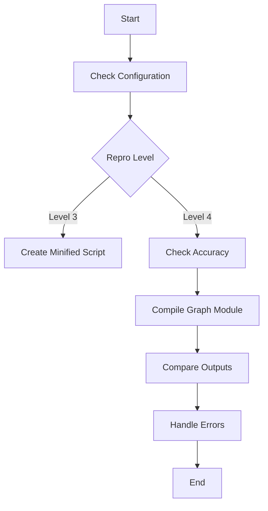

This document will cover the role of the `__call__` method in managing the flow of handling a graph module and its example inputs. We'll cover:

1. Overview of the `__call__` Method
2. Handling Accuracy Issues
3. Creating Minified Reproduction Scripts
4. Comparing Model Outputs

Technical document: <SwmLink doc-title="Role of __call__ Method">[Role of \__call_\_ Method](/.swm/role-of-__call__-method.hby47b7f.sw.md)</SwmLink>

# [Overview of the ](https://app.swimm.io/repos/Z2l0aHViJTNBJTNBcHl0b3JjaC1hdXRvZG9jcy1kZW1vJTNBJTNBU3dpbW0tRGVtbw==/docs/hby47b7f#__call__)`__call__` Method

The `__call__` method acts as a manager that decides the appropriate actions to take when handling a graph module and its example inputs. It determines these actions based on the configuration settings, such as checking for accuracy issues or other types of failures. This method ensures that the graph module runs smoothly and accurately by interacting with other functions to create scripts for error minimization or handle exceptions.

# [Handling Accuracy Issues](https://app.swimm.io/repos/Z2l0aHViJTNBJTNBcHl0b3JjaC1hdXRvZG9jcy1kZW1vJTNBJTNBU3dpbW0tRGVtbw==/docs/hby47b7f#_accuracy_fails)

When the configuration is set to check for accuracy issues (repro level 4), the `__call__` method initiates a process to verify the accuracy of the compiled graph module. This involves compiling the graph module with the provided example inputs and then comparing the outputs of the original and compiled models. If the outputs do not match within the specified tolerance, it indicates an accuracy issue. This step is crucial for ensuring that the optimizations applied during compilation do not degrade the model's performance.

# [Creating Minified Reproduction Scripts](https://app.swimm.io/repos/Z2l0aHViJTNBJTNBcHl0b3JjaC1hdXRvZG9jcy1kZW1vJTNBJTNBU3dpbW0tRGVtbw==/docs/hby47b7f#dump_to_minify_after_dynamo)

If the configuration is set to create a minified reproduction script (repro level 3), the `__call__` method invokes the `dump_to_minify_after_dynamo` function. This function generates a simplified version of the error scenario by creating a checkpoint directory and producing a minified script. This script includes the necessary imports, model definitions, and execution commands, making it easier to debug and reproduce the issue.

# [Comparing Model Outputs](https://app.swimm.io/repos/Z2l0aHViJTNBJTNBcHl0b3JjaC1hdXRvZG9jcy1kZW1vJTNBJTNBU3dpbW0tRGVtbw==/docs/hby47b7f#same_two_models)

To ensure that the compiled graph module maintains the same accuracy as the original, the `__call__` method uses the `same_two_models` function. This function runs both the original and compiled models with the provided example inputs and compares their outputs. If the outputs match within the specified tolerance, it indicates that the models have the same accuracy. This step is essential for validating the effectiveness of the optimizations applied during compilation.

&nbsp;

*This is an auto-generated document by Swimm AI 🌊 and has not yet been verified by a human*

<SwmMeta version="3.0.0" repo-id="Z2l0aHViJTNBJTNBcHl0b3JjaC1hdXRvZG9jcy1kZW1vJTNBJTNBU3dpbW0tRGVtbw==" repo-name="pytorch-autodocs-demo">Powered by [Swimm](https://app.swimm.io/)</SwmMeta>
