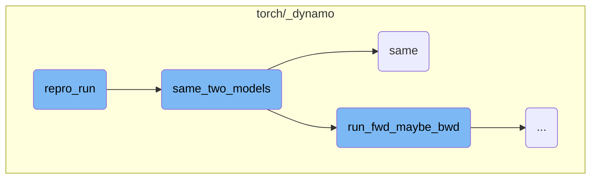

This document explains the process of running a reproducibility test on a given model using the `repro_run` function. The process involves optimizing the model, setting it to evaluation mode, running it with automatic mixed precision (AMP), and ensuring that the original and optimized models produce consistent results.

The flow starts by optimizing the model and setting it to evaluation mode if accuracy checking is enabled. Then, the model is run with AMP enabled if specified. The function `same_two_models` is used to check if the original model produces consistent results. If the optimized model does not produce the same results as the original, an error is raised.

Here is a high level diagram of the flow, showing only the most important functions:

```mermaid
graph TD;
      subgraph torchdynamo["torch/_dynamo"]
298ed5ac6f13cccbd91e03b4317b7bb0e7bb4da1ab5b31fa0bd2aef2aa8e246b(repro_run):::mainFlowStyle --> aeeefd782d30030b62d9079ee5b0d799932c917b6dddae9559db7cdbe67518ac(same_two_models):::mainFlowStyle
end

subgraph torchdynamo["torch/_dynamo"]
aeeefd782d30030b62d9079ee5b0d799932c917b6dddae9559db7cdbe67518ac(same_two_models):::mainFlowStyle --> eb0a9eb1d39824546c9563680642925b0af55a6c9bef3822592742b5943437b6(same)
end

subgraph torchdynamo["torch/_dynamo"]
aeeefd782d30030b62d9079ee5b0d799932c917b6dddae9559db7cdbe67518ac(same_two_models):::mainFlowStyle --> 45d3914ff219ac59d8791edb23592ffcf2198e42f21e9d2fa8d458122697dfbf(run_fwd_maybe_bwd):::mainFlowStyle
end

subgraph torchdynamo["torch/_dynamo"]
45d3914ff219ac59d8791edb23592ffcf2198e42f21e9d2fa8d458122697dfbf(run_fwd_maybe_bwd):::mainFlowStyle --> b849fa0d966995c95bcc0dd289d11300f269a476fb0a889509ae0149e18ed3ef(reduce_to_scalar_loss):::mainFlowStyle
end

subgraph torchdynamo["torch/_dynamo"]
b849fa0d966995c95bcc0dd289d11300f269a476fb0a889509ae0149e18ed3ef(reduce_to_scalar_loss):::mainFlowStyle --> 155e3cc2d5c50ff89e280b9cdc1c9ae4e009632d190253b8d3364f817aed44c4(numel):::mainFlowStyle
end

subgraph torchdynamo["torch/_dynamo"]
155e3cc2d5c50ff89e280b9cdc1c9ae4e009632d190253b8d3364f817aed44c4(numel):::mainFlowStyle --> 0fe776e548d42ed0d2169b9051562848ccfee29509461e7e993ce542426370a7(call_function):::mainFlowStyle
end

subgraph torchdynamo["torch/_dynamo"]
0fe776e548d42ed0d2169b9051562848ccfee29509461e7e993ce542426370a7(call_function):::mainFlowStyle --> fde83ab941c6a2749f130ece53e7f65af2928d91723a63a01273d4e430a433bb(call_method):::mainFlowStyle
end

subgraph torchdynamo["torch/_dynamo"]
fde83ab941c6a2749f130ece53e7f65af2928d91723a63a01273d4e430a433bb(call_method):::mainFlowStyle --> 458008e74f18ebce47c64da5a4233a63dc2fd42ac18b14ae3f3aaea47313241b(inline_user_function_return):::mainFlowStyle
end

subgraph torchdynamo["torch/_dynamo"]
458008e74f18ebce47c64da5a4233a63dc2fd42ac18b14ae3f3aaea47313241b(inline_user_function_return):::mainFlowStyle --> fcd883700fffa007b56c5d346195884dc971b221f81f7154a62efec44b035ea5(inline_call):::mainFlowStyle
end

subgraph torchdynamo["torch/_dynamo"]
fcd883700fffa007b56c5d346195884dc971b221f81f7154a62efec44b035ea5(inline_call):::mainFlowStyle --> 15971f1e27fd627308a99bae241ac3eb113c6830b15353374d03323c5a30959c(inline_call_):::mainFlowStyle
end

subgraph torchdynamo["torch/_dynamo"]
15971f1e27fd627308a99bae241ac3eb113c6830b15353374d03323c5a30959c(inline_call_):::mainFlowStyle --> edf27ab967b775dcd6f62cb8a0fb2a87177da9406db5a99aad72cc627af839ac(run):::mainFlowStyle
end

subgraph torchdynamo["torch/_dynamo"]
edf27ab967b775dcd6f62cb8a0fb2a87177da9406db5a99aad72cc627af839ac(run):::mainFlowStyle --> 99e91bca7ea856f56e3f34579d72219ce35debd0d03d0aee37dedaffe5ac2a22(step):::mainFlowStyle
end

subgraph torchdynamo["torch/_dynamo"]
99e91bca7ea856f56e3f34579d72219ce35debd0d03d0aee37dedaffe5ac2a22(step):::mainFlowStyle --> a8cb423a5d16e220218eb2e3c35a54f64a0aaab6b5233dd0b33a8dae3657ca81(step_graph_break):::mainFlowStyle
end

subgraph torchdynamo["torch/_dynamo"]
a8cb423a5d16e220218eb2e3c35a54f64a0aaab6b5233dd0b33a8dae3657ca81(step_graph_break):::mainFlowStyle --> 2ba345a88495baf48df3654780e05d6be290f7d7a9d8f157cc7acee764a6ff02(compile_subgraph):::mainFlowStyle
end

subgraph torchdynamo["torch/_dynamo"]
2ba345a88495baf48df3654780e05d6be290f7d7a9d8f157cc7acee764a6ff02(compile_subgraph):::mainFlowStyle --> f04eb3af86dd9d49cdf4b5a53e7e367822569119516fff5eea0fed07fa4cd321(compile_and_call_fx_graph):::mainFlowStyle
end

subgraph torchdynamo["torch/_dynamo"]
f04eb3af86dd9d49cdf4b5a53e7e367822569119516fff5eea0fed07fa4cd321(compile_and_call_fx_graph):::mainFlowStyle --> 51ac02c306603291416f8a1c3cb72c09c688733effdec5eaf74535de90614d08(run_compiler_collective):::mainFlowStyle
end


      classDef mainFlowStyle color:#000000,fill:#7CB9F4
classDef rootsStyle color:#000000,fill:#00FFF4
classDef Style1 color:#000000,fill:#00FFAA
classDef Style2 color:#000000,fill:#FFFF00
classDef Style3 color:#000000,fill:#AA7CB9
```



# Flow drill down

First, we'll zoom into this section of the flow:



<SwmSnippet path="/torch/_dynamo/repro/after_dynamo.py" line="429">

---

## Running the Reproducibility Test

The function `repro_run` is responsible for running a reproducibility test on a given model. It first optimizes the model using the specified backend and sets both the original and optimized models to evaluation mode if accuracy checking is enabled. It then runs the models with automatic mixed precision (AMP) enabled if specified. The function `same_two_models` is called to ensure that the original model produces consistent results. If the optimized model fails to produce the same results as the original, an `AccuracyError` is raised.

```python
def repro_run(options, mod, load_args):
    opt_mod = torch._dynamo.optimize(options.backend)(mod)

    if options.accuracy != "":
        mod.eval()
        opt_mod.eval()

        with torch.amp.autocast("cuda", enabled=options.autocast):
            # TODO: disable clone
            args = run_load_args(options, mod, load_args)
            assert same_two_models(mod, mod, args), "Eager itself failed"
            if not same_two_models(
                mod,
                opt_mod,
                args,
                only_fwd=config.repro_forward_only,
                ignore_non_fp=config.repro_ignore_non_fp,
            ):
                raise AccuracyError("Dynamo failed")
    else:
        with torch.amp.autocast("cuda", enabled=options.autocast):
```

---

</SwmSnippet>

<SwmSnippet path="/torch/_dynamo/debug_utils.py" line="334">

---

## Comparing Two Models

The function `same_two_models` checks if two models produce the same results given the same inputs. It runs both models and compares their outputs using the `same` function. If the configuration requires, it also attempts to generate a reference output in full precision (fp64) and compares the models' outputs against this reference. If the optimized model fails to produce the same results as the original, the function returns `False`.

```python
def same_two_models(
    gm,
    opt_gm,
    example_inputs,
    only_fwd=False,
    *,
    require_fp64=False,
    ignore_non_fp=False,
):
    """
    Check two models have same accuracy.

    require_fp64: if True, raise an error if we unable to calculate the fp64 reference
    ignore_non_fp: if True, do not compare outputs which are not floating point.  This
        is mostly useful for the minifier (which wants to avoid quantizing floating point
        error into integer/boolean error)
    """
    from .utils import same

    ref = run_fwd_maybe_bwd(gm, example_inputs, only_fwd)

```

---

</SwmSnippet>

<SwmSnippet path="/torch/_dynamo/utils.py" line="1487">

---

## Checking Model Output Accuracy

The function `same` is a utility that checks if two sets of outputs are the same. It supports various data types, including lists, tuples, dictionaries, and tensors. The function can handle different precision levels and includes options for ignoring non-floating-point outputs and using cosine similarity for comparison. It also provides detailed logging for any mismatches found during the comparison.

```python
def same(
    ref,
    res,
    fp64_ref=None,
    cos_similarity=False,
    tol=1e-4,
    equal_nan=False,
    exact_dtype=True,
    relax_numpy_equality=False,
    ignore_non_fp=False,
    log_error=log.error,
    use_larger_multiplier_for_smaller_tensor=False,
):
    """Check correctness to see if ref and res match"""
    if fp64_ref is None:
        fp64_ref = ref
    if isinstance(ref, (list, tuple, torch.nn.ParameterList, torch.Size)):
        assert isinstance(res, (list, tuple)), f"type mismatch {type(ref)} {type(res)}"
        if len(ref) != len(res):
            log_error("Length mismatch")
            return False
```

---

</SwmSnippet>

Now, lets zoom into this section of the flow:

```mermaid
graph TD;
      subgraph torchdynamo["torch/_dynamo"]
45d3914ff219ac59d8791edb23592ffcf2198e42f21e9d2fa8d458122697dfbf(run_fwd_maybe_bwd):::mainFlowStyle --> b849fa0d966995c95bcc0dd289d11300f269a476fb0a889509ae0149e18ed3ef(reduce_to_scalar_loss):::mainFlowStyle
end

subgraph torchdynamo["torch/_dynamo"]
b849fa0d966995c95bcc0dd289d11300f269a476fb0a889509ae0149e18ed3ef(reduce_to_scalar_loss):::mainFlowStyle --> 155e3cc2d5c50ff89e280b9cdc1c9ae4e009632d190253b8d3364f817aed44c4(numel):::mainFlowStyle
end

subgraph torchdynamo["torch/_dynamo"]
155e3cc2d5c50ff89e280b9cdc1c9ae4e009632d190253b8d3364f817aed44c4(numel):::mainFlowStyle --> 0fe776e548d42ed0d2169b9051562848ccfee29509461e7e993ce542426370a7(call_function):::mainFlowStyle
end

subgraph torchdynamo["torch/_dynamo"]
0fe776e548d42ed0d2169b9051562848ccfee29509461e7e993ce542426370a7(call_function):::mainFlowStyle --> fde83ab941c6a2749f130ece53e7f65af2928d91723a63a01273d4e430a433bb(call_method):::mainFlowStyle
end

subgraph torchdynamo["torch/_dynamo"]
fde83ab941c6a2749f130ece53e7f65af2928d91723a63a01273d4e430a433bb(call_method):::mainFlowStyle --> 458008e74f18ebce47c64da5a4233a63dc2fd42ac18b14ae3f3aaea47313241b(inline_user_function_return):::mainFlowStyle
end

subgraph torchdynamo["torch/_dynamo"]
458008e74f18ebce47c64da5a4233a63dc2fd42ac18b14ae3f3aaea47313241b(inline_user_function_return):::mainFlowStyle --> fcd883700fffa007b56c5d346195884dc971b221f81f7154a62efec44b035ea5(inline_call):::mainFlowStyle
end

subgraph torchdynamo["torch/_dynamo"]
fcd883700fffa007b56c5d346195884dc971b221f81f7154a62efec44b035ea5(inline_call):::mainFlowStyle --> 15971f1e27fd627308a99bae241ac3eb113c6830b15353374d03323c5a30959c(inline_call_):::mainFlowStyle
end

subgraph torchdynamo["torch/_dynamo"]
15971f1e27fd627308a99bae241ac3eb113c6830b15353374d03323c5a30959c(inline_call_):::mainFlowStyle --> edf27ab967b775dcd6f62cb8a0fb2a87177da9406db5a99aad72cc627af839ac(run):::mainFlowStyle
end

subgraph torchdynamo["torch/_dynamo"]
edf27ab967b775dcd6f62cb8a0fb2a87177da9406db5a99aad72cc627af839ac(run):::mainFlowStyle --> 99e91bca7ea856f56e3f34579d72219ce35debd0d03d0aee37dedaffe5ac2a22(step):::mainFlowStyle
end

subgraph torchdynamo["torch/_dynamo"]
99e91bca7ea856f56e3f34579d72219ce35debd0d03d0aee37dedaffe5ac2a22(step):::mainFlowStyle --> a8cb423a5d16e220218eb2e3c35a54f64a0aaab6b5233dd0b33a8dae3657ca81(step_graph_break):::mainFlowStyle
end

subgraph torchdynamo["torch/_dynamo"]
a8cb423a5d16e220218eb2e3c35a54f64a0aaab6b5233dd0b33a8dae3657ca81(step_graph_break):::mainFlowStyle --> 2ba345a88495baf48df3654780e05d6be290f7d7a9d8f157cc7acee764a6ff02(compile_subgraph):::mainFlowStyle
end

subgraph torchdynamo["torch/_dynamo"]
2ba345a88495baf48df3654780e05d6be290f7d7a9d8f157cc7acee764a6ff02(compile_subgraph):::mainFlowStyle --> f04eb3af86dd9d49cdf4b5a53e7e367822569119516fff5eea0fed07fa4cd321(compile_and_call_fx_graph):::mainFlowStyle
end

subgraph torchdynamo["torch/_dynamo"]
f04eb3af86dd9d49cdf4b5a53e7e367822569119516fff5eea0fed07fa4cd321(compile_and_call_fx_graph):::mainFlowStyle --> 51ac02c306603291416f8a1c3cb72c09c688733effdec5eaf74535de90614d08(run_compiler_collective):::mainFlowStyle
end


      classDef mainFlowStyle color:#000000,fill:#7CB9F4
classDef rootsStyle color:#000000,fill:#00FFF4
classDef Style1 color:#000000,fill:#00FFAA
classDef Style2 color:#000000,fill:#FFFF00
classDef Style3 color:#000000,fill:#AA7CB9
```



<SwmSnippet path="/torch/_dynamo/debug_utils.py" line="314">

---

## run_fwd_maybe_bwd

The function `run_fwd_maybe_bwd` is responsible for running a forward and possibly backward iteration for a given model and arguments. It first deep copies the model and optionally clones the input arguments to retain their gradient properties. If the model has a `zero_grad` method, it is called to reset gradients. The model is then executed with the provided arguments. If only a forward pass is required, the function returns the output. Otherwise, it checks if a backward pass is needed by calling `requires_bwd_pass` on the output. If so, it reduces the output to a scalar loss using `reduce_to_scalar_loss` and performs backpropagation by calling `loss.backward()`. Finally, it collects and returns the results.

```python
    from .testing import collect_results, reduce_to_scalar_loss, requires_bwd_pass

    gm = copy.deepcopy(gm)
    if not disable_clone:
        args = clone_inputs_retaining_gradness(args)

    if hasattr(gm, "zero_grad"):
        gm.zero_grad(True)

    # TorchInductor returned callable expects lists. So, may need a boxed calling convention.
    out = gm(args) if hasattr(gm, "_boxed_call") else gm(*args)

    if only_fwd:
        return out
    if requires_bwd_pass(out):
        loss = reduce_to_scalar_loss(out)
        loss.backward()
    return collect_results(gm, out, None, args)
```

---

</SwmSnippet>

<SwmSnippet path="/torch/_dynamo/testing.py" line="105">

---

### reduce_to_scalar_loss

The function `reduce_to_scalar_loss` reduces the output of a model to a scalar loss. It handles various types of outputs, including tensors, lists, tuples, and specific model output types. For tensors, it computes the sum and divides by the number of elements. For lists and tuples, it recursively reduces each element and averages the results. For specific model outputs like `MaskedLMOutput`, it reduces the `logits` attribute. For dictionaries, it reduces each value and averages the results. This function is crucial for converting complex model outputs into a single scalar value that can be used for backpropagation.

```python
def reduce_to_scalar_loss(out):
    """Reduce the output of a model to get scalar loss"""
    if isinstance(out, torch.Tensor):
        # Mean does not work on integer tensors
        return out.sum() / out.numel()
    elif isinstance(out, (list, tuple)):
        return sum(reduce_to_scalar_loss(x) for x in out) / len(out)
    elif type(out).__name__ in (
        "MaskedLMOutput",
        "Seq2SeqLMOutput",
        "CausalLMOutputWithCrossAttentions",
    ):
        return reduce_to_scalar_loss(out.logits)
    elif type(out).__name__ == "SquashedNormal":
        return out.mean.sum()
    elif isinstance(out, dict):
        return sum(reduce_to_scalar_loss(value) for value in out.values()) / len(
            out.keys()
        )
    raise NotImplementedError("Don't know how to reduce", type(out))
```

---

</SwmSnippet>

&nbsp;

*This is an auto-generated document by Swimm AI 🌊 and has not yet been verified by a human*

<SwmMeta version="3.0.0" repo-id="Z2l0aHViJTNBJTNBcHl0b3JjaC1hdXRvZG9jcy1kZW1vJTNBJTNBU3dpbW0tRGVtbw==" repo-name="pytorch-autodocs-demo"><sup>Powered by [Swimm](https://app.swimm.io/)</sup></SwmMeta>
