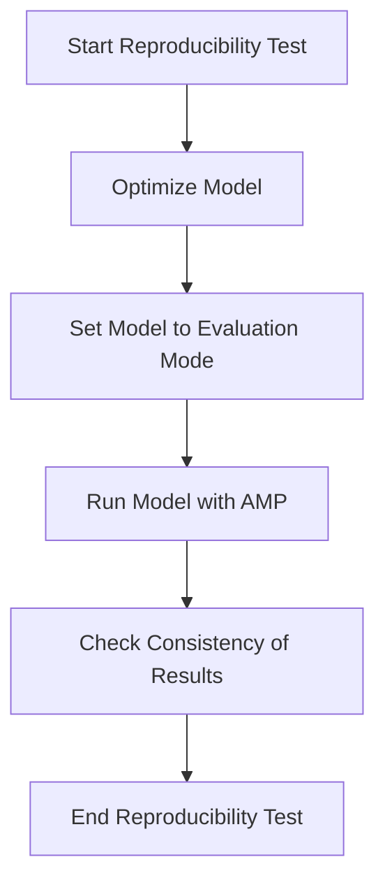

This document will cover the process of running a reproducibility test on a given model. We'll cover:

1. Optimizing the model
2. Setting the model to evaluation mode
3. Running the model with automatic mixed precision (AMP)
4. Ensuring consistency between original and optimized models

Technical document: <SwmLink doc-title="Running a Reproducibility Test">[Running a Reproducibility Test](/.swm/running-a-reproducibility-test.2puzxj0x.sw.md)</SwmLink>

# [Optimizing the Model](https://app.swimm.io/repos/Z2l0aHViJTNBJTNBcHl0b3JjaC1hdXRvZG9jcy1kZW1vJTNBJTNBU3dpbW0tRGVtbw==/docs/2puzxj0x#running-the-reproducibility-test)

The first step in running a reproducibility test is to optimize the model. This involves using a specified backend to enhance the model's performance. Optimization is crucial as it prepares the model for efficient execution, which is essential for comparing its performance against the original model.

# [Setting the Model to Evaluation Mode](https://app.swimm.io/repos/Z2l0aHViJTNBJTNBcHl0b3JjaC1hdXRvZG9jcy1kZW1vJTNBJTNBU3dpbW0tRGVtbw==/docs/2puzxj0x#running-the-reproducibility-test)

After optimization, the model is set to evaluation mode if accuracy checking is enabled. Evaluation mode ensures that the model's behavior is consistent and not influenced by training-specific operations like dropout. This step is important to ensure that the model's performance is measured accurately.

# [Running the Model with AMP](https://app.swimm.io/repos/Z2l0aHViJTNBJTNBcHl0b3JjaC1hdXRvZG9jcy1kZW1vJTNBJTNBU3dpbW0tRGVtbw==/docs/2puzxj0x#running-the-reproducibility-test)

The next step is to run the model with automatic mixed precision (AMP) enabled if specified. AMP allows the model to use both 16-bit and 32-bit floating-point types, which can improve performance and reduce memory usage. This step is essential for testing the model under different precision settings to ensure it performs consistently.

# [Ensuring Consistency of Results](https://app.swimm.io/repos/Z2l0aHViJTNBJTNBcHl0b3JjaC1hdXRvZG9jcy1kZW1vJTNBJTNBU3dpbW0tRGVtbw==/docs/2puzxj0x#comparing-two-models)

The final step is to ensure that the original and optimized models produce consistent results. This is done using the `same_two_models` function, which compares the outputs of both models given the same inputs. If the optimized model fails to produce the same results as the original, an `AccuracyError` is raised. This step is critical to validate that the optimization process has not altered the model's accuracy.

&nbsp;

*This is an auto-generated document by Swimm AI 🌊 and has not yet been verified by a human*

<SwmMeta version="3.0.0" repo-id="Z2l0aHViJTNBJTNBcHl0b3JjaC1hdXRvZG9jcy1kZW1vJTNBJTNBU3dpbW0tRGVtbw==" repo-name="pytorch-autodocs-demo">Powered by [Swimm](https://app.swimm.io/)</SwmMeta>
