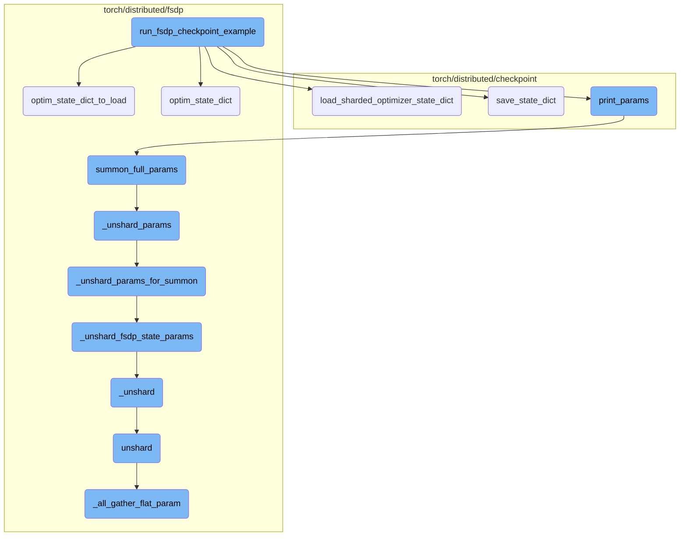

This document provides an overview of the process for saving and loading model states using Fully Sharded Data Parallel (FSDP). It includes a high-level flow diagram and a detailed breakdown of the key steps involved in the process.

The process starts by setting up the environment and initializing the process group. A model is then created and its state, along with the optimizer state, is saved to a checkpoint. A second model is created, and the saved state is loaded into this new model to ensure both models have the same parameters. This involves saving the model state, loading the model state, and transforming the optimizer state dictionary.

Here is a high level diagram of the flow, showing only the most important functions:



# Flow drill down

First, we'll zoom into this section of the flow:

```mermaid
graph TD;
      subgraph torchdistributedfsdp["torch/distributed/fsdp"]
6bd688403461aee0afffda6194709e27b766f0aa2f81347695818816c2c60356(run_fsdp_checkpoint_example):::mainFlowStyle --> 8657436e19f7aae16b43496971a1f7334b55a086a4a9a3f86285ff88635b4c66(optim_state_dict_to_load)
end

subgraph torchdistributedfsdp["torch/distributed/fsdp"]
6bd688403461aee0afffda6194709e27b766f0aa2f81347695818816c2c60356(run_fsdp_checkpoint_example):::mainFlowStyle --> e17c5eb553efc2c113f0a6ba9cd0918bff341c160508ac54948d2cdd68c44403(optim_state_dict)
end

subgraph torchdistributedcheckpoint["torch/distributed/checkpoint"]
6bd688403461aee0afffda6194709e27b766f0aa2f81347695818816c2c60356(run_fsdp_checkpoint_example):::mainFlowStyle --> efe99f8e7f73fb9b2b1e71d8644e764584ba946a5708ffa2e5c532a96aca8c30(load_sharded_optimizer_state_dict)
end

subgraph torchdistributedcheckpoint["torch/distributed/checkpoint"]
6bd688403461aee0afffda6194709e27b766f0aa2f81347695818816c2c60356(run_fsdp_checkpoint_example):::mainFlowStyle --> 57bc161234634a2476952dd528b5389ec9dbaa2eed4b16857674c95586ad282c(save_state_dict)
end

subgraph torchdistributedcheckpoint["torch/distributed/checkpoint"]
6bd688403461aee0afffda6194709e27b766f0aa2f81347695818816c2c60356(run_fsdp_checkpoint_example):::mainFlowStyle --> d581143a651eab23a61203f66e420b652e6a2f41fa212da6bf0bafd73420cbfc(print_params):::mainFlowStyle
end

subgraph torchdistributedcheckpoint["torch/distributed/checkpoint"]
d581143a651eab23a61203f66e420b652e6a2f41fa212da6bf0bafd73420cbfc(print_params):::mainFlowStyle --> lb384(...)
end

subgraph torchdistributedcheckpoint["torch/distributed/checkpoint"]
57bc161234634a2476952dd528b5389ec9dbaa2eed4b16857674c95586ad282c(save_state_dict) --> 970a4cb3f9b5b9380b727a78d49c1631f181b8387bdce63e9905d9a3c6fb63d5(_save_state_dict)
end

subgraph torchdistributedfsdp["torch/distributed/fsdp"]
efe99f8e7f73fb9b2b1e71d8644e764584ba946a5708ffa2e5c532a96aca8c30(load_sharded_optimizer_state_dict) --> 6e2395faedbd9df7483da0c6b2a687594b63a416ce2dfa45473500296ae37d7c(_create_chunk_sharded_tensor)
end

subgraph torchdistributedfsdp["torch/distributed/fsdp"]
e17c5eb553efc2c113f0a6ba9cd0918bff341c160508ac54948d2cdd68c44403(optim_state_dict) --> 00057c1834731435c73b44647ea46ab8adee57396c64e06c43e491ab2c8f10a9(_optim_state_dict_impl)
end

subgraph torchdistributedfsdp["torch/distributed/fsdp"]
8657436e19f7aae16b43496971a1f7334b55a086a4a9a3f86285ff88635b4c66(optim_state_dict_to_load) --> e2b2fa39aa8c51f305c11483296b5491226e897f9d897c0ac4592e888742eb88(_optim_state_dict_to_load_impl)
end


      classDef mainFlowStyle color:#000000,fill:#7CB9F4
classDef rootsStyle color:#000000,fill:#00FFF4
classDef Style1 color:#000000,fill:#00FFAA
classDef Style2 color:#000000,fill:#FFFF00
classDef Style3 color:#000000,fill:#AA7CB9
```



<SwmSnippet path="/torch/distributed/checkpoint/examples/fsdp_checkpoint_example.py" line="59">

---

## Saving and Loading Model States

The function `run_fsdp_checkpoint_example` demonstrates the process of saving and loading model states using Fully Sharded Data Parallel (FSDP). It initializes the process group, creates a model, saves the model state to a checkpoint, creates a second model, and then loads the saved state into the second model. This ensures that the parameters of both models are the same after loading.

```python
def run_fsdp_checkpoint_example(rank, world_size):
    # Set up world pg
    os.environ["MASTER_ADDR"] = "localhost"
    os.environ["MASTER_PORT"] = "12355"

    # Initialize the process group
    dist.init_process_group("cpu:gloo,cuda:nccl", rank=rank, world_size=world_size)
    torch.cuda.set_device(rank)

    # Create a model
    model_1, optim_1 = init_model()

    # Save the model to CHECKPOINT_DIR
    with FSDP.state_dict_type(model_1, StateDictType.SHARDED_STATE_DICT):
        state_dict = {
            "model": model_1.state_dict(),
            "optim": FSDP.optim_state_dict(model_1, optim_1),
        }

        dist_cp.save_state_dict(
            state_dict=state_dict,
```

---

</SwmSnippet>

<SwmSnippet path="/torch/distributed/checkpoint/examples/fsdp_checkpoint_example.py" line="72">

---

### Saving the Model State

The model state is saved using `FSDP.state_dict_type` to specify the state dictionary type as `SHARDED_STATE_DICT`. The state dictionary includes both the model state and the optimizer state, which are saved to a specified directory using `dist_cp.save_state_dict`.

```python
    with FSDP.state_dict_type(model_1, StateDictType.SHARDED_STATE_DICT):
        state_dict = {
            "model": model_1.state_dict(),
            "optim": FSDP.optim_state_dict(model_1, optim_1),
        }

        dist_cp.save_state_dict(
            state_dict=state_dict,
            storage_writer=dist_cp.FileSystemWriter(CHECKPOINT_DIR),
        )
```

---

</SwmSnippet>

<SwmSnippet path="/torch/distributed/checkpoint/examples/fsdp_checkpoint_example.py" line="91">

---

### Loading the Model State

The saved model state is loaded into a second model. The optimizer state is loaded separately using `load_sharded_optimizer_state_dict` and `FSDP.optim_state_dict_to_load`, ensuring that the optimizer state is correctly mapped to the new model.

```python
    with FSDP.state_dict_type(model_2, StateDictType.SHARDED_STATE_DICT):
        state_dict = {
            "model": model_2.state_dict(),
            # cannot load the optimizer state_dict together with the model state_dict
        }

        dist_cp.load_state_dict(
            state_dict=state_dict,
            storage_reader=dist_cp.FileSystemReader(CHECKPOINT_DIR),
        )
        model_2.load_state_dict(state_dict["model"])

        optim_state = load_sharded_optimizer_state_dict(
            model_state_dict=state_dict["model"],
            optimizer_key="optim",
            storage_reader=dist_cp.FileSystemReader(CHECKPOINT_DIR),
        )

        flattened_osd = FSDP.optim_state_dict_to_load(
            model_2, optim_2, optim_state["optim"]
        )
```

---

</SwmSnippet>

<SwmSnippet path="/torch/distributed/fsdp/fully_sharded_data_parallel.py" line="1795">

---

## Transforming Optimizer State Dictionary

The function `optim_state_dict` transforms the state dictionary of an optimizer corresponding to a sharded model. It can transform the state dictionary into a full optimizer state dictionary, a sharded optimizer state dictionary, or a local optimizer state dictionary, depending on the specified state dictionary type.

```python
    def optim_state_dict(
        model: torch.nn.Module,
        optim: torch.optim.Optimizer,
        optim_state_dict: Optional[Dict[str, Any]] = None,
        group: Optional[dist.ProcessGroup] = None,
    ) -> Dict[str, Any]:
        """
        Transform the state-dict of an optimizer corresponding to a sharded model.

        The given state-dict can be transformed to one of three types:
        1) full optimizer state_dict, 2) sharded optimizer state_dict, 3) local optimizer state_dict.

        For full optimizer state_dict, all states are unflattened and not sharded.
        Rank0 only and CPU only can be specified via :meth:`state_dict_type` to
        avoid OOM.

        For sharded optimizer state_dict, all states are unflattened but sharded.
        CPU only can be specified via :meth:`state_dict_type` to further save
        memory.

        For local state_dict, no transformation will be performed. But a state
```

---

</SwmSnippet>

<SwmSnippet path="/torch/distributed/checkpoint/optimizer.py" line="214">

---

## Loading Sharded Optimizer State Dictionary

The function `load_sharded_optimizer_state_dict` loads a state dictionary in conjunction with FSDP sharded optimizer state. It reads the metadata, creates a state dictionary for the optimizer state, and loads the state dictionary from the storage reader.

```python
def load_sharded_optimizer_state_dict(
    model_state_dict: STATE_DICT_TYPE,
    optimizer_key: str,
    storage_reader: StorageReader,
    planner: Optional[LoadPlanner] = None,
) -> STATE_DICT_TYPE:
    """
    Load a state_dict in conjunction with FSDP sharded optimizer state.

    This is the current recommended way to checkpoint FSDP.
    >>> # xdoctest: +SKIP
    >>> import torch.distributed.checkpoint as dist_cp
    >>> # Save
    >>> model: torch.nn.Model
    >>> optim_params = model.parameters()
    >>> optim = torch.optim.SGD(optim_params, lr=0.01)
    >>> # Save
    >>> with FSDP.state_dict_type(model, StateDictType.SHARDED_STATE_DICT):
    >>>     state_dict = {
    >>>         "optimizer": FSDP.optim_state_dict(model, optim),
    >>>         "model": model.state_dict()
```

---

</SwmSnippet>

<SwmSnippet path="/torch/distributed/checkpoint/state_dict_saver.py" line="34">

---

## Saving State Dictionary

The function `save_state_dict` saves the state dictionary to a specified storage writer. It resets the storage writer and calls the internal function `_save_state_dict` to perform the actual saving process.

```python
def save_state_dict(
    state_dict: STATE_DICT_TYPE,
    storage_writer: StorageWriter,
    process_group: Optional[dist.ProcessGroup] = None,
    coordinator_rank: int = 0,
    no_dist: bool = False,
    planner: Optional[SavePlanner] = None,
) -> Metadata:
    """This method is deprecated. Please switch to 'save'."""
    storage_writer.reset()

    # TODO: test returning `save` here instead.
    with _profile():
        return _save_state_dict(
            state_dict,
            storage_writer,
            process_group,
            coordinator_rank,
            no_dist,
            planner,
        )
```

---

</SwmSnippet>

<SwmSnippet path="/torch/distributed/fsdp/_shard_utils.py" line="30">

---

## Creating Chunk Sharded Tensor

The function `_create_chunk_sharded_tensor` shards a tensor into chunks along the first dimension. Each local rank gets its corresponding chunk as the local shard to create a `ShardedTensor`. This function is used internally to manage the sharding of tensors across different ranks.

```python
def _create_chunk_sharded_tensor(
    tensor: torch.Tensor,
    rank: int,
    world_size: int,
    num_devices_per_node: int,
    pg: dist.ProcessGroup,
    device: Optional[torch.device] = None,
) -> ShardedTensor:
    """
    Shard a tensor to chunks along the first dimension. The local rank will gets its
    corresponding chunk as the local shard to create a ShardedTensor.
    """
    chunks = tensor.chunk(world_size, dim=0)
    if len(chunks) > rank:
        local_shard = chunks[rank].clone()
        offsets = [0 for _ in tensor.size()]
        offsets[0] = math.ceil(tensor.size()[0] / world_size) * rank
        local_shards = [Shard.from_tensor_and_offsets(local_shard, offsets, rank)]
    else:
        local_shards = []

```

---

</SwmSnippet>

Now, lets zoom into this section of the flow:

```mermaid
graph TD;
      subgraph torchdistributedfsdp["torch/distributed/fsdp"]
d581143a651eab23a61203f66e420b652e6a2f41fa212da6bf0bafd73420cbfc(print_params):::mainFlowStyle --> 7bc245d745088d901cf927f1c57fc56d180be30134af49bea6fcabc76dc89601(summon_full_params):::mainFlowStyle
end

subgraph torchdistributedfsdp["torch/distributed/fsdp"]
7bc245d745088d901cf927f1c57fc56d180be30134af49bea6fcabc76dc89601(summon_full_params):::mainFlowStyle --> d36ea4cf8c166094cc4b246b13f020fd5260e3e7ea3d34fde6b40a98aa8d40e4(_unshard_params):::mainFlowStyle
end

subgraph torchdistributedfsdp["torch/distributed/fsdp"]
d36ea4cf8c166094cc4b246b13f020fd5260e3e7ea3d34fde6b40a98aa8d40e4(_unshard_params):::mainFlowStyle --> d1d8d51a3846c35a74eb60bf949a8d9ec5c973e108dfff7c9cf083256c4da4b4(_unshard_params_for_summon):::mainFlowStyle
end

subgraph torchdistributedfsdp["torch/distributed/fsdp"]
d1d8d51a3846c35a74eb60bf949a8d9ec5c973e108dfff7c9cf083256c4da4b4(_unshard_params_for_summon):::mainFlowStyle --> 2d58228a11b56231ce2dfad9a8981325f9f25ccb382b48425a95e741028b3a5c(_unshard_fsdp_state_params):::mainFlowStyle
end

subgraph torchdistributedfsdp["torch/distributed/fsdp"]
2d58228a11b56231ce2dfad9a8981325f9f25ccb382b48425a95e741028b3a5c(_unshard_fsdp_state_params):::mainFlowStyle --> c1c4fc88c5a689b164dddb25aac891a6374c49f75fbfbe7ebeb82d81da6e227e(_unshard):::mainFlowStyle
end

subgraph torchdistributedfsdp["torch/distributed/fsdp"]
c1c4fc88c5a689b164dddb25aac891a6374c49f75fbfbe7ebeb82d81da6e227e(_unshard):::mainFlowStyle --> 294a3565735e12473a18b2752b394dc3c012d883d128fdb3f40e345cd9ab175c(unshard):::mainFlowStyle
end

subgraph torchdistributedfsdp["torch/distributed/fsdp"]
294a3565735e12473a18b2752b394dc3c012d883d128fdb3f40e345cd9ab175c(unshard):::mainFlowStyle --> 4b46c39b3b6a64ec94cf4c65279c6599b3f14c65cb9f137180afe1d8b3d61a21(_all_gather_flat_param):::mainFlowStyle
end


      classDef mainFlowStyle color:#000000,fill:#7CB9F4
classDef rootsStyle color:#000000,fill:#00FFF4
classDef Style1 color:#000000,fill:#00FFAA
classDef Style2 color:#000000,fill:#FFFF00
classDef Style3 color:#000000,fill:#AA7CB9
```



<SwmSnippet path="/torch/distributed/checkpoint/examples/fsdp_checkpoint_example.py" line="39">

---

## print_params

The `print_params` function is used to print the parameters of two models and their corresponding optimizers at a given stage. It utilizes the `summon_full_params` context manager to ensure that the full parameters of the models are available for printing. This function is useful for debugging and verifying the state of the models and optimizers during different stages of training or evaluation.

```python
def print_params(stage, model_1, model_2, optim_1, optim_2):
    with FSDP.summon_full_params(model_1):
        with FSDP.summon_full_params(model_2):
            print(
                f"{stage} --- rank: {dist.get_rank()}\n"
                f"model.weight: {model_1.weight}\n"
                f"model_2.weight:{model_2.weight}\n"
                f"model.bias: {model_1.bias}\n"
                f"model_2.bias: {model_2.bias}\n"
            )

    print(
        f"{stage} --- rank: {dist.get_rank()}\n"
        f"optim exp_avg:{opt_at(optim_1, 0)['exp_avg']}\n"
        f"optim_2 exp_avg:{opt_at(optim_2, 0)['exp_avg']}\n"
        f"optim exp_avg_sq:{opt_at(optim_1, 0)['exp_avg_sq']}\n"
        f"optim_2 exp_avg_sq:{opt_at(optim_2, 0)['exp_avg_sq']}\n"
    )
```

---

</SwmSnippet>

&nbsp;

*This is an auto-generated document by Swimm AI 🌊 and has not yet been verified by a human*

<SwmMeta version="3.0.0" repo-id="Z2l0aHViJTNBJTNBcHl0b3JjaC1hdXRvZG9jcy1kZW1vJTNBJTNBU3dpbW0tRGVtbw==" repo-name="pytorch-autodocs-demo"><sup>Powered by [Swimm](https://app.swimm.io/)</sup></SwmMeta>
