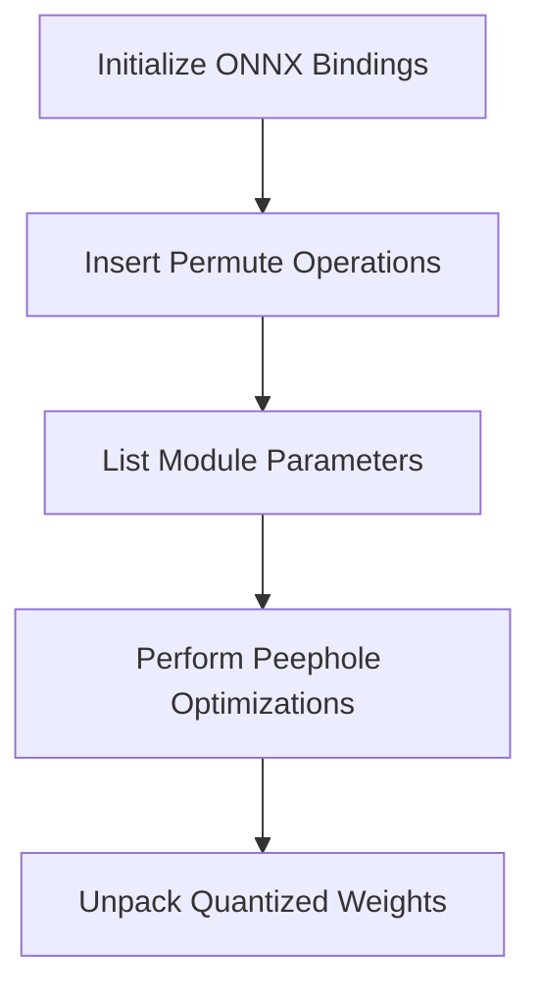

This document will cover the process of setting up ONNX bindings, which includes:

1. Initializing ONNX bindings
2. Inserting permute operations
3. Listing module parameters
4. Performing peephole optimizations
5. Unpacking quantized weights

Technical document: <SwmLink doc-title="Setting Up ONNX Bindings">[Setting Up ONNX Bindings](/.swm/setting-up-onnx-bindings.yrgaxq8i.sw.md)</SwmLink>

# [Initializing ONNX Bindings](https://app.swimm.io/repos/Z2l0aHViJTNBJTNBcHl0b3JjaC1hdXRvZG9jcy1kZW1vJTNBJTNBU3dpbW0tRGVtbw==/docs/yrgaxq8i#initonnxbindings)

The process begins by setting up the environment for converting PyTorch models to the ONNX format. This involves defining several operations and transformations essential for this conversion. The goal is to ensure that the computational graph is optimized and ready for export to ONNX. This step is crucial for enabling the seamless transition of models from PyTorch to ONNX, which is beneficial for users who need to deploy models in environments that support ONNX.

# [Inserting Permute Operations](https://app.swimm.io/repos/Z2l0aHViJTNBJTNBcHl0b3JjaC1hdXRvZG9jcy1kZW1vJTNBJTNBU3dpbW0tRGVtbw==/docs/yrgaxq8i#insertpermutes)

In this step, permute operations are inserted into the computational graph to convert data formats. This is necessary to ensure compatibility between PyTorch's NCHW format and other frameworks like Caffe2's NHWC format. The insertion of these operations ensures that the data is correctly formatted for subsequent processing steps, which is important for maintaining the integrity and performance of the model during conversion.

# [Listing Module Parameters](https://app.swimm.io/repos/Z2l0aHViJTNBJTNBcHl0b3JjaC1hdXRvZG9jcy1kZW1vJTNBJTNBU3dpbW0tRGVtbw==/docs/yrgaxq8i#list_module_parameters)

This step involves listing the parameters of a given module. The module is cloned, and its 'forward' method is retrieved to extract the parameters as inputs to the graph. This is essential for preparing the module's parameters for ONNX export, ensuring that all necessary parameters are included in the exported model. This step is important for users who need to ensure that their model's parameters are correctly represented in the ONNX format.

# [Performing Peephole Optimizations](https://app.swimm.io/repos/Z2l0aHViJTNBJTNBcHl0b3JjaC1hdXRvZG9jcy1kZW1vJTNBJTNBU3dpbW0tRGVtbw==/docs/yrgaxq8i#peepholeoptimizeonnx)

Peephole optimizations are applied to the computational graph to improve its efficiency. These optimizations include removing no-op operations, fusing consecutive operations, and eliminating dead code. The goal is to ensure that the graph is optimized for efficient execution in the ONNX runtime. This step is crucial for users who need to deploy their models in resource-constrained environments, as it helps to reduce the computational overhead and improve performance.

# [Unpacking Quantized Weights](https://app.swimm.io/repos/Z2l0aHViJTNBJTNBcHl0b3JjaC1hdXRvZG9jcy1kZW1vJTNBJTNBU3dpbW0tRGVtbw==/docs/yrgaxq8i#unpackquantizedweights)

The final step involves unpacking quantized weights and inserting them back into the graph. This step handles various quantized operations such as linear, convolutional, and their ReLU variants. The goal is to ensure that the quantized weights are correctly unpacked and represented in the graph, which is essential for maintaining the accuracy and performance of the model during conversion. This step is important for users who work with quantized models and need to ensure that their models are correctly converted to the ONNX format.

&nbsp;

*This is an auto-generated document by Swimm AI 🌊 and has not yet been verified by a human*

<SwmMeta version="3.0.0" repo-id="Z2l0aHViJTNBJTNBcHl0b3JjaC1hdXRvZG9jcy1kZW1vJTNBJTNBU3dpbW0tRGVtbw==" repo-name="pytorch-autodocs-demo">Powered by [Swimm](https://app.swimm.io/)</SwmMeta>
