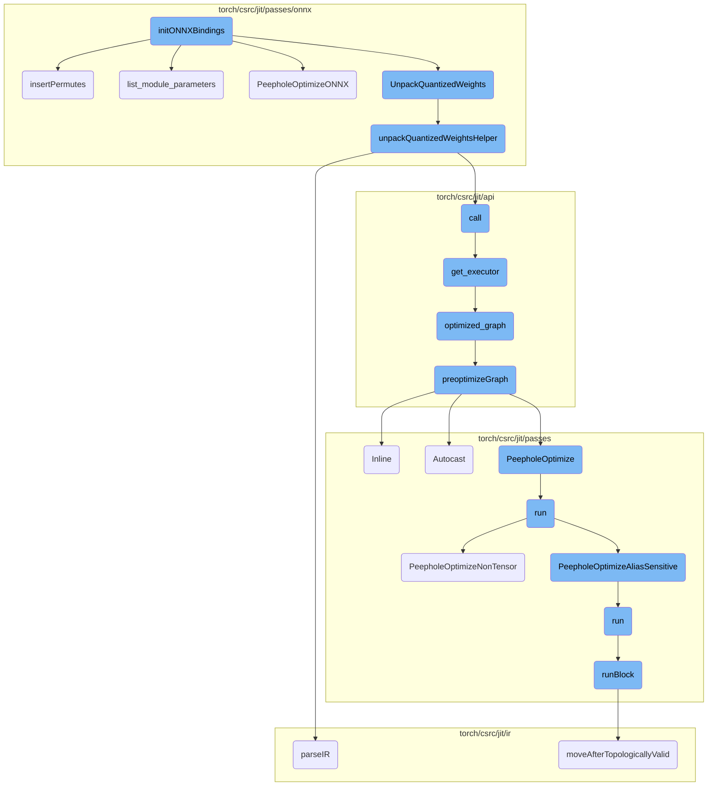
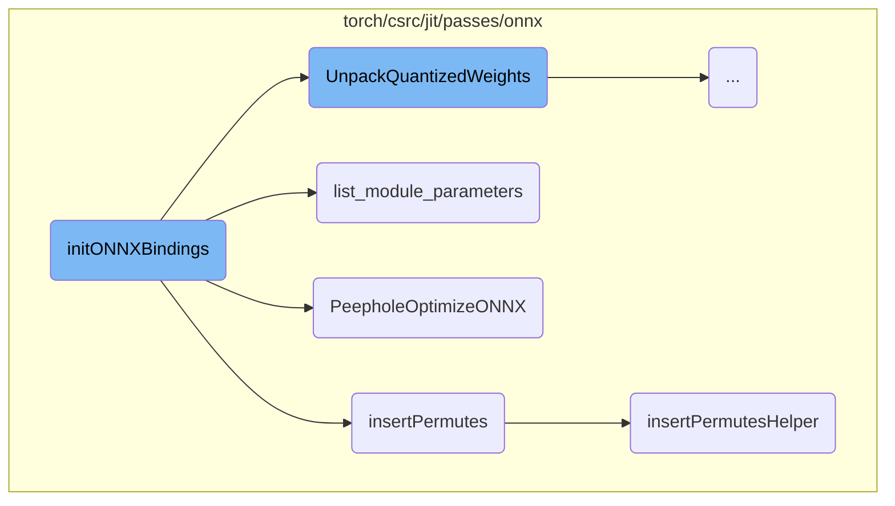
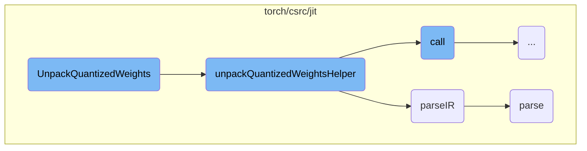
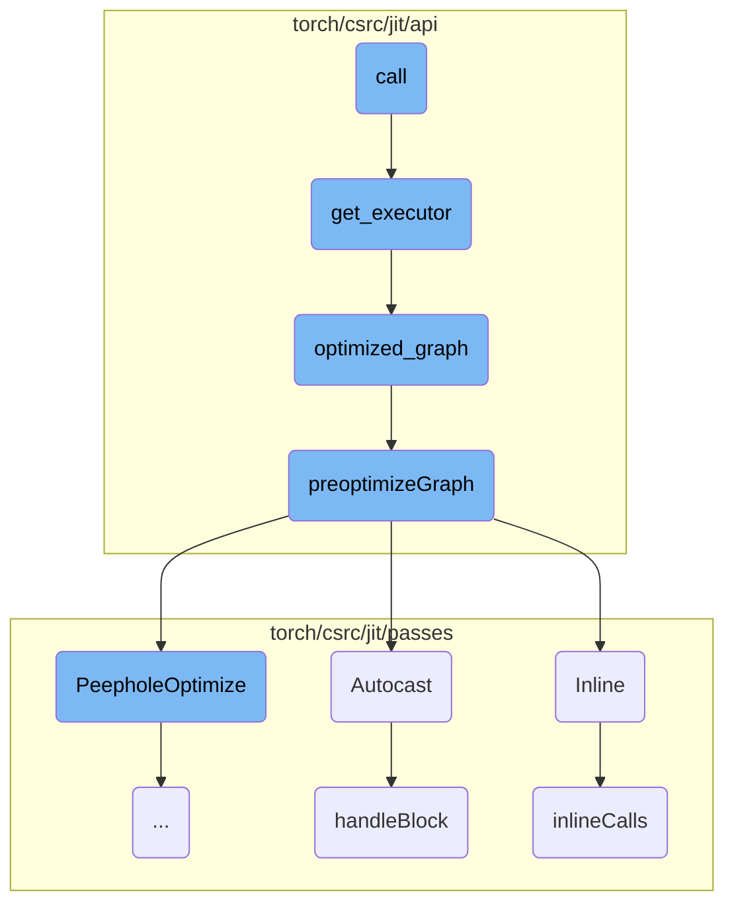
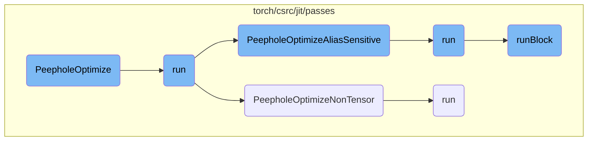

This document explains the purpose and functionality of the `initONNXBindings` function. It highlights how this function initializes various ONNX-related bindings and optimizations, ensuring that the graph is optimized and prepared for ONNX export.

The `initONNXBindings` function sets up the environment for converting PyTorch models to the ONNX format. It defines several operations and transformations that are essential for this conversion. By invoking multiple helper functions and optimization passes, it ensures that the graph is optimized and ready for export.

Here is a high level diagram of the flow, showing only the most important functions:



# Flow drill down

First, we'll zoom into this section of the flow:



<SwmSnippet path="/torch/csrc/onnx/init.cpp" line="36">

---

## initONNXBindings

The `initONNXBindings` function initializes various ONNX-related bindings and optimizations. It sets up the ONNX environment by defining several operations and transformations that are essential for converting PyTorch models to the ONNX format. This function ensures that the graph is optimized and prepared for ONNX export by invoking multiple helper functions and optimization passes.

```c++
void initONNXBindings(PyObject* module) {
  auto m = py::handle(module).cast<py::module>();

  // ONNX specific passes
  m.def("_jit_pass_onnx_remove_print", RemovePrintOps)
      .def("_jit_pass_onnx_preprocess_caffe2", PreprocessCaffe2Ops)
      .def("_jit_pass_onnx", ToONNX)
      .def(
          "_jit_pass_onnx_assign_output_shape",
          ::torch::wrap_pybind_function(
              [](std::shared_ptr<Graph>& graph,
                 const std::vector<at::Tensor>& tensors,
                 const python::IODescriptor& desc,
                 bool onnx_shape_inference,
                 bool is_script,
                 int opset_version) {
                ONNXAssignOutputShape(
                    graph,
                    tensors,
                    desc,
                    onnx_shape_inference,
```

---

</SwmSnippet>

<SwmSnippet path="/torch/csrc/jit/passes/onnx/unpack_quantized_weights.cpp" line="751">

---

## insertPermutes

The `insertPermutes` function is responsible for inserting permute operations into the graph to convert data formats. This is crucial for ensuring compatibility between PyTorch's NCHW format and Caffe2's NHWC format. The function calls `insertPermutesHelper` to handle the insertion of these permute operations for different quantized convolution patterns.

```c++
void insertPermutes(
    std::shared_ptr<Graph>& graph,
    std::map<std::string, IValue>& paramsDict) {
  std::string qconv = R"(
  graph(%input, %weight, %bias, %stride, %padding, %dilation, %groups, %w_scale, %w_zero_point):
        %r = quantized::conv2d(%input, %weight, %bias, %stride, %padding, %dilation, %groups, %w_scale, %w_zero_point)
        return (%r) )";
  std::string qconv_relu = R"(
  graph(%input, %weight, %bias, %stride, %padding, %dilation, %groups, %w_scale, %w_zero_point):
        %r = quantized::conv2d_relu(%input, %weight, %bias, %stride, %padding, %dilation, %groups, %w_scale, %w_zero_point)
        return (%r) )";
  std::string qconv_transpose = R"(
  graph(%input, %weight, %bias, %stride, %padding, %dilation, %output_padding, %groups, %w_scale, %w_zero_point):
        %r = quantized::conv_transpose2d(%input, %weight, %bias, %stride, %padding, %output_padding, %dilation, %groups, %w_scale, %w_zero_point)
        return (%r) )";

  insertPermutesHelper(graph, paramsDict, qconv);
  insertPermutesHelper(graph, paramsDict, qconv_relu);
  insertPermutesHelper(graph, paramsDict, qconv_transpose);
  GRAPH_DUMP("After insertPermutes: ", graph);
}
```

---

</SwmSnippet>

<SwmSnippet path="/torch/csrc/jit/passes/onnx/list_model_parameters.cpp" line="176">

---

## list_module_parameters

The `list_module_parameters` function lists the parameters of a given module. It clones the module, retrieves the 'forward' method, and extracts the parameters as inputs to the graph. This function is essential for preparing the module's parameters for ONNX export.

```c++
std::pair<Module, std::vector<IValue>> list_module_parameters(
    const Module& module) {
  Module moduleClone = module.clone(true);
  Method method = moduleClone.get_method("forward");
  auto function = &method.function();
  auto graph = toGraphFunction(*function).graph();
  // A map of names and values of referenced attributes, to avoid duplicates.
  std::unordered_map<std::string, Value*> attrValues = {};

  GRAPH_DEBUG("Fetch attributes for function: " + function->name());
  std::vector<IValue> parameterIValues = getParamAttributes(
      graph->block(), graph, moduleClone, function, attrValues);
  insertMainModuleAsConstant(graph);
  GRAPH_DEBUG("Listed parameters as inputs: ", *graph);

  return std::make_pair(moduleClone, parameterIValues);
}
```

---

</SwmSnippet>

<SwmSnippet path="/torch/csrc/jit/passes/onnx/peephole.cpp" line="1028">

---

## PeepholeOptimizeONNX

The `PeepholeOptimizeONNX` function performs ONNX-specific peephole optimizations on the graph. These optimizations include removing no-op operations, fusing consecutive operations, and eliminating dead code. This function ensures that the graph is optimized for efficient execution in the ONNX runtime.

```c++
// This optimization does ONNX-specific peephole optimizations.
//
// Before you write an optimization here, ask yourself, "Could I do this
// optimization on ATen operators"?  If so, you should seriously consider
// writing your optimization in jit/passes/peephole.cpp rather than
// here, as it will be generally applicable to the JIT as well.  The
// optimizations here are ONLY applied on ONNX export.
void PeepholeOptimizeONNX(
    std::shared_ptr<Graph>& graph,
    int opset_version,
    bool fixed_batch_size) {
  // TODO: decide on fixpoint strategy
  // TODO: make it easier not to do O(k) iterations over the graph, where
  // k is the number of distinct peephole optimizations
  hackFixupPadPackedShapes(graph->block());
  pushPackingPastRnn(graph->block());
  removeNopPacking(graph->block());
  // we only need to fix the size of hidden state and cell state if the batch
  // size is variable
  if (!fixed_batch_size) {
    fixDefaultRnnHiddenState(graph->block(), opset_version);
```

---

</SwmSnippet>

<SwmSnippet path="/torch/csrc/jit/passes/onnx/unpack_quantized_weights.cpp" line="716">

---

## insertPermutesHelper

The `insertPermutesHelper` function assists in inserting permute operations into the graph. It parses a given pattern, finds matches in the graph, and inserts permute nodes before and after the matched operations. This function is crucial for converting data formats to ensure compatibility between different frameworks.

```c++
// Caffe2 expects quantized ops to be in NHWC format while pytorch inputs are in
// NCHW. This pass inserts permutes to convert from NCHW to NHWC before each
// conv op and add another permute from NHWC to NCHW after the conv op.
void insertPermutesHelper(
    std::shared_ptr<Graph>& graph,
    std::map<std::string, IValue>& paramsDict,
    const std::string& pattern) {
  Graph pattern_graph;
  std::unordered_map<std::string, Value*> vmap;
  parseIR(pattern, &pattern_graph, vmap);

  const auto& matches = findPatternMatches(pattern_graph, *graph);

  for (const auto& match : matches) {
    auto match_vmap = match.values_map;
    auto op_node = match_vmap.at(vmap.at("r"))->node();
    auto input_node = match_vmap.at(vmap.at("r"))->node()->inputs()[0]->node();

    Node* permute_node_before = graph->create(
        Symbol::fromQualString("quantized::nchw2nhwc"), {input_node->output()});
    permute_node_before->insertBefore(op_node);
```

---

</SwmSnippet>

Now, lets zoom into this section of the flow:



<SwmSnippet path="/torch/csrc/jit/passes/onnx/unpack_quantized_weights.cpp" line="595">

---

## Unpacking Quantized Weights

The `UnpackQuantizedWeights` function is responsible for handling various quantized operations such as linear, convolutional, and their ReLU variants. It defines patterns for these operations and calls `unpackQuantizedWeightsHelper` to process each pattern. This function ensures that the quantized weights are unpacked and inserted back into the graph correctly.

```c++
// https://github.com/pytorch/pytorch/wiki/PyTorch-ONNX-exporter#quantized-model-export
void UnpackQuantizedWeights(
    std::shared_ptr<Graph>& graph,
    std::map<std::string, IValue>& paramsDict) {
  std::string qlinear = R"(
  graph(%input, %packed_weight, %w_scale, %w_zero_point):
        %r = quantized::linear(%input, %packed_weight, %w_scale, %w_zero_point)
        return (%r) )";
  std::string qlinear_relu = R"(
  graph(%input, %packed_weight, %w_scale, %w_zero_point):
        %r = quantized::linear_relu(%input, %packed_weight, %w_scale, %w_zero_point)
        return (%r) )";
  std::string qconv1d = R"(
  graph(%input, %packed_params, %scale, %zero_point):
        %r = quantized::conv1d(%input, %packed_params, %scale, %zero_point)
        return (%r) )";
  std::string qconv1d_relu = R"(
  graph(%input, %packed_params, %scale, %zero_point):
        %r = quantized::conv1d_relu(%input, %packed_params, %scale, %zero_point)
        return (%r) )";
  std::string qconv2d = R"(
```

---

</SwmSnippet>

<SwmSnippet path="/torch/csrc/jit/passes/onnx/unpack_quantized_weights.cpp" line="252">

---

### Helper Function for Unpacking

The `unpackQuantizedWeightsHelper` function uses pattern matching to find relevant nodes in the graph and extract the packed parameters. It then calls the appropriate unpack function using `c10::Dispatcher` and inserts the unpacked weights and bias into the graph. This function handles different types of quantized parameters and ensures they are correctly unpacked and inserted.

```c++
// This is called before the onnx pass. Using pattern matching we
// find the relevant nodes and extract the packed_params. The packed_params are
// passed to the appropriate unpack function using c10::Dispatcher. We insert
// the unpacked weights and bias into the graph using
// caffe2::Int8GivenTensorFill nodes.
void unpackQuantizedWeightsHelper(
    std::shared_ptr<Graph>& graph,
    std::map<std::string, IValue>& paramsDict,
    const std::string& pattern,
    const std::string& unpack_fn,
    QuantizedParamsType params_type,
    bool expect_output_padding = false) {
  Graph pattern_graph;
  std::unordered_map<std::string, Value*> vmap;
  parseIR(pattern, &pattern_graph, vmap);
  const auto& matches = findPatternMatches(pattern_graph, *graph);

  for (const auto& match : matches) {
    auto match_vmap = match.values_map;
    auto qlinear_node = match_vmap.at(vmap.at("r"))->node();
    std::string quantized_weight =
```

---

</SwmSnippet>

<SwmSnippet path="/torch/csrc/jit/ir/irparser.cpp" line="108">

---

### Parsing Intermediate Representation

The `parseIR` function is used to parse the intermediate representation (IR) of the graph. It initializes an `IRParser` object and calls its `parse` method to process the IR string and populate the graph and value map.

```c++
void parseIR(
    const std::string& str,
    torch::jit::Graph* graph,
    std::unordered_map<std::string, Value*>& vmap,
    bool parse_tensor_constants) {
  torch::jit::IRParser p(str, graph, vmap, parse_tensor_constants);
  p.parse();
}
```

---

</SwmSnippet>

<SwmSnippet path="/torch/csrc/jit/ir/irparser.cpp" line="612">

---

### Parsing the Graph

The `parse` method of the `IRParser` class parses the entire graph definition, including inputs, operations, and outputs. It ensures that the graph structure is correctly interpreted and any deferred initializations are handled appropriately.

```c++
/** \brief Parse entire graph.
 *
 * It should look like the following:
 *   graphName (input1, input2, ... inputN):
 *     op1
 *     op2
 *     ...
 *     opN
 *     return (output1, output2, ... outputN)
 */
void IRParser::parse() {
  // Parse graph definition, it should look like the following:
  // graphName (input1, input2, ... inputN):
  L.expect(TK_IDENT);
  parseGraphInputs();
  L.expect(':');

  // After the definition we should have a list of statements, parse it:
  parseOperatorsList(g->block());

  // The last statement should be return, which specifies graph outputs
```

---

</SwmSnippet>

Now, lets zoom into this section of the flow:



<SwmSnippet path="/torch/csrc/jit/api/function_impl.h" line="109">

---

## Call

The `call` function is responsible for executing a function's code within a given execution context. It retrieves the appropriate execution plan using `get_executor` and then runs the provided code reference `f` with this plan. This function is crucial for ensuring that the correct execution plan is used based on the current state of the stack and any bailout conditions.

```c
  bool call(
      Stack& stack,
      std::optional<size_t> bailOut,
      c10::function_ref<void(const Code&)> f) override {
    f(get_executor().getPlanFor(stack, bailOut).code);
    return true;
  }
```

---

</SwmSnippet>

<SwmSnippet path="/torch/csrc/jit/api/function_impl.h" line="90">

---

## Get Executor

The `get_executor` function ensures that the function's graph is compiled and optimized before execution. It locks the compilation process to prevent concurrent modifications and checks if an executor already exists for the current specialization. If not, it creates a new `GraphExecutor` using the optimized graph. This function is essential for managing the execution plans and ensuring that the most efficient version of the graph is used.

```c
  GraphExecutor& get_executor() {
    ensure_defined();
    std::lock_guard<std::recursive_mutex> lock(compile_mutex);
    auto& executor = executors_[currentSpecialization()];
    if (executor) {
      return *executor;
    }
    check_single_output();
    const std::string& name = name_.name();
    std::shared_ptr<Graph> opt_graph = optimized_graph();
    if (!executor_execution_mode_) {
      executor = GraphExecutor(opt_graph, name);
    } else {
      executor = GraphExecutor(opt_graph, name, *executor_execution_mode_);
    }
    return *executor;
  }
```

---

</SwmSnippet>

<SwmSnippet path="/torch/csrc/jit/api/function_impl.cpp" line="95">

---

## Optimized Graph

The `optimized_graph` function returns a copy of the function's graph that has been optimized for execution. It locks the graph to prevent concurrent modifications and retrieves the optimized version of the graph for the current specialization. If the graph has not been optimized yet, it performs the necessary optimizations using `preoptimizeGraph`. This function is crucial for ensuring that the graph is in its most efficient form before execution.

```c++
std::shared_ptr<Graph> GraphFunction::optimized_graph() const {
  std::lock_guard<std::recursive_mutex> lock(compile_mutex);
  decltype(optimized_graphs_)::value_type graph;
  auto& graph_ref = !FLAGS_torch_jit_do_not_store_optimized_graph
      ? optimized_graphs_[currentSpecialization()]
      : graph;
  if (graph_ref) {
    return graph_ref;
  }
  graph_ref = graph_->copy();
  if (getGraphExecutorOptimize()) {
    preoptimizeGraph(graph_ref, force_no_amp_);
  }
  return graph_ref;
}
```

---

</SwmSnippet>

<SwmSnippet path="/torch/csrc/jit/api/function_impl.cpp" line="132">

---

## Preoptimize Graph

The `preoptimizeGraph` function applies a series of optimization passes to the graph to improve its performance. It performs inlining, peephole optimizations, constant propagation, and constant pooling. Additionally, it may apply automatic mixed precision (AMP) transformations if autocast is enabled. This function is essential for preparing the graph for efficient execution by removing redundancies and optimizing operations.

```c++
void preoptimizeGraph(std::shared_ptr<Graph>& graph, bool disable_autocast) {
  Inline(*graph);

  // Peephole Optimize cleans up many "is None" checks and creates constant prop
  // opportunities
  PeepholeOptimize(graph, true);

  // AliasDb construction can be slow, so run it just on immutable types
  // to clean up constant Ifs & other easy wins
  ConstantPropagationImmutableTypes(graph);

#ifndef C10_MOBILE
  // Inject casts for automatic mixed precision
  //
  // TODO: Ideally, this pass could run earlier, before inlining
  //  or any other optimizations. That setup is preferable because:
  //  1. The AMP pass would be self-contained and function independently
  //     of the any optimizations
  //  2. AMP transformations would benefit from followup passes's cleanup
  //
  if (!disable_autocast) {
```

---

</SwmSnippet>

<SwmSnippet path="/torch/csrc/jit/passes/inliner.cpp" line="91">

---

## Inline

The `Inline` function performs function inlining on the given graph. It replaces function calls with the actual function body, which can help to reduce the overhead of function calls and enable further optimization opportunities. This function is a key step in the optimization process, as it allows for more aggressive optimizations by exposing the function bodies to the optimizer.

```c++
void Inline(Graph& graph) {
  GRAPH_DUMP("Before Inlining: ", &graph);
  inlineCalls(graph.block());
  GRAPH_DUMP("After Inlining: ", &graph);
}
```

---

</SwmSnippet>

<SwmSnippet path="/torch/csrc/jit/passes/autocast.cpp" line="521">

---

## Autocast

The `Autocast` function applies automatic mixed precision (AMP) transformations to the graph. It checks if autocast is enabled and, if so, processes the graph to insert the necessary casts for mixed precision execution. This function is important for leveraging the performance benefits of mixed precision, especially on hardware that supports it, such as GPUs.

```c++
void Autocast(const std::shared_ptr<Graph>& graph) {
  GRAPH_DUMP("\nBefore Autocast: ", graph);
  if (autocastEnabled()) {
    AutocastContext init = {
        at::autocast::is_autocast_enabled(at::kCUDA),
        at::autocast::is_autocast_enabled(at::kCPU),
        at::autocast::get_autocast_dtype(at::kCUDA),
        at::autocast::get_autocast_dtype(at::kCPU)};
    handleBlock(graph->block(), init);
  }
  GRAPH_DUMP("\nAfter Autocast: ", graph);
}
```

---

</SwmSnippet>

<SwmSnippet path="/torch/csrc/jit/passes/autocast.cpp" line="268">

---

## Handle Block

The `handleBlock` function processes a block of nodes in the graph, applying autocast transformations where necessary. It manages the autocast state and ensures that the appropriate casts are inserted for operations that benefit from mixed precision. This function is crucial for the correct application of AMP, ensuring that the graph is transformed in a way that maximizes performance while maintaining numerical accuracy.

```c++
void handleBlock(Block* block, AutocastContext initial_state) {
  std::stack<AutocastScope> autocast_stack;

  std::optional<bool> incompatible_amp = std::nullopt;

  // The current autocast enabled/disabled state
  auto current_state = [&] {
    return autocast_stack.empty() ? initial_state
                                  : autocast_stack.top().context;
  };

  for (Node* node : block->nodes()) {
    switch (node->kind()) {
      case prim::CallFunction:
        // TODO: limit it only to amp related node;
        if (current_state() == initial_state) {
          // if the current autocasting state is the same as the global state,
          // then autocasting will be done correctly on subsequent method and
          // function calls
          if (current_state()) {
            castTensorInputs(
```

---

</SwmSnippet>

<SwmSnippet path="/torch/csrc/jit/passes/inliner.cpp" line="32">

---

## Inline Calls

The `inlineCalls` function recursively inlines function and method calls within a block. It replaces calls with the corresponding function or method bodies, enabling further optimizations by exposing more of the graph to the optimizer. This function is a critical part of the inlining process, ensuring that all relevant calls are inlined to improve performance.

```c++
static void inlineCalls(Block* block) {
  for (auto it = block->nodes().begin(), end = block->nodes().end();
       it != end;) {
    Node* cur = *it++;
    switch (cur->kind()) {
      case prim::CallFunction: {
        if (auto graphFunction = tryToGraphFunction(cur)) {
          auto function_constant = cur->input(0)->node();
          auto fun_type =
              function_constant->output()->type()->expect<FunctionType>();

          cur->removeInput(0);
          GRAPH_UPDATE(
              "Inlining function '",
              fun_type->function()->name(),
              "' to ",
              *cur);

          std::shared_ptr<Graph> g = nullptr;
          // inline optimized graph for debugging/testing purposes.
          // we only insert fallback functions in JIT optimized graphs for
```

---

</SwmSnippet>

Now, lets zoom into this section of the flow:



<SwmSnippet path="/torch/csrc/jit/passes/peephole.cpp" line="456">

---

## PeepholeOptimize

The `PeepholeOptimize` function is responsible for optimizing a computational graph by applying a series of peephole optimizations. It creates an instance of `PeepholeOptimizeImpl` and runs it. If any changes are made to the graph, it eliminates dead code to ensure the graph remains efficient.

```c++
bool PeepholeOptimize(
    const std::shared_ptr<Graph>& graph,
    bool addmm_fusion_enabled) {
  PeepholeOptimizeImpl peephole(graph, addmm_fusion_enabled);
  bool changed = peephole.run();
  GRAPH_DUMP("After PeepholeOptimize: ", graph);
  // Eliminate dead code created by any peephole passes we've just done
  if (changed) {
    EliminateDeadCode(graph->block());
  }
  return changed;
}
```

---

</SwmSnippet>

<SwmSnippet path="/torch/csrc/jit/passes/peephole.cpp" line="31">

---

## run

The `run` function in `peephole.cpp` orchestrates multiple peephole optimizations on the graph. It calls various optimization functions like `optimizeBlock`, `PeepholeOptimizeListIdioms`, `PeepholeOptimizeDictIdioms`, `PeepholeOptimizeAliasSensitive`, and `PeepholeOptimizeNonTensor`, combining their effects to produce a more optimized graph.

```c++
  bool run() {
    bool changed = optimizeBlock(graph_->block());
    changed |= PeepholeOptimizeListIdioms(graph_);
    changed |= PeepholeOptimizeDictIdioms(graph_);
    changed |= PeepholeOptimizeAliasSensitive(graph_, shape_peepholes_);
    changed |= PeepholeOptimizeNonTensor(graph_);
    changed |= CombineConcats(graph_);
    return changed;
```

---

</SwmSnippet>

<SwmSnippet path="/torch/csrc/jit/passes/peephole_non_tensor.cpp" line="278">

---

## PeepholeOptimizeNonTensor

The `PeepholeOptimizeNonTensor` function focuses on optimizing non-tensor operations within the graph. It creates an instance of `PeepholeOptimizeNonTensorImpl` and runs it, then dumps the graph state for debugging purposes.

```c++
bool PeepholeOptimizeNonTensor(const std::shared_ptr<Graph>& graph) {
  PeepholeOptimizeNonTensorImpl peephole(graph);
  bool changed = peephole.run();
  GRAPH_DUMP("After PeepholeOptimize: ", graph);
  return changed;
}
```

---

</SwmSnippet>

<SwmSnippet path="/torch/csrc/jit/passes/peephole_alias_sensitive.cpp" line="165">

---

## PeepholeOptimizeAliasSensitive

The `PeepholeOptimizeAliasSensitive` function handles optimizations that are sensitive to aliasing. It creates an instance of `PeepholeOptimizeAliasSensitiveImpl` and runs it, ensuring that aliasing issues are taken into account during optimization.

```c++
bool PeepholeOptimizeAliasSensitive(
    const std::shared_ptr<Graph>& graph,
    bool shape_peepholes) {
  PeepholeOptimizeAliasSensitiveImpl opt(graph, shape_peepholes);
  return opt.run();
}
```

---

</SwmSnippet>

<SwmSnippet path="/torch/csrc/jit/passes/peephole_alias_sensitive.cpp" line="24">

---

## run

The `run` function in `peephole_alias_sensitive.cpp` calls `runBlock` to perform alias-sensitive optimizations on the graph's blocks.

```c++
  bool run() {
    return runBlock(graph_->block());
```

---

</SwmSnippet>

<SwmSnippet path="/torch/csrc/jit/passes/peephole_non_tensor.cpp" line="97">

---

## run

The `run` function in `peephole_non_tensor.cpp` optimizes the blocks of the graph by calling `optimizeBlock`, focusing on non-tensor operations.

```c++
  bool run() {
    return optimizeBlock(graph_->block());
  }
```

---

</SwmSnippet>

<SwmSnippet path="/torch/csrc/jit/passes/peephole_alias_sensitive.cpp" line="40">

---

## runBlock

The `runBlock` function recursively optimizes each block within the graph. It handles specific patterns like convolution operations followed by dimension checks, and arithmetic operations with constants, replacing them with more efficient equivalents when possible.

```c++
  bool runBlock(Block* block) {
    bool changed = false;
    for (Node* node : block->nodes()) {
      for (Block* b : node->blocks()) {
        changed |= runBlock(b);
      }

      // dim(conv(x)) extremely common and prevents Conv->BN fusion
      if (node->kind() == aten::conv1d || node->kind() == aten::conv2d ||
          node->kind() == aten::conv3d) {
        auto dim_uses = c10::filter(node->output()->uses(), [](const Use& use) {
          return use.user->kind() == aten::dim;
        });
        if (dim_uses.empty()) {
          continue;
        }
        auto kind = node->kind();
        int64_t output_size =
            kind == aten::conv1d ? 3 : (kind == aten::conv2d ? 4 : 5);
        // This is to handle potential resize_ calls, however unlikely.
        // If we add more checks related to resize_ in the graph,
```

---

</SwmSnippet>

&nbsp;

*This is an auto-generated document by Swimm AI 🌊 and has not yet been verified by a human*

<SwmMeta version="3.0.0" repo-id="Z2l0aHViJTNBJTNBcHl0b3JjaC1hdXRvZG9jcy1kZW1vJTNBJTNBU3dpbW0tRGVtbw==" repo-name="pytorch-autodocs-demo"><sup>Powered by [Swimm](https://app.swimm.io/)</sup></SwmMeta>
