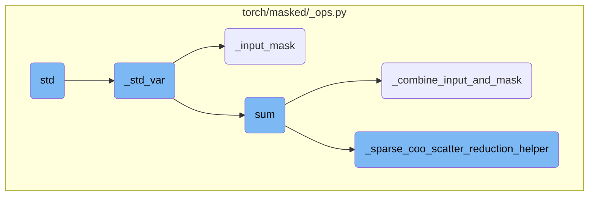
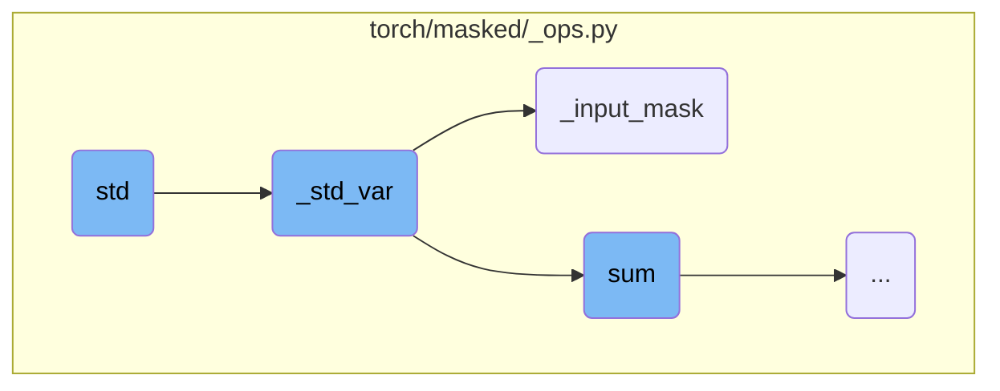
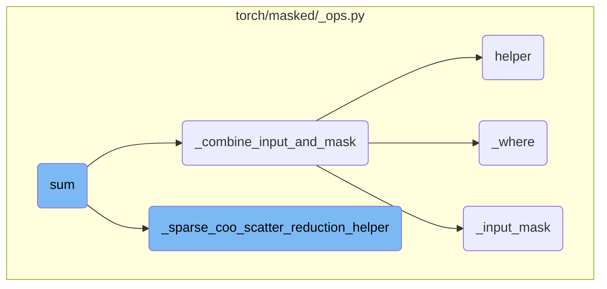
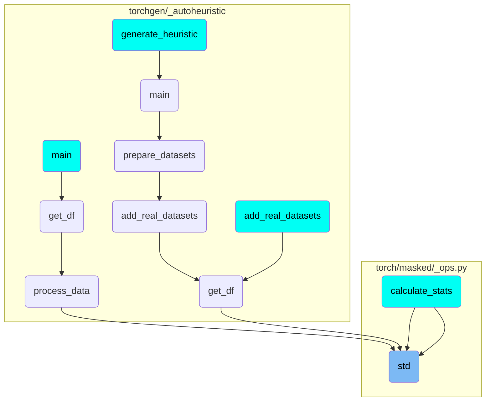

This document provides an overview of the flow for calculating the standard deviation of a masked tensor. It includes a high-level diagram and a detailed breakdown of the key functions involved in the process.

The flow for calculating the standard deviation starts with the `std` function, which calls `_std_var` to compute the variance. The `_std_var` function handles different data types, tensor layouts, and masks. It calculates the mean, subtracts it from the input, squares the result, and sums it up to get the variance. If `take_sqrt` is `True`, it returns the square root of the variance, which is the standard deviation. The `_input_mask` function ensures the mask is compatible with the input tensor, and `_combine_input_and_mask` applies the mask to the input. The `_sparse_coo_scatter_reduction_helper` handles reduction operations for sparse COO tensors, and `_where` ensures the correct values for masked-in elements.

Here is a high level diagram of the flow, showing only the most important functions:



# Flow drill down

First, we'll zoom into this section of the flow:



<SwmSnippet path="/torch/masked/_ops.py" line="1675">

---

## Calculating the standard deviation

The `std` function calculates the standard deviation of the input tensor. It calls the `_std_var` function with the `take_sqrt` parameter set to `True`, indicating that the square root of the variance should be taken to get the standard deviation.

```python
def std(
    input: Union[Tensor, MaskedTensor],
    dim: DimOrDims = None,
    unbiased: Optional[bool] = None,
    *,
    correction: Optional[int] = None,
    keepdim: Optional[bool] = False,
    dtype: Optional[DType] = None,
    mask: Optional[Tensor] = None,
) -> Tensor:
    """\
{reduction_signature}
{reduction_descr}
The identity value of sample standard deviation operation is undefined. The
elements of output tensor with strided layout, that correspond to
fully masked-out elements, have ``nan`` values.
{reduction_args}
{reduction_example}"""
    return _std_var(
```

---

</SwmSnippet>

<SwmSnippet path="/torch/masked/_ops.py" line="1571">

---

## Computing variance

The `_std_var` function computes the variance of the input tensor. It handles various cases such as different data types, tensor layouts, and the presence of a mask. The function calculates the mean, subtracts it from the input, squares the result, and then sums it up to get the total variance. If `take_sqrt` is `True`, it returns the square root of the variance, which is the standard deviation.

```python
def _std_var(
    input: Union[Tensor, MaskedTensor],
    dim: DimOrDims,
    unbiased: Optional[bool],
    *,
    correction_opt: Optional[Union[int, float]],
    keepdim: Optional[bool],
    dtype: Optional[DType],
    mask: Optional[Tensor],
    take_sqrt: Optional[bool],
) -> Tensor:
    assert (
        unbiased is None or correction_opt is None
    ), "Only one of unbiased and correction may be given"
    correction = 1.0
    if unbiased is not None:
        correction = 1.0 if unbiased else 0.0
    if correction_opt is not None:
        correction = sym_float(correction_opt)

    if dtype is None:
```

---

</SwmSnippet>

<SwmSnippet path="/torch/masked/_ops.py" line="858">

---

### Handling input masks

The `_input_mask` function ensures that the mask tensor is compatible with the input tensor. It adjusts the shape, layout, and data type of the mask to match the input tensor, ensuring that the mask can be correctly applied during the variance computation.

```python
def _input_mask(input: Union[Tensor, MaskedTensor], *args, **kwargs) -> Tensor:
    """Return canonical input mask.

    A canonical input mask is defined as a boolean mask tensor that
    shape and layout matches with the shape and the layout of the
    input.

    The canonical input mask is computed from the :attr:`mask` tensor
    content to meet the following criteria:

    1. The shape of the canonical input mask is the same as the shape
       of :attr:`input` tensor. If the mask tensor has a smaller shape
       than the shape of the :attr:`input`, broadcasting rules will be
       applied. Downcasting of mask is not supported.

    2. The layout of the canonical input mask is the same as the
       layout of the :attr:`input` tensor. If the mask has different
       layout, it will be converted to the expected layout.  In the
       case of sparse COO layout, the canonical input mask will be
       coalesced.

```

---

</SwmSnippet>

Now, lets zoom into this section of the flow:



<SwmSnippet path="/torch/masked/_ops.py" line="989">

---

## Combining Input and Mask

The function `_combine_input_and_mask` combines the input tensor with a mask. It ensures that masked-out elements are handled correctly by either returning the input directly if no mask is provided or applying the mask to the input. This is crucial for operations that need to consider masked elements, such as the `sum` function.

```python
def _combine_input_and_mask(
    op, input: Union[MaskedTensor, Tensor], mask, *args
) -> Tensor:
    def helper(input, mask):
        if mask is None:
            return input
        canonical_mask = _input_mask(input, mask=mask)
        if callable(op):
            fill_value = _reduction_identity(op.__name__, input, *args)
            return _where(canonical_mask, input, fill_value)
        else:
            raise ValueError(
                f"_combine_input_and_mask expected masked operation (got {type(op).__name__} object)"
            )

    class Combine(torch.autograd.Function):
        @staticmethod
        def forward(ctx, input, mask):
            """Return input with masked-out elements eliminated for the given operations."""
            ctx.save_for_backward(mask)

```

---

</SwmSnippet>

<SwmSnippet path="/torch/masked/_ops.py" line="992">

---

### Helper Function

The `helper` function within `_combine_input_and_mask` is responsible for applying the mask to the input tensor. It uses `_input_mask` to get a canonical mask and `_where` to combine the input and mask, filling masked-out elements with a reduction identity value.

```python
    def helper(input, mask):
        if mask is None:
            return input
        canonical_mask = _input_mask(input, mask=mask)
        if callable(op):
            fill_value = _reduction_identity(op.__name__, input, *args)
            return _where(canonical_mask, input, fill_value)
        else:
            raise ValueError(
                f"_combine_input_and_mask expected masked operation (got {type(op).__name__} object)"
            )
```

---

</SwmSnippet>

<SwmSnippet path="/torch/masked/_ops.py" line="608">

---

## Sparse COO Scatter Reduction Helper

The function `_sparse_coo_scatter_reduction_helper` handles reduction operations for sparse COO tensors. It supports various reduction operations like `sum`, `prod`, `amax`, and `amin`. The function ensures that the reduction is applied correctly across both sparse and dense dimensions, handling edge cases like empty dimensions and dtype promotion.

```python
def _sparse_coo_scatter_reduction_helper(
    op,
    mask_input: Tensor,
    dims: Tuple[int, ...],
    keepdim: bool,
    dtype: Optional[DType] = None,
) -> Tensor:
    reduce = op.__name__
    valid_reductions = ["sum", "prod", "amax", "amin"]
    if reduce not in valid_reductions:
        raise ValueError(
            f"op must be one of {' '.join(valid_reductions)}, but got {reduce} instead"
        )

    output_dtype = dtype
    values, indices = mask_input._values(), mask_input._indices()
    input_dims = mask_input.dim()
    num_sparse_dims = mask_input.sparse_dim()
    reduced_sparse_dims = []
    retained_sparse_dims = []
    reduced_dense_dims = []
```

---

</SwmSnippet>

<SwmSnippet path="/torch/masked/_ops.py" line="822">

---

## Where Function

The `_where` function is a specialized version of `torch.where` that supports sparse inputs. It ensures that the resulting tensor maintains the correct values for masked-in elements and replaces masked-out elements with a specified fill value. This function is essential for operations that need to handle sparse tensors correctly.

```python
def _where(mask: Tensor, input: Tensor, fill_value: Tensor) -> Tensor:
    """torch.where with sparse inputs support.

    _where implements the following invariant:

      _where(mask, input, fill_value).to_dense(fill_value) ==
        torch.where(mask.to_dense(), input.to_dense(), torch.full(input.shape, fill_value))

    where `a == b` means `assertEqual(a, b)`, mask is boolean sparse
    tensor, and `to_dense(fill_value)` is like `to_dense()` except
    that the unspecified elements are mapped to `fill_value` rather
    than to `0`.

    Returns a sparse tensor with the following features:

    - all specified elements correspond to masked-in elements that
      have the values of the input tensor. If there exists a masked-in
      element (as specified by mask) that is not specified in the
      input, in the result tensor, the corresponding element has value
      0. In the dense part of the sparse tensor, the masked-out
      elements are replaced with fill_value.
```

---

</SwmSnippet>

# Where is this flow used?

This flow is used multiple times in the codebase as represented in the following diagram:

(Note - these are only some of the entry points of this flow)



&nbsp;

*This is an auto-generated document by Swimm AI 🌊 and has not yet been verified by a human*

<SwmMeta version="3.0.0" repo-id="Z2l0aHViJTNBJTNBcHl0b3JjaC1hdXRvZG9jcy1kZW1vJTNBJTNBU3dpbW0tRGVtbw==" repo-name="pytorch-autodocs-demo"><sup>Powered by [Swimm](https://app.swimm.io/)</sup></SwmMeta>
