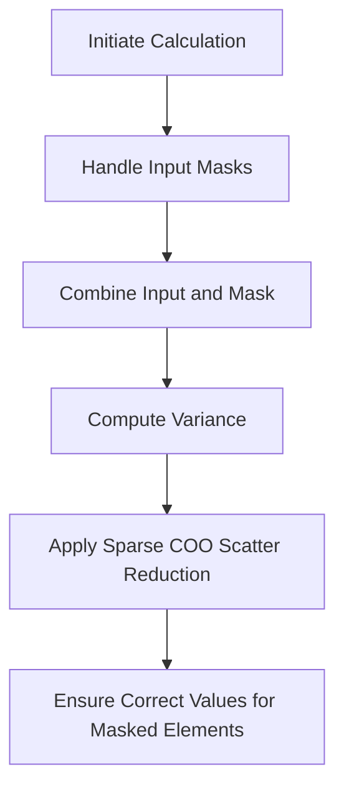

This document will cover the Standard Deviation Calculation Flow, which includes:

1. Initiating the Calculation
2. Handling Input Masks
3. Combining Input and Mask
4. Computing Variance
5. Applying Sparse COO Scatter Reduction
6. Ensuring Correct Values for Masked Elements

Technical document: <SwmLink doc-title="Standard Deviation Calculation Flow">[Standard Deviation Calculation Flow](/.swm/standard-deviation-calculation-flow.lnzlzd3b.sw.md)</SwmLink>

# [Initiating the Calculation](https://app.swimm.io/repos/Z2l0aHViJTNBJTNBcHl0b3JjaC1hdXRvZG9jcy1kZW1vJTNBJTNBU3dpbW0tRGVtbw==/docs/lnzlzd3b#calculating-the-standard-deviation)

The process begins with initiating the calculation of the standard deviation. This is done by calling a function that sets the necessary parameters and prepares the input data. The primary goal here is to ensure that the input tensor is ready for further processing, including any necessary adjustments for data type and layout.

# [Handling Input Masks](https://app.swimm.io/repos/Z2l0aHViJTNBJTNBcHl0b3JjaC1hdXRvZG9jcy1kZW1vJTNBJTNBU3dpbW0tRGVtbw==/docs/lnzlzd3b#handling-input-masks)

The next step involves handling input masks. Masks are used to specify which elements of the input tensor should be included in the calculation. The system ensures that the mask is compatible with the input tensor by adjusting its shape, layout, and data type. This step is crucial for correctly applying the mask during the variance computation.

# [Combining Input and Mask](https://app.swimm.io/repos/Z2l0aHViJTNBJTNBcHl0b3JjaC1hdXRvZG9jcy1kZW1vJTNBJTNBU3dpbW0tRGVtbw==/docs/lnzlzd3b#combining-input-and-mask)

In this step, the input tensor is combined with the mask. If no mask is provided, the input is used directly. Otherwise, the mask is applied to the input tensor, ensuring that masked-out elements are handled correctly. This is important for operations that need to consider masked elements, such as summing the values.

# [Computing Variance](https://app.swimm.io/repos/Z2l0aHViJTNBJTNBcHl0b3JjaC1hdXRvZG9jcy1kZW1vJTNBJTNBU3dpbW0tRGVtbw==/docs/lnzlzd3b#computing-variance)

The variance of the input tensor is computed next. This involves calculating the mean of the input tensor, subtracting the mean from each element, squaring the result, and summing these squared differences. The variance provides a measure of how much the values in the tensor deviate from the mean.

# [Applying Sparse COO Scatter Reduction](https://app.swimm.io/repos/Z2l0aHViJTNBJTNBcHl0b3JjaC1hdXRvZG9jcy1kZW1vJTNBJTNBU3dpbW0tRGVtbw==/docs/lnzlzd3b#sparse-coo-scatter-reduction-helper)

For tensors with sparse COO (Coordinate) format, a specialized reduction operation is applied. This step ensures that the reduction is correctly performed across both sparse and dense dimensions, handling edge cases like empty dimensions and promoting the data type as needed.

# [Ensuring Correct Values for Masked Elements](https://app.swimm.io/repos/Z2l0aHViJTNBJTNBcHl0b3JjaC1hdXRvZG9jcy1kZW1vJTNBJTNBU3dpbW0tRGVtbw==/docs/lnzlzd3b#where-function)

Finally, the system ensures that the resulting tensor maintains the correct values for masked-in elements. Masked-out elements are replaced with a specified fill value. This step is essential for maintaining the integrity of the data, especially when dealing with sparse tensors.

&nbsp;

*This is an auto-generated document by Swimm AI 🌊 and has not yet been verified by a human*

<SwmMeta version="3.0.0" repo-id="Z2l0aHViJTNBJTNBcHl0b3JjaC1hdXRvZG9jcy1kZW1vJTNBJTNBU3dpbW0tRGVtbw==" repo-name="pytorch-autodocs-demo">Powered by [Swimm](https://app.swimm.io/)</SwmMeta>
