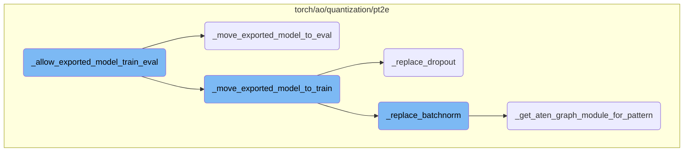
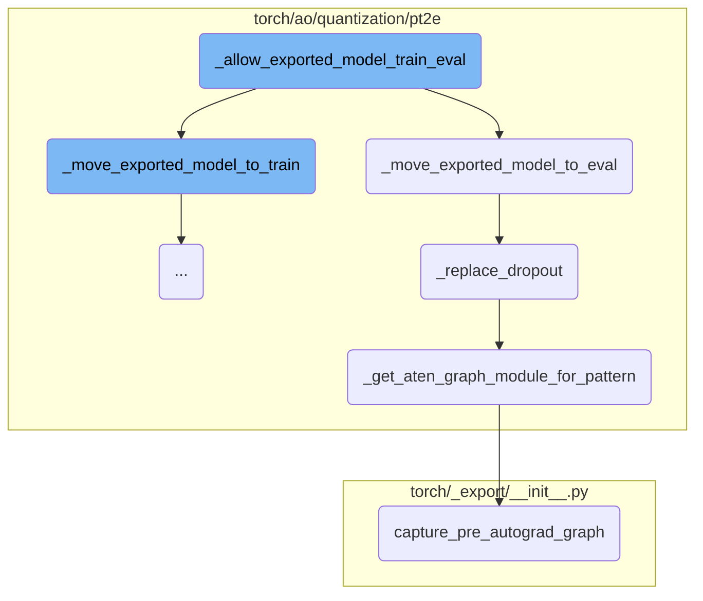
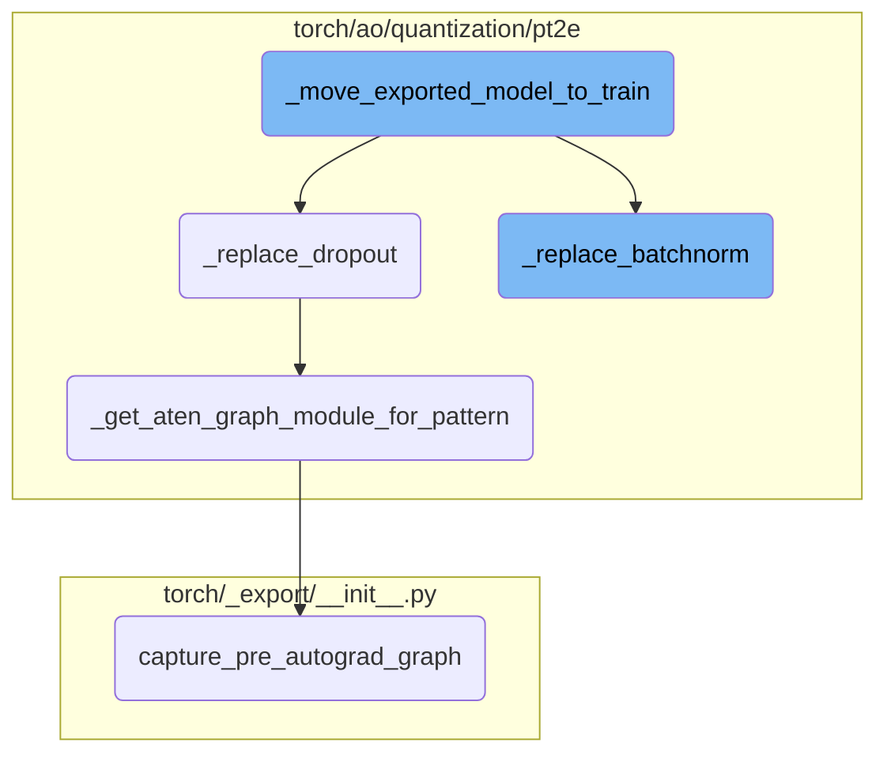

This document explains the purpose and functionality of the `_allow_exported_model_train_eval` function. It allows users to switch an exported model between training and evaluation modes, but with limitations. The document also covers the related functions that handle specific operations like dropout and batch normalization.

The flow starts with the `_allow_exported_model_train_eval` function, which lets users switch an exported model between training and evaluation modes. However, this switch only affects certain operations like dropout and batch normalization. When switching to training mode, the `_move_exported_model_to_train` function is called, which updates the model to behave correctly for training. Similarly, switching to evaluation mode calls the `_move_exported_model_to_eval` function. These functions ensure that dropout and batch normalization layers behave as expected by manually rewriting their patterns in the model's graph.

Here is a high level diagram of the flow, showing only the most important functions:



# Flow drill down

First, we'll zoom into this section of the flow:



<SwmSnippet path="/torch/ao/quantization/pt2e/export_utils.py" line="198">

---

## \_allow_exported_model_train_eval

`_allow_exported_model_train_eval` allows users to call `model.train()` and `model.eval()` on an exported model, but limits the effect of changing behavior between the two modes to special operations like dropout and batchnorm. This function does not achieve the same effect as `model.train()` and `model.eval()` in eager models, as user code branching on the `training` flag will not function correctly. The function modifies the model's `train` and `eval` methods to call `_move_exported_model_to_train` and `_move_exported_model_to_eval`, respectively.

```python
def _allow_exported_model_train_eval(model: torch.fx.GraphModule):
    """
    Allow users to call `model.train()` and `model.eval()` on an exported model,
    but with the effect of changing behavior between the two modes limited to special
    ops only, which are currently dropout and batchnorm.

    Note: This does not achieve the same effect as what `model.train()` and `model.eval()`
    does in eager models, but only provides an approximation. In particular, user code
    branching on `training` flag will not function correctly in general because the branch
    is already specialized at export time. Additionally, other ops beyond dropout and batchnorm
    that have different train/eval behavior will also not be converted properly.
    """

    def _train(self, mode: bool = True):
        if mode:
            _move_exported_model_to_train(self)
        else:
            _move_exported_model_to_eval(self)

    def _eval(self):
        _move_exported_model_to_eval(self)
```

---

</SwmSnippet>

<SwmSnippet path="/torch/ao/quantization/pt2e/export_utils.py" line="173">

---

### \_move_exported_model_to_eval

`_move_exported_model_to_eval` moves an exported `GraphModule` to evaluation mode. This is equivalent to calling `model.eval()` but only for certain special operations like dropout and batchnorm. It ensures that dropout and batchnorm layers behave correctly during inference by calling `_replace_dropout` and `_replace_batchnorm` with `train_to_eval` set to `True`.

```python
# TODO: expose these under this namespace?
def _move_exported_model_to_eval(model: torch.fx.GraphModule):
    """
    Move an exported GraphModule to eval mode.

    This is equivalent to model.eval() but only for certain special ops like dropout, batchnorm.
    QAT users should call this before performing inference on the model.
    """
    _replace_dropout(model, train_to_eval=True)
    _replace_batchnorm(model, train_to_eval=True)
    return model
```

---

</SwmSnippet>

<SwmSnippet path="/torch/ao/quantization/pt2e/export_utils.py" line="38">

---

### \_replace_dropout

`_replace_dropout` switches dropout patterns in the model between train and eval modes. Dropout has different behavior in train vs eval mode, and this function rewrites the aten dropout patterns manually to achieve the same effect. It uses `_get_aten_graph_module_for_pattern` to match and replace the dropout patterns in the model's graph.

```python
def _replace_dropout(m: torch.fx.GraphModule, train_to_eval: bool):
    """
    Switch dropout patterns in the model between train and eval modes.

    Dropout has different behavior in train vs eval mode. For exported models,
    however, calling `model.train()` or `model.eval()` does not automatically switch
    the dropout behavior between the two modes, so here we need to rewrite the aten
    dropout patterns manually to achieve the same effect.

    See https://github.com/pytorch/pytorch/issues/103681.
    """
    # Avoid circular dependencies
    from .utils import _get_aten_graph_module_for_pattern

    # Needed to ensure subgraph matches are self-contained
    m.graph.eliminate_dead_code()
    m.recompile()

    for inplace in [False, True]:

        def dropout_train(x):
```

---

</SwmSnippet>

<SwmSnippet path="/torch/ao/quantization/pt2e/utils.py" line="351">

---

### \_get_aten_graph_module_for_pattern

`_get_aten_graph_module_for_pattern` converts a given pattern to an FX graph with decomposed aten operations. This function is used to create match and replacement patterns for dropout in `_replace_dropout`. It captures the pre-autograd graph of the pattern and eliminates any dead code before returning the aten pattern.

```python
def _get_aten_graph_module_for_pattern(
    pattern: Callable,
    example_inputs: Tuple[Any, ...],
    is_cuda: bool = False,
    **kwargs,
) -> GraphModule:
    """
    Convert the pattern to an FX graph with decomposed aten ops.
    """
    if is_cuda:
        example_inputs = tuple(
            [x.cuda() if isinstance(x, torch.Tensor) else x for x in example_inputs]
        )
    aten_pattern = capture_pre_autograd_graph(
        pattern,
        example_inputs,
        kwargs,
    )
    aten_pattern.graph.eliminate_dead_code()
    aten_pattern.recompile()

```

---

</SwmSnippet>

<SwmSnippet path="/torch/_export/__init__.py" line="72">

---

### capture_pre_autograd_graph

`capture_pre_autograd_graph` captures the pre-autograd graph of a given pattern with specified example inputs. This function is used in `_get_aten_graph_module_for_pattern` to obtain the FX graph representation of the pattern, which is then used for pattern matching and replacement in the model's graph.

```python
def capture_pre_autograd_graph(
    f: torch.nn.Module,
    args: Tuple[Any],
    kwargs: Optional[Dict[str, Any]] = None,
    dynamic_shapes: Optional[Union[Dict[str, Any], Tuple[Any]]] = None,
) -> torch.nn.Module:
    """
    A helper function that is intended to trace a module before any pre-autograd
    decomposition is run. The produced module will be "non-functional" and
    composed of aten operators. Later this API will be deleted in favor of more general
    torch.export API.

    Args:
      f: nn.Module to be traced

      args: example positional inputs.

      kwargs: optional example keyword inputs.

      dynamic_shapes: Should either be:
         1) a dict from argument names of ``f`` to their dynamic shape specifications,
```

---

</SwmSnippet>

Now, lets zoom into this section of the flow:



<SwmSnippet path="/torch/ao/quantization/pt2e/export_utils.py" line="193">

---

## Moving Exported Model to Train Mode

The function `_move_exported_model_to_train` is responsible for transitioning an exported `GraphModule` to train mode. This is particularly important for operations like dropout and batch normalization, which behave differently during training and evaluation. The function calls `_replace_dropout` and `_replace_batchnorm` with `train_to_eval` set to `False` to ensure these operations are correctly configured for training.

```python
    _replace_dropout(model, train_to_eval=False)
    _replace_batchnorm(model, train_to_eval=False)
    return model
```

---

</SwmSnippet>

<SwmSnippet path="/torch/ao/quantization/pt2e/export_utils.py" line="92">

---

### Replacing BatchNorm

The function `_replace_batchnorm` switches batch normalization patterns between train and eval modes. This is necessary because calling `model.train()` or `model.eval()` does not automatically update batch normalization behavior in exported models. The function manually rewrites the aten batch normalization patterns to achieve the desired effect. It uses helper functions to define the train and eval modes for batch normalization and then replaces the patterns in the model accordingly.

```python
def _replace_batchnorm(m: torch.fx.GraphModule, train_to_eval: bool):
    """
    Switch batchnorm patterns in the model between train and eval modes.

    Batchnorm has different behavior in train vs eval mode. For exported models,
    however, calling `model.train()` or `model.eval()` does not automatically switch
    the batchnorm behavior between the two modes, so here we need to rewrite the aten
    batchnorm patterns manually to achieve the same effect.
    """
    # TODO(Leslie): This function still fails to support custom momentum and eps value.
    # Enable this support in future updates.

    # Avoid circular dependencies
    from .utils import _get_aten_graph_module_for_pattern

    # Needed to ensure subgraph matches are self-contained
    m.graph.eliminate_dead_code()
    m.recompile()

    def bn_train(
        x: torch.Tensor,
```

---

</SwmSnippet>

&nbsp;

*This is an auto-generated document by Swimm AI 🌊 and has not yet been verified by a human*

<SwmMeta version="3.0.0" repo-id="Z2l0aHViJTNBJTNBcHl0b3JjaC1hdXRvZG9jcy1kZW1vJTNBJTNBU3dpbW0tRGVtbw==" repo-name="pytorch-autodocs-demo"><sup>Powered by [Swimm](https://app.swimm.io/)</sup></SwmMeta>
