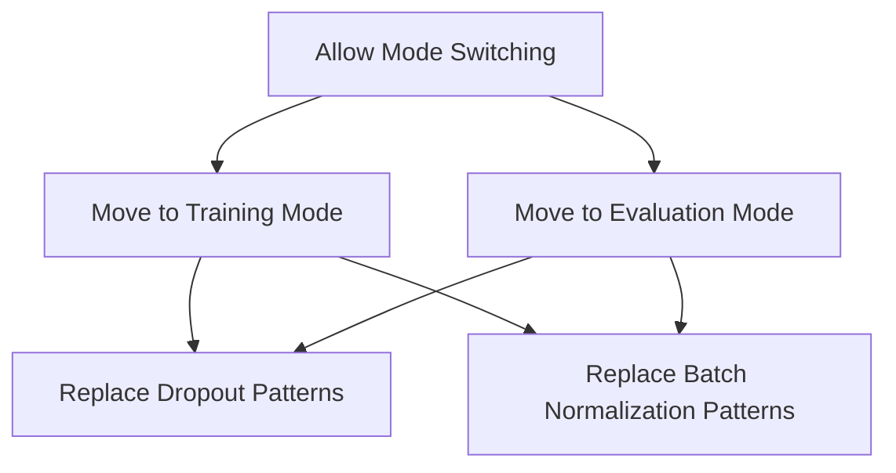

This document will cover the process of switching exported model modes, which includes:

1. Allowing mode switching
2. Moving to training mode
3. Moving to evaluation mode
4. Replacing dropout patterns
5. Replacing batch normalization patterns.

Technical document: <SwmLink doc-title="Switching Exported Model Modes">[Switching Exported Model Modes](/.swm/switching-exported-model-modes.0kq43tar.sw.md)</SwmLink>

# [Allowing Mode Switching](https://app.swimm.io/repos/Z2l0aHViJTNBJTNBcHl0b3JjaC1hdXRvZG9jcy1kZW1vJTNBJTNBU3dpbW0tRGVtbw==/docs/0kq43tar#_allow_exported_model_train_eval)

The process begins with allowing users to switch an exported model between training and evaluation modes. This is done through a function that modifies the model's behavior for specific operations like dropout and batch normalization. This function does not fully replicate the behavior of `model.train()` and `model.eval()` in eager models, but it provides an approximation. The main purpose is to enable users to call `model.train()` and `model.eval()` on an exported model, affecting only certain operations.

# [Moving to Training Mode](https://app.swimm.io/repos/Z2l0aHViJTNBJTNBcHl0b3JjaC1hdXRvZG9jcy1kZW1vJTNBJTNBU3dpbW0tRGVtbw==/docs/0kq43tar#_move_exported_model_to_train)

When switching to training mode, the model needs to update its behavior to correctly handle training-specific operations. This involves calling a function that ensures operations like dropout and batch normalization are configured for training. The function manually rewrites the patterns in the model's graph to achieve the desired training behavior.

# [Moving to Evaluation Mode](https://app.swimm.io/repos/Z2l0aHViJTNBJTNBcHl0b3JjaC1hdXRvZG9jcy1kZW1vJTNBJTNBU3dpbW0tRGVtbw==/docs/0kq43tar#_move_exported_model_to_eval)

Similarly, when switching to evaluation mode, the model needs to update its behavior for inference. This involves calling a function that ensures operations like dropout and batch normalization are configured for evaluation. The function manually rewrites the patterns in the model's graph to achieve the desired evaluation behavior.

# [Replacing Dropout Patterns](https://app.swimm.io/repos/Z2l0aHViJTNBJTNBcHl0b3JjaC1hdXRvZG9jcy1kZW1vJTNBJTNBU3dpbW0tRGVtbw==/docs/0kq43tar#_replace_dropout)

Dropout behaves differently during training and evaluation. To switch between these modes, the model's dropout patterns need to be manually rewritten. This function identifies and replaces the dropout patterns in the model's graph to ensure they behave correctly for the specified mode.

# [Replacing Batch Normalization Patterns](https://app.swimm.io/repos/Z2l0aHViJTNBJTNBcHl0b3JjaC1hdXRvZG9jcy1kZW1vJTNBJTNBU3dpbW0tRGVtbw==/docs/0kq43tar#_replace_batchnorm)

Batch normalization also behaves differently during training and evaluation. Similar to dropout, the model's batch normalization patterns need to be manually rewritten to switch between these modes. This function identifies and replaces the batch normalization patterns in the model's graph to ensure they behave correctly for the specified mode.

&nbsp;

*This is an auto-generated document by Swimm AI 🌊 and has not yet been verified by a human*

<SwmMeta version="3.0.0" repo-id="Z2l0aHViJTNBJTNBcHl0b3JjaC1hdXRvZG9jcy1kZW1vJTNBJTNBU3dpbW0tRGVtbw==" repo-name="pytorch-autodocs-demo">Powered by [Swimm](https://app.swimm.io/)</SwmMeta>
