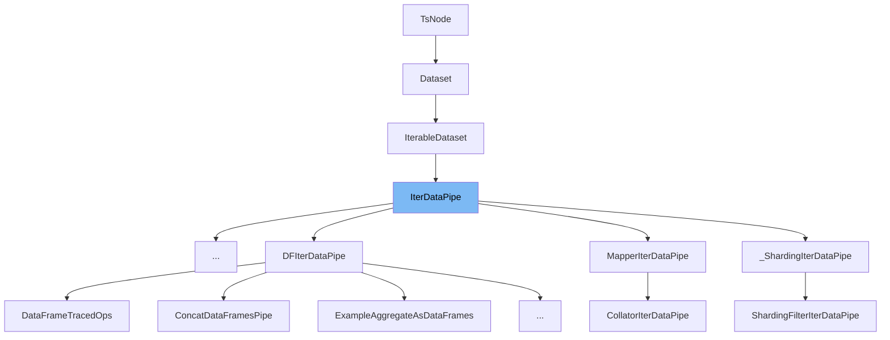

This document will cover the class <SwmToken path="/torch/utils/data/datapipes/datapipe.py" pos="54:2:2" line-data="class IterDataPipe(IterableDataset[_T_co], metaclass=_IterDataPipeMeta):">`IterDataPipe`</SwmToken> in the file <SwmPath>[torch/utils/data/datapipes/datapipe.py](/torch/utils/data/datapipes/datapipe.py)</SwmPath>. We will cover:

1. What <SwmToken path="/torch/utils/data/datapipes/datapipe.py" pos="54:2:2" line-data="class IterDataPipe(IterableDataset[_T_co], metaclass=_IterDataPipeMeta):">`IterDataPipe`</SwmToken> is and what it is used for.
2. The variables and functions defined in <SwmToken path="/torch/utils/data/datapipes/datapipe.py" pos="54:2:2" line-data="class IterDataPipe(IterableDataset[_T_co], metaclass=_IterDataPipeMeta):">`IterDataPipe`</SwmToken>.
3. An example of how to use <SwmToken path="/torch/utils/data/datapipes/datapipe.py" pos="54:2:2" line-data="class IterDataPipe(IterableDataset[_T_co], metaclass=_IterDataPipeMeta):">`IterDataPipe`</SwmToken> in <SwmToken path="/torch/utils/data/datapipes/dataframe/datapipes.py" pos="20:2:2" line-data="class DataFramesAsTuplesPipe(IterDataPipe):">`DataFramesAsTuplesPipe`</SwmToken>.



# What is <SwmToken path="/torch/utils/data/datapipes/datapipe.py" pos="54:2:2" line-data="class IterDataPipe(IterableDataset[_T_co], metaclass=_IterDataPipeMeta):">`IterDataPipe`</SwmToken>

<SwmToken path="/torch/utils/data/datapipes/datapipe.py" pos="54:2:2" line-data="class IterDataPipe(IterableDataset[_T_co], metaclass=_IterDataPipeMeta):">`IterDataPipe`</SwmToken> is a class in <SwmPath>[torch/utils/data/datapipes/datapipe.py](/torch/utils/data/datapipes/datapipe.py)</SwmPath> that represents an <SwmToken path="/torch/utils/data/datapipes/datapipe.py" pos="56:1:3" line-data="    Iterable-style DataPipe.">`Iterable-style`</SwmToken> <SwmToken path="/torch/utils/data/datapipes/datapipe.py" pos="159:9:9" line-data="                f&quot;Unable to add DataPipe function name {function_name} as it is already taken&quot;">`DataPipe`</SwmToken>. It is particularly useful when data comes from a stream or when the number of samples is too large to fit in memory. <SwmToken path="/torch/utils/data/datapipes/datapipe.py" pos="54:2:2" line-data="class IterDataPipe(IterableDataset[_T_co], metaclass=_IterDataPipeMeta):">`IterDataPipe`</SwmToken> is lazily initialized, meaning its elements are computed only when <SwmToken path="/torch/utils/data/datapipes/datapipe.py" pos="61:12:14" line-data="    elements are computed only when ``next()`` is called on the iterator of an ``IterDataPipe``.">`next()`</SwmToken> is called on its iterator. Subclasses of <SwmToken path="/torch/utils/data/datapipes/datapipe.py" pos="54:2:2" line-data="class IterDataPipe(IterableDataset[_T_co], metaclass=_IterDataPipeMeta):">`IterDataPipe`</SwmToken> should override the <SwmToken path="/torch/utils/data/datapipes/datapipe.py" pos="132:3:3" line-data="    def __iter__(self) -&gt; Iterator[_T_co]:">`__iter__`</SwmToken> method to return an iterator of samples. The <SwmToken path="/torch/utils/data/datapipes/datapipe.py" pos="227:3:3" line-data="    def reset(self) -&gt; None:">`reset`</SwmToken> method can also be overridden to reset buffers, pointers, and state variables.

<SwmSnippet path="/torch/utils/data/datapipes/datapipe.py" line="122">

---

# Variables and functions

The variable <SwmToken path="/torch/utils/data/datapipes/datapipe.py" pos="122:1:1" line-data="    functions: Dict[str, Callable] = {}">`functions`</SwmToken> is a dictionary that stores callable functions. These functions can be registered and accessed dynamically.

```python
    functions: Dict[str, Callable] = {}
```

---

</SwmSnippet>

<SwmSnippet path="/torch/utils/data/datapipes/datapipe.py" line="123">

---

The variable <SwmToken path="/torch/utils/data/datapipes/datapipe.py" pos="123:1:1" line-data="    reduce_ex_hook: Optional[Callable] = None">`reduce_ex_hook`</SwmToken> is an optional callable that can be used to customize the behavior of the <SwmToken path="/torch/utils/data/datapipes/datapipe.py" pos="191:3:3" line-data="    def __reduce_ex__(self, *args, **kwargs):">`__reduce_ex__`</SwmToken> method for serialization.

```python
    reduce_ex_hook: Optional[Callable] = None
```

---

</SwmSnippet>

<SwmSnippet path="/torch/utils/data/datapipes/datapipe.py" line="124">

---

The variable <SwmToken path="/torch/utils/data/datapipes/datapipe.py" pos="124:1:1" line-data="    getstate_hook: Optional[Callable] = None">`getstate_hook`</SwmToken> is an optional callable that can be used to customize the behavior of the <SwmToken path="/torch/utils/data/datapipes/datapipe.py" pos="179:3:3" line-data="    def __getstate__(self):">`__getstate__`</SwmToken> method for serialization.

```python
    getstate_hook: Optional[Callable] = None
```

---

</SwmSnippet>

<SwmSnippet path="/torch/utils/data/datapipes/datapipe.py" line="125">

---

The variable <SwmToken path="/torch/utils/data/datapipes/datapipe.py" pos="125:1:1" line-data="    str_hook: Optional[Callable] = None">`str_hook`</SwmToken> is an optional callable that can be used to customize the string representation of the <SwmToken path="/torch/utils/data/datapipes/datapipe.py" pos="54:2:2" line-data="class IterDataPipe(IterableDataset[_T_co], metaclass=_IterDataPipeMeta):">`IterDataPipe`</SwmToken> object.

```python
    str_hook: Optional[Callable] = None
```

---

</SwmSnippet>

<SwmSnippet path="/torch/utils/data/datapipes/datapipe.py" line="126">

---

The variable <SwmToken path="/torch/utils/data/datapipes/datapipe.py" pos="126:1:1" line-data="    repr_hook: Optional[Callable] = None">`repr_hook`</SwmToken> is an optional callable that can be used to customize the `repr` representation of the <SwmToken path="/torch/utils/data/datapipes/datapipe.py" pos="54:2:2" line-data="class IterDataPipe(IterableDataset[_T_co], metaclass=_IterDataPipeMeta):">`IterDataPipe`</SwmToken> object.

```python
    repr_hook: Optional[Callable] = None
```

---

</SwmSnippet>

<SwmSnippet path="/torch/utils/data/datapipes/datapipe.py" line="127">

---

The variable <SwmToken path="/torch/utils/data/datapipes/datapipe.py" pos="127:1:1" line-data="    _valid_iterator_id: Optional[int] = None">`_valid_iterator_id`</SwmToken> is an optional integer that stores the ID of the valid iterator. This is used to enforce the single iterator constraint.

```python
    _valid_iterator_id: Optional[int] = None
```

---

</SwmSnippet>

<SwmSnippet path="/torch/utils/data/datapipes/datapipe.py" line="128">

---

The variable <SwmToken path="/torch/utils/data/datapipes/datapipe.py" pos="128:1:1" line-data="    _number_of_samples_yielded: int = 0">`_number_of_samples_yielded`</SwmToken> is an integer that keeps track of the number of samples yielded by the <SwmToken path="/torch/utils/data/datapipes/datapipe.py" pos="54:2:2" line-data="class IterDataPipe(IterableDataset[_T_co], metaclass=_IterDataPipeMeta):">`IterDataPipe`</SwmToken>.

```python
    _number_of_samples_yielded: int = 0
```

---

</SwmSnippet>

<SwmSnippet path="/torch/utils/data/datapipes/datapipe.py" line="129">

---

The variable <SwmToken path="/torch/utils/data/datapipes/datapipe.py" pos="129:1:1" line-data="    _snapshot_state: _SnapshotState = _SnapshotState.NotStarted">`_snapshot_state`</SwmToken> is an instance of <SwmToken path="/torch/utils/data/datapipes/datapipe.py" pos="129:4:4" line-data="    _snapshot_state: _SnapshotState = _SnapshotState.NotStarted">`_SnapshotState`</SwmToken> that keeps track of the snapshot state of the <SwmToken path="/torch/utils/data/datapipes/datapipe.py" pos="54:2:2" line-data="class IterDataPipe(IterableDataset[_T_co], metaclass=_IterDataPipeMeta):">`IterDataPipe`</SwmToken>.

```python
    _snapshot_state: _SnapshotState = _SnapshotState.NotStarted
```

---

</SwmSnippet>

<SwmSnippet path="/torch/utils/data/datapipes/datapipe.py" line="130">

---

The variable <SwmToken path="/torch/utils/data/datapipes/datapipe.py" pos="130:1:1" line-data="    _fast_forward_iterator: Optional[Iterator] = None">`_fast_forward_iterator`</SwmToken> is an optional iterator used for fast-forwarding the <SwmToken path="/torch/utils/data/datapipes/datapipe.py" pos="54:2:2" line-data="class IterDataPipe(IterableDataset[_T_co], metaclass=_IterDataPipeMeta):">`IterDataPipe`</SwmToken>.

```python
    _fast_forward_iterator: Optional[Iterator] = None
```

---

</SwmSnippet>

<SwmSnippet path="/torch/utils/data/datapipes/datapipe.py" line="132">

---

The <SwmToken path="/torch/utils/data/datapipes/datapipe.py" pos="132:3:3" line-data="    def __iter__(self) -&gt; Iterator[_T_co]:">`__iter__`</SwmToken> method returns an iterator for the <SwmToken path="/torch/utils/data/datapipes/datapipe.py" pos="54:2:2" line-data="class IterDataPipe(IterableDataset[_T_co], metaclass=_IterDataPipeMeta):">`IterDataPipe`</SwmToken>. Subclasses should override this method to return an iterator of samples.

```python
    def __iter__(self) -> Iterator[_T_co]:
        return self
```

---

</SwmSnippet>

<SwmSnippet path="/torch/utils/data/datapipes/datapipe.py" line="135">

---

The <SwmToken path="/torch/utils/data/datapipes/datapipe.py" pos="135:3:3" line-data="    def __getattr__(self, attribute_name):">`__getattr__`</SwmToken> method allows dynamic access to functions registered in the <SwmToken path="/torch/utils/data/datapipes/datapipe.py" pos="136:9:9" line-data="        if attribute_name in IterDataPipe.functions:">`functions`</SwmToken> dictionary. If the requested attribute is a deprecated function, a deprecation warning is issued.

```python
    def __getattr__(self, attribute_name):
        if attribute_name in IterDataPipe.functions:
            if attribute_name in _iter_deprecated_functional_names:
                kwargs = _iter_deprecated_functional_names[attribute_name]
                _deprecation_warning(**kwargs)
            f = IterDataPipe.functions[attribute_name]
            function = functools.partial(f, self)
            functools.update_wrapper(wrapper=function, wrapped=f, assigned=("__doc__",))
            return function
        else:
            raise AttributeError(
                f"'{self.__class__.__name__}' object has no attribute '{attribute_name}"
            )
```

---

</SwmSnippet>

<SwmSnippet path="/torch/utils/data/datapipes/datapipe.py" line="149">

---

The <SwmToken path="/torch/utils/data/datapipes/datapipe.py" pos="150:3:3" line-data="    def register_function(cls, function_name, function):">`register_function`</SwmToken> class method registers a function in the <SwmToken path="/torch/utils/data/datapipes/datapipe.py" pos="151:3:3" line-data="        cls.functions[function_name] = function">`functions`</SwmToken> dictionary.

```python
    @classmethod
    def register_function(cls, function_name, function):
        cls.functions[function_name] = function
```

---

</SwmSnippet>

<SwmSnippet path="/torch/utils/data/datapipes/datapipe.py" line="153">

---

The <SwmToken path="/torch/utils/data/datapipes/datapipe.py" pos="154:3:3" line-data="    def register_datapipe_as_function(">`register_datapipe_as_function`</SwmToken> class method registers a <SwmToken path="/torch/utils/data/datapipes/datapipe.py" pos="159:9:9" line-data="                f&quot;Unable to add DataPipe function name {function_name} as it is already taken&quot;">`DataPipe`</SwmToken> class as a function in the <SwmToken path="/torch/utils/data/datapipes/datapipe.py" pos="157:9:9" line-data="        if function_name in cls.functions:">`functions`</SwmToken> dictionary. It also supports enabling <SwmToken path="/torch/utils/data/datapipes/dataframe/datapipes.py" pos="5:10:10" line-data="from torch.utils.data.datapipes.dataframe import dataframe_wrapper as df_wrapper">`dataframe`</SwmToken> API tracing.

```python
    @classmethod
    def register_datapipe_as_function(
        cls, function_name, cls_to_register, enable_df_api_tracing=False
    ):
        if function_name in cls.functions:
            raise Exception(  # noqa: TRY002
                f"Unable to add DataPipe function name {function_name} as it is already taken"
            )

        def class_function(cls, enable_df_api_tracing, source_dp, *args, **kwargs):
            result_pipe = cls(source_dp, *args, **kwargs)
            if isinstance(result_pipe, IterDataPipe):
                if enable_df_api_tracing or isinstance(source_dp, DFIterDataPipe):
                    if function_name not in UNTRACABLE_DATAFRAME_PIPES:
                        result_pipe = result_pipe.trace_as_dataframe()

            return result_pipe

        function = functools.partial(
            class_function, cls_to_register, enable_df_api_tracing
        )
```

---

</SwmSnippet>

<SwmSnippet path="/torch/utils/data/datapipes/datapipe.py" line="179">

---

The <SwmToken path="/torch/utils/data/datapipes/datapipe.py" pos="179:3:3" line-data="    def __getstate__(self):">`__getstate__`</SwmToken> method customizes the serialization of the <SwmToken path="/torch/utils/data/datapipes/datapipe.py" pos="187:3:3" line-data="        if IterDataPipe.getstate_hook is not None:">`IterDataPipe`</SwmToken> object. It supports serializing `lambda` functions when <SwmToken path="/torch/utils/data/datapipes/datapipe.py" pos="181:12:12" line-data="        Serialize `lambda` functions when `dill` is available.">`dill`</SwmToken> is available.

```python
    def __getstate__(self):
        """
        Serialize `lambda` functions when `dill` is available.

        If this doesn't cover your custom DataPipe's use case, consider writing custom methods for
        `__getstate__` and `__setstate__`, or use `pickle.dumps` for serialization.
        """
        state = self.__dict__
        if IterDataPipe.getstate_hook is not None:
            return IterDataPipe.getstate_hook(state)
        return state
```

---

</SwmSnippet>

<SwmSnippet path="/torch/utils/data/datapipes/datapipe.py" line="191">

---

The <SwmToken path="/torch/utils/data/datapipes/datapipe.py" pos="191:3:3" line-data="    def __reduce_ex__(self, *args, **kwargs):">`__reduce_ex__`</SwmToken> method customizes the behavior of the <SwmToken path="/torch/utils/data/datapipes/datapipe.py" pos="191:3:3" line-data="    def __reduce_ex__(self, *args, **kwargs):">`__reduce_ex__`</SwmToken> method for serialization. It supports using a custom <SwmToken path="/torch/utils/data/datapipes/datapipe.py" pos="192:5:5" line-data="        if IterDataPipe.reduce_ex_hook is not None:">`reduce_ex_hook`</SwmToken> if provided.

```python
    def __reduce_ex__(self, *args, **kwargs):
        if IterDataPipe.reduce_ex_hook is not None:
            try:
                return IterDataPipe.reduce_ex_hook(self)
            except NotImplementedError:
                pass
        return super().__reduce_ex__(*args, **kwargs)
```

---

</SwmSnippet>

<SwmSnippet path="/torch/utils/data/datapipes/datapipe.py" line="199">

---

The <SwmToken path="/torch/utils/data/datapipes/datapipe.py" pos="200:3:3" line-data="    def set_getstate_hook(cls, hook_fn):">`set_getstate_hook`</SwmToken> class method sets a custom <SwmToken path="/torch/utils/data/datapipes/datapipe.py" pos="201:5:5" line-data="        if IterDataPipe.getstate_hook is not None and hook_fn is not None:">`getstate_hook`</SwmToken> for the <SwmToken path="/torch/utils/data/datapipes/datapipe.py" pos="201:3:3" line-data="        if IterDataPipe.getstate_hook is not None and hook_fn is not None:">`IterDataPipe`</SwmToken> class.

```python
    @classmethod
    def set_getstate_hook(cls, hook_fn):
        if IterDataPipe.getstate_hook is not None and hook_fn is not None:
            raise RuntimeError("Attempt to override existing getstate_hook")
        IterDataPipe.getstate_hook = hook_fn
```

---

</SwmSnippet>

<SwmSnippet path="/torch/utils/data/datapipes/datapipe.py" line="205">

---

The <SwmToken path="/torch/utils/data/datapipes/datapipe.py" pos="206:3:3" line-data="    def set_reduce_ex_hook(cls, hook_fn):">`set_reduce_ex_hook`</SwmToken> class method sets a custom <SwmToken path="/torch/utils/data/datapipes/datapipe.py" pos="207:5:5" line-data="        if IterDataPipe.reduce_ex_hook is not None and hook_fn is not None:">`reduce_ex_hook`</SwmToken> for the <SwmToken path="/torch/utils/data/datapipes/datapipe.py" pos="207:3:3" line-data="        if IterDataPipe.reduce_ex_hook is not None and hook_fn is not None:">`IterDataPipe`</SwmToken> class.

```python
    @classmethod
    def set_reduce_ex_hook(cls, hook_fn):
        if IterDataPipe.reduce_ex_hook is not None and hook_fn is not None:
            raise RuntimeError("Attempt to override existing reduce_ex_hook")
        IterDataPipe.reduce_ex_hook = hook_fn
```

---

</SwmSnippet>

<SwmSnippet path="/torch/utils/data/datapipes/datapipe.py" line="211">

---

The <SwmToken path="/torch/utils/data/datapipes/datapipe.py" pos="211:3:3" line-data="    def __repr__(self):">`__repr__`</SwmToken> method returns the `repr` representation of the <SwmToken path="/torch/utils/data/datapipes/datapipe.py" pos="54:2:2" line-data="class IterDataPipe(IterableDataset[_T_co], metaclass=_IterDataPipeMeta):">`IterDataPipe`</SwmToken> object. If a custom <SwmToken path="/torch/utils/data/datapipes/datapipe.py" pos="212:5:5" line-data="        if self.repr_hook is not None:">`repr_hook`</SwmToken> is provided, it uses that instead.

```python
    def __repr__(self):
        if self.repr_hook is not None:
            return self.repr_hook(self)
        # Instead of showing <torch. ... .MapperIterDataPipe object at 0x.....>, return the class name
        return str(self.__class__.__qualname__)
```

---

</SwmSnippet>

<SwmSnippet path="/torch/utils/data/datapipes/datapipe.py" line="217">

---

The <SwmToken path="/torch/utils/data/datapipes/datapipe.py" pos="217:3:3" line-data="    def __str__(self):">`__str__`</SwmToken> method returns the string representation of the <SwmToken path="/torch/utils/data/datapipes/datapipe.py" pos="54:2:2" line-data="class IterDataPipe(IterableDataset[_T_co], metaclass=_IterDataPipeMeta):">`IterDataPipe`</SwmToken> object. If a custom <SwmToken path="/torch/utils/data/datapipes/datapipe.py" pos="218:5:5" line-data="        if self.str_hook is not None:">`str_hook`</SwmToken> is provided, it uses that instead.

```python
    def __str__(self):
        if self.str_hook is not None:
            return self.str_hook(self)
        # Instead of showing <torch. ... .MapperIterDataPipe object at 0x.....>, return the class name
        return str(self.__class__.__qualname__)
```

---

</SwmSnippet>

<SwmSnippet path="/torch/utils/data/datapipes/datapipe.py" line="223">

---

The <SwmToken path="/torch/utils/data/datapipes/datapipe.py" pos="223:3:3" line-data="    def __dir__(self):">`__dir__`</SwmToken> method returns a list of attributes for the <SwmToken path="/torch/utils/data/datapipes/datapipe.py" pos="54:2:2" line-data="class IterDataPipe(IterableDataset[_T_co], metaclass=_IterDataPipeMeta):">`IterDataPipe`</SwmToken> object, including dynamically registered functions.

```python
    def __dir__(self):
        # for auto-completion in a REPL (e.g. Jupyter notebook)
        return list(super().__dir__()) + list(self.functions.keys())
```

---

</SwmSnippet>

<SwmSnippet path="/torch/utils/data/datapipes/datapipe.py" line="227">

---

The <SwmToken path="/torch/utils/data/datapipes/datapipe.py" pos="227:3:3" line-data="    def reset(self) -&gt; None:">`reset`</SwmToken> method resets the <SwmToken path="/torch/utils/data/datapipes/datapipe.py" pos="229:6:6" line-data="        Reset the `IterDataPipe` to the initial state.">`IterDataPipe`</SwmToken> to its initial state. By default, it is a <SwmToken path="/torch/utils/data/datapipes/datapipe.py" pos="231:6:8" line-data="        By default, no-op. For subclasses of `IterDataPipe`, depending on their functionalities,">`no-op`</SwmToken>, but subclasses can override it to clear buffers and reset pointers.

```python
    def reset(self) -> None:
        r"""
        Reset the `IterDataPipe` to the initial state.

        By default, no-op. For subclasses of `IterDataPipe`, depending on their functionalities,
        they may want to override this method with implementations that
        may clear the buffers and reset pointers of the DataPipe.
        The `reset` method is always called when `__iter__` is called as part of `hook_iterator`.
        """
```

---

</SwmSnippet>

# Usage example

Here is an example of how to use <SwmToken path="/torch/utils/data/datapipes/datapipe.py" pos="54:2:2" line-data="class IterDataPipe(IterableDataset[_T_co], metaclass=_IterDataPipeMeta):">`IterDataPipe`</SwmToken> in <SwmToken path="/torch/utils/data/datapipes/dataframe/datapipes.py" pos="20:2:2" line-data="class DataFramesAsTuplesPipe(IterDataPipe):">`DataFramesAsTuplesPipe`</SwmToken>.

<SwmSnippet path="/torch/utils/data/datapipes/dataframe/datapipes.py" line="1">

---

The <SwmToken path="/torch/utils/data/datapipes/dataframe/datapipes.py" pos="20:2:2" line-data="class DataFramesAsTuplesPipe(IterDataPipe):">`DataFramesAsTuplesPipe`</SwmToken> class extends <SwmToken path="/torch/utils/data/datapipes/dataframe/datapipes.py" pos="6:17:17" line-data="from torch.utils.data.datapipes.datapipe import DFIterDataPipe, IterDataPipe">`IterDataPipe`</SwmToken> and demonstrates how to use it. It converts <SwmToken path="/torch/utils/data/datapipes/dataframe/datapipes.py" pos="5:10:10" line-data="from torch.utils.data.datapipes.dataframe import dataframe_wrapper as df_wrapper">`dataframe`</SwmToken> rows into tuples.

```python
# mypy: allow-untyped-defs
import random

from torch.utils.data.datapipes._decorator import functional_datapipe
from torch.utils.data.datapipes.dataframe import dataframe_wrapper as df_wrapper
from torch.utils.data.datapipes.datapipe import DFIterDataPipe, IterDataPipe


__all__ = [
    "ConcatDataFramesPipe",
```

---

</SwmSnippet>

&nbsp;

*This is an auto-generated document by Swimm AI 🌊 and has not yet been verified by a human*

<SwmMeta version="3.0.0" repo-id="Z2l0aHViJTNBJTNBcHl0b3JjaC1hdXRvZG9jcy1kZW1vJTNBJTNBU3dpbW0tRGVtbw==" repo-name="pytorch-autodocs-demo"><sup>Powered by [Swimm](https://app.swimm.io/)</sup></SwmMeta>
