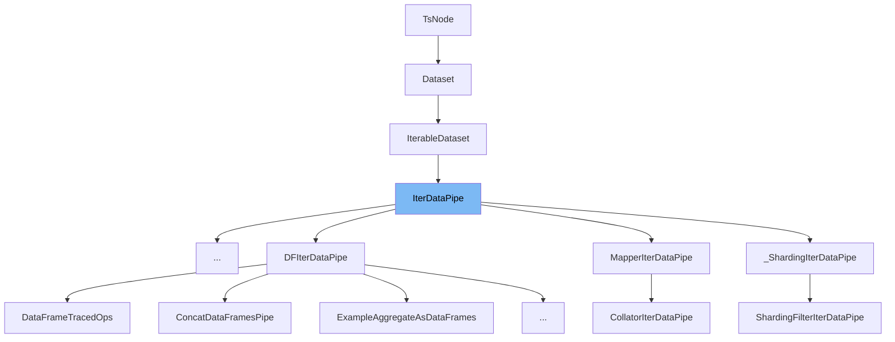

This document will cover the class `IterDataPipe` in the file `torch/utils/data/datapipes/datapipe.py`. We will cover:

1. What `IterDataPipe` is and what it is used for.
2. The variables and functions defined in `IterDataPipe`.
3. An example of how to use `IterDataPipe` in `DataFramesAsTuplesPipe`.



# What is IterDataPipe

`IterDataPipe` is a class in `torch/utils/data/datapipes/datapipe.py` that represents an iterable-style DataPipe. It is particularly useful when data comes from a stream or when the number of samples is too large to fit in memory. `IterDataPipe` is lazily initialized, meaning its elements are computed only when `next()` is called on its iterator. Subclasses of `IterDataPipe` should override the `__iter__` method to return an iterator of samples. The `reset` method can also be overridden to reset buffers, pointers, and state variables.

<SwmSnippet path="/torch/utils/data/datapipes/datapipe.py" line="122">

---

# Variables and functions

The variable `functions` is a dictionary that stores callable functions. These functions can be registered and accessed dynamically.

```python
    functions: Dict[str, Callable] = {}
```

---

</SwmSnippet>

<SwmSnippet path="/torch/utils/data/datapipes/datapipe.py" line="123">

---

The variable `reduce_ex_hook` is an optional callable that can be used to customize the behavior of the `__reduce_ex__` method for serialization.

```python
    reduce_ex_hook: Optional[Callable] = None
```

---

</SwmSnippet>

<SwmSnippet path="/torch/utils/data/datapipes/datapipe.py" line="124">

---

The variable `getstate_hook` is an optional callable that can be used to customize the behavior of the `__getstate__` method for serialization.

```python
    getstate_hook: Optional[Callable] = None
```

---

</SwmSnippet>

<SwmSnippet path="/torch/utils/data/datapipes/datapipe.py" line="125">

---

The variable `str_hook` is an optional callable that can be used to customize the string representation of the `IterDataPipe` object.

```python
    str_hook: Optional[Callable] = None
```

---

</SwmSnippet>

<SwmSnippet path="/torch/utils/data/datapipes/datapipe.py" line="126">

---

The variable `repr_hook` is an optional callable that can be used to customize the `repr` representation of the `IterDataPipe` object.

```python
    repr_hook: Optional[Callable] = None
```

---

</SwmSnippet>

<SwmSnippet path="/torch/utils/data/datapipes/datapipe.py" line="127">

---

The variable `_valid_iterator_id` is an optional integer that stores the ID of the valid iterator. This is used to enforce the single iterator constraint.

```python
    _valid_iterator_id: Optional[int] = None
```

---

</SwmSnippet>

<SwmSnippet path="/torch/utils/data/datapipes/datapipe.py" line="128">

---

The variable `_number_of_samples_yielded` is an integer that keeps track of the number of samples yielded by the `IterDataPipe`.

```python
    _number_of_samples_yielded: int = 0
```

---

</SwmSnippet>

<SwmSnippet path="/torch/utils/data/datapipes/datapipe.py" line="129">

---

The variable `_snapshot_state` is an instance of `_SnapshotState` that keeps track of the snapshot state of the `IterDataPipe`.

```python
    _snapshot_state: _SnapshotState = _SnapshotState.NotStarted
```

---

</SwmSnippet>

<SwmSnippet path="/torch/utils/data/datapipes/datapipe.py" line="130">

---

The variable `_fast_forward_iterator` is an optional iterator used for fast-forwarding the `IterDataPipe`.

```python
    _fast_forward_iterator: Optional[Iterator] = None
```

---

</SwmSnippet>

<SwmSnippet path="/torch/utils/data/datapipes/datapipe.py" line="132">

---

The `__iter__` method returns an iterator for the `IterDataPipe`. Subclasses should override this method to return an iterator of samples.

```python
    def __iter__(self) -> Iterator[_T_co]:
        return self
```

---

</SwmSnippet>

<SwmSnippet path="/torch/utils/data/datapipes/datapipe.py" line="135">

---

The `__getattr__` method allows dynamic access to functions registered in the `functions` dictionary. If the requested attribute is a deprecated function, a deprecation warning is issued.

```python
    def __getattr__(self, attribute_name):
        if attribute_name in IterDataPipe.functions:
            if attribute_name in _iter_deprecated_functional_names:
                kwargs = _iter_deprecated_functional_names[attribute_name]
                _deprecation_warning(**kwargs)
            f = IterDataPipe.functions[attribute_name]
            function = functools.partial(f, self)
            functools.update_wrapper(wrapper=function, wrapped=f, assigned=("__doc__",))
            return function
        else:
            raise AttributeError(
                f"'{self.__class__.__name__}' object has no attribute '{attribute_name}"
            )
```

---

</SwmSnippet>

<SwmSnippet path="/torch/utils/data/datapipes/datapipe.py" line="149">

---

The `register_function` class method registers a function in the `functions` dictionary.

```python
    @classmethod
    def register_function(cls, function_name, function):
        cls.functions[function_name] = function
```

---

</SwmSnippet>

<SwmSnippet path="/torch/utils/data/datapipes/datapipe.py" line="153">

---

The `register_datapipe_as_function` class method registers a DataPipe class as a function in the `functions` dictionary. It also supports enabling DataFrame API tracing.

```python
    @classmethod
    def register_datapipe_as_function(
        cls, function_name, cls_to_register, enable_df_api_tracing=False
    ):
        if function_name in cls.functions:
            raise Exception(  # noqa: TRY002
                f"Unable to add DataPipe function name {function_name} as it is already taken"
            )

        def class_function(cls, enable_df_api_tracing, source_dp, *args, **kwargs):
            result_pipe = cls(source_dp, *args, **kwargs)
            if isinstance(result_pipe, IterDataPipe):
                if enable_df_api_tracing or isinstance(source_dp, DFIterDataPipe):
                    if function_name not in UNTRACABLE_DATAFRAME_PIPES:
                        result_pipe = result_pipe.trace_as_dataframe()

            return result_pipe

        function = functools.partial(
            class_function, cls_to_register, enable_df_api_tracing
        )
```

---

</SwmSnippet>

<SwmSnippet path="/torch/utils/data/datapipes/datapipe.py" line="179">

---

The `__getstate__` method customizes the serialization of the `IterDataPipe` object. It supports serializing `lambda` functions when `dill` is available.

```python
    def __getstate__(self):
        """
        Serialize `lambda` functions when `dill` is available.

        If this doesn't cover your custom DataPipe's use case, consider writing custom methods for
        `__getstate__` and `__setstate__`, or use `pickle.dumps` for serialization.
        """
        state = self.__dict__
        if IterDataPipe.getstate_hook is not None:
            return IterDataPipe.getstate_hook(state)
        return state
```

---

</SwmSnippet>

<SwmSnippet path="/torch/utils/data/datapipes/datapipe.py" line="191">

---

The `__reduce_ex__` method customizes the behavior of the `__reduce_ex__` method for serialization. It supports using a custom `reduce_ex_hook` if provided.

```python
    def __reduce_ex__(self, *args, **kwargs):
        if IterDataPipe.reduce_ex_hook is not None:
            try:
                return IterDataPipe.reduce_ex_hook(self)
            except NotImplementedError:
                pass
        return super().__reduce_ex__(*args, **kwargs)
```

---

</SwmSnippet>

<SwmSnippet path="/torch/utils/data/datapipes/datapipe.py" line="199">

---

The `set_getstate_hook` class method sets a custom `getstate_hook` for the `IterDataPipe` class.

```python
    @classmethod
    def set_getstate_hook(cls, hook_fn):
        if IterDataPipe.getstate_hook is not None and hook_fn is not None:
            raise RuntimeError("Attempt to override existing getstate_hook")
        IterDataPipe.getstate_hook = hook_fn
```

---

</SwmSnippet>

<SwmSnippet path="/torch/utils/data/datapipes/datapipe.py" line="205">

---

The `set_reduce_ex_hook` class method sets a custom `reduce_ex_hook` for the `IterDataPipe` class.

```python
    @classmethod
    def set_reduce_ex_hook(cls, hook_fn):
        if IterDataPipe.reduce_ex_hook is not None and hook_fn is not None:
            raise RuntimeError("Attempt to override existing reduce_ex_hook")
        IterDataPipe.reduce_ex_hook = hook_fn
```

---

</SwmSnippet>

<SwmSnippet path="/torch/utils/data/datapipes/datapipe.py" line="211">

---

The `__repr__` method returns the `repr` representation of the `IterDataPipe` object. If a custom `repr_hook` is provided, it uses that instead.

```python
    def __repr__(self):
        if self.repr_hook is not None:
            return self.repr_hook(self)
        # Instead of showing <torch. ... .MapperIterDataPipe object at 0x.....>, return the class name
        return str(self.__class__.__qualname__)
```

---

</SwmSnippet>

<SwmSnippet path="/torch/utils/data/datapipes/datapipe.py" line="217">

---

The `__str__` method returns the string representation of the `IterDataPipe` object. If a custom `str_hook` is provided, it uses that instead.

```python
    def __str__(self):
        if self.str_hook is not None:
            return self.str_hook(self)
        # Instead of showing <torch. ... .MapperIterDataPipe object at 0x.....>, return the class name
        return str(self.__class__.__qualname__)
```

---

</SwmSnippet>

<SwmSnippet path="/torch/utils/data/datapipes/datapipe.py" line="223">

---

The `__dir__` method returns a list of attributes for the `IterDataPipe` object, including dynamically registered functions.

```python
    def __dir__(self):
        # for auto-completion in a REPL (e.g. Jupyter notebook)
        return list(super().__dir__()) + list(self.functions.keys())
```

---

</SwmSnippet>

<SwmSnippet path="/torch/utils/data/datapipes/datapipe.py" line="227">

---

The `reset` method resets the `IterDataPipe` to its initial state. By default, it is a no-op, but subclasses can override it to clear buffers and reset pointers.

```python
    def reset(self) -> None:
        r"""
        Reset the `IterDataPipe` to the initial state.

        By default, no-op. For subclasses of `IterDataPipe`, depending on their functionalities,
        they may want to override this method with implementations that
        may clear the buffers and reset pointers of the DataPipe.
        The `reset` method is always called when `__iter__` is called as part of `hook_iterator`.
        """
```

---

</SwmSnippet>

# Usage example

Here is an example of how to use `IterDataPipe` in `DataFramesAsTuplesPipe`.

<SwmSnippet path="/torch/utils/data/datapipes/dataframe/datapipes.py" line="1">

---

The `DataFramesAsTuplesPipe` class extends `IterDataPipe` and demonstrates how to use it. It converts DataFrame rows into tuples.

```python
# mypy: allow-untyped-defs
import random

from torch.utils.data.datapipes._decorator import functional_datapipe
from torch.utils.data.datapipes.dataframe import dataframe_wrapper as df_wrapper
from torch.utils.data.datapipes.datapipe import DFIterDataPipe, IterDataPipe


__all__ = [
    "ConcatDataFramesPipe",
```

---

</SwmSnippet>

&nbsp;

*This is an auto-generated document by Swimm AI 🌊 and has not yet been verified by a human*

<SwmMeta version="3.0.0" repo-id="Z2l0aHViJTNBJTNBcHl0b3JjaC1hdXRvZG9jcy1kZW1vJTNBJTNBU3dpbW0tRGVtbw==" repo-name="pytorch-autodocs-demo"><sup>Powered by [Swimm](https://app.swimm.io/)</sup></SwmMeta>
