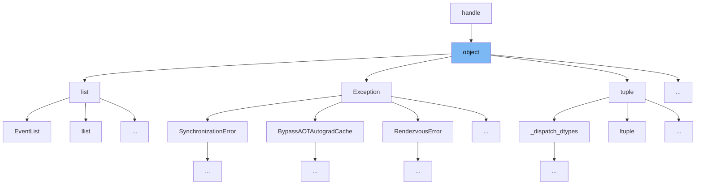

This document will cover the class `object` in `functorch/csrc/dim/minpybind.h`. We will cover:

1. What is `object`
2. Variables and functions



# What is object

The `object` class in `functorch/csrc/dim/minpybind.h` is a wrapper around Python's `PyObject`. It provides a managed way to handle Python objects within C++ code, ensuring proper reference counting and exception handling. This class is used to facilitate interaction with Python objects, making it easier to call Python functions, access attributes, and manage object lifetimes.

<SwmSnippet path="/functorch/csrc/dim/minpybind.h" line="280">

---

# Variables and functions

The function `attr` is used to get an attribute from the Python object. It takes a C-string `key` as an argument and returns an `object` representing the attribute.

```c
inline object handle::attr(const char* key) {
    return object::checked_steal(PyObject_GetAttrString(ptr(), key));
}
```

---

</SwmSnippet>

<SwmSnippet path="/functorch/csrc/dim/minpybind.h" line="284">

---

The function `hasattr` checks if the Python object has an attribute with the given name. It takes a C-string `key` as an argument and returns a boolean indicating the presence of the attribute.

```c
inline bool handle::hasattr(const char* key) {
    return PyObject_HasAttrString(ptr(), key);
}
```

---

</SwmSnippet>

<SwmSnippet path="/functorch/csrc/dim/minpybind.h" line="292">

---

The function `call` is a template function that allows calling the Python object as a function with the provided arguments. It returns an `object` representing the result of the call.

```c
template<typename... Args>
inline object handle::call(Args&&... args) {
    return object::checked_steal(PyObject_CallFunctionObjArgs(ptr_, args.ptr()..., nullptr));
}
```

---

</SwmSnippet>

<SwmSnippet path="/functorch/csrc/dim/minpybind.h" line="297">

---

The function `call_object` is used to call the Python object with a single argument. It takes a `handle` representing the argument and returns an `object` representing the result.

```c
inline object handle::call_object(mpy::handle args) {
    return object::checked_steal(PyObject_CallObject(ptr(), args.ptr()));
}
```

---

</SwmSnippet>

<SwmSnippet path="/functorch/csrc/dim/minpybind.h" line="302">

---

The function `call_object` is overloaded to accept both arguments and keyword arguments. It takes two `handle` objects representing the arguments and keyword arguments, respectively, and returns an `object` representing the result.

```c
inline object handle::call_object(mpy::handle args, mpy::handle kwargs) {
    return object::checked_steal(PyObject_Call(ptr(), args.ptr(), kwargs.ptr()));
}
```

---

</SwmSnippet>

<SwmSnippet path="/functorch/csrc/dim/minpybind.h" line="306">

---

The function `call_vector` is used to call the Python object with a vector of arguments. It takes a pointer to the beginning of the arguments, the number of arguments, and a `handle` representing the keyword names. It returns an `object` representing the result.

```c
inline object handle::call_vector(mpy::handle* begin, Py_ssize_t nargs, mpy::handle kwnames) {
    return object::checked_steal(PY_VECTORCALL(ptr(), (PyObject*const*) begin, nargs, kwnames.ptr()));
}
```

---

</SwmSnippet>

<SwmSnippet path="/functorch/csrc/dim/minpybind.h" line="669">

---

The function `call_vector` is overloaded to accept a `vector_args` object, which encapsulates the arguments and keyword names. It returns an `object` representing the result.

```c
inline object handle::call_vector(vector_args args) {
    return object::checked_steal(PY_VECTORCALL(ptr(), (PyObject*const*) args.args, args.nargs, args.kwnames.ptr()));
}
```

---

</SwmSnippet>

*This is an auto-generated document by Swimm AI 🌊 and has not yet been verified by a human*

<SwmMeta version="3.0.0" repo-id="Z2l0aHViJTNBJTNBcHl0b3JjaC1hdXRvZG9jcy1kZW1vJTNBJTNBU3dpbW0tRGVtbw==" repo-name="pytorch-autodocs-demo"><sup>Powered by [Swimm](https://app.swimm.io/)</sup></SwmMeta>
