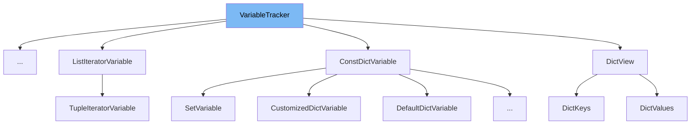

This document will cover the class `VariableTracker` in `torch/_dynamo/variables/base.py`. We will cover:

1. What `VariableTracker` is.
2. Variables and functions defined in `VariableTracker`.
3. Usage example of `VariableTracker` in `NewGlobalVariable`.



# What is VariableTracker

`VariableTracker` in `torch/_dynamo/variables/base.py` is a base class for tracked locals and stack values. Instances of `VariableTracker` are immutable and should be copied to change them. It serves as a foundational class for tracking variables during the introspection and analysis phases in Dynamo.

<SwmSnippet path="/torch/_dynamo/variables/base.py" line="126">

---

# Variables and functions

The variable `_nonvar_fields` is a set of fields that should remain unmodified in the `apply()` method. These fields include `value`, `guards`, `source`, `mutable_local`, `parents_tracker`, and `user_code_variable_name`.

```python
    # fields to leave unmodified in apply()
    _nonvar_fields = {
        "value",
        "guards",
        "source",
        "mutable_local",
        "parents_tracker",
        "user_code_variable_name",
    }
```

---

</SwmSnippet>

<SwmSnippet path="/torch/_dynamo/variables/base.py" line="136">

---

The function `clone` creates a shallow copy of the `VariableTracker` instance with optional changes. It updates the instance's dictionary with the provided keyword arguments and returns a new instance of the same class.

```python
    def clone(self, **kwargs):
        """Shallow copy with some (optional) changes"""
        args = dict(self.__dict__)
        args.update(kwargs)
        return self.__class__(**args)
```

---

</SwmSnippet>

<SwmSnippet path="/torch/_dynamo/variables/base.py" line="142">

---

The class method `visit` walks through the value and calls the provided function `fn` on all `VariableTracker` instances. It uses a cache to keep track of visited instances and ensures that the function is called on each unique instance.

```python
    @classmethod
    def visit(
        cls,
        fn: Callable[["VariableTracker"], None],
        value: Any,
        cache: Optional[Dict[int, Any]] = None,
    ) -> None:
        """
        Walk value and call fn on all the VariableTracker instances
        """
        if cache is None:
            cache = {}

        idx = id(value)
        if idx in cache:
            return
        # save `value` to keep it alive and ensure id() isn't reused
        cache[idx] = value

        if isinstance(value, VariableTracker):
            value = value.unwrap()
```

---

</SwmSnippet>

<SwmSnippet path="/torch/_dynamo/variables/base.py" line="176">

---

The function `__repr__` returns a string representation of the `VariableTracker` instance, which is the class name followed by empty parentheses.

```python
    def __repr__(self) -> str:
        return f"{self.__class__.__name__}()"

```

---

</SwmSnippet>

<SwmSnippet path="/torch/_dynamo/variables/base.py" line="179">

---

The function `debug_repr` is intended to be overridden to provide more detailed information. It attempts to return the Python constant representation of the instance, and if not implemented, it falls back to the default `repr`.

```python
    def debug_repr(self):
        # Intended to be overridden to provide more info
        try:
            return repr(self.as_python_constant())
        except NotImplementedError:
            return repr(self)

```

---

</SwmSnippet>

<SwmSnippet path="/torch/_dynamo/variables/base.py" line="186">

---

The function `python_type` is an abstract method that should be implemented by subclasses of `VariableTracker`. It returns the Python type represented by the instance of the subclass. If not implemented, it raises a `NotImplementedError`.

```python
    def python_type(self):
        """
        Abstract method to be implemented by subclasses of VariableTracker.

        This method should return the type represented by the instance of the subclass.
        The purpose is to provide a standardized way to retrieve the Python type information
        of the variable being tracked.

        Returns:
            type: The Python type (such as int, str, list, etc.) of the variable tracked by
                the subclass. If the type cannot be determined or is not relevant,
                leaving it undefined or invoking super() is always sound.

        Note:
            This is an abstract method and may be overridden in subclasses.

        Example:
            class SetVariable(VariableTracker):
                def python_type(self):
                    return set

```

---

</SwmSnippet>

<SwmSnippet path="/torch/_dynamo/variables/base.py" line="212">

---

The function `as_python_constant` is intended for constants and should be implemented by subclasses. If not implemented, it raises a `NotImplementedError`.

```python
    def as_python_constant(self):
        """For constants"""
        raise NotImplementedError(f"{self} is not a constant")

```

---

</SwmSnippet>

<SwmSnippet path="/torch/_dynamo/variables/base.py" line="216">

---

The function `guard_as_python_constant` is similar to `as_python_constant` but adds ID_MATCH guards to try to force things to become constants. If not implemented, it raises a `NotImplementedError`.

```python
    def guard_as_python_constant(self):
        """Similar to as_python_constant(), but add ID_MATCH guards to try to force things to become constants"""
        try:
            return self.as_python_constant()
        except NotImplementedError as e:
            unimplemented(str(e))

```

---

</SwmSnippet>

<SwmSnippet path="/torch/_dynamo/variables/base.py" line="223">

---

The function `is_python_constant` checks if the instance can be represented as a Python constant by calling `as_python_constant`. If not implemented, it returns `False`.

```python
    def is_python_constant(self):
        try:
            self.as_python_constant()
            return True
        except NotImplementedError:
            return False
```

---

</SwmSnippet>

<SwmSnippet path="/torch/_dynamo/variables/base.py" line="230">

---

The function `make_guard` creates a guard based on the instance's source. If the source is not available, it raises a `NotImplementedError`.

```python
    def make_guard(self, fn):
        if self.source:
            return self.source.make_guard(fn)
        raise NotImplementedError
```

---

</SwmSnippet>

<SwmSnippet path="/torch/_dynamo/variables/base.py" line="235">

---

The function `const_getattr` is an abstract method that should return a Python constant when `getattr` is called on the instance. If not implemented, it raises a `NotImplementedError`.

```python
    def const_getattr(self, tx: "InstructionTranslator", name: str) -> Any:
        """getattr(self, name) returning a python constant"""
        raise NotImplementedError
```

---

</SwmSnippet>

<SwmSnippet path="/torch/_dynamo/variables/base.py" line="239">

---

The function `var_getattr` returns a new variable when `getattr` is called on the instance. It calls `const_getattr` to get the value and creates a new `ConstantVariable` if the value is a literal.

```python
    def var_getattr(self, tx: "InstructionTranslator", name: str) -> "VariableTracker":
        """getattr(self, name) returning a new variable"""
        value = self.const_getattr(tx, name)
        if not variables.ConstantVariable.is_literal(value):
            raise NotImplementedError
        source = None
        if self.source:
            source = AttrSource(self.source, name)
        return variables.ConstantVariable.create(value, source=source)
```

---

</SwmSnippet>

<SwmSnippet path="/torch/_dynamo/variables/base.py" line="249">

---

The function `is_proxy` checks if the instance can be represented as a proxy by calling `as_proxy`. If not implemented, it returns `False`.

```python
    def is_proxy(self):
        try:
            self.as_proxy()
            return True
        except NotImplementedError:
            return False

```

---

</SwmSnippet>

<SwmSnippet path="/torch/_dynamo/variables/base.py" line="256">

---

The function `as_proxy` is an abstract method that should return a proxy representation of the instance. If not implemented, it raises a `NotImplementedError`.

```python
    def as_proxy(self):
        raise NotImplementedError(str(self))

```

---

</SwmSnippet>

<SwmSnippet path="/torch/_dynamo/variables/base.py" line="259">

---

The function `maybe_fx_node` attempts to return the FX node representation of the instance's proxy. If not implemented, it returns `None`.

```python
    def maybe_fx_node(self):
        try:
            proxy = self.as_proxy()
            import torch.fx

            if isinstance(proxy, torch.fx.Proxy):
                return proxy.node
            return None
        except NotImplementedError:
            return None
```

---

</SwmSnippet>

<SwmSnippet path="/torch/_dynamo/variables/base.py" line="270">

---

The function `reconstruct` is an abstract method that should reconstruct the Python object represented by the instance. If not implemented, it raises a `NotImplementedError`.

```python
    def reconstruct(self, codegen):
        raise NotImplementedError

```

---

</SwmSnippet>

<SwmSnippet path="/torch/_dynamo/variables/base.py" line="273">

---

The function `can_reconstruct` checks if it is possible to reconstruct the Python object represented by the instance. It uses the `PyCodegen` class to attempt reconstruction and returns `True` if successful.

```python
    def can_reconstruct(self, tx):
        """If it is possible to reconstruct the Python object this
        VariableTracker represents."""
        assert tx is tx.output.root_tx, "Only root tx can reconstruct"
        try:
            from ..codegen import PyCodegen

            cg = PyCodegen(tx)
            self.reconstruct(cg)
            return True
        except NotImplementedError:
            return False
```

---

</SwmSnippet>

<SwmSnippet path="/torch/_dynamo/variables/base.py" line="286">

---

The function `unpack_var_sequence` is an abstract method that should return a list of `VariableTracker` instances. If not implemented, it raises a `NotImplementedError`.

```python
    def unpack_var_sequence(self, tx) -> List["VariableTracker"]:
        raise NotImplementedError
```

---

</SwmSnippet>

<SwmSnippet path="/torch/_dynamo/variables/base.py" line="289">

---

The function `has_unpack_var_sequence` checks if the instance can be unpacked into a sequence of `VariableTracker` instances by calling `unpack_var_sequence`. If not implemented, it returns `False`.

```python
    def has_unpack_var_sequence(self, tx) -> bool:
        try:
            self.unpack_var_sequence(tx)
            return True
        except NotImplementedError:
            return False
```

---

</SwmSnippet>

<SwmSnippet path="/torch/_dynamo/variables/base.py" line="296">

---

The function `inspect_parameter_names` is an abstract method that should return a list of parameter names. If not implemented, it raises a `NotImplementedError`.

```python
    def inspect_parameter_names(self) -> List[str]:
        unimplemented(f"inspect_parameter_names: {self}")

```

---

</SwmSnippet>

<SwmSnippet path="/torch/_dynamo/variables/base.py" line="299">

---

The function `call_hasattr` is an abstract method that should handle `hasattr` calls on the instance. If not implemented, it raises a `NotImplementedError`.

```python
    def call_hasattr(self, tx: "InstructionTranslator", name: str) -> "VariableTracker":
        unimplemented(f"hasattr {self.__class__.__name__} {name}")

```

---

</SwmSnippet>

<SwmSnippet path="/torch/_dynamo/variables/base.py" line="302">

---

The function `call_function` is an abstract method that should handle function calls on the instance. If not implemented, it raises a `NotImplementedError`.

```python
    def call_function(
        self,
        tx: "InstructionTranslator",
        args: "List[VariableTracker]",
        kwargs: "Dict[str, VariableTracker]",
    ) -> "VariableTracker":
        unimplemented(f"call_function {self} {args} {kwargs}")

```

---

</SwmSnippet>

<SwmSnippet path="/torch/_dynamo/variables/base.py" line="310">

---

The function `call_method` handles method calls on the instance. It has specific implementations for `__len__` and `__getattr__` methods and raises a `NotImplementedError` for other methods.

```python
    def call_method(
        self,
        tx,
        name,
        args: "List[VariableTracker]",
        kwargs: "Dict[str, VariableTracker]",
    ) -> "VariableTracker":
        if name == "__len__" and self.has_unpack_var_sequence(tx):
            assert not (args or kwargs)
            return variables.ConstantVariable.create(len(self.unpack_var_sequence(tx)))
        elif (
            name == "__getattr__"
            and len(args) == 1
            and args[0].is_python_constant()
            and not kwargs
        ):
            return self.var_getattr(tx, args[0].as_python_constant())
        unimplemented(f"call_method {self} {name} {args} {kwargs}")
```

---

</SwmSnippet>

<SwmSnippet path="/torch/_dynamo/variables/base.py" line="329">

---

The function `set_name_hint` is a placeholder method that does nothing. It can be overridden by subclasses if needed.

```python
    def set_name_hint(self, name):
        pass
```

---

</SwmSnippet>

&nbsp;

*This is an auto-generated document by Swimm AI 🌊 and has not yet been verified by a human*

<SwmMeta version="3.0.0" repo-id="Z2l0aHViJTNBJTNBcHl0b3JjaC1hdXRvZG9jcy1kZW1vJTNBJTNBU3dpbW0tRGVtbw==" repo-name="pytorch-autodocs-demo"><sup>Powered by [Swimm](https://app.swimm.io/)</sup></SwmMeta>
