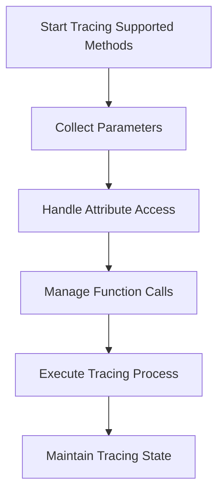

This document will cover the flow of tracing supported methods in a neural network module, which includes:

1. Collecting parameters from the module and its submodules
2. Handling attribute access and custom attribute methods
3. Managing function calls and special cases
4. Executing and maintaining the tracing process

Technical document: <SwmLink doc-title="Tracing Supported Methods Flow">[Tracing Supported Methods Flow](/.swm/tracing-supported-methods-flow.tc7nm5xy.sw.md)</SwmLink>

# [Collecting Parameters](https://app.swimm.io/repos/Z2l0aHViJTNBJTNBcHl0b3JjaC1hdXRvZG9jcy1kZW1vJTNBJTNBU3dpbW0tRGVtbw==/docs/tc7nm5xy#collect_parameters)

The process begins by collecting parameters from the neural network module and its submodules. This ensures that all relevant parameters are gathered for tracing. The parameters are collected recursively, meaning that the function will also gather parameters from any submodules within the main module. This step is crucial for ensuring that the tracing process has access to all necessary parameters.

# [Handling Attribute Access](https://app.swimm.io/repos/Z2l0aHViJTNBJTNBcHl0b3JjaC1hdXRvZG9jcy1kZW1vJTNBJTNBU3dpbW0tRGVtbw==/docs/tc7nm5xy#var_getattr)

Next, the flow handles attribute access for the module. This involves checking various sources for the attribute and falling back to a custom `__getattr__` method if necessary. This step is essential for dynamically accessing module attributes, which allows for greater flexibility and customization in how the module's attributes are handled during the tracing process.

# [Managing Function Calls](https://app.swimm.io/repos/Z2l0aHViJTNBJTNBcHl0b3JjaC1hdXRvZG9jcy1kZW1vJTNBJTNBU3dpbW0tRGVtbw==/docs/tc7nm5xy#call_function)

The flow then manages function calls on the module. This includes handling special cases such as lazy modules and modules with hooks. Ensuring that function calls are executed correctly is vital for maintaining the integrity of the tracing process. This step ensures that all function calls are handled appropriately, even in complex scenarios.

# [Executing Tracing Process](https://app.swimm.io/repos/Z2l0aHViJTNBJTNBcHl0b3JjaC1hdXRvZG9jcy1kZW1vJTNBJTNBU3dpbW0tRGVtbw==/docs/tc7nm5xy#run)

The tracing process is executed, managing the execution context and handling any exceptions that may occur. This step ensures that the tracing process is carried out correctly and that any issues are addressed promptly. It involves running the tracing mechanism and ensuring that the execution context is maintained throughout the process.

# [Maintaining Tracing State](https://app.swimm.io/repos/Z2l0aHViJTNBJTNBcHl0b3JjaC1hdXRvZG9jcy1kZW1vJTNBJTNBU3dpbW0tRGVtbw==/docs/tc7nm5xy#step)

Finally, the flow maintains the tracing state by processing individual instructions and handling graph breaks. This step ensures that the tracing state is updated as needed and that the process can continue smoothly. It involves processing each instruction within the tracing process and handling any breaks in the graph to ensure continuous execution.

&nbsp;

*This is an auto-generated document by Swimm AI 🌊 and has not yet been verified by a human*

<SwmMeta version="3.0.0" repo-id="Z2l0aHViJTNBJTNBcHl0b3JjaC1hdXRvZG9jcy1kZW1vJTNBJTNBU3dpbW0tRGVtbw==" repo-name="pytorch-autodocs-demo">Powered by [Swimm](https://app.swimm.io/)</SwmMeta>
