This document provides an overview of the `trace_supported_methods` function, which is responsible for tracing methods supported by the `nn.Module`. It ensures that the parameters of the module are collected and deduplicated before being returned as a list iterator variable. The document also covers the related functions that play a crucial role in this process.

The flow starts with the `trace_supported_methods` function, which traces the methods supported by a neural network module. It first collects the parameters of the module using the `collect_parameters` function. This function gathers all parameters from the module and its submodules. The `get_current_parameters` function is then used to retrieve the current parameters, filtering out any non-TensorVariable parameters. The `var_getattr` function handles attribute access for the module, and the `_custom_getattr_fallback` function deals with custom `__getattr__` methods. The `call_function` function is responsible for calling functions on the module, handling special cases like lazy modules and hooks. Finally, the `inline_user_function_return`, `inline_call`, `inline_call_`, `run`, `step`, `step_graph_break`, and `compile_subgraph` functions manage the execution and tracing process, ensuring that the function calls are executed correctly and the tracing state is maintained.

# Flow drill down

```mermaid
graph TD;
      subgraph torchdynamo["torch/_dynamo"]
7dd5f51b54df5d588f7e4798b5ae5997ad22325d0950cee11430b120e031330b(trace_supported_methods):::mainFlowStyle --> fa90d144d2282eb1aa00d3e90742e5f0bb9bb0621d18d0c90b3f105544dd7747(collect_parameters):::mainFlowStyle
end

subgraph torchdynamo["torch/_dynamo"]
fa90d144d2282eb1aa00d3e90742e5f0bb9bb0621d18d0c90b3f105544dd7747(collect_parameters):::mainFlowStyle --> bf9e8a5ab877d028e95bc9819401e38063beebe2276fab804b6631dc4d6852bc(get_current_parameters):::mainFlowStyle
end

subgraph torchdynamo["torch/_dynamo"]
bf9e8a5ab877d028e95bc9819401e38063beebe2276fab804b6631dc4d6852bc(get_current_parameters):::mainFlowStyle --> b7795dc9950f3ec2dfcb82efd7ac6c7fe7f13ee6d16cbab16b545d6a952c67d5(var_getattr):::mainFlowStyle
end

subgraph torchdynamo["torch/_dynamo"]
b7795dc9950f3ec2dfcb82efd7ac6c7fe7f13ee6d16cbab16b545d6a952c67d5(var_getattr):::mainFlowStyle --> 34e859ece8cea029466dc4648c2dae9c942c4276010d9e6f7b149e8faa057d4b(_custom_getattr_fallback):::mainFlowStyle
end

subgraph torchdynamo["torch/_dynamo"]
34e859ece8cea029466dc4648c2dae9c942c4276010d9e6f7b149e8faa057d4b(_custom_getattr_fallback):::mainFlowStyle --> 95b9416a39d86369a1c11225468f2f8460fc2597fb2d525b73a446f57908d6dd(call_function):::mainFlowStyle
end

subgraph torchdynamo["torch/_dynamo"]
95b9416a39d86369a1c11225468f2f8460fc2597fb2d525b73a446f57908d6dd(call_function):::mainFlowStyle --> 458008e74f18ebce47c64da5a4233a63dc2fd42ac18b14ae3f3aaea47313241b(inline_user_function_return):::mainFlowStyle
end

subgraph torchdynamo["torch/_dynamo"]
458008e74f18ebce47c64da5a4233a63dc2fd42ac18b14ae3f3aaea47313241b(inline_user_function_return):::mainFlowStyle --> fcd883700fffa007b56c5d346195884dc971b221f81f7154a62efec44b035ea5(inline_call):::mainFlowStyle
end

subgraph torchdynamo["torch/_dynamo"]
fcd883700fffa007b56c5d346195884dc971b221f81f7154a62efec44b035ea5(inline_call):::mainFlowStyle --> 15971f1e27fd627308a99bae241ac3eb113c6830b15353374d03323c5a30959c(inline_call_):::mainFlowStyle
end

subgraph torchdynamo["torch/_dynamo"]
15971f1e27fd627308a99bae241ac3eb113c6830b15353374d03323c5a30959c(inline_call_):::mainFlowStyle --> edf27ab967b775dcd6f62cb8a0fb2a87177da9406db5a99aad72cc627af839ac(run):::mainFlowStyle
end

subgraph torchdynamo["torch/_dynamo"]
edf27ab967b775dcd6f62cb8a0fb2a87177da9406db5a99aad72cc627af839ac(run):::mainFlowStyle --> 99e91bca7ea856f56e3f34579d72219ce35debd0d03d0aee37dedaffe5ac2a22(step):::mainFlowStyle
end

subgraph torchdynamo["torch/_dynamo"]
99e91bca7ea856f56e3f34579d72219ce35debd0d03d0aee37dedaffe5ac2a22(step):::mainFlowStyle --> a8cb423a5d16e220218eb2e3c35a54f64a0aaab6b5233dd0b33a8dae3657ca81(step_graph_break):::mainFlowStyle
end

subgraph torchdynamo["torch/_dynamo"]
a8cb423a5d16e220218eb2e3c35a54f64a0aaab6b5233dd0b33a8dae3657ca81(step_graph_break):::mainFlowStyle --> 2ba345a88495baf48df3654780e05d6be290f7d7a9d8f157cc7acee764a6ff02(compile_subgraph):::mainFlowStyle
end


      classDef mainFlowStyle color:#000000,fill:#7CB9F4
classDef rootsStyle color:#000000,fill:#00FFF4
classDef Style1 color:#000000,fill:#00FFAA
classDef Style2 color:#000000,fill:#FFFF00
classDef Style3 color:#000000,fill:#AA7CB9
```



<SwmSnippet path="/torch/_dynamo/variables/nn_module.py" line="903">

---

## trace_supported_methods

The `trace_supported_methods` function is responsible for tracing methods that are supported by the nn.Module. It ensures that the parameters of the module are collected and deduplicated before being returned as a list iterator variable. This function is crucial for handling the parameters of neural network modules in a structured manner.

```python
    def trace_supported_methods(
        self, tx: "InstructionTranslator", method, name, args, kwargs
    ):
        def get_kwargs(*names):
            fn = getattr(self.value, name)
            bound_args = inspect.signature(fn).bind(
                *([x.as_python_constant() for x in args]),
                **{k: v.as_python_constant() for k, v in kwargs.items()},
            )
            bound_args.apply_defaults()
            bound_args = bound_args.arguments
            return {k: bound_args[k] for k in names}

        def get_current_parameters(module_var):
            params_dict = module_var.var_getattr(tx, "_parameters").realize().items
            assert isinstance(params_dict, dict)
            params_list = list(params_dict.values())
            params_list = [param.realize() for param in params_list]
            # Account for mod.param = None
            params_list = [
                param
```

---

</SwmSnippet>

<SwmSnippet path="/torch/_dynamo/variables/nn_module.py" line="929">

---

## collect_parameters

The `collect_parameters` function recursively collects parameters from the given module and its submodules. It ensures that all parameters are gathered, which is essential for the proper functioning of the `trace_supported_methods` function.

```python
        def collect_parameters(module_var, recurse):
            params_list = []
            assert isinstance(module_var, UnspecializedNNModuleVariable)
            params_list = get_current_parameters(module_var)
            modules_dict = module_var.var_getattr(tx, "_modules").realize()
            if recurse:
                for submodule_var in modules_dict.items.values():
                    assert isinstance(submodule_var, UnspecializedNNModuleVariable)
                    params_list.extend(collect_parameters(submodule_var, recurse))
            return params_list
```

---

</SwmSnippet>

<SwmSnippet path="/torch/_dynamo/variables/nn_module.py" line="916">

---

## get_current_parameters

The `get_current_parameters` function retrieves the current parameters of a module. It filters out any non-TensorVariable parameters, ensuring that only valid parameters are considered. This function is a key part of the parameter collection process.

```python
        def get_current_parameters(module_var):
            params_dict = module_var.var_getattr(tx, "_parameters").realize().items
            assert isinstance(params_dict, dict)
            params_list = list(params_dict.values())
            params_list = [param.realize() for param in params_list]
            # Account for mod.param = None
            params_list = [
                param
                for param in params_list
                if isinstance(param, variables.TensorVariable)
            ]
            return params_list
```

---

</SwmSnippet>

<SwmSnippet path="/torch/_dynamo/variables/nn_module.py" line="243">

---

## var_getattr

The `var_getattr` function handles attribute access for the module. It checks various sources for the attribute and falls back to a custom getattr function if necessary. This function is essential for accessing module attributes dynamically.

```python
    def var_getattr(self, tx: "InstructionTranslator", name):
        from .builder import VariableBuilder

        if self.source:
            source = AttrSource(self.source, name)
        else:
            source = None

        base = tx.output.get_submodule(self.module_key)
        base_dict = object.__getattribute__(base, "__dict__")
        object_member = True
        all_class_attribute_names = set()
        for x in inspect.getmro(base.__class__):
            all_class_attribute_names.update(x.__dict__.keys())

        if not self.source:
            unimplemented("GETATTR with no source")

        if name == "__dict__":
            return variables.GetAttrVariable(self, name, source=source)

```

---

</SwmSnippet>

<SwmSnippet path="/torch/_dynamo/variables/nn_module.py" line="227">

---

## \_custom_getattr_fallback

The `_custom_getattr_fallback` function handles cases where a custom **getattr** method is defined on the module. It ensures that the custom method is called correctly, providing flexibility in attribute access.

```python
    def _custom_getattr_fallback(self, base, tx, name, options):
        """Check for a __getattr__ and handle it specially if it is implemented"""
        if object_has_getattribute(base):
            unimplemented("torch.nn.Module with a custom __getattribute__ defined")

        getattr_fn = get_custom_getattr(base, ignore_nn_module_getattr=True)
        if getattr_fn is None:
            return None

        if not isinstance(getattr_fn, types.FunctionType):
            unimplemented("torch.nn.Module with a non-function custom __getattr__")

        return variables.UserMethodVariable(getattr_fn, self, **options).call_function(
            tx, [variables.ConstantVariable.create(name)], {}
        )
```

---

</SwmSnippet>

<SwmSnippet path="/torch/_dynamo/variables/nn_module.py" line="341">

---

## call_function

The `call_function` function is responsible for calling a function on the module. It handles various special cases, such as lazy modules and modules with hooks, ensuring that the function call is executed correctly.

```python
    def call_function(
        self,
        tx,
        args: "List[VariableTracker]",
        kwargs: "Dict[str, VariableTracker]",
    ) -> "VariableTracker":
        mod = tx.output.get_submodule(self.module_key)

        with record_nn_module_stack(
            self.module_key, self.get_nn_module_stack_source(), tx, mod
        ):
            is_lazy = is_lazy_module(mod)
            if (
                isinstance(mod, torch.nn.Sequential)
                and mod.__class__.forward is torch.nn.Sequential.forward
            ):
                if nnmodule_has_hooks(mod):
                    # We do not want to unroll sequential if it has hooks, since evaporating it
                    # will cause hooks to not fire!
                    # This terminates and restart the tracing process
                    self.convert_to_unspecialized(tx)
```

---

</SwmSnippet>

<SwmSnippet path="/torch/_dynamo/symbolic_convert.py" line="807">

---

## inline_user_function_return

The `inline_user_function_return` function inlines a user-defined function call. This is part of the process of handling function calls within the tracing mechanism.

```python
    def inline_user_function_return(self, fn, args, kwargs):
        """
        A call to some user defined function by inlining it.
        """
        return InliningInstructionTranslator.inline_call(self, fn, args, kwargs)
```

---

</SwmSnippet>

<SwmSnippet path="/torch/_dynamo/symbolic_convert.py" line="2943">

---

## inline_call

The `inline_call` function is a class method that inlines a function call. It ensures that the function call is handled within the current context, maintaining the integrity of the tracing process.

```python
    @classmethod
    def inline_call(cls, parent, func, args, kwargs):
        with patch.dict(counters, {"unimplemented": counters["inline_call"]}):
            return cls.inline_call_(parent, func, args, kwargs)
```

---

</SwmSnippet>

<SwmSnippet path="/torch/_dynamo/symbolic_convert.py" line="2981">

---

## inline_call\_

The `inline_call_` function performs the actual inlining of a function call. It handles various edge cases and ensures that the function call is executed correctly within the tracing context.

```python
    def inline_call_(
        parent, func: VariableTracker, args: List[VariableTracker], kwargs
    ):
        if isinstance(func, SkipFunctionVariable):
            unimplemented("inline with functions in skip files")
        assert isinstance(
            func,
            (UserFunctionVariable, NestedUserFunctionVariable),
        )
        result = InliningInstructionTranslator.check_inlineable(func)
        assert result.skipped is False
        try:
            sub_locals, closure_cells = func.bind_args(parent, args, kwargs)
        except TypeError as e:
            # Wrap the general TypeError during bind_args() to the internal ArgsMismatchError with detailed info
            raise ArgsMismatchError(  # noqa: B904
                "{reason}.\n  func = {func}, args = {args}, kwargs = {kwargs}".format(
                    reason=str(e),
                    func=f"'{func.get_name()}' {func.get_filename()}:{func.get_code().co_firstlineno}",
                    args=[arg.python_type() for arg in args],
                    kwargs=kwargs,
```

---

</SwmSnippet>

<SwmSnippet path="/torch/_dynamo/symbolic_convert.py" line="954">

---

## run

The `run` function executes the tracing process. It manages the execution context and ensures that the tracing process is carried out correctly, handling any exceptions that may occur.

```python
    def run(self):
        with self.run_ctx_mgr():
            try:
                self.output.push_tx(self)
                while self.step():
                    pass
            except BackendCompilerFailed:
                raise
            except Exception as e:
                if self.exec_recorder:
                    e.exec_record = self.exec_recorder.get_record()  # type: ignore[attr-defined]
                raise
            finally:
                self.output.pop_tx()
                # Cleanup the outputGraph to delete the held tensors. We perform the
                # cleanup only for InstructionTranslator and not
                # InliningInstructionTranslator. The InliningInstructionTranslator
                # mutates the output object and is restored to original state if
                # there was an exception.
                if isinstance(self, InstructionTranslator):
                    self.output.cleanup()
```

---

</SwmSnippet>

<SwmSnippet path="/torch/_dynamo/symbolic_convert.py" line="842">

---

## step

The `step` function processes a single instruction within the tracing process. It handles various conditions and ensures that the instruction is executed correctly, updating the tracing state as needed.

```python
    def step(self):
        """Process exactly one instruction, return False we should exit"""
        ip = self.instruction_pointer
        if ip is None:
            return False
        self.current_instruction = inst = self.instructions[ip]
        self.instruction_pointer = ip + 1

        if inst.starts_line:
            self.starts_line(inst.starts_line)

        if (
            not self.stack
            and self.should_compile_partial_graph()
            and self.is_non_empty_graph()
        ):
            self.current_speculation = self.speculate()
            if self.current_speculation.failed:
                return self.step_graph_break(inst)

        if trace_bytecode_log.isEnabledFor(logging.DEBUG):
```

---

</SwmSnippet>

<SwmSnippet path="/torch/_dynamo/symbolic_convert.py" line="935">

---

## step_graph_break

The `step_graph_break` function handles cases where a graph break occurs during the tracing process. It generates code to continue execution and ensures that the tracing state is correctly updated.

```python
    def step_graph_break(self, continue_inst):
        # generate code from checkpoint
        assert not self.output.output_instructions
        assert self.current_speculation is not None
        self.output.compile_subgraph(
            self,
            partial_convert=True,
            reason=GraphCompileReason("step_unsupported", [self.frame_summary()]),
        )
        self.output.add_output_instructions(
            [create_jump_absolute(continue_inst)] + self.instructions
        )
```

---

</SwmSnippet>

<SwmSnippet path="/torch/_dynamo/output_graph.py" line="968">

---

## compile_subgraph

The `compile_subgraph` function generates a subgraph to continue execution on user code. It restores live variables and ensures that the tracing process can continue correctly, handling any necessary code generation.

```python
    def compile_subgraph(
        self, tx, partial_convert=False, reason: Optional[GraphCompileReason] = None
    ):
        """
        Generate a subgraph to continue execution on user code.
        Automatically restore live variables.
        """
        assert reason is not None

        from .decorators import disable

        self.partial_convert = partial_convert
        self.compile_subgraph_reason = reason
        self.should_exit = True

        log.debug("COMPILING GRAPH due to %s", reason)

        if not all(block.can_restore() for block in tx.block_stack):
            unimplemented("compile_subgraph with block_depth != 0")

        prefix_insts: List[Instruction] = []
```

---

</SwmSnippet>

&nbsp;

*This is an auto-generated document by Swimm AI 🌊 and has not yet been verified by a human*

<SwmMeta version="3.0.0" repo-id="Z2l0aHViJTNBJTNBcHl0b3JjaC1hdXRvZG9jcy1kZW1vJTNBJTNBU3dpbW0tRGVtbw==" repo-name="pytorch-autodocs-demo"><sup>Powered by [Swimm](https://app.swimm.io/)</sup></SwmMeta>
