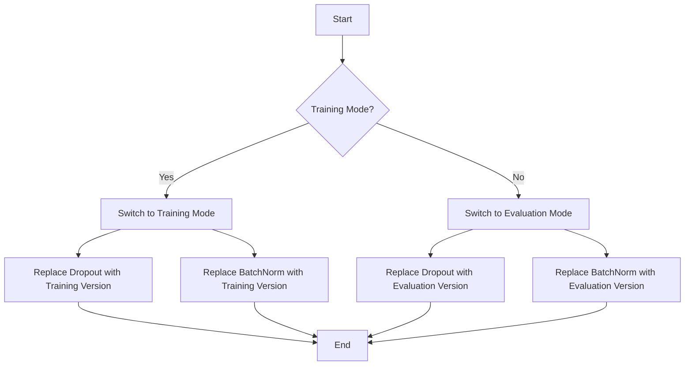

This document will cover the Training Mode Toggle feature, which includes:

1. Switching the model to training mode
2. Switching the model to evaluation mode.

Technical document: <SwmLink doc-title="Training Mode Toggle">[Training Mode Toggle](/.swm/training-mode-toggle.vvaabh56.sw.md)</SwmLink>

# [Switching the model to training mode](https://app.swimm.io/repos/Z2l0aHViJTNBJTNBcHl0b3JjaC1hdXRvZG9jcy1kZW1vJTNBJTNBU3dpbW0tRGVtbw==/docs/vvaabh56#moving-exported-model-to-train-mode)

When the model is switched to training mode, it involves replacing certain operations like dropout and batchnorm with their training counterparts. This ensures that the model behaves correctly during the training phase. Specifically, dropout layers will randomly drop units during training to prevent overfitting, and batchnorm layers will use batch statistics to normalize the data.

# [Switching the model to evaluation mode](https://app.swimm.io/repos/Z2l0aHViJTNBJTNBcHl0b3JjaC1hdXRvZG9jcy1kZW1vJTNBJTNBU3dpbW0tRGVtbw==/docs/vvaabh56#_move_exported_model_to_eval)

When the model is switched to evaluation mode, it involves replacing certain operations like dropout and batchnorm with their evaluation counterparts. This ensures that the model behaves correctly during the evaluation phase. Specifically, dropout layers will not drop any units, and batchnorm layers will use running statistics to normalize the data.

&nbsp;

*This is an auto-generated document by Swimm AI 🌊 and has not yet been verified by a human*

<SwmMeta version="3.0.0" repo-id="Z2l0aHViJTNBJTNBcHl0b3JjaC1hdXRvZG9jcy1kZW1vJTNBJTNBU3dpbW0tRGVtbw==" repo-name="pytorch-autodocs-demo">Powered by [Swimm](https://app.swimm.io/)</SwmMeta>
