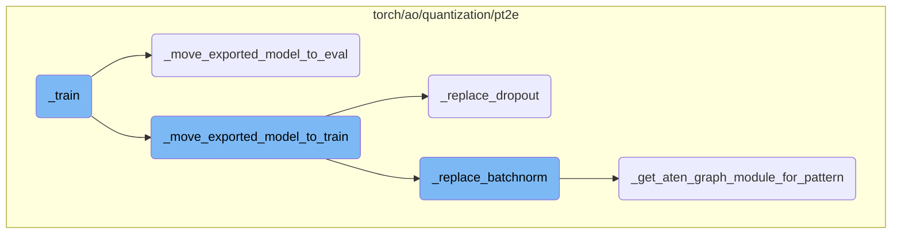
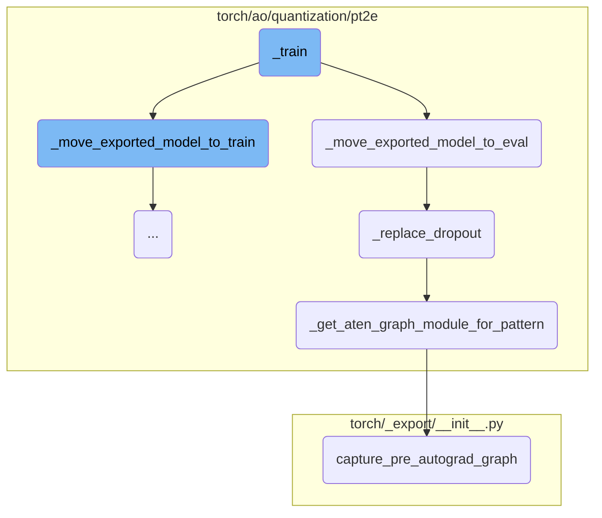
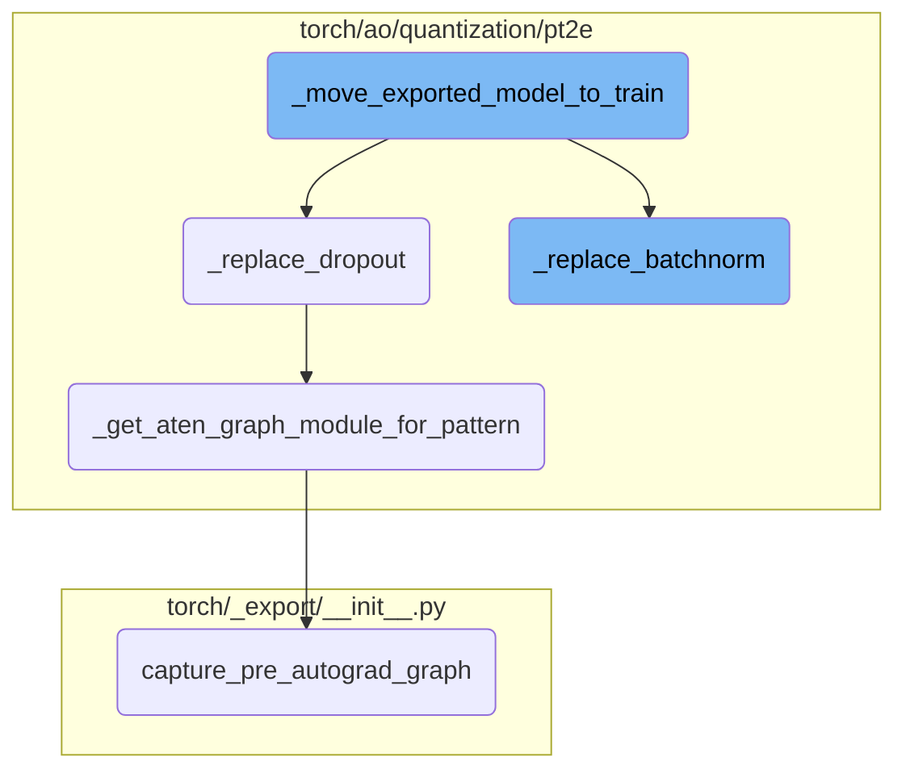

This document provides an overview of the <SwmToken path="/torch/ao/quantization/pt2e/export_utils.py" pos="211:3:3" line-data="    def _train(self, mode: bool = True):">`_train`</SwmToken> function, which is responsible for toggling the training mode of a model. It explains how the function works, including the steps it takes to switch the model between training and evaluation modes.

The <SwmToken path="/torch/ao/quantization/pt2e/export_utils.py" pos="211:3:3" line-data="    def _train(self, mode: bool = True):">`_train`</SwmToken> function is designed to switch a model between training and evaluation modes. When the function is called with the mode set to `True`, it transitions the model to training mode by calling <SwmToken path="/torch/ao/quantization/pt2e/export_utils.py" pos="213:1:1" line-data="            _move_exported_model_to_train(self)">`_move_exported_model_to_train`</SwmToken>. This involves replacing certain operations like dropout and batchnorm with their training counterparts. Conversely, if the mode is set to `False`, the function calls <SwmToken path="/torch/ao/quantization/pt2e/export_utils.py" pos="174:2:2" line-data="def _move_exported_model_to_eval(model: torch.fx.GraphModule):">`_move_exported_model_to_eval`</SwmToken>, which switches the model to evaluation mode by replacing these operations with their evaluation counterparts. This ensures that the model behaves correctly during both training and evaluation phases.

Here is a high level diagram of the flow, showing only the most important functions:



# Flow drill down

First, we'll zoom into this section of the flow:



<SwmSnippet path="/torch/ao/quantization/pt2e/export_utils.py" line="211">

---

## \_train

<SwmToken path="/torch/ao/quantization/pt2e/export_utils.py" pos="211:3:3" line-data="    def _train(self, mode: bool = True):">`_train`</SwmToken> is responsible for toggling the training mode of the model. It calls <SwmToken path="/torch/ao/quantization/pt2e/export_utils.py" pos="213:1:1" line-data="            _move_exported_model_to_train(self)">`_move_exported_model_to_train`</SwmToken> if the mode is set to `True`, otherwise, it calls <SwmToken path="/torch/ao/quantization/pt2e/export_utils.py" pos="215:1:1" line-data="            _move_exported_model_to_eval(self)">`_move_exported_model_to_eval`</SwmToken>.

```python
    def _train(self, mode: bool = True):
        if mode:
            _move_exported_model_to_train(self)
        else:
            _move_exported_model_to_eval(self)
```

---

</SwmSnippet>

<SwmSnippet path="/torch/ao/quantization/pt2e/export_utils.py" line="174">

---

### <SwmToken path="/torch/ao/quantization/pt2e/export_utils.py" pos="174:2:2" line-data="def _move_exported_model_to_eval(model: torch.fx.GraphModule):">`_move_exported_model_to_eval`</SwmToken>

<SwmToken path="/torch/ao/quantization/pt2e/export_utils.py" pos="174:2:2" line-data="def _move_exported_model_to_eval(model: torch.fx.GraphModule):">`_move_exported_model_to_eval`</SwmToken> switches the model to evaluation mode by replacing certain operations like dropout and batchnorm to their evaluation counterparts.

```python
def _move_exported_model_to_eval(model: torch.fx.GraphModule):
    """
    Move an exported GraphModule to eval mode.

    This is equivalent to model.eval() but only for certain special ops like dropout, batchnorm.
    QAT users should call this before performing inference on the model.
    """
    _replace_dropout(model, train_to_eval=True)
    _replace_batchnorm(model, train_to_eval=True)
    return model
```

---

</SwmSnippet>

<SwmSnippet path="/torch/ao/quantization/pt2e/export_utils.py" line="38">

---

### <SwmToken path="/torch/ao/quantization/pt2e/export_utils.py" pos="38:2:2" line-data="def _replace_dropout(m: torch.fx.GraphModule, train_to_eval: bool):">`_replace_dropout`</SwmToken>

<SwmToken path="/torch/ao/quantization/pt2e/export_utils.py" pos="38:2:2" line-data="def _replace_dropout(m: torch.fx.GraphModule, train_to_eval: bool):">`_replace_dropout`</SwmToken> manually switches dropout patterns between training and evaluation modes. This is necessary because calling <SwmToken path="/torch/ao/quantization/pt2e/export_utils.py" pos="43:7:11" line-data="    however, calling `model.train()` or `model.eval()` does not automatically switch">`model.train()`</SwmToken> or <SwmToken path="/torch/ao/quantization/pt2e/export_utils.py" pos="43:17:21" line-data="    however, calling `model.train()` or `model.eval()` does not automatically switch">`model.eval()`</SwmToken> does not automatically switch dropout behavior in exported models.

```python
def _replace_dropout(m: torch.fx.GraphModule, train_to_eval: bool):
    """
    Switch dropout patterns in the model between train and eval modes.

    Dropout has different behavior in train vs eval mode. For exported models,
    however, calling `model.train()` or `model.eval()` does not automatically switch
    the dropout behavior between the two modes, so here we need to rewrite the aten
    dropout patterns manually to achieve the same effect.

    See https://github.com/pytorch/pytorch/issues/103681.
    """
    # Avoid circular dependencies
    from .utils import _get_aten_graph_module_for_pattern

    # Needed to ensure subgraph matches are self-contained
    m.graph.eliminate_dead_code()
    m.recompile()

    for inplace in [False, True]:

        def dropout_train(x):
```

---

</SwmSnippet>

<SwmSnippet path="/torch/ao/quantization/pt2e/utils.py" line="351">

---

### <SwmToken path="/torch/ao/quantization/pt2e/utils.py" pos="351:2:2" line-data="def _get_aten_graph_module_for_pattern(">`_get_aten_graph_module_for_pattern`</SwmToken>

<SwmToken path="/torch/ao/quantization/pt2e/utils.py" pos="351:2:2" line-data="def _get_aten_graph_module_for_pattern(">`_get_aten_graph_module_for_pattern`</SwmToken> converts a given pattern to an FX graph with decomposed aten operations. This is used to match and replace specific subgraphs in the model.

```python
def _get_aten_graph_module_for_pattern(
    pattern: Callable,
    example_inputs: Tuple[Any, ...],
    is_cuda: bool = False,
    **kwargs,
) -> GraphModule:
    """
    Convert the pattern to an FX graph with decomposed aten ops.
    """
    if is_cuda:
        example_inputs = tuple(
            [x.cuda() if isinstance(x, torch.Tensor) else x for x in example_inputs]
        )
    aten_pattern = capture_pre_autograd_graph(
        pattern,
        example_inputs,
        kwargs,
    )
    aten_pattern.graph.eliminate_dead_code()
    aten_pattern.recompile()

```

---

</SwmSnippet>

<SwmSnippet path="/torch/_export/__init__.py" line="72">

---

### <SwmToken path="/torch/_export/__init__.py" pos="72:2:2" line-data="def capture_pre_autograd_graph(">`capture_pre_autograd_graph`</SwmToken>

<SwmToken path="/torch/_export/__init__.py" pos="72:2:2" line-data="def capture_pre_autograd_graph(">`capture_pre_autograd_graph`</SwmToken> captures the graph of a given pattern before autograd transformations. This is essential for ensuring that the pattern matching and replacement are accurate.

```python
def capture_pre_autograd_graph(
    f: torch.nn.Module,
    args: Tuple[Any],
    kwargs: Optional[Dict[str, Any]] = None,
    dynamic_shapes: Optional[Union[Dict[str, Any], Tuple[Any]]] = None,
) -> torch.nn.Module:
    """
    A helper function that is intended to trace a module before any pre-autograd
    decomposition is run. The produced module will be "non-functional" and
    composed of aten operators. Later this API will be deleted in favor of more general
    torch.export API.

    Args:
      f: nn.Module to be traced

      args: example positional inputs.

      kwargs: optional example keyword inputs.

      dynamic_shapes: Should either be:
         1) a dict from argument names of ``f`` to their dynamic shape specifications,
```

---

</SwmSnippet>

Now, lets zoom into this section of the flow:



<SwmSnippet path="/torch/ao/quantization/pt2e/export_utils.py" line="193">

---

## Moving Exported Model to Train Mode

The function <SwmToken path="/torch/ao/quantization/pt2e/export_utils.py" pos="213:1:1" line-data="            _move_exported_model_to_train(self)">`_move_exported_model_to_train`</SwmToken> is responsible for transitioning an exported <SwmToken path="/torch/ao/quantization/pt2e/export_utils.py" pos="38:11:11" line-data="def _replace_dropout(m: torch.fx.GraphModule, train_to_eval: bool):">`GraphModule`</SwmToken> to train mode. This involves switching certain operations like dropout and batchnorm to their training behaviors. This is crucial for Quantization Aware Training (QAT) as it ensures the model behaves correctly during training.

```python
    _replace_dropout(model, train_to_eval=False)
    _replace_batchnorm(model, train_to_eval=False)
    return model
```

---

</SwmSnippet>

<SwmSnippet path="/torch/ao/quantization/pt2e/export_utils.py" line="92">

---

## Replacing <SwmToken path="/torch/ao/quantization/pt2e/export_utils.py" pos="94:3:3" line-data="    Switch batchnorm patterns in the model between train and eval modes.">`batchnorm`</SwmToken> Patterns

The function <SwmToken path="/torch/ao/quantization/pt2e/export_utils.py" pos="92:2:2" line-data="def _replace_batchnorm(m: torch.fx.GraphModule, train_to_eval: bool):">`_replace_batchnorm`</SwmToken> switches batchnorm patterns in the model between train and eval modes. Since exported models do not automatically switch batchnorm behavior with <SwmToken path="/torch/ao/quantization/pt2e/export_utils.py" pos="97:7:11" line-data="    however, calling `model.train()` or `model.eval()` does not automatically switch">`model.train()`</SwmToken> or <SwmToken path="/torch/ao/quantization/pt2e/export_utils.py" pos="97:17:21" line-data="    however, calling `model.train()` or `model.eval()` does not automatically switch">`model.eval()`</SwmToken>, this function manually rewrites the aten batchnorm patterns to achieve the desired effect. This ensures that the batchnorm layers behave correctly during training and evaluation.

```python
def _replace_batchnorm(m: torch.fx.GraphModule, train_to_eval: bool):
    """
    Switch batchnorm patterns in the model between train and eval modes.

    Batchnorm has different behavior in train vs eval mode. For exported models,
    however, calling `model.train()` or `model.eval()` does not automatically switch
    the batchnorm behavior between the two modes, so here we need to rewrite the aten
    batchnorm patterns manually to achieve the same effect.
    """
    # TODO(Leslie): This function still fails to support custom momentum and eps value.
    # Enable this support in future updates.

    # Avoid circular dependencies
    from .utils import _get_aten_graph_module_for_pattern

    # Needed to ensure subgraph matches are self-contained
    m.graph.eliminate_dead_code()
    m.recompile()

    def bn_train(
        x: torch.Tensor,
```

---

</SwmSnippet>

&nbsp;

*This is an auto-generated document by Swimm AI 🌊 and has not yet been verified by a human*

<SwmMeta version="3.0.0" repo-id="Z2l0aHViJTNBJTNBcHl0b3JjaC1hdXRvZG9jcy1kZW1vJTNBJTNBU3dpbW0tRGVtbw==" repo-name="pytorch-autodocs-demo"><sup>Powered by [Swimm](https://app.swimm.io/)</sup></SwmMeta>
