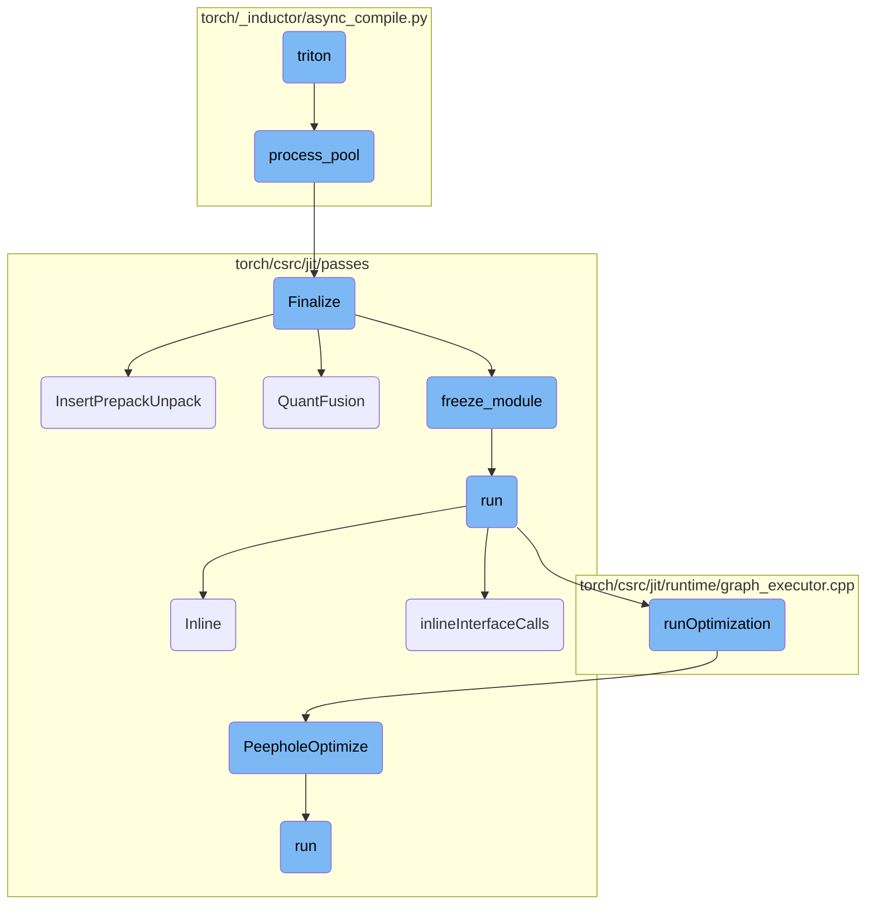
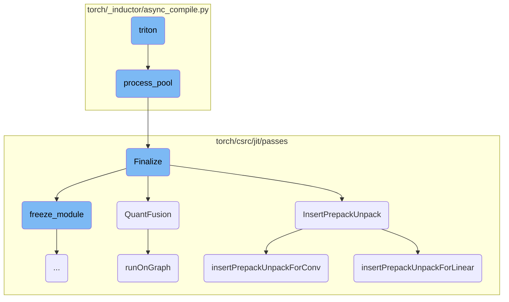
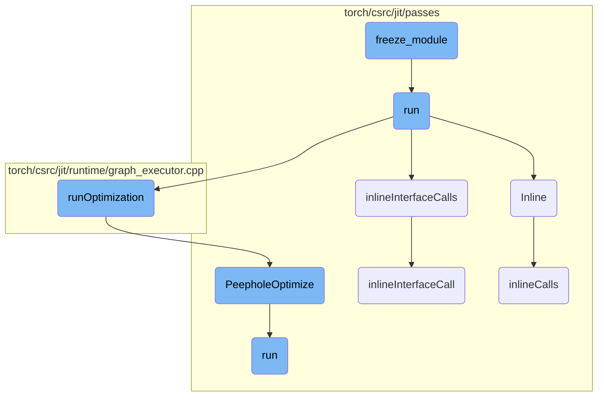

This document explains the role of the Triton function in the compilation process. It covers how Triton kernels are compiled, the setup of the Triton PTXAS path, and the management of the process pool for parallel compilation.

The Triton function is responsible for compiling specific types of code called Triton kernels. First, it logs the source code of the kernel. Then, it sets up the necessary environment for compilation. If there are multiple threads available for compilation, it sends the task to a group of worker processes to handle it in parallel. If not, it compiles the kernel directly. This process ensures that the code is ready to run efficiently on the hardware.

Here is a high level diagram of the flow, showing only the most important functions:



# Flow drill down

First, we'll zoom into this section of the flow:



<SwmSnippet path="/torch/_inductor/async_compile.py" line="169">

---

## Triton Compilation

The `triton` function is responsible for compiling Triton kernels. It logs the kernel source code, sets up the Triton PTXAS path, and loads the kernel from the Triton code cache. If multiple compile threads are configured, it submits the compilation task to a process pool; otherwise, it precompiles the kernel directly.

```python
    def triton(self, kernel_name: str, source_code: str, device_str: str = "cuda"):
        kernel_code_log.info("Triton Kernel:\n%s", source_code)
        _compile_start()
        _set_triton_ptxas_path()

        kernel = TritonCodeCache.load(kernel_name, source_code)
        if config.compile_threads > 1:
            # We want to support changing these env vars after (and while) the
            # process pool is running, so pass them to the subprocess to reset.
            env_vars = ["TORCHINDUCTOR_CACHE_DIR", "TRITON_CACHE_DIR"]
            extra_env = {v: os.environ[v] for v in env_vars if v in os.environ}
            return TritonFuture(
                kernel,
                self.process_pool().submit(
                    _worker_compile_triton,
                    kernel._reload_in_subproc,
                    extra_env,
                ),
            )
        else:
            kernel.precompile()
```

---

</SwmSnippet>

<SwmSnippet path="/torch/_inductor/async_compile.py" line="132">

---

## Process Pool Management

The `process_pool` function manages a pool of worker processes for parallel compilation. It creates a process pool using either a subprocess-based pool or a multiprocessing-based pool, depending on the configuration. This pool is used to submit compilation tasks in parallel.

```python
    def process_pool() -> AnyPool:
        assert config.compile_threads > 1
        pool: AnyPool
        if config.worker_start_method == "subprocess":
            # Wrapper around ProcessPoolExecutor forks in a new process we control
            pool = SubprocPool(config.compile_threads)
        else:
            pre_fork_setup()
            ctx = multiprocessing.get_context(config.worker_start_method)
            pool = ProcessPoolExecutor(
                config.compile_threads,
                mp_context=ctx,
                initializer=partial(_async_compile_initializer, os.getpid()),
            )
            # when this pool is created in a subprocess object, the normal exit handler
            # doesn't run, and we need to register our own handler.
            # exitpriority has to be high, because another one of the finalizers will
            # kill the worker thread that sends the shutdown message to the workers...
            multiprocessing.util.Finalize(None, pool.shutdown, exitpriority=sys.maxsize)

        _pool_set.add(pool)
```

---

</SwmSnippet>

<SwmSnippet path="/torch/csrc/jit/passes/quantization/finalize.cpp" line="188">

---

## Finalizing the Module

The `Finalize` function cleans up and optimizes a quantized module. It clears profiling information, inserts prepack and unpack operations, performs quantization fusion, freezes the module, and folds quantized prepacking operations. This ensures the module is optimized and ready for execution.

```c++
Module Finalize(
    Module& module,
    QuantType quant_type,
    const std::vector<std::string>& preserved_attrs) {
  // Tracing annotates the resulting graph with shape information. In many case,
  // user applies different input shapes to traced graph. It is on the user to
  // know it is correct to do so. The quantized module needs to be clean up and
  // To prevent the JIT optimizations from leveraging the annotated shape info,
  // clear shape information in the graph.
  for (auto func : module.type()->methods()) {
    ClearProfilingInformation(toGraphFunction(*func).graph());
  }

  auto graph = module.get_method("forward").graph();
  InsertPrepackUnpack(graph);
  GRAPH_DUMP("Before QuantFusion:", graph);
  QuantFusion(graph, quant_type);
  auto frozen = freeze_module(module, preserved_attrs);
  FoldQuantizedPrepackingOps(frozen);
  return frozen;
```

---

</SwmSnippet>

<SwmSnippet path="/torch/csrc/jit/passes/quantization/finalize.cpp" line="141">

---

## Inserting Prepack and Unpack Operations

The `InsertPrepackUnpack` function inserts prepack and unpack operations into the graph. It calls `insertPrepackUnpackForLinear` and `insertPrepackUnpackForConv` to handle linear and convolutional layers, respectively.

```c++
void InsertPrepackUnpack(std::shared_ptr<Graph>& graph) {
  insertPrepackUnpackForLinear(graph);
  insertPrepackUnpackForConv(graph);
}
```

---

</SwmSnippet>

<SwmSnippet path="/torch/csrc/jit/passes/quantization/finalize.cpp" line="35">

---

### Prepack and Unpack for Convolution

The `insertPrepackUnpackForConv` function registers and applies rewrite patterns for convolutional layers. It uses the `SubgraphRewriter` to replace patterns in the graph with optimized versions that include prepack and unpack operations.

```c++
void insertPrepackUnpackForConv(std::shared_ptr<Graph>& graph) {
  std::vector<QuantFusionInfo> patterns_and_replacements =
      conv_prepack_unpack_patterns();

  for (const auto& entry : patterns_and_replacements) {
    SubgraphRewriter rewriter;
    rewriter.RegisterRewritePattern(entry.pattern, entry.replacement);
    rewriter.runOnGraph(graph, entry.filters);
  }
}
```

---

</SwmSnippet>

<SwmSnippet path="/torch/csrc/jit/passes/quantization/finalize.cpp" line="24">

---

### Prepack and Unpack for Linear Layers

The `insertPrepackUnpackForLinear` function registers and applies rewrite patterns for linear layers. Similar to the convolutional case, it uses the `SubgraphRewriter` to optimize the graph by inserting prepack and unpack operations.

```c++
void insertPrepackUnpackForLinear(std::shared_ptr<Graph>& graph) {
  std::vector<QuantFusionInfo> patterns_and_replacements =
      linear_prepack_unpack_patterns();

  for (const auto& entry : patterns_and_replacements) {
    SubgraphRewriter rewriter;
    rewriter.RegisterRewritePattern(entry.pattern, entry.replacement);
    rewriter.runOnGraph(graph, entry.filters);
  }
}
```

---

</SwmSnippet>

<SwmSnippet path="/torch/csrc/jit/passes/quantization/finalize.cpp" line="121">

---

## Quantization Fusion

The `QuantFusion` function performs fusion of quantized operations in the graph. It selects appropriate fusion patterns based on the quantization type (dynamic or static) and applies these patterns using the `SubgraphRewriter`.

```c++
void QuantFusion(std::shared_ptr<Graph>& graph, QuantType quant_type) {
  std::vector<QuantFusionInfo> patterns;
  if (quant_type == QuantType::DYNAMIC) {
    patterns = dynamic_quant_fusion_pattern_and_replacements();
    std::vector<QuantFusionInfo> patterns_wo_dynamic_activation_quant =
        dynamic_quantized_linear_pattern_and_replacements();
    patterns.insert(
        patterns.end(),
        patterns_wo_dynamic_activation_quant.begin(),
        patterns_wo_dynamic_activation_quant.end());
  } else {
    patterns = quant_fusion_pattern_and_replacements();
  }
  for (const auto& info : patterns) {
    SubgraphRewriter rewriter;
    rewriter.RegisterRewritePattern(info.pattern, info.replacement);
    rewriter.runOnGraph(graph, info.filters);
  }
}
```

---

</SwmSnippet>

<SwmSnippet path="/torch/csrc/jit/passes/subgraph_rewrite.cpp" line="71">

---

## Running Rewrite Patterns on Graph

The `runOnGraph` method of `SubgraphRewriter` applies registered rewrite patterns to the graph. It iterates over the patterns and applies each one to the graph, enabling various optimizations and transformations.

```c++
void SubgraphRewriter::runOnGraph(
    std::shared_ptr<Graph>& graph,
    const std::vector<MatchFilter>& filters) {
  for (const RewritePatternDescr& pattern : patterns_) {
    rewriteSinglePatternOnGraph(graph, pattern, filters);
  }
}
```

---

</SwmSnippet>

Now, lets zoom into this section of the flow:



<SwmSnippet path="/torch/csrc/jit/passes/freeze_module.cpp" line="1020">

---

## freeze_module

The `freeze_module` function is responsible for freezing a module by cloning it and then propagating attributes. This process ensures that the module's computation graph is optimized and ready for inference by eliminating any mutable state.

```c++
Module freeze_module(
    const Module& module,
    std::vector<std::string> preservedAttrs,
    bool freezeInterfaces,
    bool preserveParameters) {
  checkModuleDoesNotReturnSelf(module);

  auto moduleClone = module.clone(true);
  AttributePropagator attrPropagator(
      moduleClone, preservedAttrs, freezeInterfaces, preserveParameters);
  attrPropagator.run();
  return moduleClone;
}
```

---

</SwmSnippet>

<SwmSnippet path="/torch/csrc/jit/passes/freeze_module.cpp" line="111">

---

## run

The `run` function orchestrates the freezing process by applying inlining and optimizations to the computation graph. It ensures that all necessary attributes are propagated and that the module is cleaned up and ready for inference.

```c++
  void run() {
    auto applyInline = [](std::shared_ptr<Graph>& subgraph) {
      Inline(*subgraph);
      ClearProfilingInformation(subgraph);
    };
    auto applyOptimizations = [](std::shared_ptr<Graph>& subgraph) {
#ifndef C10_MOBILE
      Autocast(subgraph);
#endif
      runOptimization(
          subgraph,
          /* unroll_non_constant_loops? */ false,
          /* const_prop_user_classes? */ false);
      EliminateNoOps(subgraph);
      LowerSimpleTuples(subgraph);
    };

    std::unordered_map<std::string, std::unordered_set<std::string>>
        interfacesToReassignType;

    for (auto function : preservedMethods_) {
```

---

</SwmSnippet>

<SwmSnippet path="/torch/csrc/jit/passes/inliner.cpp" line="91">

---

## Inline

The `Inline` function performs inlining on the computation graph, which involves replacing function calls with their actual implementations. This step is crucial for optimizing the graph by eliminating function call overhead.

```c++
void Inline(Graph& graph) {
  GRAPH_DUMP("Before Inlining: ", &graph);
  inlineCalls(graph.block());
  GRAPH_DUMP("After Inlining: ", &graph);
}
```

---

</SwmSnippet>

<SwmSnippet path="/torch/csrc/jit/passes/freeze_module.cpp" line="492">

---

## inlineInterfaceCalls

The `inlineInterfaceCalls` function handles the inlining of interface calls within the computation graph. It ensures that interface methods are properly inlined and that any disallowed operations, such as setting attributes on interfaces, are checked and handled.

```c++
  //   [Note: Inlining interfaces strategy]
  // There's two structures that are relevant to freezing:
  // - the graph describing the computation in a method
  // - the module describing the data structure of the module instance.
  //
  // First, in inlineInterfaceCalls, we inline interfaces. This is done in a
  // separate step from normal inlining because CallMethod on an interface type
  // requires extra steps compared to inlining a normal CallMethod.
  //
  // Next we need to simplify the structure of the module data structure, which
  // is done for the most part by the usual steps in cleanupFrozenModule.
  //
  // However, there's a complication that comes from the fact that within a
  // method, you can change the value of an interface to another module that
  // implements that interface.
  //
  // For example:
  //
  // impl: MyInterface
  // ...
  // def forward(self, x):
```

---

</SwmSnippet>

<SwmSnippet path="/torch/csrc/jit/runtime/graph_executor.cpp" line="968">

---

## runOptimization

The `runOptimization` function applies a series of optimization passes to the computation graph. These optimizations include eliminating dead code, common subexpression elimination, and peephole optimizations, which collectively improve the efficiency and performance of the graph.

```c++
void runOptimization(
    std::shared_ptr<Graph>& graph,
    bool unroll_non_constant_loops,
    bool const_prop_user_classes) {
  // Basic graph preprocessing to eliminate noise.
  GRAPH_DEBUG(
      "Before EliminateDeadCode (beginning of runOptimization)\n", *graph);
  EliminateDeadCode(graph);
  GRAPH_DEBUG(
      "After EliminateDeadCode, before EliminateCommonSubexpression\n", *graph);
  EliminateCommonSubexpression(graph);
  GRAPH_DEBUG(
      "After EliminateCommonSubexpression , before PeepholeOptimize\n", *graph);

  PeepholeOptimize(graph);
  GRAPH_DEBUG("After PeepholeOptimize, before ConstantPropagation\n", *graph);

  if (const_prop_user_classes) {
    ConstantPropagation(graph);
  } else {
    ConstantPropagation(graph, true);
```

---

</SwmSnippet>

<SwmSnippet path="/torch/csrc/jit/passes/peephole.cpp" line="456">

---

## PeepholeOptimize

The `PeepholeOptimize` function performs peephole optimizations on the computation graph. These optimizations involve making local transformations to the graph to simplify and improve its performance.

```c++
bool PeepholeOptimize(
    const std::shared_ptr<Graph>& graph,
    bool addmm_fusion_enabled) {
  PeepholeOptimizeImpl peephole(graph, addmm_fusion_enabled);
  bool changed = peephole.run();
  GRAPH_DUMP("After PeepholeOptimize: ", graph);
  // Eliminate dead code created by any peephole passes we've just done
  if (changed) {
    EliminateDeadCode(graph->block());
  }
  return changed;
}
```

---

</SwmSnippet>

<SwmSnippet path="/torch/csrc/jit/passes/freeze_module.cpp" line="465">

---

## inlineInterfaceCall

The `inlineInterfaceCall` function is invoked when the `freezeInterfaces` parameter is enabled. It retrieves the module associated with an interface and inlines the invoked method, ensuring that the computation graph is optimized for inference.

```c++
  // This method is invoked only when 'freezeInterfaces' parameter is on.
  // The module associated with Interface is retrieved and the invoked method
  // is inlined.
  bool inlineInterfaceCall(Node* n, const IValue& attr) {
    auto class_type = attr.type()->expect<ClassType>();
    bool inlined = false;
    for (auto use : n->output()->uses()) {
      auto user_node = use.user;
      if (user_node->kind() == prim::CallMethod) {
        const std::string& methodName = user_node->s(attr::name);
        Function& function = class_type->getMethod(methodName);
        if (auto graphFunction = tryToGraphFunction(function)) {
          GRAPH_UPDATE(
              "Inlining interface method '",
              function.name(),
              "' to ",
              *user_node);

          GRAPH_UPDATE("Function body: ", graphFunction->optimized_graph());
          inlineCallTo(user_node, graphFunction);
          inlined = true;
```

---

</SwmSnippet>

<SwmSnippet path="/torch/csrc/jit/passes/inliner.cpp" line="32">

---

## inlineCalls

The `inlineCalls` function recursively inlines function and method calls within a computation graph block. This step is essential for optimizing the graph by eliminating the overhead associated with function and method calls.

```c++
static void inlineCalls(Block* block) {
  for (auto it = block->nodes().begin(), end = block->nodes().end();
       it != end;) {
    Node* cur = *it++;
    switch (cur->kind()) {
      case prim::CallFunction: {
        if (auto graphFunction = tryToGraphFunction(cur)) {
          auto function_constant = cur->input(0)->node();
          auto fun_type =
              function_constant->output()->type()->expect<FunctionType>();

          cur->removeInput(0);
          GRAPH_UPDATE(
              "Inlining function '",
              fun_type->function()->name(),
              "' to ",
              *cur);

          std::shared_ptr<Graph> g = nullptr;
          // inline optimized graph for debugging/testing purposes.
          // we only insert fallback functions in JIT optimized graphs for
```

---

</SwmSnippet>

<SwmSnippet path="/torch/csrc/jit/passes/peephole.cpp" line="31">

---

## run

The `run` function in `peephole.cpp` applies various peephole optimizations to the computation graph. These optimizations include simplifying list and dictionary idioms, optimizing alias-sensitive operations, and combining concatenation operations.

```c++
  bool run() {
    bool changed = optimizeBlock(graph_->block());
    changed |= PeepholeOptimizeListIdioms(graph_);
    changed |= PeepholeOptimizeDictIdioms(graph_);
    changed |= PeepholeOptimizeAliasSensitive(graph_, shape_peepholes_);
    changed |= PeepholeOptimizeNonTensor(graph_);
    changed |= CombineConcats(graph_);
    return changed;
  }
```

---

</SwmSnippet>

&nbsp;

*This is an auto-generated document by Swimm AI 🌊 and has not yet been verified by a human*

<SwmMeta version="3.0.0" repo-id="Z2l0aHViJTNBJTNBcHl0b3JjaC1hdXRvZG9jcy1kZW1vJTNBJTNBU3dpbW0tRGVtbw==" repo-name="pytorch-autodocs-demo"><sup>Powered by [Swimm](https://app.swimm.io/)</sup></SwmMeta>
